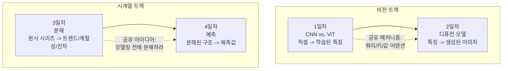

# Week 1 — 컴퓨터 비전 & 시계열

언뜻 무관해 보이는 두 주제지만, 더 깊은 구조적 패턴을 공유합니다. 두 트랙 모두 **표현(representation)**을 다루는 날과, 그 표현 위에 직접 쌓아 올리는 **응용(application)**을 다루는 날로 짝지어져 있습니다.

- **1~2일차 (비전):** 1일차는 CNN과 비전 트랜스포머가 픽셀 그리드를 학습된 특징(feature)으로 바꾸는 방식을 다룹니다 — "학습이 시작되기도 전에 아키텍처가 어떤 구조를 가정해야 하는가?"라는 질문에 대한 두 가지 다른 답입니다. 2일차는 여기서 한 걸음 더 나아가 디퓨전 모델을 다룹니다. 디퓨전 모델은 노이즈를 제거하는 과정을 역으로 학습해 새 이미지를 생성하며, 이때 1일차에서 ViT를 위해 소개한 것과 동일한 쿼리/키/값(query/key/value) 어텐션 메커니즘으로 방향을 조정합니다.
- **3~4일차 (시계열):** 3일차는 시간 순서가 있는 시리즈를 트렌드, 계절성, 잔차(residual)로 분해하는 방법을 다룹니다 — 데이터를 다루기 쉽게 만드는 표현입니다. 4일차는 이 분해 결과를 직접 활용합니다: Holt-Winters 예측법은 사실상 이 세 요소를 지수평활(exponential smoothing)로 시간축상 앞으로 확장한 것에 불과합니다.

| Day | 주제 | 학습 노트 |
|---|---|---|
| Day 1 | CNN vs. 비전 트랜스포머, 전이학습 | [Day1_cnn-vs-vit.ko.md](daily/Day1_cnn-vs-vit.ko.md) |
| Day 2 | 디퓨전 모델 & 텍스트-이미지 생성 | [Day2_diffusion-models.ko.md](daily/Day2_diffusion-models.ko.md) |
| Day 3 | 시계열 기초 & 분해 | [Day3_time-series-fundamentals.ko.md](daily/Day3_time-series-fundamentals.ko.md) |
| Day 4 | 예측 기법 & 평가 | [Day4_forecasting-methods.ko.md](daily/Day4_forecasting-methods.ko.md) |

4일치 실행 가능한 코드는 노트북 1개에 모두 담겨 있습니다: [1st_week_Concepts.ko.ipynb](concepts/1st_week_Concepts.ko.ipynb).

## 코드 예제 검증 방법

각 노트에 실린 numpy/pandas/statsmodels 예제(1일차의 패치 임베딩·어텐션 shape 추적, 2일차의 forward diffusion 노이즈 스케줄, 3일차의 `seasonal_decompose`와 자기상관, 4일차의 Holt-Winters 예측과 ADF 검정)는 실제 데이터로 직접 실행해 확인했으며, 본문에 실린 shape와 수치는 그 실행 결과를 그대로 옮긴 것입니다. 1일차와 2일차의 `transformers`/`diffusers` 기반 파이프라인 예제는 해당 라이브러리의 실제 최신 API를 사용하지만, 이 노트를 작성한 환경에는 GPU도 torch 설치도 없어 직접 실행하지는 못했습니다 — 실행이 보장된 스크립트가 아니라, 기술적으로 정확한 참고 패턴으로 포함했습니다.

## 영어 버전

[README.md](README.md) — 모든 일별 노트와 노트북에는 영어 원본과 함께 `.ko.md` / `.ko.ipynb` 대응 파일이 있습니다.
