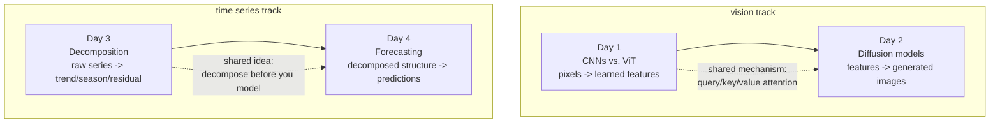

# Week 1 — Computer Vision & Time Series

Two unrelated-looking topics that share a deeper structural pattern: both weeks pair a **representation** day (how do you turn raw input into something a model can reason over?) with an **application** day that builds directly on that representation (generate something new from it, or predict what comes next from it).

- **Days 1-2 (vision):** Day 1 covers how CNNs and Vision Transformers turn a pixel grid into learned features — two different answers to "what structure should the architecture assume before training even starts?" Day 2 builds on that by covering diffusion models, which generate new images by learning to reverse a noising process, steered by the same query/key/value attention mechanism introduced for ViT on Day 1.
- **Days 3-4 (time series):** Day 3 covers how to decompose a time-ordered series into trend, seasonality, and residual — the representation that makes the data tractable. Day 4 builds on that decomposition directly: Holt-Winters forecasting is mechanically just exponential smoothing of those same three components, extended forward in time.

| Day | Topic | Daily Notes |
|---|---|---|
| Day 1 | CNNs vs. Vision Transformers, transfer learning | [Day1_cnn-vs-vit.md](daily/Day1_cnn-vs-vit.md) |
| Day 2 | Diffusion models & text-to-image generation | [Day2_diffusion-models.md](daily/Day2_diffusion-models.md) |
| Day 3 | Time series fundamentals & decomposition | [Day3_time-series-fundamentals.md](daily/Day3_time-series-fundamentals.md) |
| Day 4 | Forecasting methods & evaluation | [Day4_forecasting-methods.md](daily/Day4_forecasting-methods.md) |

Runnable code for all four days lives in one notebook: [1st_week_Concepts.ipynb](concepts/1st_week_Concepts.ipynb).

## How the code examples were verified

The numpy/pandas/statsmodels examples in every note (patch-embedding and attention shape tracing on Day 1, the forward-diffusion noise schedule on Day 2, `seasonal_decompose` and autocorrelation on Day 3, Holt-Winters forecasting and the ADF test on Day 4) were actually executed against real data, and the printed shapes and numbers in the text are taken directly from that output. The `transformers`/`diffusers`-based pipeline examples on Days 1 and 2 use the current, real API for those libraries but were not executed in the environment these notes were written in, since it has no GPU and no torch installation — they're included as technically accurate reference patterns, not as guaranteed-to-run-as-is scripts.

## Korean version

[README.ko.md](README.ko.md) — and every daily note and the notebook have a `.ko.md` / `.ko.ipynb` counterpart alongside the English original.
