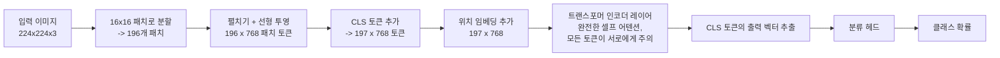

# Day 1 — CNN vs. 비전 트랜스포머

오늘의 질문: 사진이 숫자 그리드로 환원되고 나면, 네트워크는 그 안에서 고양이나 정지 표지판, 혹은 종양을 어떻게 "보게" 될까? 답은 하나가 아니라 서로 경쟁하는 두 가지 아키텍처 철학, 즉 합성곱 신경망(CNN)과 비전 트랜스포머(ViT)로 나뉜다. 이 둘이 왜 다른지를 이해하면 둘 중 하나만 아는 것보다 딥러닝 전반에 대해 훨씬 많은 것을 알게 된다.

## 이미지는 텐서다 — 그리고 그것이 문제의 전부다

컬러 사진은 `height x width x 3` 형태의 배열로 저장된다 — 빨강, 초록, 파랑 각 채널마다 하나씩의 강도(intensity) 그리드다. 224x224 사진은 어떤 모델이 손대기도 전에 이미 224 x 224 x 3 = 150,528개의 숫자다. 배치·채널-우선(channel-first) 텐서 표기(PyTorch 관례)로 쓰면, 이미지 한 장은 다음과 같다.

```
shape: (batch=1, channels=3, height=224, width=224)
```

이 배열 어디에도 "가장자리(edge)", "눈", "바퀴" 같은 개념은 내장되어 있지 않다 — 그저 숫자일 뿐이다. 아래 나오는 모든 아키텍처는 결국 이 그리드에서 활용 가능한 구조를 찾아내는 서로 다른 전략에 불과하다. 두 전략의 차이는 훈련 데이터를 단 하나도 보기 전에 그 구조에 대해 무엇을 **가정**하는가 — 이른바 **귀납적 편향(inductive bias)** — 에 있으며, 이 설계 선택 하나가 두 아키텍처 사이의 실질적인 차이 거의 전부로 이어진다.

## CNN: 슬라이딩 필터, 커지는 수용 영역

합성곱(convolutional) 레이어는 작은 필터(흔히 3x3)를 이미지 위에서 슬라이딩시키며 각 위치에서 가중합을 계산한다. 3채널 이미지에 대한 3x3 필터 하나는 3x3x3 = 27개의 가중치(플러스 편향 하나)를 가지며, 이 27개의 숫자가 모든 공간적 위치에서 재사용된다. 이 재사용이야말로 핵심 트릭이다.

레이어를 쌓으면 특징의 위계가 만들어진다. 얕은 필터는 가장자리와 색상 그라데이션에 반응하고, 중간 깊이의 필터는 이를 조합해 질감과 단순한 부분(곡선, 모서리)을 만들며, 깊은 필터는 부분들을 조합해 완전한 객체를 조립한다. 어떤 단일 레이어도 "얼굴이 무엇인지" 알지 못한다 — 그 개념은 여러 레이어에 걸친 조합으로서만 존재한다.


이 설계는 이미지에 대해 거의 항상 참인 두 가지 가정을 내장하고 있다.

- **국소성(Locality)** — 픽셀은 이미지 반대편 픽셀보다 바로 이웃한 픽셀과 훨씬 더 관련이 깊다. 그래서 필터는 한 번에 작은 이웃 영역만 본다.
- **평행이동 등변성(Translation equivariance)** — 왼쪽 위 모서리에서 수직 가장자리를 감지하도록 학습된 필터는 같은 가장자리가 오른쪽 아래에 나타나도 똑같이 감지한다. 왜냐하면 그것은 말 그대로 *동일한 가중치*가 모든 위치를 슬라이딩하며 적용되기 때문이다. 네트워크는 위치마다 "가장자리"를 다시 배울 필요가 없다.

**수용 영역(receptive field)**이란 어떤 유닛의 출력이 실제로 의존하는 입력 영역의 크기이며, 깊이가 깊어질수록 커진다. 3x3 conv 레이어 두 개를 (stride 1, 패딩 없이) 쌓으면, 두 번째 레이어의 유닛은 이미 5x5 입력 패치에 의존하게 된다 — 3x3 레이어 하나마다 수용 영역에 `(kernel_size - 1)`만큼이 더해지므로, 두 개면 기본 1x1에 `2 + 2 = 4`가 더해져 5x5가 된다. 이것이 바로 CNN에 깊이가 필요한 이유다. 단일 레이어는 항상 가까운 픽셀끼리만 비교하므로, 왼쪽 위 모서리의 픽셀을 오른쪽 아래 픽셀과 연관 짓기 위해서는 두 수용 영역이 마침내 겹칠 만큼 충분히 많은 레이어(또는 충분한 다운샘플링)가 쌓여야 한다.

국소성과 평행이동 등변성 덕분에 CNN은 비교적 적은 데이터로도 잘 학습한다. 훈련이 시작되기도 전에 이미 자연 이미지에 대해 참인 무언가(가까운 픽셀은 서로 관련이 있고, 같은 패턴이 어디서든 나타날 수 있다는 것)를 아키텍처가 알고 있으므로, 데이터로부터 그것을 다시 유도하는 데 능력을 덜 소모하기 때문이다.

## ViT: 패치들의 문장으로서의 이미지

비전 트랜스포머는 합성곱을 완전히 버리고, 언어 모델을 지탱하는 트랜스포머 아키텍처를 그대로 재사용한다. 구체적으로는:

1. 이미지를 고정 크기의, 겹치지 않는 패치들로 자른다 — 224x224 이미지를 16x16 패치로 자르면 `(224/16) x (224/16) = 14 x 14 = 196`개의 패치가 나온다.
2. 각 패치를 펼쳐서(flatten) 선형 투영으로 임베딩 벡터 — "패치 토큰" — 로 변환한다. 패치 하나는 `16 x 16 x 3 = 768`개의 원시 값을 가지며, 학습된 행렬을 통해 `embed_dim` 크기의 임베딩(ViT-Base는 흔히 768)으로 투영된다. 이는 눈여겨볼 만한 우연이다 — 이 특정 패치 크기와 채널 수에서는 원시 패치 차원과 모델의 은닉 차원이 우연히 일치한다.
3. 시퀀스 맨 앞에 학습 가능한 **CLS 토큰** 하나를 붙인다 — 대응하는 이미지 콘텐츠가 없는 벡터로, 오직 어텐션을 통해 이미지 전체의 요약 정보를 축적하는 역할만 한다.
4. 모든 토큰(패치 + CLS)에 학습된 **위치 임베딩(position embedding)**을 더한다. 셀프 어텐션 자체는 순서나 위치 개념이 전혀 없다 — 이 단계가 없다면 196개 패치의 순서를 뒤섞어도 출력이 동일해지는데, 이는 이미지에 대해 명백히 잘못된 성질이다.
5. 197개 토큰으로 이루어진 시퀀스를 표준 트랜스포머 인코더 레이어에 통과시킨다. 각 셀프 어텐션 레이어에서 모든 토큰은 쿼리, 키, 값 벡터를 계산하고, 다른 모든 토큰에 직접 주의를 기울인다(attend) — 이웃 제약이 전혀 없다.
6. 마지막 레이어를 통과한 뒤 CLS 토큰의 출력 벡터를 취해 작은 분류 헤드에 통과시킨다.



어텐션은 국소성 가정을 전혀 갖지 않으므로, 셀프 어텐션 레이어 단 하나만으로도 왼쪽 위 모서리 패치와 오른쪽 아래 패치를 직접 연관 지을 수 있다 — CNN은 위에서 설명했듯 수용 영역이 겹칠 만큼 충분한 레이어를 거쳐야만 도달할 수 있는 능력이다. 이 유연함에는 대가가 따른다. 기댈 수 있는 내장 구조가 훨씬 적기 때문에, ViT는 "가까운 픽셀들이 함께 더 중요한 경향이 있다"는 사실을 순수하게 데이터로부터 *학습*해야 하며, 그래서 작거나 중간 규모 데이터셋에서 CNN 수준의 정확도를 따라잡으려면 대개 더 큰 훈련 데이터셋(혹은 강력한 사전학습 체크포인트)이 필요하다. 이것은 사소한 각주가 아니라 실제로 관찰된 트레이드오프다 — 원조 ViT 논문에서도 ImageNet 규모의 데이터로 처음부터 학습시켰을 때는 비슷한 크기의 CNN보다 성능이 떨어졌고, 그보다 몇 자릿수 큰 데이터셋으로 사전학습한 뒤에야 CNN을 앞서기 시작했다.

### 예제로 확인하기: 두 아키텍처를 관통하는 shape 추적

위 산술을 224x224x3 이미지 한 장에 대해 끝까지 실행해 보면(작은 numpy 스크립트로 검증 — 아래 참고):

| 단계 | Shape | 비고 |
|---|---|---|
| 입력 이미지 | `(1, 3, 224, 224)` | batch=1, 채널-우선 |
| 16x16 크롭에 3x3 conv, 필터 8개 | `(1, 8, 14, 14)` | 공간 축마다 `(16 - 3) / 1 + 1 = 14` |
| ViT: 원시 패치 | `(1, 196, 768)` | 196 = 14x14 패치, 768 = 16x16x3 |
| ViT: 투영 후 패치 토큰 | `(1, 196, 768)` | 선형 레이어, 여기서는 `768 -> 768` |
| ViT: CLS 추가한 토큰 | `(1, 197, 768)` | 196 + 1 |
| ViT: 토큰별 Q, K, V | 각 `(1, 197, 768)` | 토큰마다 쿼리/키/값 벡터 하나씩 |
| ViT: 어텐션 스코어 행렬 | `(1, 197, 197)` | 모든 토큰의 스코어를 다른 모든 토큰에 대해 계산 |
| ViT: 어텐션 출력 | `(1, 197, 768)` | softmax(scores)로 구한 가중치로 V를 가중합 |

`(197, 197)` 어텐션 행렬이 이 비교 전체의 핵심이다. 이것은 197개 토큰 각각이 다른 모든 토큰에 얼마나 귀 기울여야 하는지를 담은, 밀집(dense)되고 학습된 지도(map)다 — CLS 토큰이 196칸 떨어진 패치에 귀 기울이는 것도, 단일 레이어에서, 거리에 따른 감쇠 없이 포함된다. CNN은 이런 행렬을 결코 명시적으로 만들지 않는다. CNN의 "어텐션"은 필터들을 쌓았을 때 우연히 수용 영역이 겹치는 픽셀들 속에 암묵적으로만 존재한다.

```python
import numpy as np

rng = np.random.default_rng(0)

# ---- 이미지를 텐서로 ----
B, C, H, W = 1, 3, 224, 224
image = rng.uniform(0, 1, size=(B, C, H, W)).astype(np.float32)
# shape: (batch=1, channels=3, H=224, W=224)

# ---- CNN: conv 레이어 하나를 직접 구현 (im2col 방식) --
# 라이브러리 호출 뒤에 숨기지 않고 shape 계산이 그대로 드러나도록 한다
kernel = rng.normal(size=(8, C, 3, 3)).astype(np.float32)
# shape: (out_channels=8, in_channels=3, kh=3, kw=3)

def conv2d_naive(x, w, stride=1):
    B, C, H, W = x.shape
    OC, _, kh, kw = w.shape
    oh = (H - kh) // stride + 1          # 출력 높이는 패딩이 없으므로 줄어든다
    ow = (W - kw) // stride + 1          # 출력 너비도 마찬가지
    out = np.zeros((B, OC, oh, ow), dtype=np.float32)
    w_flat = w.reshape(OC, -1)            # (OC, C*kh*kw) -- 필터마다 펼치기
    for i in range(oh):
        for j in range(ow):
            # 이 출력 위치가 의존하는 수용 영역 패치를 가져온다
            patch = x[:, :, i*stride:i*stride+kh, j*stride:j*stride+kw]   # (B, C, kh, kw)
            patch_flat = patch.reshape(B, -1)                             # (B, C*kh*kw)
            out[:, :, i, j] = patch_flat @ w_flat.T                       # (B, OC) 필터별 내적
    return out

# 16x16 크롭에서만 실행 -- 224x224 전체에 순수 파이썬 루프를 돌리면
# shape 데모용으로는 불필요하게 느리다
small_crop = image[:, :, :16, :16]                  # shape: (1, 3, 16, 16)
feature_map = conv2d_naive(small_crop, kernel)      # shape: (1, 8, 14, 14)
print(feature_map.shape)   # -> (1, 8, 14, 14): 공간 축마다 (16-3)/1+1 = 14

# ---- ViT: 패치화 + 선형 투영 + CLS 토큰 + 위치 임베딩 ----
patch_size = 16
n_patches_h = H // patch_size                       # 224 / 16 = 14
n_patches_w = W // patch_size                        # 14
n_patches = n_patches_h * n_patches_w                 # 196
patch_dim = C * patch_size * patch_size               # 3*16*16 = 768
embed_dim = 768                                        # ViT-Base 은닉 차원

# 이미지를 겹치지 않는 패치 그리드로 재구성한 뒤, 각 패치를 벡터 하나로
# 펼친다 -- 아직 학습된 가중치는 전혀 관여하지 않는다
x = image.reshape(B, C, n_patches_h, patch_size, n_patches_w, patch_size)
x = x.transpose(0, 2, 4, 1, 3, 5)      # 각 패치의 픽셀들을 하나로 묶는다
patches = x.reshape(B, n_patches, patch_dim)
# shape: (1, 196, 768) -- 패치 196개, 각각 아직 원시 768차원 픽셀 벡터

W_proj = rng.normal(scale=0.02, size=(patch_dim, embed_dim)).astype(np.float32)
patch_tokens = patches @ W_proj
# shape: (1, 196, 768) -- 이제는 원시 픽셀이 아니라 *학습된* 임베딩

cls_token = rng.normal(scale=0.02, size=(1, 1, embed_dim)).astype(np.float32)
cls_tokens = np.repeat(cls_token, B, axis=0)         # shape: (1, 1, 768)
tokens = np.concatenate([cls_tokens, patch_tokens], axis=1)
# shape: (1, 197, 768) -- CLS 토큰이 이제 시퀀스의 0번 위치

pos_embed = rng.normal(scale=0.02, size=(1, n_patches + 1, embed_dim)).astype(np.float32)
tokens = tokens + pos_embed
# shape: (1, 197, 768) -- shape는 동일하지만, 값에 위치 정보가 인코딩됨

# ---- 197개 토큰 전체 시퀀스에 대한 셀프 어텐션 레이어 하나 ----
Wq = rng.normal(scale=0.02, size=(embed_dim, embed_dim)).astype(np.float32)
Wk = rng.normal(scale=0.02, size=(embed_dim, embed_dim)).astype(np.float32)
Wv = rng.normal(scale=0.02, size=(embed_dim, embed_dim)).astype(np.float32)

Q = tokens @ Wq   # shape: (1, 197, 768) -- 토큰마다 쿼리 벡터 하나
K = tokens @ Wk   # shape: (1, 197, 768) -- 토큰마다 키 벡터 하나
V = tokens @ Wv   # shape: (1, 197, 768) -- 토큰마다 값 벡터 하나

scores = Q @ K.transpose(0, 2, 1) / np.sqrt(embed_dim)
# shape: (1, 197, 197) -- scores[0, i, j] = 토큰 i가 토큰 j에 얼마나 주의를 기울여야 하는가

scores = scores - scores.max(axis=-1, keepdims=True)   # 수치 안정성을 위한 처리
attn = np.exp(scores)
attn = attn / attn.sum(axis=-1, keepdims=True)          # shape: (1, 197, 197), 각 행의 합은 1

out = attn @ V
# shape: (1, 197, 768) -- 각 토큰의 출력은 모든 토큰의 값 벡터를 가중 혼합한 것
```

이 스크립트는 numpy만으로 실제 실행했으며, 위에 적힌 모든 shape가 실제 출력과 일치한다 — 메커니즘을 확인하는 데 torch나 transformers가 전혀 필요 없다. 197개 어텐션 가중치가 어디로 향하는지가 흥미로운 부분이다. 학습되지 않은 무작위 가중치 상태에서, CLS 토큰이 맨 마지막 패치 토큰에 주는 어텐션 가중치와 맨 첫 패치 토큰에 주는 가중치는 거의 같은 크기(둘 다 약 0.005, 즉 균등 분포에 가까운 `1/197 ≈ 0.0051`)로 나왔다. 이는 예상된 결과다 — 학습이 전혀 이루어지지 않았다면 어텐션이 가까운 토큰을 먼 토큰보다 선호할 이유가 없기 때문이다. 바로 이 균등함을 깨뜨리는 것이 학습의 역할이다 — 학습은 그 가중치들을 재구성해서, 모델이 이미지 어디에 있든 실제로 *관련 있는* 패치에 주의를 기울이도록 만든다. CNN이라면 기본적으로 가까운 패치에만 주목했을 것이다.

## 처음부터 학습시키는 경우가 거의 없는 이유

두 아키텍처 모두 무작위 초기화 상태에서 강력한 정확도까지 학습시키려면 수백만 장의 레이블링된 이미지가 필요하다 — "이 나뭇잎 열 종류를 분류하라" 같은 새롭고 좁은 과제에 그런 예산을 가진 사람은 거의 없다. 대신 표준적인 접근은 **전이학습(transfer learning)**이다. 누군가가 이미 크고 일반적인 데이터셋(ImageNet-21k, LAION 등)으로 학습시킨 체크포인트에서 시작해, 그대로 사용하거나(**제로샷** / **특징 추출**) 자신의 더 작은 데이터셋으로 짧게 이어서 학습(**파인튜닝**)한다.

체크포인트를 고를 때 실무적으로 중요한 것은 세 가지다.

- **크기** — CPU만 있는 환경에서 열 개 범주를 분류하는 데모에는 3억 파라미터 모델이 불필요한 오버헤드일 수 있다. 더 좁은 과제라면 증류(distillation)된 더 작은 체크포인트도 정확도 손실이 크지 않은 경우가 많다.
- **사전학습 데이터** — 일반 웹 사진으로 사전학습된 모델은 의료 영상, 위성 사진, 제조 결함 사진에서 쓸 만해지려면 실제 파인튜닝이 필요할 수 있다. 이런 도메인은 사전학습 분포와 전혀 다르게 생겼기 때문이다.
- **라이선스** — 일부 체크포인트는 연구 목적으로만 배포된다. 이를 기반으로 제품을 출시하기 전에 반드시 확인해야 한다.

## 코드 패턴: 신뢰도 기반 검토 플래그를 포함한 배치 분류

아래는 실제 최신 `transformers` API 사용법이다 — 이 샌드박스에는 torch가 설치되어 있지 않아 직접 실행하지는 않았지만, 위에서 검증한 것과 동일한 shape 논리를 그대로 따른다. 모든 이미지는 하나의 224x224x3 텐서가 되고, 분류를 거쳐 클래스에 대한 softmax 확률 분포 하나를 만들어낸다.

```python
from transformers import ViTImageProcessor, ViTForImageClassification
from PIL import Image
import torch
import pandas as pd

processor = ViTImageProcessor.from_pretrained("google/vit-base-patch16-224")
model = ViTForImageClassification.from_pretrained("google/vit-base-patch16-224")
model.eval()  # dropout 등을 비활성화 -- 이건 추론이지 학습이 아니다

rows = []
for path in ["plate_01.jpg", "plate_02.jpg", "plate_03.jpg"]:
    image = Image.open(path).convert("RGB")
    # processor가 모델이 기대하는 크기로 리사이즈/크롭/정규화한 뒤
    # pixel_values를 포함한 텐서 딕셔너리를 반환한다
    inputs = processor(images=image, return_tensors="pt")
    # inputs["pixel_values"] shape: (1, 3, 224, 224)

    with torch.no_grad():  # 역전파가 필요 없다 -- 메모리와 시간을 절약
        logits = model(**inputs).logits
    # logits shape: (1, num_labels) -- 이 ImageNet 체크포인트는 num_labels=1000

    probs = logits.softmax(dim=-1)[0]        # shape: (1000,) -- 합이 1.0
    top_prob, top_idx = probs.max(dim=-1)     # 둘 다 스칼라

    rows.append({
        "file": path,
        "label": model.config.id2label[top_idx.item()],
        "confidence": round(top_prob.item(), 3),
        "needs_review": top_prob.item() < 0.6,   # 임의지만 합리적인 임계값
    })

df = pd.DataFrame(rows)  # -> DataFrame, columns [file, label, confidence, needs_review], len=3
```

신뢰도 임계값 미만인 항목에 플래그를 다는 것은, 조용히 틀릴 수도 있는 예측을 사람이 검토하는 대기열의 항목으로 바꿔주는 저렴한 보험이다. 대개 탐지되지 않은 잘못된 자동 태깅이 프로덕션에 도달했을 때의 비용보다 훨씬 저렴하다.

## 흔한 함정

- **전처리 불일치.** 사전학습된 체크포인트는 저마다 특정한 입력 크기, 정규화(채널별 평균/표준편차), 때로는 채널 순서를 기대한다. 모델 전용 `Processor`/`ImageProcessor` 클래스(위 예제처럼)를 쓰면, 다른 범위로 학습된 네트워크에 스케일이 잘못된 픽셀을 조용히 먹이는 사고를 막을 수 있다.
- **작은 데이터셋에서 ViT를 CNN의 대체품처럼 취급하기.** 같은 크기의 CNN을 ViT로 바꾸고 둘 다 수천 장의 이미지로 처음부터 학습시키면, 대개 결과는 더 좋아지는 게 아니라 *나빠진다*. ViT는 기댈 수 있는 유용한 가정이 더 적기 때문이다. 사전학습된 ViT를 파인튜닝하는 것은 전혀 다른 이야기다 — "무엇이 중요한지 학습하는" 작업 대부분이 이미 끝나 있기 때문이다.
- **입력 해상도가 바뀔 때 수용 영역을 무시하기.** 224x224로 학습된 CNN은 그 스케일의 특징에 맞춰 필터를 학습했다. 기대치를 조정하지 않고 1024x1024 이미지를 넣으면 품질이 조용히 저하될 수 있다. 유효 수용 영역이 이제 객체의 훨씬 작은 부분만 커버하기 때문이다.
- **높은 신뢰도를 높은 정확도로 해석하기.** softmax 확률은 기본적으로 보정된(calibrated) 확률이 아니다 — 모델이 99% "확신"하면서도 틀릴 수 있다. 특히 훈련 데이터와 다른 입력(분포 밖 입력)에서 그렇다. 신뢰도 임계값은 이 위험을 줄여주지만 없애지는 못한다.

## 요약

CNN은 슬라이딩하며 가중치를 공유하는 필터를 통해 국소성과 평행이동 등변성을 아키텍처에 직접 새겨 넣는다. 그래서 비교적 적은 데이터로도 잘 작동하지만, 이미지의 먼 부분들을 연관 짓기 위해서는 깊이가 필요하다. ViT는 그런 내장 구조를 완전히 버리고, 이미지를 패치 토큰의 시퀀스로 취급하며 순수하게 셀프 어텐션을 통해 공간적 관계를 학습한다 — 어떤 패치든 단 한 레이어 만에 다른 어떤 패치와도 연관 지을 수 있지만, 그 대가로 CNN이 공짜로 얻는 것을 학습하기 위해 훨씬 더 많은 데이터(또는 강력한 사전학습 체크포인트)가 필요하다. 실무에서는 둘 다 처음부터 학습시키는 경우가 거의 없다. 큰 사전학습 체크포인트로부터의 전이학습이 기본값이며, 실제 엔지니어링 결정은 과제에 맞는 체크포인트 크기와 사전학습 도메인, 신뢰도 임계값을 고르는 데 있다.
