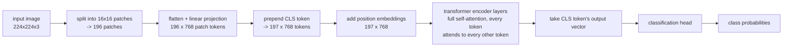

# Day 1 — CNNs vs. Vision Transformers

Today's question: once a photo is reduced to a grid of numbers, how does a network learn to "see" a cat, a stop sign, or a tumor in it? There isn't one answer — there are two competing architectural philosophies, convolutional networks (CNNs) and vision transformers (ViT), and understanding *why* they differ tells you more about deep learning in general than either one does on its own.

## An image is a tensor, and that's the whole problem

A color photo is stored as a `height x width x 3` array of intensities — one channel each for red, green, and blue. A 224x224 photo is 224 x 224 x 3 = 150,528 numbers before any model has done anything with it. In batched, channel-first tensor notation (the PyTorch convention), a single such image is:

```
shape: (batch=1, channels=3, height=224, width=224)
```

There is no built-in notion of "edge," "eye," or "wheel" anywhere in that array — just numbers. Every architecture below is really just a different strategy for finding exploitable structure in that grid. The two strategies differ in what they assume about that structure *before* seeing a single training example — what's called an **inductive bias** — and that single design choice cascades into almost every practical difference between the two.

## CNNs: sliding filters, growing receptive fields

A convolutional layer slides a small filter (commonly 3x3) across the image, computing one weighted sum per position. A single 3x3 filter over a 3-channel image has 3x3x3 = 27 weights (plus a bias); the same 27 numbers get reused at every spatial position. That reuse is the whole trick.

Stacking layers builds a feature hierarchy: early filters respond to edges and color gradients, mid-depth filters combine those into textures and simple parts (a curve, a corner), and deep filters assemble parts into whole objects. No single layer "knows" what a face is — the concept only exists as a composition across many layers.

```mermaid
flowchart LR
    IMG["input image<br/>224x224x3"] --> C1["conv block 1<br/>edges, color gradients<br/>small receptive field"]
    C1 --> P1["pool / stride<br/>downsample"]
    P1 --> C2["conv block 2<br/>textures, corners"]
    C2 --> P2["pool / stride<br/>downsample"]
    P2 --> C3["conv block 3<br/>parts: eyes, wheels, leaves"]
    C3 --> C4["conv block 4<br/>whole objects"]
    C4 --> GAP["global average pool<br/>-> one vector per channel"]
    GAP --> FC["fully connected head"]
    FC --> OUT["class probabilities"]
```



This design bakes in two assumptions about images that turn out to be true almost all the time:

- **Locality** — a pixel is much more related to its immediate neighbors than to a pixel on the other side of the image, so a filter only ever looks at a small neighborhood at once.
- **Translation equivariance** — a filter that has learned to detect a vertical edge in the top-left corner will detect the same edge if it appears in the bottom-right, because it's *literally the same weights* sliding across every position. The network doesn't have to relearn "edge" once per location.

**Receptive field** is the size of the input region that a given unit's output actually depends on, and it grows with depth. Stack two 3x3 conv layers (stride 1, no pooling) and a unit in the second layer already depends on a 5x5 input patch — each 3x3 layer adds `(kernel_size - 1)` to the receptive field, so two of them add `2 + 2 = 4` to the base 1x1, giving 5x5. This is *why* CNNs need depth: a single layer only ever compares nearby pixels, so relating a pixel in the top-left corner to one in the bottom-right requires enough stacked layers (or enough downsampling) for their receptive fields to finally overlap.

Locality and translation equivariance are why CNNs learn well from comparatively modest datasets: the architecture already "knows" something true about natural images (nearby pixels relate; the same pattern can appear anywhere) before training even starts, so it spends less of its capacity re-deriving that from data.

## ViT: an image as a sentence of patches

A Vision Transformer throws convolution out entirely and reuses the transformer architecture that language models are built on. Concretely:

1. Slice the image into fixed-size, non-overlapping patches — for a 224x224 image with 16x16 patches, that's `(224/16) x (224/16) = 14 x 14 = 196` patches.
2. Flatten each patch and linearly project it into an embedding vector — a "patch token." Each patch has `16 x 16 x 3 = 768` raw values, projected (via a learned matrix) into an embedding of size `embed_dim` — commonly 768 for ViT-Base, which is a coincidence worth noticing: the raw patch dimension and the model's hidden size happen to line up for this particular patch size and channel count.
3. Prepend one learnable **CLS token** to the sequence — a vector with no corresponding image content, whose job is purely to accumulate a summary of the whole image through attention.
4. Add a learned **position embedding** to every token (patches + CLS). Self-attention itself has no notion of order or position — without this step, shuffling the 196 patches would produce an identical output, which is obviously wrong for images.
5. Feed the sequence of 197 tokens through standard transformer encoder layers. In each self-attention layer, every token computes a query, key, and value vector, and attends to every other token directly — there is no neighborhood restriction at all.
6. After the final layer, take the CLS token's output vector and pass it through a small classification head.



Because attention carries no locality assumption, a single self-attention layer can directly relate a patch in the top-left corner to a patch in the bottom-right — something a CNN only achieves after enough layers for the receptive fields to overlap, as described above. That flexibility is also the cost: with far less built-in structure to lean on, a ViT has to *learn* that nearby pixels tend to matter more together, purely from data, so it typically needs a larger training set (or a strong pretrained checkpoint) to match a CNN's accuracy on small-to-medium datasets. This is a real, empirically observed tradeoff, not a minor footnote — the original ViT paper found it underperformed similarly-sized CNNs when trained from scratch on ImageNet-scale data, and only pulled ahead once pretrained on datasets orders of magnitude larger.

### Worked example: tracing shapes through both architectures

Running the arithmetic above end-to-end (verified with a small numpy script — see below) on one 224x224x3 image:

| Stage | Shape | Notes |
|---|---|---|
| Input image | `(1, 3, 224, 224)` | batch=1, channels-first |
| One 3x3 conv, 8 filters, on a 16x16 crop | `(1, 8, 14, 14)` | `(16 - 3) / 1 + 1 = 14` per spatial dim |
| ViT: raw patches | `(1, 196, 768)` | 196 = 14x14 patches, 768 = 16x16x3 |
| ViT: patch tokens after projection | `(1, 196, 768)` | linear layer, `768 -> 768` here |
| ViT: tokens with CLS prepended | `(1, 197, 768)` | 196 + 1 |
| ViT: Q, K, V per token | `(1, 197, 768)` each | one query/key/value vector per token |
| ViT: attention score matrix | `(1, 197, 197)` | every token's score against every other token |
| ViT: attention output | `(1, 197, 768)` | weighted sum of V, weights from softmax(scores) |

The `(197, 197)` attention matrix is the crux of the whole comparison: it is a dense, learned map of how much every one of the 197 tokens should listen to every other one — including the CLS token listening to a patch 196 positions away, in a single layer, with no decay for distance. A CNN never materializes anything like this matrix; its "attention" is implicit in which pixels a stack of filters happens to have overlapping receptive fields over.

```python
import numpy as np

rng = np.random.default_rng(0)

# ---- an image as a tensor ----
B, C, H, W = 1, 3, 224, 224
image = rng.uniform(0, 1, size=(B, C, H, W)).astype(np.float32)
# shape: (batch=1, channels=3, H=224, W=224)

# ---- CNN: one conv layer, implemented directly (im2col-style) so the
# shape math is visible rather than hidden inside a library call ----
kernel = rng.normal(size=(8, C, 3, 3)).astype(np.float32)
# shape: (out_channels=8, in_channels=3, kh=3, kw=3)

def conv2d_naive(x, w, stride=1):
    B, C, H, W = x.shape
    OC, _, kh, kw = w.shape
    oh = (H - kh) // stride + 1          # output height shrinks: no padding
    ow = (W - kw) // stride + 1          # output width shrinks the same way
    out = np.zeros((B, OC, oh, ow), dtype=np.float32)
    w_flat = w.reshape(OC, -1)            # (OC, C*kh*kw) -- flatten each filter
    for i in range(oh):
        for j in range(ow):
            # grab the receptive-field patch this output position depends on
            patch = x[:, :, i*stride:i*stride+kh, j*stride:j*stride+kw]   # (B, C, kh, kw)
            patch_flat = patch.reshape(B, -1)                             # (B, C*kh*kw)
            out[:, :, i, j] = patch_flat @ w_flat.T                       # (B, OC) dot product per filter
    return out

# run on a 16x16 crop only -- a pure-python loop over the full 224x224
# image would be needlessly slow for a shape demo
small_crop = image[:, :, :16, :16]                  # shape: (1, 3, 16, 16)
feature_map = conv2d_naive(small_crop, kernel)      # shape: (1, 8, 14, 14)
print(feature_map.shape)   # -> (1, 8, 14, 14): (16-3)/1+1 = 14 per spatial dim

# ---- ViT: patchify + linear projection + CLS token + position embedding ----
patch_size = 16
n_patches_h = H // patch_size                       # 224 / 16 = 14
n_patches_w = W // patch_size                        # 14
n_patches = n_patches_h * n_patches_w                 # 196
patch_dim = C * patch_size * patch_size               # 3*16*16 = 768
embed_dim = 768                                        # ViT-Base hidden size

# reshape the image into a grid of non-overlapping patches, then flatten
# each patch into a single vector -- no learned weights involved yet
x = image.reshape(B, C, n_patches_h, patch_size, n_patches_w, patch_size)
x = x.transpose(0, 2, 4, 1, 3, 5)      # group each patch's pixels together
patches = x.reshape(B, n_patches, patch_dim)
# shape: (1, 196, 768) -- 196 patches, each still a raw 768-length pixel vector

W_proj = rng.normal(scale=0.02, size=(patch_dim, embed_dim)).astype(np.float32)
patch_tokens = patches @ W_proj
# shape: (1, 196, 768) -- now a *learned* embedding, not raw pixels

cls_token = rng.normal(scale=0.02, size=(1, 1, embed_dim)).astype(np.float32)
cls_tokens = np.repeat(cls_token, B, axis=0)         # shape: (1, 1, 768)
tokens = np.concatenate([cls_tokens, patch_tokens], axis=1)
# shape: (1, 197, 768) -- CLS token is now position 0 in the sequence

pos_embed = rng.normal(scale=0.02, size=(1, n_patches + 1, embed_dim)).astype(np.float32)
tokens = tokens + pos_embed
# shape: (1, 197, 768) -- same shape, but position is now encoded in the values

# ---- one self-attention layer over the full 197-token sequence ----
Wq = rng.normal(scale=0.02, size=(embed_dim, embed_dim)).astype(np.float32)
Wk = rng.normal(scale=0.02, size=(embed_dim, embed_dim)).astype(np.float32)
Wv = rng.normal(scale=0.02, size=(embed_dim, embed_dim)).astype(np.float32)

Q = tokens @ Wq   # shape: (1, 197, 768) -- one query vector per token
K = tokens @ Wk   # shape: (1, 197, 768) -- one key vector per token
V = tokens @ Wv   # shape: (1, 197, 768) -- one value vector per token

scores = Q @ K.transpose(0, 2, 1) / np.sqrt(embed_dim)
# shape: (1, 197, 197) -- scores[0, i, j] = how much token i should attend to token j

scores = scores - scores.max(axis=-1, keepdims=True)   # numerical stability
attn = np.exp(scores)
attn = attn / attn.sum(axis=-1, keepdims=True)          # shape: (1, 197, 197), rows sum to 1

out = attn @ V
# shape: (1, 197, 768) -- each token's output is a weighted blend of every token's value vector
```

This script was run directly in a numpy-only environment and every printed shape above matches what's shown here — no torch or transformers required to see the mechanism. Where the row-197 attention weights land is the interesting part: the CLS token's attention weight onto the very last patch token and onto the very first patch token came out to roughly the same magnitude (both around 0.005, i.e. close to uniform, `1/197 ≈ 0.0051`) for these random, untrained weights — which is expected: with no training, attention has no reason to prefer near tokens over far ones. That uniformity is exactly what training is for — it reshapes those weights so the model actually attends to the *relevant* patches, wherever they are in the image, not just the nearby ones a CNN would default to.

## Why you almost never train either one from scratch

Both architectures need on the order of millions of labeled images to train from a random initialization to strong accuracy — nobody has that budget for a new, narrow task like "classify these ten kinds of plant leaf." Instead, the standard move is **transfer learning**: start from a checkpoint someone already trained on a large, general dataset (ImageNet-21k, LAION, or similar), and either use it directly (**zero-shot** / **feature extraction**) or continue training it briefly on your smaller dataset (**fine-tuning**).

When picking a checkpoint, three things matter in practice:
- **Size** — a 300M-parameter model may be pointless overhead for a CPU-only demo classifying ten categories; a smaller distilled checkpoint often loses little accuracy for a narrower task.
- **Pretraining data** — a model pretrained on general web photos may need real fine-tuning before it's useful on medical scans, satellite imagery, or manufacturing defect photos, since those domains look nothing like the pretraining distribution.
- **License** — some checkpoints are released for research only; check before shipping a product on top of one.

## Code pattern: batch classification with a confidence-based review flag

This is real, current `transformers` API usage — not run in this sandbox (torch isn't installed here), but it follows the same shape logic verified above: every image becomes one 224x224x3 tensor, gets classified, and produces one softmax probability distribution over classes.

```python
from transformers import ViTImageProcessor, ViTForImageClassification
from PIL import Image
import torch
import pandas as pd

processor = ViTImageProcessor.from_pretrained("google/vit-base-patch16-224")
model = ViTForImageClassification.from_pretrained("google/vit-base-patch16-224")
model.eval()  # disable dropout etc. -- this is inference, not training

rows = []
for path in ["plate_01.jpg", "plate_02.jpg", "plate_03.jpg"]:
    image = Image.open(path).convert("RGB")
    # processor resizes/crops/normalizes to the model's expected input and
    # returns a dict of tensors, including pixel_values
    inputs = processor(images=image, return_tensors="pt")
    # inputs["pixel_values"] shape: (1, 3, 224, 224)

    with torch.no_grad():  # no backward pass needed -- saves memory and time
        logits = model(**inputs).logits
    # logits shape: (1, num_labels) -- num_labels=1000 for this ImageNet checkpoint

    probs = logits.softmax(dim=-1)[0]        # shape: (1000,) -- sums to 1.0
    top_prob, top_idx = probs.max(dim=-1)     # both scalars

    rows.append({
        "file": path,
        "label": model.config.id2label[top_idx.item()],
        "confidence": round(top_prob.item(), 3),
        "needs_review": top_prob.item() < 0.6,   # arbitrary but reasonable threshold
    })

df = pd.DataFrame(rows)  # -> DataFrame, columns [file, label, confidence, needs_review], len=3
```

Flagging anything under a confidence threshold turns a silent, potentially wrong prediction into an item in a human review queue — cheap insurance, and usually far cheaper than the cost of an undetected wrong auto-tag reaching production.

## Common pitfalls

- **Mismatched preprocessing.** Every pretrained checkpoint expects a specific input size, normalization (mean/std per channel), and sometimes color channel order. Using the model's own `Processor`/`ImageProcessor` class (as above) avoids silently feeding garbage-scaled pixels into a network that was trained on a different range.
- **Treating ViT as a drop-in CNN replacement on small data.** Swapping a CNN for a same-sized ViT and training both from scratch on a few thousand images will usually make results *worse*, not better, precisely because the ViT has fewer useful assumptions to fall back on. Fine-tuning a pretrained ViT is a different story — most of the "learn what matters" work is already done.
- **Ignoring receptive field when input resolution changes.** A CNN trained at 224x224 has learned filters tuned to features at that scale; feeding it 1024x1024 images without adjusting expectations can silently degrade quality, because the effective receptive field now covers a much smaller fraction of the object.
- **Interpreting high confidence as high correctness.** Softmax probabilities are not calibrated probabilities by default — a model can be 99% "confident" and wrong, especially on inputs unlike anything in its training data (out-of-distribution inputs). Confidence thresholds help but don't eliminate this risk.

## Takeaway

CNNs bake locality and translation equivariance directly into the architecture via sliding, weight-shared filters, which is why they work well from comparatively modest data but need depth to relate distant parts of an image. ViTs discard that built-in structure entirely, treating an image as a sequence of patch tokens and learning spatial relationships purely through self-attention — which lets any patch relate to any other patch in one layer, at the cost of needing far more data (or a strong pretrained checkpoint) to learn what a CNN gets for free. In practice, almost nobody trains either from scratch: transfer learning from a large pretrained checkpoint is the default, and the real engineering decisions are about picking the right checkpoint size, pretraining domain, and confidence threshold for the task at hand.
