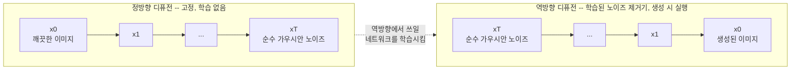
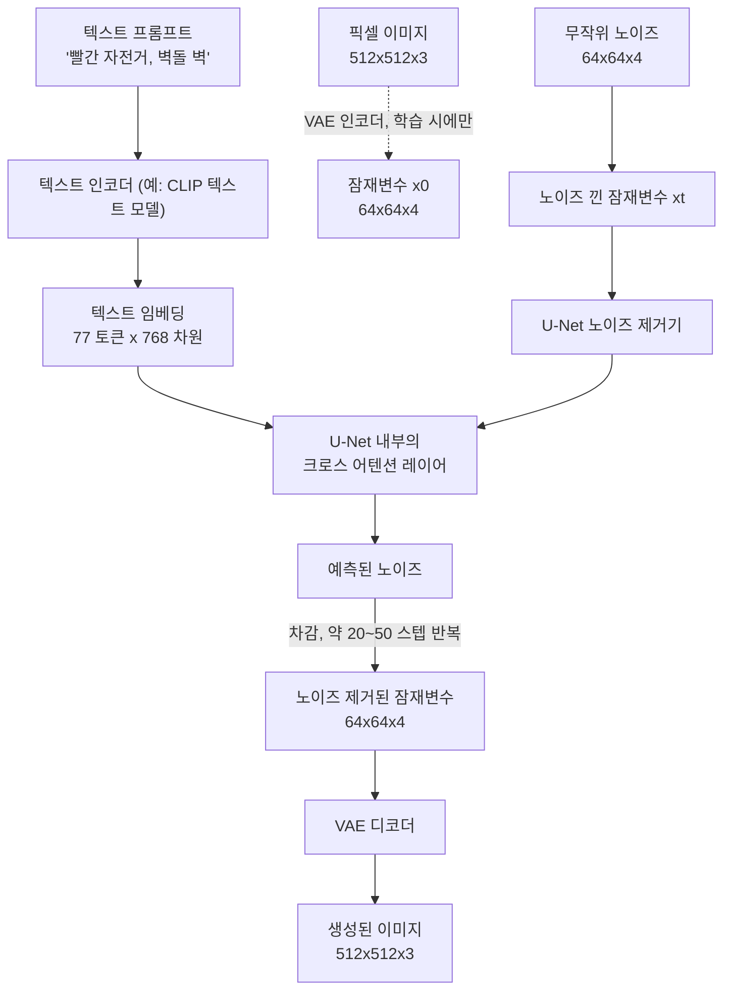

# Day 2 — 디퓨전 모델과 텍스트-이미지 생성

오늘의 질문: 모델은 `"a red bicycle leaning against a brick wall"`(벽돌 벽에 기대어 있는 빨간 자전거)이라는 문자열을 어떻게 5초 전까지만 해도 존재하지 않던 그림으로 바꿀까? 그 메커니즘은 언뜻 생각하는 것보다 훨씬 낯설다 — 모델은 아무것도 "그리지" 않는다. 순수한 정적(static) 노이즈에서 시작해, 어떤 노이즈를 제거해야 할지를 반복해서 추측할 뿐이다.

## 핵심 트릭: 그리는 법이 아니라, 노이즈를 되돌리는 법을 배운다

"X의 사진"을 한 번에 출력하도록 네트워크를 직접 학습시키는 것은 진짜로 어려운 생성 모델링 문제다 — 가능한 모든 이미지의 공간은 어마어마하게 크고, 그중 대부분은 무엇의 그럴듯한 사진도 아니다. 디퓨전은 이 문제를 훨씬 쉽고 잘 정의된 문제로 바꿔치기함으로써 우회한다. 바로 *노이즈 제거(denoising)*다.

**정방향 디퓨전(forward diffusion)**은 실제 훈련 이미지에 소량의 가우시안 노이즈를 여러 단계(흔히 `T = 1000`단계)에 걸쳐 반복적으로 더해서, 결과가 통계적으로 순수한 무작위 노이즈와 구별되지 않을 때까지 진행한다. 이 과정은 고정되어 있고 학습이 전혀 필요 없다 — 전적으로 각 단계에서 얼마만큼의 노이즈를 주입할지를 결정하는 분산 값들의 시퀀스인 **노이즈 스케줄** `beta_1, ..., beta_T`에 의해 결정된다. 반복적인 가우시안 노이즈 추가일 뿐이므로, 모든 중간 단계를 시뮬레이션하지 않고도 깨끗한 이미지 `x0`에서 임의의 노이즈 레벨 `xt`로 곧장 건너뛸 수 있는 닫힌 형태(closed-form)의 지름길이 존재한다.

```
xt = sqrt(alpha_bar_t) * x0 + sqrt(1 - alpha_bar_t) * noise
```

여기서 `alpha_bar_t`는 `t`단계까지 `(1 - beta)`를 누적곱한 값이다. `t`가 커질수록 `alpha_bar_t`는 0에 가까워지므로, `x0` 항의 기여는 줄어들고 `noise` 항의 기여는 커진다 — `xt`는 "완전한 신호"에서 "완전한 노이즈"로 부드럽게 보간된다.

**역방향 디퓨전(reverse diffusion)**이 실제로 학습되는 부분이다. 신경망은 노이즈가 낀 이미지 `xt`와 타임스텝 `t`를 보고, 그것을 만들기 위해 더해졌던 노이즈를 예측하도록 학습된다. 이걸 안정적으로 할 수 있게 되면, 생성은 단순해진다. 순수한 무작위 노이즈 `xT`에서 시작해, 네트워크에 그 안의 노이즈를 예측하라고 물어본 뒤, 그 예측값의 (신중하게 스케일된) 일부를 빼서 노이즈가 조금 줄어든 `x(T-1)`을 얻고, 이를 `x0`까지 반복한다 — 훈련 세트에 한 번도 없었던 새로운 이미지가 완성된다.



"그냥 한 번에 좋은 이미지를 생성하라"는 문제와 달리 이 문제가 다루기 쉬운 이유는 이렇다. 이미 어느 정도 형태를 갖춘 이미지에 *얼마나 많은 노이즈가 더해졌는지* 예측하는 것은, 아무것도 없는 상태에서 일관된 이미지 전체를 발명해내는 것보다 훨씬 국소적이고 잘 제약된 과제다. 각 노이즈 제거 단계는 살짝만 맞으면 되고, 오류는 남은 수많은 단계에 걸쳐 교정될 여지가 있다.

### 예제로 확인하기: 정방향 과정에서 신호 대 노이즈 비율이 감쇠하는 양상

표준적인 선형 노이즈 스케줄(`T=1000` 단계에 걸쳐 `beta`가 `1e-4`에서 `0.02`로 증가)을 쓰고 `alpha_bar_t = cumprod(1 - beta)`를 직접 계산해 보면(numpy로 검증 — torch 불필요, 순수한 배열 연산):

| 단계 t | 신호 크기 `sqrt(alpha_bar_t)` | 노이즈 크기 `sqrt(1-alpha_bar_t)` |
|---|---|---|
| 0 | 0.9999 | 0.0100 |
| 249 | 0.7239 | 0.6899 |
| 499 | 0.2803 | 0.9599 |
| 999 | 0.0064 | 1.0000 |

대략 중간 지점(t=499)에 이르면 이미 노이즈 성분이 신호 성분을 3배 넘게 압도하고, t=999에서는 원본 이미지가 실질적으로 아무 기여도 하지 못한다 — `xt`는 사실상 순수 노이즈다. 바로 이것이 역방향 과정에 하나의 거대한 점프가 아니라 *수백 개*의 작은 단계가 필요한 이유다. t=999 근방에서는 하나의 거대한 노이즈 제거 단계를 조건화할 신호가 거의 남아있지 않으므로, 네트워크는 신호 대 노이즈 비율이 되돌아오는 길에서 서서히 개선되는 동안, 구조를 한 단계씩 점진적으로 재구축해야 한다.

```python
import numpy as np

rng = np.random.default_rng(0)

# VAE로 인코딩된 잠재변수(latent)를 대신하는 예시 (아래 파이프라인 절에서
# 디퓨전이 왜 원시 픽셀이 아니라 이 압축된 공간에서 실행되는지 설명한다)
B, C, Hl, Wl = 1, 4, 64, 64
x0 = rng.uniform(-1, 1, size=(B, C, Hl, Wl)).astype(np.float32)
# shape: (batch=1, channels=4, H=64, W=64) -- "깨끗한" 잠재변수

# ---- 고정된 선형 노이즈 스케줄 ----
T = 1000
betas = np.linspace(1e-4, 0.02, T).astype(np.float32)   # shape: (1000,)
alphas = 1.0 - betas                                      # shape: (1000,)
alpha_bars = np.cumprod(alphas)                            # shape: (1000,), 단조 감소

def forward_diffuse(x0, t_index, alpha_bars, rng):
    """x0로부터 x_t를 닫힌 형태로 직접 샘플링, 중간 단계를 모두 건너뛴다."""
    a_bar = alpha_bars[t_index]
    noise = rng.normal(size=x0.shape).astype(np.float32)   # x0와 shape 동일
    xt = np.sqrt(a_bar) * x0 + np.sqrt(1 - a_bar) * noise    # x0와 shape 동일
    return xt, noise

for t_index in [0, 249, 499, 999]:
    xt, noise = forward_diffuse(x0, t_index, alpha_bars, rng)
    signal_scale = np.sqrt(alpha_bars[t_index])
    noise_scale = np.sqrt(1 - alpha_bars[t_index])
    print(t_index, xt.shape, round(signal_scale, 4), round(noise_scale, 4))
    # xt.shape는 매 단계에서 항상 (1, 4, 64, 64) -- 노이즈 추가는 shape를
    # 절대 바꾸지 않고, 원본 신호가 얼마나 남아있는지만 바꾼다
```

이 스크립트를 실행하면 위 표의 네 행이 정확히 그대로 출력된다 — `xt.shape`는 매 단계에서 `(1, 4, 64, 64)`로 유지되며(노이즈를 더하는 과정은 값만 바꿀 뿐 텐서의 shape는 절대 바꾸지 않는다), `signal_scale`은 0.9999에서 0.0064로 줄어들고 `noise_scale`은 0.0100에서 1.0000으로 늘어난다.

## 이미지 생성의 두 계열

현대의 생성형 이미지 모델은 "일관된 이미지를 생성한다"는 문제를 아주 다르게 푸는 두 계열로 대체로 나뉜다.

- **이산 토큰화 + 자기회귀(autoregressive)** — VQ-VAE/VQGAN이 먼저 이미지를 이산적인 코드북 인덱스 그리드(텍스트의 BPE 어휘와 개념적으로 유사한, 고정된 시각적 "토큰" 어휘)로 압축한다. 그다음 자기회귀 트랜스포머가 그 토큰 인덱스들을 왼쪽부터 오른쪽으로 한 번에 하나씩 생성한다 — 언어 모델이 단어 토큰을 생성하는 것과 같은 방식이다.
- **연속 잠재 디퓨전(continuous latent diffusion)** — 오토인코더가 이미지를 (이산 어휘가 아닌) *연속적인* 잠재 텐서로 압축하고, 디퓨전 모델이 위에서 설명한 정방향/역방향 과정을 이용해 그 연속 공간에서 직접 노이즈를 제거한다. Stable Diffusion, Imagen을 비롯한 현재의 고품질 텍스트-이미지 시스템 대부분이 이 방식으로 만들어져 있다.

실무적인 차이는 생성 속도와 실패 양상에서 드러난다. 자기회귀 토큰 생성은 한 번에 하나씩 되돌릴 수 없는 이산적 선택을 내리므로, 초반의 나쁜 토큰 선택이 누적되는 경향이 있다. 반면 디퓨전은 매 단계마다 이미지 전체를 함께 노이즈 제거하므로 경로를 수정할 기회가 여러 번 주어지지만, 그 대가로 최종 이미지에 수렴하기까지 많은 순차적 단계가 필요하다.

## Stable Diffusion 스타일 파이프라인 내부

세 가지 구성 요소가 함께 동작하며, 각각이 무엇을 담당하는지 이해하면 "스텝 수"와 "guidance scale"이 실제로 무엇을 제어하는지가 대부분 명확해진다.



1. **VAE(오토인코더).** 학습 단계에서 VAE의 인코더는 `512x512x3` 픽셀 이미지(786,432개의 숫자)를 훨씬 작은 잠재변수, 예를 들어 `64x64x4`(16,384개의 숫자)로 압축한다 — **48배 압축**이다. 생성 시점에는 디코더 절반만 실행되어, 최종적으로 노이즈가 제거된 잠재변수를 다시 픽셀로 바꾼다. 비용이 많이 드는 반복 과정 동안 디퓨전은 원시 픽셀을 직접 건드리지 않는다 — 전체 노이즈 추가/제거 루프를 완전한 픽셀 해상도가 아니라 이 압축된 잠재 공간에서 실행하는 것이, 데이터센터 클러스터가 아니라 일반 소비자용 GPU 한 대로도 충분히 빠르게 돌아가게 만드는 핵심이다.
2. **U-Net(노이즈 제거기).** 매 단계마다 현재 노이즈가 낀 잠재변수와 타임스텝 `t`(대략 얼마나 많은 노이즈를 예상해야 하는지 알기 위해)를 입력받아 그 안에 있는 노이즈를 예측한다. "U-Net"이라는 이름은 그 모양에서 왔다 — 잠재변수를 여러 단계에 걸쳐 다운샘플링한 뒤 다시 업샘플링하며, 스킵 연결(skip connection)이 다운샘플링 경로의 세밀한 디테일을 대응하는 업샘플링 단계로 직접 전달한다. 이 구조 덕분에 여러 공간적 스케일에서 동시에 추론할 수 있다.
3. **텍스트 인코더 + 크로스 어텐션.** 프롬프트는 토큰화되어 임베딩 시퀀스로 인코딩된다 — Stable Diffusion의 CLIP 텍스트 인코더의 경우 고정된 `77 x 768` shape(77개 토큰 위치, 패딩 또는 잘림, 각각 768차원 벡터)다. U-Net 내부에서 **크로스 어텐션** 레이어는 잠재변수의 모든 공간적 위치가 쿼리를 계산하고 77개의 텍스트 임베딩(키와 값)에 걸쳐 주의를 기울이게 한다 — 이는 메커니즘상 1일차 ViT의 쿼리/키/값 어텐션과 완전히 동일하며, 다만 쿼리는 이미지 쪽에서, 키/값은 텍스트 쪽에서 온다는 점만 다르다. "빨간"이라는 단어가 잠재변수의 어떤 영역을 붉은 계열의 노이즈 제거 값 쪽으로 밀어붙이는지를 결정하는 구체적인 메커니즘이 바로 이것이다.

### Guidance scale, 한 문장으로

텍스트-이미지 모델은 대개 텍스트 프롬프트가 없는 것처럼 가정하는 *무조건부(unconditional)* 노이즈 예측도 함께 만들어내도록 학습된다. 생성 시점에 실제로 사용되는 최종 노이즈 예측은 다음과 같은 혼합값이다: `pred = uncond_pred + guidance_scale * (cond_pred - uncond_pred)`. `guidance_scale`이 1.0이면 단순 조건부 예측을 그대로 쓰고, 값을 높이면 텍스트가 만들어낸 *차이*를 과장시켜 프롬프트 충실도를 높인다 — 그리고 어느 지점을 넘어서면(일반적인 체크포인트 기준으로 대략 15~20 근처) 예측이 모델이 실제로 학습된 범위를 크게 벗어나 외삽되기 시작하면서 채도가 과도하게 높아지고 시각적 아티팩트가 나타나기 시작한다.

## GAN vs. 디퓨전

GAN(생성적 적대 신경망)은 생성자(generator) 네트워크를 한 번의 **단일 순전파(forward pass)**로 통과시켜 이미지를 만들며, 실제 이미지와 생성된 이미지를 구별하는 법을 동시에 학습하는 판별자(discriminator) 네트워크에 맞서 적대적으로 학습된다. 이 방식은 추론 시 GAN을 빠르게 만들지만, 훈련이 불안정하기로 악명 높다 — 생성자와 판별자는 수렴에 실패할 수도 있는 미니맥스 게임에 갇혀 있으며, **모드 붕괴(mode collapse)**(생성자가 훈련 분포 전체의 다양성 대신, 판별자를 안정적으로 속일 수 있는 가능한 출력의 좁은 일부만 생성하도록 학습되는 것)는 잘 알려진 실패 양상이다.

디퓨전은 그 하나의 빠른 패스를, 개별적으로는 쉬운 여러 개의 작은 노이즈 제거 단계와 맞바꾼다. 이미지 하나당 추론 속도는 느리지만(단 한 번이 아니라 수십 번의 순차적 네트워크 평가), "더해진 노이즈를 예측하라"는 학습 목표는 적대적 게임 때문에 불안정해질 일이 없는, 안정적이고 잘 작동하는 회귀 문제다. 스텝 수를 조절해 추론 속도와 품질을 맞바꿀 수 있다는 점과 결합된 이 안정성이, 디퓨전이 고품질 텍스트-이미지 생성의 지배적인 접근법으로서 GAN을 대체한 큰 이유다.

## 코드 패턴: 스텝 수와 guidance scale 비교하기

아래는 실제 최신 `diffusers` API를 사용한다. 이 샌드박스에는 GPU도 torch/diffusers 설치도 없어 직접 실행하지는 않았지만, shape와 제어 흐름은 위에서 검증한 메커니즘을 그대로 따른다.

```python
from diffusers import StableDiffusionPipeline
import torch
import pandas as pd

pipe = StableDiffusionPipeline.from_pretrained(
    "segmind/small-sd",          # 증류된 경량 체크포인트 -- U-Net 파라미터가 더 적다
    torch_dtype=torch.float32,   # CPU라면 float32; GPU에서는 보통 float16
)

prompts = [
    "a wooden board game piece shaped like a fox, isometric, flat colors",
    "a wooden board game piece shaped like a whale, isometric, flat colors",
]

rows = []
for prompt in prompts:
    for steps, guidance in [(15, 4.0), (30, 7.5), (30, 12.0)]:
        # 호출마다 전체 역방향 디퓨전 루프가 실행된다: `steps`번의 순차적
        # U-Net 평가로 64x64x4 잠재변수의 노이즈를 제거한 뒤, VAE 디코더가
        # 이를 512x512x3 이미지로 바꾼다
        image = pipe(
            prompt,
            num_inference_steps=steps,
            guidance_scale=guidance,
        ).images[0]
        fname = f"{prompt[:10].replace(' ', '_')}_{steps}_{guidance}.png"
        image.save(fname)
        rows.append({"prompt": prompt, "steps": steps, "guidance_scale": guidance, "file": fname})

comparison = pd.DataFrame(rows)
# -> DataFrame, columns [prompt, steps, guidance_scale, file], len = 프롬프트 2개 * 설정 3개 = 6
```

대략적으로: `num_inference_steps`를 늘리면 노이즈 제거기가 디테일을 다듬을 기회를 더 많이 얻지만, 대부분의 최신 체크포인트에서는 30~50 스텝을 넘어서면 개선 폭이 급격히 줄어든다(많은 체크포인트가 특별히 훨씬 적은 스텝만 필요하도록 증류되어 있기도 하다). `guidance_scale`을 높이면 출력이 프롬프트를 더 문자 그대로 따르게 되지만, 보통 서로 다른 무작위 시드에 걸친 출력 다양성을 희생하게 되고, 위에서 설명했듯 너무 높이면 시각적 아티팩트가 나타난다.

## 흔한 함정

- **`num_inference_steps`와 학습 스텝을 혼동하기.** 노이즈 스케줄의 `T=1000`은 정방향 과정이 얼마나 세밀하게 정의되었는지를 나타내는 학습 시점 상수다. `num_inference_steps`는 별개의, 훨씬 작은 값(흔히 20~50)이다 — 현대의 샘플러들은 생성 시점에 1000개의 이산 스텝을 전부 걸어갈 필요가 없다. 부분집합으로 뽑은 타임스텝들 사이를 신중하게 계산된 더 큰 점프로 건너뛴다.
- **디퓨전이 원시 픽셀에서 동작한다고 가정하기.** (Stable Diffusion 등의) 잠재 디퓨전에서는 U-Net이 노이즈 제거 루프 동안 `512x512x3` 픽셀 텐서를 전혀 보지 않는다 — 훨씬 작은 잠재변수만 본다. 커스텀 파이프라인에서 shape 불일치를 디버깅할 때는, 보통 잠재 해상도에서 동작해야 할 단계가 실수로 픽셀 해상도 입력을 받았거나 그 반대인지를 확인하는 것부터 시작하는 게 좋다.
- **guidance scale을 높여서 나쁜 생성 결과를 "고치려" 하기.** guidance scale을 매우 높이면 다양성이 줄고 아티팩트가 생길 뿐, 모델이 근본적으로 어려워하는 프롬프트를 안정적으로 고쳐주지는 않는다. 보통은 프롬프트를 다르게 표현하거나 다른 시드를 시도하는 편이 낫다.
- **VAE 자체의 손실 압축을 무시하기.** 잠재변수를 다시 픽셀로 매핑하는 VAE 자체가 손실 압축이므로, 디퓨전 과정이 무엇을 했든 상관없이 세밀한 디테일(작은 글자, 머리카락 한 올, 정밀한 기하학적 패턴)이 인코딩/디코딩 왕복만으로도 미묘하게 뭉개질 수 있다.

## 요약

디퓨전 모델은 고정되고 수학적으로 단순한 노이즈 추가 과정을 되돌리는 법을 학습함으로써 이미지를 생성한다 — 네트워크는 언제나 "이 이미지에 노이즈가 얼마나 있는가"라는 국소적이고 잘 제약된 문제만 풀면 되며, "처음부터 일관된 이미지를 발명하라"는 문제는 절대 풀지 않는다. Stable Diffusion 스타일 파이프라인은 이 루프를 원시 픽셀이 아니라 압축된 VAE 잠재 공간에서 실행함으로써 저렴하게 만들고, 잠재변수의 공간적 위치와 프롬프트의 토큰 임베딩 사이의 크로스 어텐션을 통해 텍스트 프롬프트 쪽으로 방향을 조정한다 — 이는 ViT를 구동하는 것과 메커니즘상 동일한 어텐션 연산이며, 다만 쿼리와 키/값이 서로 다른 모달리티에서 온다는 점만 다르다.
