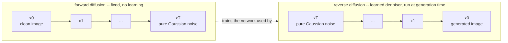
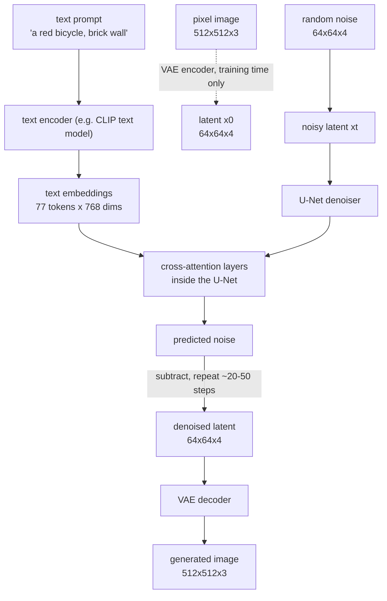

# Day 2 — Diffusion Models and Text-to-Image Generation

Today's question: how does a model turn the string `"a red bicycle leaning against a brick wall"` into a picture that didn't exist five seconds earlier? The mechanism is stranger than it sounds — the model doesn't draw anything. It starts with pure static and repeatedly guesses what noise to remove.

## The core trick: learn to undo noise, not to draw

Directly training a network to output "a photo of X" in one shot is a genuinely hard generative modeling problem — the space of all possible images is enormous, and most of it is not a coherent picture of anything. Diffusion sidesteps this by turning image generation into a much easier, well-posed problem: *denoising*.

**Forward diffusion** takes a real training image and adds a small amount of Gaussian noise, repeatedly, over many steps (often `T = 1000`), until the result is statistically indistinguishable from pure random noise. This process is fixed and requires no learning at all — it's entirely determined by a **noise schedule**, a sequence of variance values `beta_1, ..., beta_T` that controls how much noise is injected at each step. Because it's just repeated Gaussian noise addition, there is a closed-form shortcut to jump directly from the clean image `x0` to any noise level `xt` without simulating every intermediate step:

```
xt = sqrt(alpha_bar_t) * x0 + sqrt(1 - alpha_bar_t) * noise
```

where `alpha_bar_t` is the cumulative product of `(1 - beta)` up through step `t`. As `t` grows, `alpha_bar_t` shrinks toward 0, so the `x0` term's contribution shrinks and the `noise` term's contribution grows — `xt` smoothly interpolates from "all signal" to "all noise."

**Reverse diffusion** is the part that's actually learned: a neural network is trained to look at a noisy image `xt` and the timestep `t`, and predict the noise that was added to produce it. Once it can do that reliably, generation is just: start from pure random noise `xT`, ask the network to predict the noise in it, subtract a (carefully scaled) portion of that prediction to get a slightly less noisy `x(T-1)`, and repeat all the way down to `x0` — a novel image that was never in the training set.



The reason this is tractable where "just generate a good image in one pass" isn't: predicting *how much noise was added* to an already-mostly-formed image is a much more local, well-constrained task than inventing an entire coherent image from nothing. Each individual denoising step only has to be slightly right, and errors get corrected over the many remaining steps.

### Worked example: how signal-to-noise decays across the forward process

Using a standard linear noise schedule (`beta` ramping from `1e-4` to `0.02` across `T=1000` steps) and computing `alpha_bar_t = cumprod(1 - beta)` directly (verified with numpy, no torch required — this is pure array math):

| step t | signal scale `sqrt(alpha_bar_t)` | noise scale `sqrt(1-alpha_bar_t)` |
|---|---|---|
| 0 | 0.9999 | 0.0100 |
| 249 | 0.7239 | 0.6899 |
| 499 | 0.2803 | 0.9599 |
| 999 | 0.0064 | 1.0000 |

By roughly the halfway point (t=499) the noise component already dominates the signal component by more than 3x, and by t=999 the original image contributes essentially nothing — `xt` is, for all practical purposes, pure noise. This is exactly why the reverse process needs *hundreds* of small steps rather than one big jump: near t=999 there is almost no signal left to condition a single giant denoising step on, so the network has to rebuild structure gradually, step by step, as the signal-to-noise ratio slowly improves on the way back down.

```python
import numpy as np

rng = np.random.default_rng(0)

# a stand-in for a VAE-encoded latent (see the pipeline section below for why
# diffusion runs in this compressed space instead of on raw pixels)
B, C, Hl, Wl = 1, 4, 64, 64
x0 = rng.uniform(-1, 1, size=(B, C, Hl, Wl)).astype(np.float32)
# shape: (batch=1, channels=4, H=64, W=64) -- a "clean" latent

# ---- fixed linear noise schedule ----
T = 1000
betas = np.linspace(1e-4, 0.02, T).astype(np.float32)   # shape: (1000,)
alphas = 1.0 - betas                                      # shape: (1000,)
alpha_bars = np.cumprod(alphas)                            # shape: (1000,), monotonically decreasing

def forward_diffuse(x0, t_index, alpha_bars, rng):
    """Closed-form sample of x_t given x0, skipping every intermediate step."""
    a_bar = alpha_bars[t_index]
    noise = rng.normal(size=x0.shape).astype(np.float32)   # shape matches x0
    xt = np.sqrt(a_bar) * x0 + np.sqrt(1 - a_bar) * noise    # shape matches x0
    return xt, noise

for t_index in [0, 249, 499, 999]:
    xt, noise = forward_diffuse(x0, t_index, alpha_bars, rng)
    signal_scale = np.sqrt(alpha_bars[t_index])
    noise_scale = np.sqrt(1 - alpha_bars[t_index])
    print(t_index, xt.shape, round(signal_scale, 4), round(noise_scale, 4))
    # xt.shape is always (1, 4, 64, 64) -- noise addition never changes shape,
    # only how much of the original signal survives in it
```

Running this script prints exactly the four rows in the table above — `xt.shape` stays `(1, 4, 64, 64)` at every step (the noising process only ever changes *values*, never the tensor's shape), while `signal_scale` decays from 0.9999 to 0.0064 and `noise_scale` grows from 0.0100 to 1.0000.

## Two lineages of image generation

Modern generative image models mostly split into two families that solve "generate a coherent image" very differently:

- **Discrete tokenization + autoregression** — a VQ-VAE/VQGAN first compresses an image into a grid of discrete codebook indices (a fixed vocabulary of visual "tokens," conceptually similar to a byte-pair-encoding vocabulary for text), and then an autoregressive transformer generates those token indices one at a time, left to right, the same way a language model generates word tokens.
- **Continuous latent diffusion** — an autoencoder compresses the image into a *continuous* latent tensor (not a discrete vocabulary), and a diffusion model denoises directly in that continuous space, using the forward/reverse process above. Stable Diffusion, Imagen, and most current high-fidelity text-to-image systems are built this way.

The practical difference shows up in generation speed and failure modes: autoregressive token generation makes one irrevocable discrete choice at a time, so an early bad token choice tends to compound; diffusion, denoising the whole image jointly at every step, gets many chances to correct course, at the cost of needing many sequential steps to converge on a final image.

## Inside a Stable-Diffusion-style pipeline

Three components work together, and understanding what each one is responsible for demystifies most of what "steps" and "guidance scale" actually control.



1. **VAE (autoencoder).** During training, the VAE's encoder compresses a `512x512x3` pixel image (786,432 numbers) down to a much smaller latent, e.g. `64x64x4` (16,384 numbers) — a **48x compression**. At generation time, only the *decoder* half runs, turning the final denoised latent back into pixels. Diffusion never touches raw pixels directly during the expensive iterative part; running the entire noise/denoise loop in this compressed latent space instead of at full pixel resolution is what makes the whole pipeline fast enough to run on a single consumer GPU rather than a data-center cluster.
2. **U-Net (the denoiser).** At each step, it takes the current noisy latent plus the timestep `t` (so it knows roughly how much noise to expect) and predicts the noise present in it. "U-Net" describes its shape: it downsamples the latent through several stages, then upsamples back up, with skip connections carrying fine detail across from the downsampling path to the matching upsampling stage — this lets it reason at multiple spatial scales simultaneously.
3. **Text encoder + cross-attention.** The prompt is tokenized and encoded into a sequence of embeddings — for Stable Diffusion's CLIP text encoder, a fixed `77 x 768` shape (77 token positions, padded or truncated, each a 768-dim vector). Inside the U-Net, **cross-attention** layers let every spatial location in the latent compute a query and attend over the 77 text embeddings (as keys and values) — this is mechanically the same query/key/value attention from Day 1's ViT, except the queries come from the image side and the keys/values come from the text side. This is the concrete mechanism by which "red" ends up influencing which region of the latent gets pushed toward red-ish denoised values.

### Guidance scale, in one sentence

Text-to-image models are typically trained to also produce an *unconditional* noise prediction (as if no text prompt were given). At generation time, the final noise prediction actually used is a blend: `pred = uncond_pred + guidance_scale * (cond_pred - uncond_pred)`. A `guidance_scale` of 1.0 uses the plain conditional prediction; pushing it higher exaggerates the *difference* the text made, which sharpens prompt adherence — and, past a certain point (commonly somewhere around 15-20 for typical checkpoints), starts producing oversaturated colors and visual artifacts because the prediction is being extrapolated well outside the range the model was actually trained on.

## GANs vs. diffusion

A GAN (generative adversarial network) generates an image in a **single forward pass** through a generator network, trained adversarially against a discriminator network that's simultaneously learning to tell real images from generated ones. This makes GANs fast at inference time, but famously unstable to train — the generator and discriminator are locked in a minimax game that can fail to converge, and **mode collapse** (the generator learning to produce only a narrow slice of possible outputs that reliably fool the discriminator, rather than the full diversity of the training distribution) is a well-known failure mode.

Diffusion trades that single fast pass for many small, individually easy denoising steps. It's slower per image at inference time (dozens of sequential network evaluations vs. one), but the training objective — "predict the noise that was added" — is a stable, well-behaved regression problem with no adversarial game to destabilize it. That stability, combined with the ability to trade inference-time speed for quality by adjusting the number of steps, is a large part of why diffusion displaced GANs as the dominant approach for high-fidelity text-to-image generation.

## Code pattern: comparing steps and guidance scale

This uses the real, current `diffusers` API. It is not executed in this sandbox — no GPU and no torch/diffusers installation available here — but the shapes and control flow follow directly from the mechanism verified above.

```python
from diffusers import StableDiffusionPipeline
import torch
import pandas as pd

pipe = StableDiffusionPipeline.from_pretrained(
    "segmind/small-sd",          # a distilled, lighter checkpoint -- fewer U-Net params
    torch_dtype=torch.float32,   # float32 for CPU; float16 typically used on GPU
)

prompts = [
    "a wooden board game piece shaped like a fox, isometric, flat colors",
    "a wooden board game piece shaped like a whale, isometric, flat colors",
]

rows = []
for prompt in prompts:
    for steps, guidance in [(15, 4.0), (30, 7.5), (30, 12.0)]:
        # each call runs the full reverse-diffusion loop: `steps` sequential
        # U-Net evaluations, denoising a 64x64x4 latent before the VAE
        # decoder turns it into a 512x512x3 image
        image = pipe(
            prompt,
            num_inference_steps=steps,
            guidance_scale=guidance,
        ).images[0]
        fname = f"{prompt[:10].replace(' ', '_')}_{steps}_{guidance}.png"
        image.save(fname)
        rows.append({"prompt": prompt, "steps": steps, "guidance_scale": guidance, "file": fname})

comparison = pd.DataFrame(rows)
# -> DataFrame, columns [prompt, steps, guidance_scale, file], len = 2 prompts * 3 settings = 6
```

Roughly: more `num_inference_steps` gives the denoiser more, smaller corrections to refine detail, with sharply diminishing returns past about 30-50 steps for most modern checkpoints (many are specifically distilled to need far fewer). A higher `guidance_scale` pushes the output to follow the prompt more literally, typically at the cost of output diversity across different random seeds, and — pushed too far, as discussed above — visual artifacts.

## Common pitfalls

- **Confusing `num_inference_steps` with training steps.** The `T=1000` in the noise schedule is a training-time constant describing how finely the forward process was defined. `num_inference_steps` is a separate, much smaller number (commonly 20-50) — modern samplers don't need to walk all 1000 discrete steps at generation time; they take larger, carefully-computed jumps between a subsampled set of timesteps.
- **Assuming diffusion works on raw pixels.** For latent diffusion (Stable Diffusion and similar), the U-Net never sees a `512x512x3` pixel tensor during the denoising loop — only the much smaller latent. Debugging shape mismatches in a custom pipeline usually means checking whether a step meant to operate at latent resolution accidentally received pixel-resolution input, or vice versa.
- **Cranking guidance scale to "fix" a bad generation.** Very high guidance scale narrows diversity and introduces artifacts; it doesn't reliably fix a prompt the model fundamentally struggles with. A better first move is usually rephrasing the prompt or trying a different seed.
- **Ignoring the VAE's own lossy compression.** Because the VAE that maps latents back to pixels is itself lossy, fine detail (small text, individual strands of hair, precise geometric patterns) can get subtly mangled purely by the encode/decode round trip — independent of anything the diffusion process did.

## Takeaway

Diffusion models generate images by learning to reverse a fixed, mathematically simple noising process — the network only ever has to solve the local, well-constrained problem of "how much noise is in this image," never "invent a coherent image from scratch." Stable-Diffusion-style pipelines make that loop cheap by running it in a compressed VAE latent space rather than on raw pixels, and steer it toward a text prompt via cross-attention between the latent's spatial locations and the prompt's token embeddings — mechanically the same attention operation that powers a ViT, just with queries and keys/values coming from different modalities.
