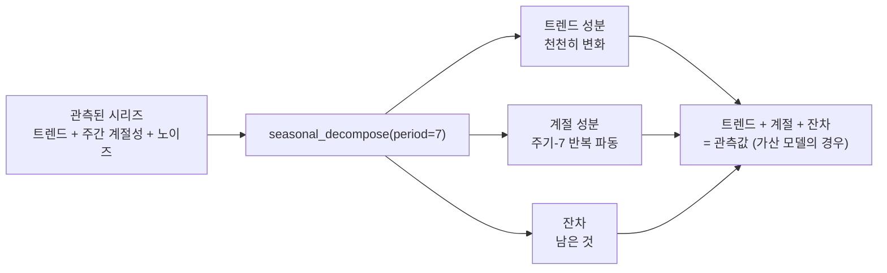

# Day 3 — 시계열 기초

시계열은 단순한 숫자의 나열이 아니다 — **순서 자체가 값만으로는 알 수 없는 정보를 담고 있는** 숫자의 나열이다. 고객 이탈(churn) 테이블의 행 순서를 섞어도 어떤 모델이든 잘 학습된다. 각 행이 서로 독립적이기 때문이다. 하지만 일별 매출 시리즈의 순서를 섞으면, 애초에 그것을 시계열로 만들어 주었던 바로 그것을 파괴하게 된다. 즉 어제 무슨 일이 있었는지가 오늘 무슨 일이 일어날지에 대한 정보를 준다는 사실이다. 이 노트의 모든 내용은 그 의존성을 독립적인 행들의 테이블처럼 취급하지 않고 진지하게 받아들이는 데서 출발한다.

## 순서가 중요하다: 자기상관

**자기상관(autocorrelation)**은 어떤 시리즈가 자기 자신을 시차만큼 이동시킨 사본과 얼마나 상관관계가 있는지를 측정한다 — 오늘 값 대 어제 값, 오늘 값 대 지난주 값 등, 관심 있는 모든 시차에 대해 확인할 수 있다. 일별 소매 데이터에서 시차 7에 강한 자기상관이 있다면 주간 계절성(예: 주말 매출 급증)일 가능성이 크고, 시차 365에서 강한 자기상관이 있다면 연간 패턴일 가능성이 크다. 무언가를 모델링하기 전에 이를 확인하는 것은 실제로 중요한 질문에 답하는 일이다. 이 시리즈에 활용할 수 있는 구조가 있는가, 있다면 대략 어느 시차에서인가?

여기에는 반드시 체화해야 할 미묘한 지점이 있고, 실제 숫자로 보면 가장 쉽게 이해할 수 있다. 트렌드와 주기 7의 계절 파동, 노이즈로 만든 2년치 합성 일별 "유동인구" 시리즈를 예로 들어, 원본 시리즈에 대해 자기상관함수(ACF)를 직접 계산해 보자.

```
lag  0: +1.000
lag  1: +0.913
lag  6: +0.897
lag  7: +0.953   <-- 국소적 피크
lag  8: +0.888
lag 14: +0.930   <-- 한 주기 뒤에서 다시 국소적 피크
```

여기 나온 모든 시차가 *높은* 자기상관을 보인다 — 주간 계절성과 아무 상관이 없는 시차 1조차도 그렇다. 강한 트렌드가 있으면 가까운 두 지점은 계절과 무관하게 무조건 비슷해 보이기 때문이다. 어제 값과 오늘 값은 계절이 무엇이든 상관없이 둘 다 "트렌드가 현재 위치한 지점"의 값이다. 즉 트렌드가 원본 ACF에서 계절 신호를 파묻어 버리고 있다. 실제로 주간 주기를 드러내는 것은 시차 7에서의 절대적인 높이가 아니라, 바로 이웃한 값들에 대한 **국소적 피크**라는 사실이다(시차 6의 0.897, 시차 8의 0.888과 비교해 시차 7이 0.953으로 더 높다) — 그리고 같은 국소적 피크 패턴이 시차 14에서 다시 나타난다.

먼저 트렌드를 제거하면 계절 신호가 극적으로 선명해진다. ACF를 계산하기 전에 피팅된 트렌드를 시리즈에서 빼면:

```
lag  0: +1.000
lag  1: +0.544
lag  3: -0.833   <-- 반 주기만큼 위상이 어긋남: 강한 음의 값
lag  7: +0.893   <-- 이제 명확한 지배적 피크
lag 14: +0.885
```

트렌드를 제거하고 나면 시차 7이 (시차 0을 제외하고) 확실히 두드러진 값이 되고, 사인파가 정반대 위상에 있는 반 주(week)만큼 떨어진 시차 3~4는 주기-7 파동이 예측하는 그대로 강하게 *음수*가 된다. **일반적인 교훈은 이렇다. 강한 트렌드는 모든 시차의 자기상관을 부풀리므로, 계절적 구조를 파악하려고 ACF를 읽기 전에 항상 트렌드 제거를 고려하라** — 원본 숫자를 그대로 믿기보다는.


### ACF vs. PACF: 서로 다른 질문

**편자기상관함수(PACF)**는 ACF와 헷갈리기 쉽지만, 실제로는 완전히 다른 질문에 답한다. 시차 `k`에서의 ACF는 `y_t`와 `y_(t-k)` 사이의 원시 상관관계를 측정하며, 그 사이에 있는 모든 시차를 거쳐 매개되는 간접적인 상관관계까지 *포함한다*(시차 7의 상관관계는 부분적으로 시차 1의 상관관계를 반영하고, 그것은 다시 부분적으로 시차 2의 상관관계를 반영하는 식이다). 시차 `k`에서의 PACF는 그보다 짧은 모든 시차의 효과를 회귀로 제거한 *뒤에* `y_t`와 `y_(t-k)` 사이의 상관관계를 측정한다 — 중간 시차들의 영향을 걷어내고 k칸 떨어진 직접적인 관계만 분리해낸다.

위와 같은 트렌드 제거된 시리즈에 대해 계산하면:

```
lag   ACF     PACF
  1  +0.544  +0.545
  3  -0.833  -0.696
  6  +0.559  -0.383
  7  +0.893  -0.189   <-- ACF는 뚜렷한 스파이크; PACF는 여기서 거의 반응하지 않음
 10  -0.800  -0.051
```

ACF는 시차 7에서 명백한 스파이크를 보이지만, PACF는 거기서 스파이크를 보이지 *않는다* — 오히려 표에서 상대적으로 작은 값 중 하나다. 이는 모순이 아니라, 부드럽게 반복되는 사인파 패턴을 각 렌즈로 보면 정확히 이렇게 보인다는 것이다. 순수한 사인파의 시차 7 값이 오늘과 강하게 상관되는 것은, 단지 시차 6과 상관되고, 시차 6은 다시 시차 5와 상관되는 식으로 쭉 이어지기 때문이다 — 날카로운 한 단계짜리 의존이 아니라 연속적인 파동이다. PACF가 그 중간 단계들을 걷어내고 나면, 찾아낼 만한 남은 *직접적인* 시차-7 효과가 없다. 이 구분은 실무에서 중요하다. 반복 주기를 찾는 데는(위에서처럼) ACF가 적합한 도구이고, 자기회귀(AR) 모델의 차수를 고르는 데는 PACF가 적합한 도구다 — 시차 `p` 이후로 PACF가 급격히 끊기면 AR(`p`) 과정이 적절한 적합일 가능성이 크다는 뜻이며, 이는 Day 4에서 다루는 ARIMA 모델 선택이 의존하는 진단 방법 그대로다.

## 빈도와 리샘플링

모든 시리즈에는 수집 방식에 내재된 샘플링 빈도가 있다 — 시간별 센서 측정값, 일별 매출 합계, 월별 매출 보고서 등이다. **리샘플링**은 이 빈도를 사후에 바꾸는 작업이며, 두 방향이 대칭적이지 않다.

- **다운샘플링**(예: 일별 -> 주별, `.resample("W").mean()`)은 실제로 측정된 값들을 함께 집계한다. 노이즈를 완만하게 하고 데이터양을 줄이며, 실제로 측정된 숫자들을 평균 내는 것이므로 통계적으로 항상 정직하다.
- **업샘플링**(예: 일별 -> 시간별)은 보간(interpolation)을 통해 한 번도 측정된 적 없는 값을 만들어내야 한다. 이는 실제로 존재하지 않는 더 세밀한 정보가 있는 것처럼 *보이게* 만든다 — 서로 다른 시리즈를 공통 인덱스에 맞출 때는 유용하지만, 추가된 값들이 합성된 것임을 잊고 실제 관측치처럼 취급하기 시작하면 위험하다.

```python
weekly_avg = foot_traffic.resample("W").mean()
# foot_traffic: Series, len=730 (일별) -> weekly_avg: Series, len=106 (주별)
```

## 네 가지 구성 요소

대부분의 실제 시리즈는 다음의 조합으로 생각할 수 있다.

- **트렌드(Trend)** — 짧은 기간의 흔들림을 무시한 장기적인 방향(단골 고객층이 쌓이며 커피숍이 연 단위로 서서히 성장하는 것).
- **계절성(Seasonality)** — 알려진 주기를 가진, 달력에 고정된 반복 패턴(주중 대 주말 유동인구, 예외 없이 7일마다 반복).
- **주기(Cycle)** — 반복은 되지만 고정된 주기가 없는 패턴으로, 보통 외부 조건과 연관된다. 언뜻 보면 계절성과 헷갈리기 쉽지만, 결정적인 차이는 주기에는 고정된 달력 주기가 없다는 점이다 — 경기 침체로 인한 수요 감소는 이번엔 8개월, 다음엔 14개월 지속될 수 있지만, 크리스마스는 항상 12월 25일이다.
- **잔차(Residual, 노이즈)** — 트렌드, 계절성, 주기를 제거하고 남은 나머지. 이상적으로는 더 이상 활용할 패턴이 없는 구조 없는 무작위 변동처럼 보여야 한다.

이들이 **가산적(additive)**으로 결합하는지(`observed = trend + seasonal + residual`) 아니면 **승산적(multiplicative)**으로 결합하는지(`observed = trend * seasonal * residual`)는 형식적인 절차가 아니라 실제 모델링 선택이다. 트렌드 수준과 무관하게 계절적 진폭이 절댓값 기준으로 대체로 일정하면 가산적 모델이 맞다(커피숍이 장사가 잘 되든 안 되든 토요일에 항상 컵 15개를 더 판다). 트렌드에 비례해 진폭이 커지면 승산적 모델이 맞다(토요일에 15% 더 판다면, 트렌드가 사업을 키워놓은 뒤에는 절대적인 진폭도 더 커진다). 잘못된 쪽을 고르면 하위 구성 요소 전부가 왜곡된다. 실제로는 승산적인 시리즈에 가산적 모델을 강제로 적용하면, "계절" 성분이 시리즈 초반(트렌드가 낮았을 때)의 진폭은 과도하게 설명하고 후반(트렌드가 높을 때)의 진폭은 과소하게 설명하게 되며, 그 불일치가 그대로 잔차로 새어 들어간다.



## statsmodels로 분해하기

이 예제는 이 환경에서 처음부터 끝까지 직접 실행해 확인했다(`statsmodels`는 컴파일 없이 순수 wheel 형태로 pip 설치가 깔끔하게 된다).

```python
import numpy as np
import pandas as pd
from statsmodels.tsa.seasonal import seasonal_decompose

rng = np.random.default_rng(7)

dates = pd.date_range("2023-01-01", periods=730, freq="D")   # 2년치 일별 데이터
trend = np.linspace(80, 160, len(dates))                      # 완만한 선형 성장, 80 -> 160
weekly = 15 * np.sin(2 * np.pi * dates.dayofweek / 7)          # +/-15 주간 파동
noise = rng.normal(0, 4, len(dates))                            # 작은 무작위 잡음
foot_traffic = pd.Series(trend + weekly + noise, index=dates, name="visitors")
# -> Series, len=730, dtype=float64, DatetimeIndex freq="D"

result = seasonal_decompose(foot_traffic, model="additive", period=7)
# result.trend:    Series, len=730, dtype=float64 -- 앞뒤로 NaN 6개
#                  (폭 7의 중심 이동창(centered rolling window)은
#                   양쪽에 이웃이 있어야 계산할 수 있어서, 처음/마지막
#                   3개 지점은 계산할 수 없다)
# result.seasonal: Series, len=730 -- 시리즈 전체에 반복되는 주기-7 패턴
# result.resid:    Series, len=730 -- trend와 동일한 경계 NaN

print(result.trend.isna().sum())          # -> 6
print(result.seasonal.head(14).round(2).tolist())
# -> [-11.4, 0.1, 11.28, 14.41, 6.87, -6.81, -14.44,   <- 1주차
#     -11.4, 0.1, 11.28, 14.41, 6.87, -6.81, -14.44]   <- 2주차, 완전히 동일한 패턴
```

계절 성분은 7칸마다 말 그대로 완전히 동일하게 반복된다 — `period`를 고정해서 쓰는 `seasonal_decompose`는 계절 형태가 시간에 따라 조금이라도 변하는 것을 전혀 허용하지 않는다. (모든 주에 걸쳐 평균을 내는 방식으로) 하나의 표준적인 주간 패턴을 추정한 뒤, 그것을 모든 주에 동일하게 찍어낼 뿐이다. 이는 실제 모델링 가정이며, 실제 계절 패턴이 서서히 진화한다면(예: 2년에 걸쳐 주말 유동인구가 주중 대비 점점 늘어나는 경우) 틀린 가정이다 — `seasonal_decompose`는 그런 변화를 포착하지 못한다. 시간에 따라 서서히 변하는 계절 성분을 허용하는 STL 분해(`statsmodels.tsa.seasonal.STL`)가 그런 경우에 맞는 도구다.

## 평활화와 이상치 탐지

**이동평균(moving average)**은 각 지점을 주변 윈도우의 평균값으로 대체해, 단기 노이즈를 완만하게 만들어 눈으로 보기에 트렌드를 더 쉽게 파악하게 해준다: `foot_traffic.rolling(7).mean()`.

흔히 쓰는 저렴한 이상치 탐지 방법은 이동 평균에서 `k` 표준편차 이상 벗어난 지점에 플래그를 다는 것이다 — 고전적인 3-시그마 규칙이다.

```python
roll_mean = foot_traffic.rolling(14).mean()
roll_std = foot_traffic.rolling(14).std()
anomaly = (foot_traffic - roll_mean).abs() > 3 * roll_std
```

이 원본 합성 시리즈에 직접 실행하면 **0개**의 지점이 플래그된다(이 시리즈에는 진짜 이상치가 없다 — 트렌드와 깨끗한 계절성, 작은 노이즈뿐이다). 이는 올바른 동작이다. 하지만 이 합성 시리즈가 대신하고 있는, 진짜 계절성을 가진 *실제* 시리즈에서는 어떤 일이 벌어지는지 보자. 주중과 주말 값을 모두 걸치는 14일짜리 이동 윈도우는 서로 다른 두 개의 "정상" 기준선을 하나의 평균과 하나의 표준편차로 섞어버린다. 그러면 매주 토요일의 증가가 그 섞인 기준선에서 유독 멀리 떨어진 것처럼 보이게 된다 — 탐지기가 "주말은 원래 주중과 다르게 생겨야 한다"는 사실을 전혀 몰랐기 때문에 생기는 순전한 거짓 양성(false positive)이다.

이 수정이 실제로 작동하는지 확인하기 위해, 같은 탐지기를 원본 시리즈가 아니라 `result.resid`(계절성이 제거된 잔차)에 실행하되, **진짜 이상치 하나를 직접 주입**해 보자(하루짜리 +60 스파이크로, 지역 행사나 화제가 된 게시물 같은 것을 흉내낸 것이다).

```python
foot_traffic_with_spike = foot_traffic.copy()
foot_traffic_with_spike.iloc[400] += 60
result2 = seasonal_decompose(foot_traffic_with_spike, model="additive", period=7)
resid2 = result2.resid.dropna()
roll_mean2 = resid2.rolling(14).mean()
roll_std2 = resid2.rolling(14).std()
anomaly2 = (resid2 - roll_mean2).abs() > 3 * roll_std2
```

계절성이 제거된 잔차에 대해 실행하면, 정확히 하나의 날짜만 플래그된다: **2024-02-05** — 이는 정확히 주입한 스파이크의 날짜다(`foot_traffic.index[400]`도 같은 날짜다). 평범한 토요일은 하나도 거짓 양성으로 딸려 오지 않았다. 이동 윈도우가 데이터를 보기 전에 이미 계절 패턴이 제거되어 있었기 때문이다. **원본의 계절성 있는 시리즈에 이상치 탐지를 실행하는 것은 이상치를 탐지하는 게 아니라, 이미 알고 있던 계절 패턴을 번거로운 과정을 거쳐 다시 발견하는 것에 불과하다.**

## 흔한 함정

- **분해 전에 이상치 탐지부터 실행하기.** 위에서 보였듯 이것이 가장 흔한 시계열 실수다 — 모든 계절적 피크가 "탐지된 이상치"가 되어, 진짜로 드문 사건들이 일상적인 사건의 홍수 속에 묻혀버린다.
- **`seasonal_decompose`의 경계 NaN을 "데이터 없음"으로 오해하기.** 이는 "무슨 일이 없었다"가 아니라 "그 지점에서는 중심 윈도우를 계산할 수 없었다"는 뜻이다. 무시하거나 버리는 것은 괜찮지만, 조용히 0으로 취급하면 실제 편향이 생긴다.
- **직접 확인하지 않고 기본값으로 가산적/승산적을 고르기.** 원본 시리즈를 그려보고 계절적 진폭 크기가 트렌드 수준과 함께 눈에 띄게 커지는지 확인하는 데는 30초면 충분하고, 이는 체계적으로 왜곡된 분해를 막아준다.
- **`period`를 반드시 올바르게 지정해야 한다는 것을 잊기.** `seasonal_decompose`는 계절 주기를 자동으로 감지하지 않는다 — 실제 주기가 30인 데이터에 `period=7`을 넘기면 오류 없이 조용히 무의미한 계절 성분을 만들어낸다.

## 요약

시계열에서 무언가를 예측하거나 이상 여부를 판단하기 전에, 먼저 트렌드와 계절성, 잔차로 분해하라 — 그리고 자기상관을 읽기 전에 트렌드부터 제거하라. 강한 트렌드는 모든 시차의 자기상관을 부풀려서, 정작 찾고 있는 주기적 구조를 숨겨버릴 수 있기 때문이다. 원본의, 분해되지 않은 데이터에서 잡힌 "이상치" 대부분은 사실 아무도 미리 감안하지 않았던 평범한 계절성일 뿐이다 — 해법은 더 똑똑한 이상치 임계값이 아니라, 그 임계값이 데이터를 보기 전에 계절 패턴을 먼저 제거하는 것이다.
