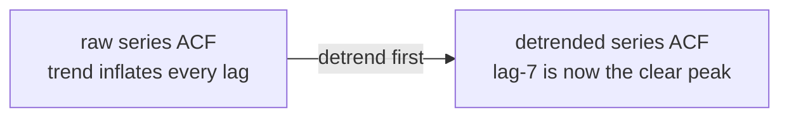
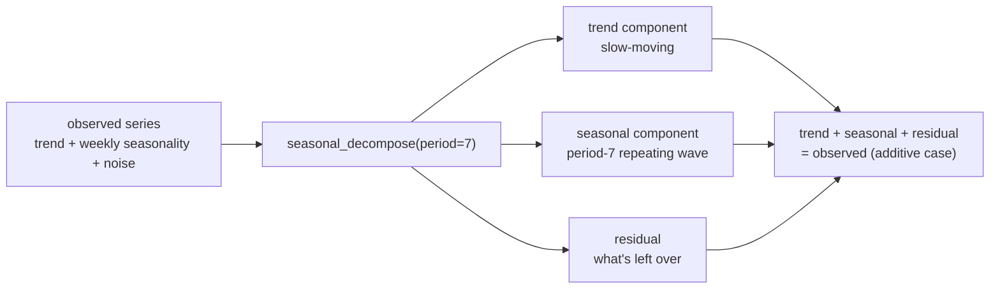

# Day 3 — Time Series Fundamentals

A time series isn't just a list of numbers — it's a list of numbers where *order carries information that the values alone don't*. Shuffle the rows of a customer-churn table and every model still trains fine, because each row is independent. Shuffle a daily-sales series and you've destroyed the one thing that made it a time series in the first place: what happened yesterday is informative about what happens today. Everything in this note follows from taking that dependency seriously instead of treating a series as just another table of independent rows.

## Order matters: autocorrelation

**Autocorrelation** measures how correlated a series is with a lagged copy of itself — today's value against yesterday's, today's against last week's, and so on for every lag you care to check. A strong autocorrelation at lag 7 in daily retail data is a strong hint of weekly seasonality (weekend spikes, say); a strong one at lag 365 hints at an annual pattern. Checking this before modeling anything answers a genuinely load-bearing question: is there exploitable structure in this series, and at roughly what lag?

There's a subtlety worth internalizing here, and it's easiest to see with real numbers. Take a synthetic two-year daily "foot traffic" series built from a linear trend plus a period-7 seasonal wave plus noise, and compute the autocorrelation function (ACF) directly on the raw series:

```
lag  0: +1.000
lag  1: +0.913
lag  6: +0.897
lag  7: +0.953   <-- local peak
lag  8: +0.888
lag 14: +0.930   <-- local peak again, one period later
```

Every single lag shown here has a *high* autocorrelation — even lag 1, which has nothing to do with weekly seasonality. That's because a strong trend makes *any* two nearby points look correlated: yesterday's value and today's value are both "wherever the trend currently is," regardless of season. The trend is drowning out the seasonal signal in the raw ACF. What actually reveals the weekly period is not the absolute height at lag 7, but that it's a **local peak** relative to its immediate neighbors (0.953 vs. 0.897 at lag 6 and 0.888 at lag 8) — and the same local-peak pattern repeats at lag 14.

Detrending first makes the seasonal signal dramatically cleaner. Subtracting the fitted trend from the series before computing the ACF:

```
lag  0: +1.000
lag  1: +0.544
lag  3: -0.833   <-- half a period out of phase: strongly negative
lag  7: +0.893   <-- now the clear, dominant peak
lag 14: +0.885
```

With the trend removed, lag 7 is unambiguously the standout value (after lag 0), and lag 3-4 — half a week away, where the sine wave sits at the opposite phase — is strongly *negative*, exactly as a period-7 wave predicts. **The general lesson: a strong trend inflates autocorrelation at every lag, so always consider detrending before reading the ACF for seasonal structure**, rather than trusting the raw numbers at face value.



### ACF vs. PACF: two different questions

The **partial autocorrelation function (PACF)** is easy to confuse with the ACF, but it answers a genuinely different question. The ACF at lag `k` measures the raw correlation between `y_t` and `y_(t-k)`, *including* whatever indirect correlation is mediated through every lag in between (lag 7's correlation partly reflects lag 1's correlation, which partly reflects lag 2's, and so on). The PACF at lag `k` measures the correlation between `y_t` and `y_(t-k)` *after* regressing out the effect of every shorter lag — it isolates the direct, k-steps-away relationship with the in-between lags' influence removed.

Computed on the same detrended series from above:

```
lag   ACF     PACF
  1  +0.544  +0.545
  3  -0.833  -0.696
  6  +0.559  -0.383
  7  +0.893  -0.189   <-- ACF's clear spike; PACF barely reacts here
 10  -0.800  -0.051
```

Notice the ACF has its unmistakable spike at lag 7, but the PACF does *not* spike there — it's actually one of the smaller values in the table. This isn't a contradiction; it's exactly what a smoothly repeating sinusoidal pattern looks like through each lens. A pure sine wave's value at lag 7 is highly correlated with today purely because it's correlated with lag 6, which is correlated with lag 5, and so on all the way down — a continuous wave, not a sharp one-step dependency. Once the PACF strips out those intermediate steps, there's no leftover *direct* lag-7 effect to find. This distinction matters in practice: ACF is the right tool for spotting a repeating period (as above), while PACF is the tool for choosing the order of an autoregressive (AR) model — a PACF that cuts off sharply after lag `p` suggests an AR(`p`) process is a reasonable fit, which is exactly the diagnostic ARIMA model selection in Day 4 relies on.

## Frequency and resampling

Every series has an implicit sampling frequency baked into how it was collected — hourly sensor reads, daily sales totals, monthly revenue reports. **Resampling** changes that frequency after the fact, and the two directions are not symmetric:

- **Downsampling** (e.g. daily -> weekly, via `.resample("W").mean()`) aggregates real measurements together. It smooths out noise and reduces data volume, and it's always statistically honest — you're averaging numbers that were actually measured.
- **Upsampling** (e.g. daily -> hourly) has to invent values that were never measured, via interpolation. This manufactures the *appearance* of finer-grained information that doesn't actually exist — useful for aligning series onto a common index, dangerous if you forget the extra points are synthetic and start treating them as real observations.

```python
weekly_avg = foot_traffic.resample("W").mean()
# foot_traffic: Series, len=730 (daily) -> weekly_avg: Series, len=106 (weekly)
```

## The four components

Most real-world series can be thought of as a combination of:

- **Trend** — the long-run direction, ignoring any short-term wiggle (a coffee shop's slow year-over-year growth as it builds a regular customer base).
- **Seasonality** — a fixed, calendar-driven repeating pattern with a known period (weekday vs. weekend foot traffic, repeating every 7 days without fail).
- **Cycle** — a repeating-but-not-fixed-period pattern, usually tied to external conditions like business or economic cycles. Easy to confuse with seasonality on a quick glance, but the defining difference is that a cycle has no fixed calendar period — a recession-driven demand dip might last 8 months this time and 14 months next time, whereas Christmas is always December 25.
- **Residual (noise)** — whatever's left over after removing trend, seasonality, and cycle; ideally it looks like unstructured random variation with no remaining pattern to exploit.

Whether these combine **additively** (`observed = trend + seasonal + residual`) or **multiplicatively** (`observed = trend * seasonal * residual`) is a real modeling choice, not a formality. Additive fits when seasonal swings stay roughly constant in absolute size regardless of the trend level (a coffee shop always sells about 15 more cups on Saturdays, whether business is slow or booming). Multiplicative fits when swings grow proportionally with the trend (a shop selling 15% more on Saturdays — a bigger absolute swing once the trend has grown the business). Picking the wrong one distorts every downstream component: force an additive model onto a genuinely multiplicative series, and the "seasonal" component will systematically over-explain swings early in the series (when the trend was low) and under-explain them later (when the trend is high), leaking that mismatch straight into the residual.



## Decomposing with statsmodels

This example was run end-to-end in this environment (`statsmodels` installs cleanly via pip as a pure wheel; no compilation needed):

```python
import numpy as np
import pandas as pd
from statsmodels.tsa.seasonal import seasonal_decompose

rng = np.random.default_rng(7)

dates = pd.date_range("2023-01-01", periods=730, freq="D")   # 2 years of daily data
trend = np.linspace(80, 160, len(dates))                      # slow linear growth, 80 -> 160
weekly = 15 * np.sin(2 * np.pi * dates.dayofweek / 7)          # +/-15 weekly wave
noise = rng.normal(0, 4, len(dates))                            # small random jitter
foot_traffic = pd.Series(trend + weekly + noise, index=dates, name="visitors")
# -> Series, len=730, dtype=float64, DatetimeIndex freq="D"

result = seasonal_decompose(foot_traffic, model="additive", period=7)
# result.trend:    Series, len=730, dtype=float64 -- 6 leading/trailing NaNs
#                  (a centered rolling window of width 7 can't be computed for
#                   the first/last 3 points, since it needs neighbors on both sides)
# result.seasonal: Series, len=730 -- a period-7 pattern repeated across the whole series
# result.resid:    Series, len=730 -- same edge NaNs as trend

print(result.trend.isna().sum())          # -> 6
print(result.seasonal.head(14).round(2).tolist())
# -> [-11.4, 0.1, 11.28, 14.41, 6.87, -6.81, -14.44,   <- week 1
#     -11.4, 0.1, 11.28, 14.41, 6.87, -6.81, -14.44]   <- week 2, identical pattern
```

The seasonal component genuinely repeats bit-for-bit every 7 entries — `seasonal_decompose` with a fixed `period` doesn't let the seasonal shape drift over time at all, it estimates one canonical week-shaped pattern (by averaging across all weeks) and stamps it onto every week identically. That's a real modeling assumption, and it's wrong if your actual seasonal pattern slowly evolves (say, weekend traffic gradually creeping up relative to weekdays over two years) — `seasonal_decompose` won't capture that drift; STL decomposition (`statsmodels.tsa.seasonal.STL`), which allows a slowly time-varying seasonal component, is the tool for that case.

## Smoothing and anomaly detection

A **moving average** replaces each point with the mean of a surrounding window, damping short-term noise so the underlying trend is easier to see by eye: `foot_traffic.rolling(7).mean()`.

A common, cheap anomaly detector flags any point more than `k` standard deviations from a rolling mean — the classic three-sigma rule:

```python
roll_mean = foot_traffic.rolling(14).mean()
roll_std = foot_traffic.rolling(14).std()
anomaly = (foot_traffic - roll_mean).abs() > 3 * roll_std
```

Run directly on this raw synthetic series, this flags **zero** points (there's no genuine outlier in it — just trend, clean seasonality, and small noise). That's the correct behavior. But watch what happens on a *real* series with genuine seasonality that this synthetic one is standing in for: a rolling 14-day window straddling both weekday and weekend values mixes two different "normal" baselines into one mean and one standard deviation. Every Saturday spike then looks unusually far from that blended baseline — a false positive purely because the detector was never told weekends are supposed to look different from weekdays.

To confirm the fix works, the same detector run on `result.resid` (the deseasonalized residual) instead of the raw series, after **injecting one genuine one-day anomaly** (a +60 spike on a single day, simulating something like a local event or viral post):

```python
foot_traffic_with_spike = foot_traffic.copy()
foot_traffic_with_spike.iloc[400] += 60
result2 = seasonal_decompose(foot_traffic_with_spike, model="additive", period=7)
resid2 = result2.resid.dropna()
roll_mean2 = resid2.rolling(14).mean()
roll_std2 = resid2.rolling(14).std()
anomaly2 = (resid2 - roll_mean2).abs() > 3 * roll_std2
```

Run against the deseasonalized residual, this flagged exactly one date: **2024-02-05** — which is precisely the injected spike (`foot_traffic.index[400]` is that same date). No ordinary Saturday got swept up as a false positive, because the seasonal pattern was already removed before the rolling window ever saw the data. **Anomaly detection run on a raw seasonal series isn't detecting anomalies — it's just rediscovering the seasonal pattern you already knew was there, with extra steps.**

## Common pitfalls

- **Running anomaly detection before decomposing.** As shown above, this is the single most common time-series mistake — every seasonal peak becomes a "detected anomaly," burying the genuinely rare events under a flood of routine ones.
- **Trusting `seasonal_decompose`'s edge NaNs to mean "no data."** They mean "the centered window couldn't be computed there," not "nothing happened there" — dropping or ignoring them is fine, but silently treating them as zero would introduce a real bias.
- **Picking additive vs. multiplicative by default rather than by looking.** Plotting the raw series and checking whether seasonal swing size visibly grows with the trend level takes thirty seconds and prevents a systematically distorted decomposition.
- **Forgetting that `period` must be supplied and correct.** `seasonal_decompose` doesn't detect the seasonal period automatically — passing `period=7` on data with a real period of 30 will silently produce a nonsensical seasonal component rather than raising an error.

## Takeaway

Before forecasting or flagging anything unusual in a time series, decompose it into trend, seasonality, and residual — and detrend before reading autocorrelation, since a strong trend inflates every lag and can hide exactly the periodic structure you're looking for. Most "anomalies" caught on raw, non-decomposed data are actually just ordinary seasonality nobody accounted for yet; the fix isn't a smarter anomaly threshold, it's removing the seasonal pattern before the threshold ever sees the data.
