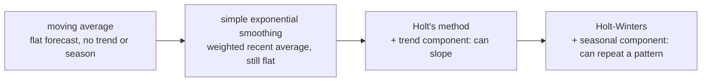
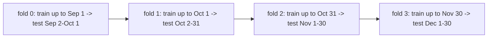

# Day 4 — Forecasting Methods and Evaluation

Yesterday we decomposed a series into trend, seasonality, and residual. Today: use that structure to actually predict what happens next, and — just as important — measure honestly how wrong the prediction is likely to be.

## From naive to seasonal: a ladder of methods

Four forecasting methods, each a strict superset of the one before it — meaning each later method reduces to the earlier one when its extra component is switched off:



- **Moving-average forecast** — predict tomorrow as the plain average of the last N days. No concept of trend or seasonality at all; on a growing series it systematically under-predicts (it lags behind the trend by construction), and it ignores any repeating pattern entirely.
- **Simple Exponential Smoothing (SES)** — a weighted average where recent points count exponentially more than old ones, controlled by a smoothing parameter `alpha` (`0 < alpha <= 1`; larger `alpha` weighs recent data more heavily). Still produces a flat-line forecast — it has no mechanism to extrapolate a trend or repeat a seasonal cycle, it can only track the current smoothed level.
- **Holt's method** — adds a second smoothed component tracking the trend's slope, so the forecast can angle upward or downward instead of staying flat.
- **Holt-Winters** — adds a third smoothed component for seasonality (additive or multiplicative, same distinction as Day 3), so the forecast repeats a weekly/monthly/yearly pattern layered on top of the trend line.

Turn Holt-Winters' seasonal component off and it's mathematically Holt; turn Holt's trend component off too and it's mathematically SES. This isn't just a teaching simplification — it's literally how the `statsmodels` API is structured, via the `trend=` and `seasonal=` arguments below.

## Splitting time-respecting data

Never use a random train/test split on a time series. Shuffling rows before splitting lets points from *after* the cutoff leak into training, so the model effectively "sees the future" through nearby leaked points — this doesn't just slightly bias the accuracy estimate, it can make an unusable model look excellent, because temporally adjacent points in a smooth series are highly similar to begin with (recall Day 3's autocorrelation discussion — that similarity between nearby points is exactly the leakage vector). Always split by cutting at one chronological point: everything before goes to train, everything after to test.

```python
train, test = foot_traffic[:-60], foot_traffic[-60:]
# foot_traffic: Series, len=730 -> train: Series, len=670, test: Series, len=60 (last 60 days held out)
```

## A single holdout isn't quite enough either

Even a proper chronological split has a weakness: it evaluates the model against exactly one 60-day window, so the score can end up unusually flattering or unusually harsh purely because of what that particular window happened to contain (a holiday, an unusual cold snap, whatever). **Walk-forward validation** (also called rolling-origin evaluation) fixes this by repeating the chronological split multiple times, sliding the cutoff forward each time, and averaging the score across folds:



Every fold still respects chronology — training data always ends before its matching test window begins — but each fold's cutoff advances, so the final score reflects performance across several different slices of the series rather than one potentially lucky (or unlucky) window. Run against the same series, 4 folds of 30 days each, comparing Holt-Winters to the moving-average baseline:

```python
def mae(y, yhat): return float(np.mean(np.abs(y - yhat)))

horizon, n_folds = 30, 4
hw_scores, ma_scores = [], []
for fold in range(n_folds):
    cutoff = len(foot_traffic) - horizon * (n_folds - fold)
    train_fold = foot_traffic.iloc[:cutoff]
    test_fold = foot_traffic.iloc[cutoff:cutoff + horizon]

    hw = ExponentialSmoothing(train_fold, trend="add", seasonal="add", seasonal_periods=7).fit()
    hw_forecast_fold = hw.forecast(horizon)                                  # Series, len=30
    ma_forecast_fold = pd.Series([train_fold.iloc[-7:].mean()] * horizon, index=test_fold.index)

    hw_scores.append(mae(test_fold, hw_forecast_fold))
    ma_scores.append(mae(test_fold, ma_forecast_fold))
```

The actual per-fold results:

```
fold 0: HW_MAE=3.29  MA_MAE=11.34
fold 1: HW_MAE=3.11  MA_MAE=9.82
fold 2: HW_MAE=3.08  MA_MAE=9.97
fold 3: HW_MAE=3.55  MA_MAE=9.77

HW  mean MAE across folds: 3.26  std: 0.19
MA  mean MAE across folds: 10.22  std: 0.65
```

Two things stand out. First, the ranking (Holt-Winters far ahead of moving-average) holds up across every single fold, not just the one window from the earlier example — that consistency is what makes a walk-forward result trustworthy in a way a single split can't be. Second, look at the standard deviation across folds: Holt-Winters' error is not just lower on average, it's also far more *consistent* (std 0.19 vs. 0.65) — the moving-average baseline's accuracy swings noticeably more depending on which 30-day window it happened to be tested on, since it has no way to anticipate which part of the weekly cycle that window falls on.

## Worked example: fitting all four methods and scoring them

Using the same synthetic two-year foot-traffic series from Day 3 (trend + weekly seasonality + noise), holding out the last 60 days, and fitting all four methods — this was run end-to-end with `statsmodels` 0.14.6:

```python
from statsmodels.tsa.holtwinters import ExponentialSmoothing

def moving_average_forecast(train, horizon, window=7):
    last_avg = train.iloc[-window:].mean()
    return pd.Series([last_avg] * horizon, index=test.index)   # flat line at the last window's average

ma_forecast = moving_average_forecast(train, len(test))

ses_model = ExponentialSmoothing(train, trend=None, seasonal=None).fit()
ses_forecast = ses_model.forecast(len(test))

holt_model = ExponentialSmoothing(train, trend="add", seasonal=None).fit()
holt_forecast = holt_model.forecast(len(test))

hw_model = ExponentialSmoothing(train, trend="add", seasonal="add", seasonal_periods=7).fit()
hw_forecast = hw_model.forecast(len(test))
# hw_forecast: Series, len=60 -- one predicted value per held-out day
```

Scored against the true held-out values with MAE, MAPE, and RMSE (defined below):

```
Method            MAE    MAPE(%)   RMSE
MovingAvg          9.80    6.34    11.46
SES               10.17    6.66    11.87
Holt              11.29    7.53    13.41
Holt-Winters       3.32    2.12     4.17
```

Holt-Winters comes out roughly **3x better** than every other method on every metric — not a marginal win. That's expected here, and worth understanding *why*: this synthetic series has a strong, exactly-period-7 weekly wave, which is precisely the structure only Holt-Winters is modeling. The other three methods have to fold that entire predictable weekly swing into unmodeled error, which is why their errors are consistently 3x larger. Notice also that Holt does *worse* than plain SES here (RMSE 13.41 vs 11.87) — adding a trend component doesn't automatically help; the training window's *local* trend can extrapolate slightly wrong over a 60-day horizon in a way that a flatter SES forecast happens to avoid. More model complexity is not automatically more accuracy — it only pays off when the extra component actually matches structure that's really in the data, which is exactly why Day 3's decomposition step (confirming there really is clean period-7 seasonality here) comes before this step, not after it.

## A range, not a point

A single forecasted number always implies more precision than is honest. Because Holt-Winters is fit as a statistical model with an estimated residual error distribution, you can **simulate** many plausible future paths by repeatedly sampling noise consistent with the fitted residuals, and report a percentile range instead of one line:

```python
simulations = hw_model.simulate(len(test), repetitions=200, error="add", random_state=7)
# simulations: DataFrame, shape (60, 200) -- 60 forecasted days x 200 simulated paths

lower = simulations.quantile(0.05, axis=1)   # Series, len=60 -- 5th percentile per day
upper = simulations.quantile(0.95, axis=1)   # Series, len=60 -- 95th percentile per day
```

Running this and checking how often the *true* held-out values actually fell inside the resulting 90% band: **83.3%** of the 60 true test points landed inside it. That's somewhat below the nominal 90% — a useful, honest reminder that a simulated interval is only as good as the model generating it; here the mismatch traces back to the same Holt-vs-SES trend-extrapolation wobble noted above, which pulls some of the simulated paths' central tendency slightly off from where the true series actually went. A prediction interval communicates "here's the plausible range, and here's roughly how often reality should fall inside it" — which is a fundamentally more honest deliverable than a single confident-looking line, even when the calibration isn't perfect, because it makes the model's uncertainty visible instead of hiding it.

## Stationarity and differencing

Many classical forecasting techniques — ARIMA in particular — assume the series is **stationary**: its statistical properties (mean, variance, autocorrelation structure) don't drift over time. A series with a clear trend is definitionally not stationary, since its mean is different at the start than at the end.

The **Augmented Dickey-Fuller (ADF) test** checks this formally: its null hypothesis is "the series is non-stationary," so a low p-value (conventionally < 0.05) lets you reject that null and conclude the series probably is stationary.

Run on the trending foot-traffic series and then on its first difference:

```python
from statsmodels.tsa.stattools import adfuller

stat, p_value, *_ = adfuller(foot_traffic)
# raw series: stat=-0.568, p=0.8780 -- cannot reject non-stationarity (as expected: it has a real trend)

diffed = foot_traffic.diff().dropna()
# foot_traffic: Series, len=730 -> diffed: Series, len=729 (one point lost: diff needs a previous value)

stat_d, p_value_d, *_ = adfuller(diffed)
# differenced series: stat=-10.298, p≈0.0000003 -- strongly stationary
```

**Differencing** — replacing each value with its difference from the previous one (`foot_traffic.diff()`) — removed the trend entirely and flipped the series from clearly non-stationary (p=0.878) to strongly stationary (p effectively 0), confirming the textbook claim with real numbers rather than taking it on faith: a linear trend is exactly the kind of non-stationarity that a single order of differencing is designed to remove.

## Scoring the methods

Three standard error metrics, each answering a slightly different question:

- **MAE** (mean absolute error) — the average magnitude of error, in the original units. Easy to explain to a non-technical stakeholder ("we're off by about 3 visitors a day on average").
- **MAPE** (mean absolute percentage error) — the same idea scaled to a percentage, which makes it comparable across series with very different scales (visitors/day vs. dollars/month) — but it's unstable and can blow up or become meaningless near zero, since it divides by the true value.
- **RMSE** (root mean squared error) — like MAE, but squaring the errors before averaging means large errors are penalized disproportionately more than small ones. Prefer RMSE when a few big misses matter more than many small ones (e.g. inventory shortfalls); prefer MAE when all errors of a given size should count equally.

```python
import numpy as np

def mae(y, yhat): return float(np.mean(np.abs(y - yhat)))
def mape(y, yhat): return float(np.mean(np.abs((y - yhat) / y)) * 100)
def rmse(y, yhat): return float(np.sqrt(np.mean((y - yhat) ** 2)))
```

## Common pitfalls

- **Random train/test splits on time-ordered data.** Covered above, but worth repeating as its own pitfall because it's the single most common way to accidentally produce an unrealistically good-looking backtest.
- **Trusting MAPE near zero.** A series that legitimately dips to near-zero values (e.g. weekend sales for a B2B product) can make MAPE explode or become undefined purely from the denominator, even when the absolute error is small and unremarkable.
- **Adding model complexity without confirming the structure is really there.** As the Holt-vs-SES result above shows directly, a fancier model isn't automatically a better one — always compare against the simpler methods on the same held-out window before trusting that added complexity earned its keep.
- **Reporting a point forecast with no uncertainty band.** Especially for anything feeding a business decision (staffing, inventory), a single number invites false confidence that the simulation-based range above is specifically designed to avoid.

## Takeaway

Pick the simplest method that captures the structure actually present in the data — Holt-Winters only wins by 3x here because the data genuinely has clean weekly seasonality; on a series without real seasonal structure, its extra machinery is pure overhead and can even underperform a simpler method, exactly as Holt underperformed SES above. Always evaluate on a chronological holdout, never a random split, and prefer reporting a simulated prediction interval over a single "best guess" number — an 83% empirical hit rate against a nominal 90% band is itself useful information about how much to trust the model, information a single point forecast would have hidden entirely.
