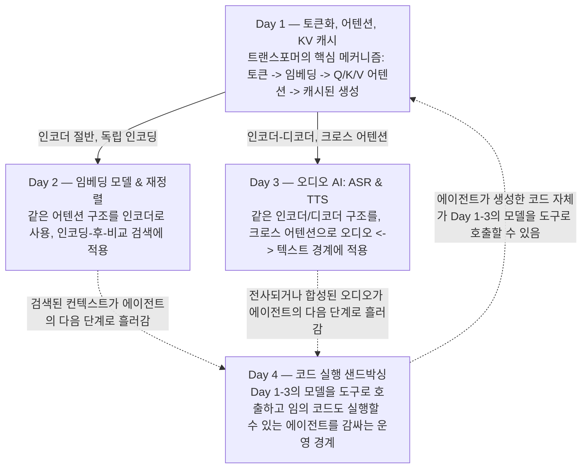

# Week 2 — LLM 내부 구조, 오디오 AI, 샌드박싱

나흘 동안 하나의 흐름이 이어집니다. 트랜스포머의 핵심 메커니즘 — 토큰, 임베딩, 어텐션 — 이 매번 다른 모달리티, 다른 역할로 반복해서 등장합니다. Day 1은 그 메커니즘을 바닥부터 쌓습니다: 텍스트가 어떻게 정수로 바뀌는지, 어텐션이 그 정수들의 벡터를 어떻게 서로 주고받게 하는지, KV 캐시가 어떻게 긴 생성 과정을 제곱으로 느려지지 않게 막는지. Day 2는 그 구조의 인코더 절반을 가져와 검색에 적용합니다 — 확장성을 위한 바이 인코더, 정밀도를 위한 크로스 인코더, 그리고 실제 시스템이 왜 둘 다 쓰는지. Day 3은 인코더-디코더 구조 전체를 가져와 오디오와 텍스트의 경계에 적용합니다 — ASR과 TTS는 서로 역방향 문제이며, 같은 셀프/크로스 어텐션 위에 세워져 있습니다. Day 4는 모델 바깥으로 한 걸음 나가, 이 모든 것 위에 세워진 에이전트가 스스로 코드를 작성하고 실행하도록 허용됐을 때 실제로 무슨 일이 벌어지는지, 진짜 보안 경계는 어디에 있어야 하는지를 다룹니다.

| Day | 주제 | 학습 노트 |
|---|---|---|
| Day 1 | 토큰화, 어텐션, KV 캐시 | [Day1_tokenization-attention-kv-cache.md](daily/Day1_tokenization-attention-kv-cache.md) ([한국어](daily/Day1_tokenization-attention-kv-cache.ko.md)) |
| Day 2 | 임베딩 모델 & 재정렬 | [Day2_embeddings-and-reranking.md](daily/Day2_embeddings-and-reranking.md) ([한국어](daily/Day2_embeddings-and-reranking.ko.md)) |
| Day 3 | 오디오 AI: ASR & TTS | [Day3_audio-asr-tts.md](daily/Day3_audio-asr-tts.md) ([한국어](daily/Day3_audio-asr-tts.ko.md)) |
| Day 4 | 에이전트를 위한 코드 실행 샌드박싱 | [Day4_code-sandboxing.md](daily/Day4_code-sandboxing.md) ([한국어](daily/Day4_code-sandboxing.ko.md)) |

4일치 실행 가능한 코드는 상세한 주석과 함께 노트북 1개에 모두 담겨 있습니다: [2nd_week_Concepts.ipynb](concepts/2nd_week_Concepts.ipynb) ([한국어 버전](concepts/2nd_week_Concepts.ko.ipynb)). 이 환경에서 실행할 수 없는 실제 신경망 모델(`sentence-transformers`의 바이/크로스 인코더, Whisper)이 필요한 셀은 실제 최신 API 그대로 작성하되 이 환경에서는 실행하지 않았다고 명시했습니다. 반면 처음부터 직접 구현한 예제와 `tiktoken` 기반 예제는 모두 실제로 실행해 출력을 검증했습니다.

영문 버전은 [README.md](README.md)와 위 표의 각 파일을 참고하세요.
