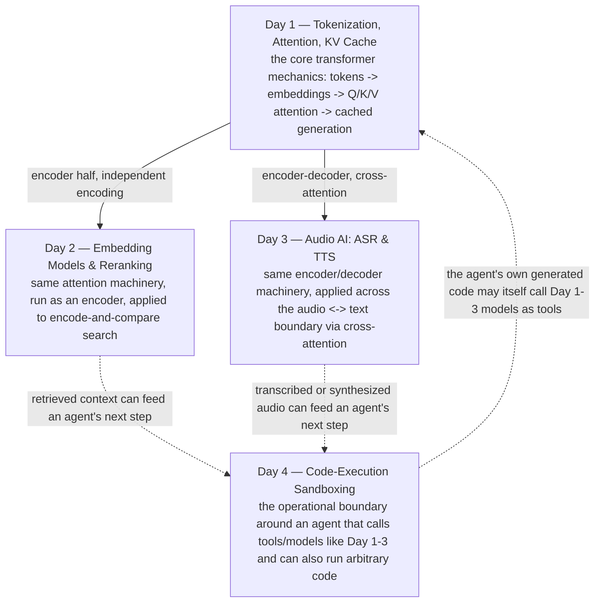

# Week 2 — LLM Internals, Audio AI, and Sandboxing

Four days, one underlying thread: the same core transformer mechanism — tokens, embeddings, and attention — shows up again and again, applied to a different modality or a different job each time. Day 1 builds that mechanism from the ground up: how text becomes integers, how attention lets those integers' vectors exchange information, and how a KV cache keeps a long generation from getting quadratically slower. Day 2 takes the encoder half of that machinery and applies it to search — bi-encoders for scale, cross-encoders for precision, and why real systems use both. Day 3 takes the full encoder-decoder machinery and applies it across the audio-text boundary — ASR and TTS as inverse problems built on the same self-/cross-attention primitives. Day 4 steps outside the model entirely, to the practical question of what happens once an agent built on all of this is allowed to write and execute its own code, and where the real security boundary actually has to live.

| Day | Topic | Daily Notes |
|---|---|---|
| Day 1 | Tokenization, attention, KV cache | [Day1_tokenization-attention-kv-cache.md](daily/Day1_tokenization-attention-kv-cache.md) |
| Day 2 | Embedding models & reranking | [Day2_embeddings-and-reranking.md](daily/Day2_embeddings-and-reranking.md) |
| Day 3 | Audio AI: ASR & TTS | [Day3_audio-asr-tts.md](daily/Day3_audio-asr-tts.md) |
| Day 4 | Code-execution sandboxing for agents | [Day4_code-sandboxing.md](daily/Day4_code-sandboxing.md) |

Runnable, heavily-commented code for all four days lives in one notebook: [2nd_week_Concepts.ipynb](concepts/2nd_week_Concepts.ipynb). Where a cell needs a real neural model (a bi-/cross-encoder from `sentence-transformers`, or Whisper) that this environment can't run, it's written against the real current API and clearly marked as unexecuted here — every from-scratch and `tiktoken`-based example in the notebook was independently run and its output verified.

Korean translations: [README.ko.md](README.ko.md) and a `.ko.md` / `.ko.ipynb` sibling next to every file above.
