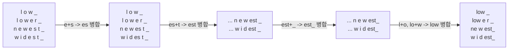
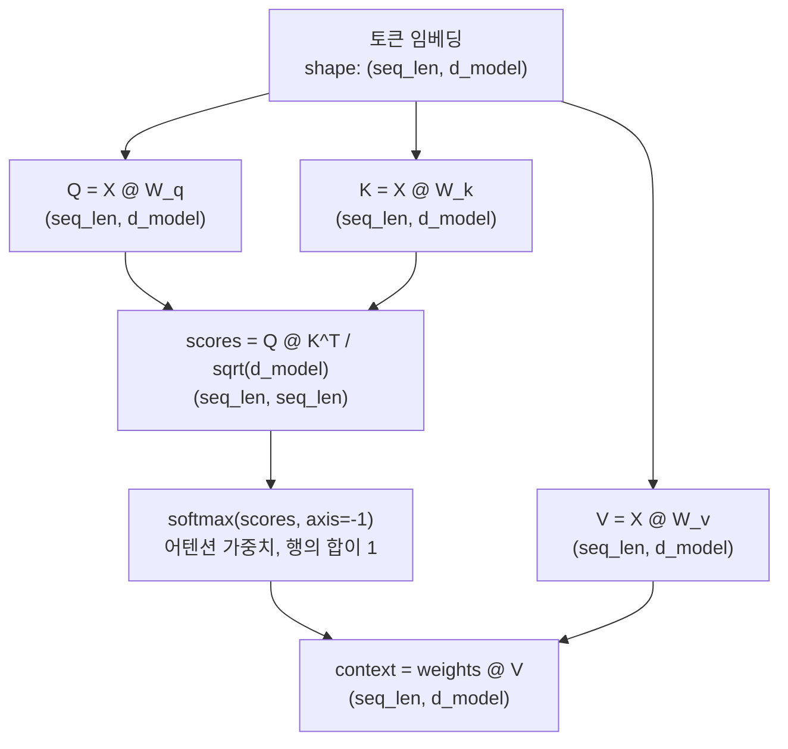

# Day 1 — 토큰화, 어텐션, 그리고 KV 캐시

트랜스포머는 단어를 보지 않습니다. 정수의 나열을 보고, 각 정수를 벡터로 바꾼 다음, "이 시퀀스 안의 다른 벡터들 중 지금 나에게 중요한 건 무엇이고, 얼마나 중요한가"라는 질문을 반복해서 던집니다. 이후에 벌어지는 모든 일 — 프롬프트가 토큰 몇 개로 계산되는지, 모델이 세 문장 앞의 명사를 "그것"이라는 대명사와 어떻게 연결하는지, 30턴짜리 대화가 이어질수록 응답 속도가 비례해서 느려지지 않는 이유 — 은 세 가지 메커니즘의 결과입니다: 텍스트가 정수로 잘리는 방식(토큰화), 그 정수들의 벡터가 서로 정보를 주고받는 방식(어텐션), 그리고 매 생성 토큰마다 이 교환 과정을 처음부터 다시 하지 않도록 막는 방식(KV 캐시). 세 가지 모두 겉보기와 달리 전혀 자명하지 않고, 각각 실무에서 부딪히기 전에 알아둘 만한 구체적인 실패 양상을 가지고 있습니다.

## 토큰화: 텍스트가 정수가 되기까지

토크나이저의 역할은 임의의 텍스트를 고정된 어휘 집합(실제로는 대개 서브워드 단위)으로 쪼개고, 각 조각에 정수 ID를 부여하는 것입니다. 오늘날 LLM에서 가장 널리 쓰이는 방식은 **바이트 페어 인코딩(BPE, Byte-Pair Encoding)**입니다: 개별 바이트에서 시작해, 가장 빈번하게 인접하는 쌍을 새로운 심볼로 반복해서 병합합니다. 이 과정을 목표 어휘 크기에 도달할 때까지 수천 번 반복합니다(예를 들어 GPT-4의 `cl100k_base`는 10만 개가 넘는 토큰을 가지고 있습니다). 병합 규칙은 대규모 학습 코퍼스로부터 오프라인에서 딱 한 번 학습되며, 추론 시점의 토큰화는 그 학습된 병합 규칙을 순서대로 그리디하게 적용하는 것뿐입니다.

바이트 레벨 BPE는 (문자 레벨 BPE와 달리) 유니코드 문자가 아니라 원시 UTF-8 바이트에서 시작합니다. 이것이 바로 이모지든, 손상된 텍스트든, 학습 코퍼스가 거의 보지 못한 문자 체계든 *어떤* 문자열이라도 표현 가능함을 보장하는 이유입니다: 최악의 경우 심볼은 "알 수 없는 토큰" 대신 원시 바이트로 되돌아갑니다.

### BPE가 병합 규칙을 학습하는 과정 직접 보기

이 메커니즘은 직접 돌려보면 가장 확실하게 이해됩니다. 아래는 4개 단어짜리 장난감 코퍼스(Sennrich 등의 원조 BPE 논문에 나오는 것과 같은 예시)에 대한 최소한의 BPE 트레이너입니다. 각 단어는 문자 단위로 쪼갠 뒤 단어 끝을 표시하는 `_` 마커를 붙여, 알고리즘이 단어 경계의 "est"와 단어 중간의 "est"를 구분할 수 있게 했습니다:

```python
import collections

# 단어 -> 장난감 코퍼스에서의 빈도
corpus = {"low": 5, "lower": 2, "newest": 6, "widest": 3}

def word_to_symbols(word):
    return list(word) + ["_"]  # 문자 단위로 시작하고, '_'로 단어의 끝을 표시

# vocab: 심볼 튜플 -> 빈도, 예: ('l','o','w','_') -> 5
vocab = {tuple(word_to_symbols(w)): f for w, f in corpus.items()}

def get_pair_counts(vocab):
    pairs = collections.Counter()
    for symbols, freq in vocab.items():
        for i in range(len(symbols) - 1):
            pairs[(symbols[i], symbols[i + 1])] += freq  # 인접한 모든 쌍을, 단어 빈도로 가중해 카운트
    return pairs

def merge_vocab(pair, vocab):
    a, b = pair
    merged = a + b
    new_vocab = {}
    for symbols, freq in vocab.items():
        new_symbols, i = [], 0
        while i < len(symbols):
            if i < len(symbols) - 1 and symbols[i] == a and symbols[i + 1] == b:
                new_symbols.append(merged)   # 해당 쌍을 병합된 심볼로 교체
                i += 2
            else:
                new_symbols.append(symbols[i])
                i += 1
        new_vocab[tuple(new_symbols)] = new_vocab.get(tuple(new_symbols), 0) + freq
    return new_vocab

for step in range(6):
    pairs = get_pair_counts(vocab)
    best = max(pairs, key=pairs.get)          # 단어 빈도로 가중했을 때 가장 빈번한 인접 쌍
    vocab = merge_vocab(best, vocab)
    print(f"step {step+1}: merge {best} (seen {pairs[best]}x) -> '{best[0]+best[1]}'")
```

실제로 실행하면(아래 출력은 실제로 검증된 값이며 가상의 예시가 아닙니다) 다음과 같이 나옵니다:

```
step 1: merge ('e', 's') (seen 9x) -> 'es'
step 2: merge ('es', 't') (seen 9x) -> 'est'
step 3: merge ('est', '_') (seen 9x) -> 'est_'
step 4: merge ('l', 'o') (seen 7x) -> 'lo'
step 5: merge ('lo', 'w') (seen 7x) -> 'low'
step 6: merge ('n', 'e') (seen 6x) -> 'ne'
```

왜 이런 순서인지 따라가 보면: `e`와 `s`는 "newest"(빈도 6)와 "widest"(빈도 3)에서 함께 등장해 총 9회로 다른 어떤 인접 쌍보다 많이 나타나므로 가장 먼저 병합됩니다. `es`가 생기고 나면 `es`+`t`가 (여전히 같은 두 단어에서 나타나므로 9회로) 가장 빈번한 쌍이 되어 다음으로 병합되고, 이렇게 이어집니다. 6번의 병합 뒤에는 "lower"가 `low`, `e`, `r`, `_`(4조각)로 토큰화되는 반면 "newest"는 `ne`, `w`, `est_`(3조각)로 토큰화됩니다 — 공통으로 나타나는 부분 문자열은 하나의 토큰이 되고, 드문 것은 계속 쪼개진 채로 남습니다. 이것이 알고리즘의 전부입니다. 실제 프로덕션 토크나이저는 훨씬 많은 텍스트에 대해 훨씬 더 많은 횟수의 병합을 수행할 뿐입니다.



### 토큰화는 언어 중립적이지 않다

병합 규칙은 빈도 기반이며, 영어 쪽으로 크게 치우친 학습 코퍼스로부터 학습됩니다. 이는 직접적이고 측정 가능한 결과로 이어집니다: 같은 내용을 담고 있어도 문장을 어떤 언어로 쓰느냐에 따라 토큰 수가 달라집니다. `tiktoken`(GPT-4 계열 토크나이저인 `cl100k_base`)으로 검증했습니다:

```python
import tiktoken

enc = tiktoken.get_encoding("cl100k_base")
en = "The quarterly report is ready for review."
ko = "분기 보고서 검토 준비가 완료되었습니다."

en_ids = enc.encode(en)
ko_ids = enc.encode(ko)
print(len(en_ids), "tokens for English:", en_ids)
print(len(ko_ids), "tokens for Korean:", ko_ids)
```

실제 출력:

```
8 tokens for English
20 tokens for Korean
```

거의 같은 의미인데 토큰 수는 2.5배입니다 — 문자당 토큰 수로 보면 영어는 5.1자, 한국어는 1.1자입니다. *왜* 그런지 더 파고들면 훨씬 구체적으로 드러납니다: 한국어 토큰 ID를 다시 바이트로 디코딩해 보면, "검토"의 "토"는 아예 하나의 학습된 토큰이 아닙니다 — 서로 다른 단일 바이트 토큰 세 개(`b'\xed'`, `b'\xa0'`... 정확히는 `b'\xed'`, `b'\x86'`, `b'\xa0'`, "토"를 구성하는 UTF-8 3바이트)로 쪼개집니다. 그 이유는 이 음절이 (영어가 지배적인) 학습 코퍼스에서 하나의 병합 규칙을 얻을 만큼 충분히 자주 등장하지 않았기 때문입니다. 같은 단어의 "검"과 대조해 보면 이건 실제로 단일 토큰입니다(` 검`, id 86422). 이것은 실재하고 재현 가능한 비용입니다: 영어에 대해서는 효율적인 바로 그 영어 학습 토크나이저가, 다른 언어에 대해서는 2~3배의 토큰 — 그리고 그만큼의 비용과 컨텍스트 윈도우 예산 — 을 소모할 수 있고, 흔하지 않은 문자에 대해서는 개별 바이트 단위까지 완전히 쪼개질 수도 있습니다.

## 토큰에서 벡터로

각 토큰 ID는 임베딩 테이블을 인덱싱해 하나의 벡터, 즉 그 토큰의 **임베딩**을 만듭니다. 두 임베딩의 **코사인 유사도**(두 벡터 사이 각도의 코사인 값 — 크기는 무시하고 방향만 봅니다)가 1에 가까울수록, 모델이 학습한 공간에서 서로 가까이 위치하는 경향이 있고, 이는 보통 관련된 의미와 상관관계를 가집니다:

```python
import numpy as np

def cosine_sim(a, b):
    return np.dot(a, b) / (np.linalg.norm(a) * np.linalg.norm(b))
```

이는 Day 2의 검색 시스템이 기반으로 삼는 것과 동일한 기본 연산입니다 — 임베딩에 대한 코사인 유사도는 특별한 트릭이 아니라, 트랜스포머 자체의 어텐션 메커니즘이 내부적으로 하는 것과 같은 조회(lookup)를 토큰 단위가 아니라 문서 전체 벡터 단위로 외부에 적용한 것뿐입니다.

## 셀프 어텐션: Query, Key, Value

임베딩만으로는 정적입니다 — 문장이 강에 관한 것이든 돈에 관한 것이든 "bank"는 같은 시작 벡터를 갖습니다. 셀프 어텐션은 토큰의 표현이 문맥에 따라 바뀔 수 있게 해주는 장치입니다. 모델은 모든 토큰에 대해 그 임베딩에 세 개의 학습된 가중치 행렬을 곱해 세 개의 벡터를 만듭니다:

- **Query (Q)** — "이 토큰이 시퀀스의 나머지 부분에서 찾고 있는 것은 무엇인가?"
- **Key (K)** — "이 토큰은 자신에 대해 무엇을 내세우고 있어서, 다른 토큰의 쿼리가 이것과 대조해 볼 수 있는가?"
- **Value (V)** — "다른 토큰이 이 토큰에 주목한다면, 이 토큰은 어떤 내용을 제공하는가?"

토큰의 새로운, 문맥을 반영한 표현은 모든 토큰의 Value 벡터의 가중합이며, 가중치는 그 토큰의 Query가 각 Key와 얼마나 잘 맞는지로 결정됩니다 — `softmax(QK^T / sqrt(d_k))`로 계산합니다. `sqrt(d_k)` 스케일링은 중요합니다: 이게 없으면 내적 값이 차원이 커질수록 함께 커져서 softmax를 거의 원-핫에 가까운 상태로 밀어붙이고, 이는 학습 중 그래디언트를 평평하게 만들어 버립니다.



5토큰짜리 장난감 문장으로 실제 numpy 연산을 검증했습니다(`d_model=8` — 실제 70억 파라미터급 Llama 모델은 `d_model=4096`을 쓰지만, 8은 동일한 수식을 그대로 유지하면서도 출력되는 숫자를 읽기 쉽게 해줍니다):

```python
import numpy as np

def softmax(x, axis=-1):
    x = x - np.max(x, axis=axis, keepdims=True)
    e = np.exp(x)
    return e / e.sum(axis=axis, keepdims=True)

np.random.seed(0)
tokens = ["The", "cat", "sat", "on", "mat"]
seq_len, d_model = len(tokens), 8

X = np.random.randn(seq_len, d_model)              # shape: (5, 8) -- 임베딩 + 위치 정보

W_q = np.random.randn(d_model, d_model) * 0.1       # shape: (8, 8), 실제 모델에서는 학습됨
W_k = np.random.randn(d_model, d_model) * 0.1
W_v = np.random.randn(d_model, d_model) * 0.1

Q, K, V = X @ W_q, X @ W_k, X @ W_v                 # 각각 shape (5, 8)

scores = (Q @ K.T) / np.sqrt(d_model)               # shape: (5, 5) -- scores[i,j] = query_i . key_j
weights = softmax(scores, axis=-1)                  # shape: (5, 5), 각 행의 합이 1.0
context = weights @ V                               # shape: (5, 8) -- 문맥이 섞인 새 표현
```

실제 출력 — 어텐션 가중치 행렬(행 = 쿼리 토큰, 열 = 키 토큰):

```
[[0.18 0.21 0.17 0.17 0.26]
 [0.2  0.2  0.2  0.2  0.2 ]
 [0.22 0.2  0.23 0.2  0.16]
 [0.2  0.2  0.2  0.19 0.2 ]
 [0.2  0.19 0.18 0.23 0.2 ]]
row sums: [1. 1. 1. 1. 1.]
context.shape: (5, 8)
```

무작위로 초기화된, 학습되지 않은 가중치에서는 가중치가 거의 균등합니다(모든 토큰이 모든 것에 조금씩 주목합니다) — 학습된 모델의 Q/K/V 투영은 바로 이것을 의미 있는 패턴으로 날카롭게 만드는 역할을 합니다. 예를 들어 대명사의 쿼리가 그 선행사의 키와 강하게 매칭되는 식입니다.

**멀티헤드 어텐션**은 이러한 Q/K/V 투영을 여러 개 독립적으로, 각각 더 작은 차원(`d_model / n_heads`)으로 병렬 실행한 뒤 결과를 이어 붙입니다. 각 헤드는 서로 다른 관계에 특화되는 경향이 있습니다 — 어떤 헤드는 주어-동사 일치를 추적하고, 다른 헤드는 상호참조를, 또 다른 헤드는 인접성을 추적할 수 있습니다. 각 헤드의 가중치가 독립적으로 학습되고, 이어 붙였을 때만 함께 유용하면 되기 때문입니다.

**코잘 마스킹(causal masking)**은 이 구조를 디코더가 생성에 쓸 수 있는 형태로 바꿔주는 장치입니다: 생성 시점에는 토큰 *i*가 `<= i`인 토큰만 볼 수 있어야 합니다(아직 존재하지 않는 미래는 볼 수 없습니다). 이는 softmax 이전에 대각선 위쪽의 score를 `-inf`로 설정해서 구현하며, 그 결과 해당 가중치는 정확히 0으로 사라집니다:

```python
causal_mask = np.triu(np.ones((seq_len, seq_len)), k=1).astype(bool)  # 대각선보다 엄격히 위쪽만 True
masked_scores = np.where(causal_mask, -np.inf, scores)
causal_weights = softmax(masked_scores, axis=-1)
```

실제 검증된 출력(위쪽 삼각형은 정확히 0, 각 행의 합은 여전히 1):

```
[[1.   0.   0.   0.   0.  ]
 [0.5  0.5  0.   0.   0.  ]
 [0.34 0.31 0.36 0.   0.  ]
 [0.25 0.25 0.25 0.24 0.  ]
 [0.2  0.19 0.18 0.23 0.2 ]]
```

어텐션은 순서에 대한 감각이 내장되어 있지 않습니다 — 이것은 Value의 *집합*에 대한 가중합이며, 입력에서 두 토큰의 위치를 바꿔도 다른 무언가가 그 위치를 표시하지 않는 한 수식 결과는 동일합니다. 그래서 **위치 인코딩**(각 토큰의 위치를 인코딩하는 벡터를, 어텐션 이전에 임베딩에 더하거나 섞는 것)이 있어야만 모델이 "개가 사람을 문다"와 "사람이 개를 문다"를 구분할 수 있습니다. 최신 모델 대부분은 **로터리 위치 임베딩(RoPE)**을 사용합니다. 이는 별도의 위치 벡터를 더하는 대신 Q와 K 벡터를 위치에 비례하는 각도만큼 회전시키는 방식인데, 어텐션이 계산하는 내적과 깔끔하게 결합되고 학습 시점보다 더 긴 시퀀스 길이로도 잘 일반화되기 때문입니다.

## KV 캐시

생성은 자기회귀적(autoregressive)입니다: 토큰 하나를 생성하고, 그것을 이어 붙이고, 전체 시퀀스를 다시 입력해 다음 토큰을 생성합니다. 순진하게 구현하면 매 스텝마다 프리픽스에 있는 *모든* 토큰의 K와 V를 다시 계산해야 한다는 뜻입니다 — 하지만 한 토큰의 Key와 Value는 일단 계산되고 나면 절대 바뀌지 않습니다(그 토큰 자신의 임베딩과 위치에만 의존할 뿐, 그 뒤에 무엇이 생성되는지와는 무관합니다). **KV 캐시**는 바로 이 점을 이용합니다: 각 토큰의 K와 V를 처음 계산될 때 저장해 두면, 토큰 N+1을 생성할 때는 *새* 토큰에 대해서만 Q/K/V를 계산하고, 그 이전의 모든 위치에 대해서는 캐시된 K/V를 재사용하면 됩니다.

```mermaid
sequenceDiagram
    participant Cache as KV 캐시
    participant Model as 디코더 스텝
    Note over Cache: 비어 있음
    Model->>Cache: 스텝 1 - "The" 토큰의 K1,V1 계산 -> 저장
    Note over Cache: [K1,V1]
    Model->>Cache: 스텝 2 - "cat" 토큰의 K2,V2만 계산 -> 저장; K1,V1 재사용
    Note over Cache: [K1,V1] [K2,V2]
    Model->>Cache: 스텝 3 - "sat" 토큰의 K3,V3만 계산 -> 저장; K1,V1,K2,V2 재사용
    Note over Cache: [K1,V1] [K2,V2] [K3,V3]
```

이것이 바로 디코딩 비용이 출력 길이에 대해 제곱이 아니라 대략 선형으로 유지되는 이유입니다. 캐시가 없다면 N개의 토큰을 생성할 때 *k*번째 스텝마다 프리픽스 전체의 K/V를 다시 계산하는 O(k) 작업을 반복하게 되어, 생성 전체로는 O(N²)의 비용이 듭니다. 캐시가 있으면 *k*번째 스텝은 이미 계산되어 있는 캐시에 대해 새 토큰이 어텐션하는 O(k) 작업만 하면 됩니다(캐시가 길어질수록 나중 스텝이 더 긴 캐시를 훑어야 하므로 전체 *어텐션* FLOPs 자체는 여전히 O(N²)이지만, 결정적으로 스텝당 *새로* 계산해야 하는 K/V는 O(1)이며, 캐시가 없었다면 바로 이 K/V 재계산 비용을 매 스텝, 프리픽스 전체에 대해 치러야 했을 것입니다). 캐시는 순전히 메모리와 연산을 맞바꾸는 트레이드오프입니다: 재계산을 막아주는 대가로, 생성이 진행되는 내내 그만큼을 GPU 메모리에 올려두어야 합니다.

### 캐시가 실제로 소모하는 비용, 구체적인 숫자로

70억 파라미터급 모델(레이어 32개, 어텐션 헤드 32개, `head_dim=128`, fp16 = 값 하나당 2바이트)의 경우, 캐시는 레이어마다, 헤드마다, 토큰마다 K 벡터와 V 벡터를 하나씩 저장합니다:

```python
n_layers, n_heads, head_dim, dtype_bytes = 32, 32, 128, 2

def kv_cache_bytes(seq_len, n_kv_heads, batch_size=1):
    per_token_per_layer = 2 * n_kv_heads * head_dim * dtype_bytes  # K와 V를 위해 x2
    return batch_size * n_layers * seq_len * per_token_per_layer
```

검증된 숫자(표준 멀티헤드 어텐션, 32개 헤드 전부가 각자의 K/V를 가짐, 배치 크기 1):

| seq_len | KV 캐시 크기 |
|---|---|
| 128 토큰 | 67.1 MB |
| 1,024 토큰 | 536.9 MB |
| 8,192 토큰 | 4,295.0 MB (약 4.2 GB) |
| 32,768 토큰 | 17,179.9 MB (약 16.8 GB) |

이건 *요청 하나당* 비용입니다 — 긴 대화 몇 개만으로도 모델 가중치 자체만큼의 GPU 메모리를 소모할 수 있습니다. 바로 이 메모리 압박이 **멀티 쿼리 어텐션(MQA)**과 **그룹 쿼리 어텐션(GQA)**이 겨냥하는 지점입니다: 32개의 쿼리 헤드 각각이 자기만의 K/V 헤드를 갖는 대신, MQA는 모든 쿼리 헤드가 *단 하나의* K/V 헤드를 공유하게 하고, GQA는 작은 그룹(예: 32개 쿼리 헤드가 8개의 K/V 헤드를 공유)이 공유하게 합니다. `n_kv_heads=8`로 다시 계산하면, 같은 표가 모든 시퀀스 길이에서 정확히 4배 줄어듭니다(검증됨: 128 토큰에서 67.1MB -> 16.8MB, 32,768 토큰에서 17.2GB -> 4.3GB) — 이는 K/V 헤드를 몇 개나 공유하는지에 대한 직접적이고 선형적인 함수입니다. 멀티헤드 *쿼리* 메커니즘(여전히 32개 헤드라서 그쪽의 표현력은 잃지 않습니다)은 그대로 두고, K/V 쪽만 줄어듭니다.

## 흔한 함정

- **토큰 수를 단어 수와 거의 같다고 가정하는 것.** 영어 산문에서는 대략 맞는 근사지만 코드, 숫자, 비영어권 텍스트에서는 잘 맞지 않습니다 — 컨텍스트 윈도우와 API 비용은 단어 수가 아니라 실제 토큰 수를 기준으로 계산해야 합니다.
- **토큰화가 산술이나 철자 관련 작업에 미치는 영향을 잊는 것.** 모델은 문자가 아니라 토큰 단위로 추론합니다 — "5138"이 토크나이저가 학습한 병합 규칙에 따라 하나의 토큰이 될 수도 있고 "51"+"38"로 쪼개질 수도 있습니다. 이것이 LLM이 자릿수 단위 산술이나 글자 세기에 역사적으로 취약했던 이유 중 하나입니다: 과제가 필요로 하는 정보가 모델이 실제로 다루는 토큰 경계에서는 깔끔하게 보이지 않기 때문입니다.
- **어텐션을 본질적으로 해석 가능한 것으로 취급하는 것.** 어텐션 가중치는 토큰이 통계적으로 *무엇을 끌어다 썼는지*를 보여줄 뿐, 모델이 왜 그런 출력을 냈는지에 대한 인과적 설명이 아닙니다 — 어떤 토큰에 대한 어텐션이 높다고 해서 그 토큰이 최종 결정을 좌우했다는 보장은 없습니다.
- **서버가 동시에 처리할 수 있는 요청 수를 추정할 때 KV 캐시 메모리를 고려하지 않는 것.** 모델 가중치는 고정 비용이지만, KV 캐시는 *요청당, 토큰당* 비용이며 생성이 진행될수록 계속 커지고 긴 컨텍스트에서는 메모리 사용량을 지배합니다 — 모델 가중치만 고려해 사이징한 서버는 긴 컨텍스트를 가진 실제 트래픽이 들어오는 순간 메모리가 바닥납니다.

**핵심 정리:** 토큰화는 모델에게 입력이 애초에 "얼마나 긴지"를 결정하며, 그 길이는 언어마다 다릅니다. 어텐션은 Query/Key/Value와 (생성 시의) 코잘 마스크를 이용해 각 토큰이 다른 모든 토큰으로부터 무엇을 배우는지를 결정합니다. 그리고 KV 캐시는 긴 대화가 이어질수록 제곱으로 느려지지 않게 막아주는 구체적인 메커니즘이며, 그 대가로 토큰이 생성될 때마다 선형으로 늘어나는 메모리를 지불해야 합니다.
