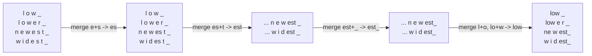
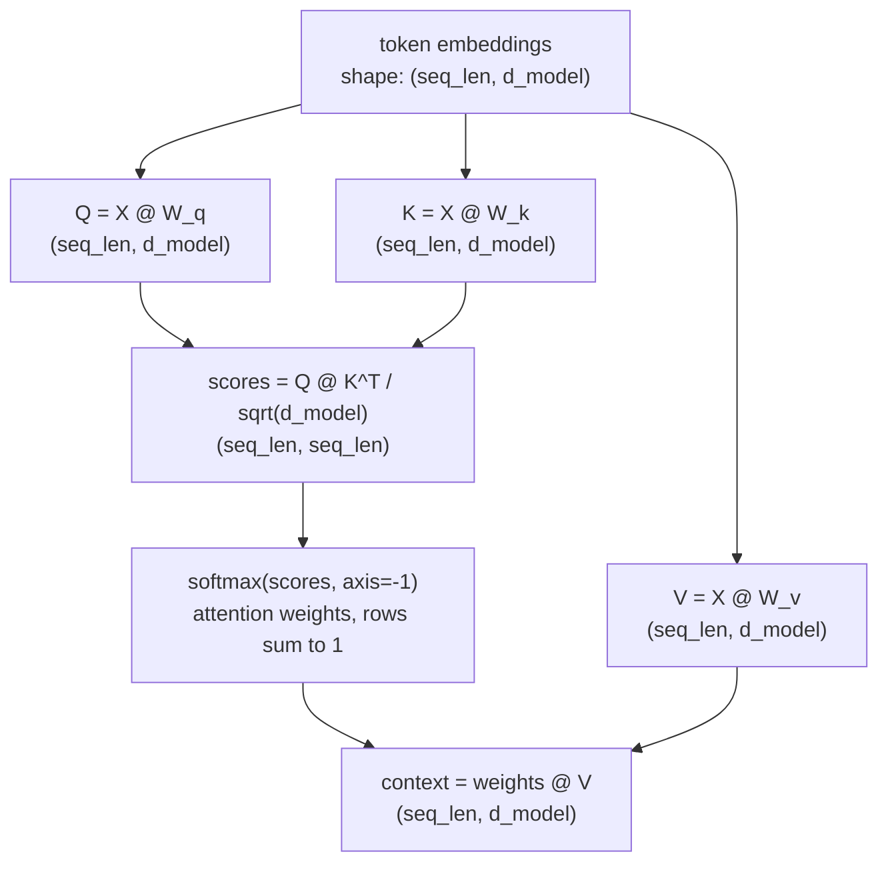

# Day 1 — Tokenization, Attention, and the KV Cache

A transformer never sees words. It sees a sequence of integers, turns each integer into a vector, and repeatedly asks "which other vectors in this sequence matter to me right now, and how much?" Everything downstream — how many tokens your prompt costs, how the model resolves "it" back to the right noun three sentences earlier, how a 30-turn conversation doesn't get proportionally slower with every reply — is a consequence of three mechanisms: how text gets cut into integers (tokenization), how those integers' vectors exchange information (attention), and how the model avoids redoing that exchange from scratch on every generated token (the KV cache). None of the three is obvious from the outside, and each has a specific, well-defined failure mode worth knowing before you hit it in production.

## Tokenization: text becomes integers

A tokenizer's job is to split arbitrary text into a fixed vocabulary of chunks (subwords, in practice), each with an integer ID. The dominant approach for modern LLMs is **byte-pair encoding (BPE)**: start from individual bytes, and repeatedly merge the most frequent adjacent pair into a new symbol, thousands of times, until you have a vocabulary of the target size (GPT-4's `cl100k_base`, for instance, has 100k+ tokens). The merges are learned once, offline, from a large training corpus; at inference time, tokenizing text just means greedily applying those learned merges in order.

Byte-level BPE (as opposed to character-level) starts from raw UTF-8 bytes rather than Unicode characters. This is what guarantees *any* string — emoji, malformed text, a string in a script the training corpus barely saw — is representable: worst case, a symbol falls back to its raw bytes instead of an "unknown token."

### Watching BPE learn merges

The mechanism is easiest to trust once you've run it. Here's a minimal BPE trainer over a tiny four-word toy corpus (the same example from Sennrich et al.'s original BPE paper), each word split into characters plus an end-of-word marker `_` so the algorithm can tell "est" at a word boundary from "est" in the middle of a word:

```python
import collections

# word -> frequency in the toy corpus
corpus = {"low": 5, "lower": 2, "newest": 6, "widest": 3}

def word_to_symbols(word):
    return list(word) + ["_"]  # start from characters; '_' marks end-of-word

# vocab: tuple-of-symbols -> frequency, e.g. ('l','o','w','_') -> 5
vocab = {tuple(word_to_symbols(w)): f for w, f in corpus.items()}

def get_pair_counts(vocab):
    pairs = collections.Counter()
    for symbols, freq in vocab.items():
        for i in range(len(symbols) - 1):
            pairs[(symbols[i], symbols[i + 1])] += freq  # count every adjacent pair, weighted by word freq
    return pairs

def merge_vocab(pair, vocab):
    a, b = pair
    merged = a + b
    new_vocab = {}
    for symbols, freq in vocab.items():
        new_symbols, i = [], 0
        while i < len(symbols):
            if i < len(symbols) - 1 and symbols[i] == a and symbols[i + 1] == b:
                new_symbols.append(merged)   # replace the pair with the merged symbol
                i += 2
            else:
                new_symbols.append(symbols[i])
                i += 1
        new_vocab[tuple(new_symbols)] = new_vocab.get(tuple(new_symbols), 0) + freq
    return new_vocab

for step in range(6):
    pairs = get_pair_counts(vocab)
    best = max(pairs, key=pairs.get)          # most frequent adjacent pair, weighted by word count
    vocab = merge_vocab(best, vocab)
    print(f"step {step+1}: merge {best} (seen {pairs[best]}x) -> '{best[0]+best[1]}'")
```

Actually running this (verified — output below is real, not illustrative) produces:

```
step 1: merge ('e', 's') (seen 9x) -> 'es'
step 2: merge ('es', 't') (seen 9x) -> 'est'
step 3: merge ('est', '_') (seen 9x) -> 'est_'
step 4: merge ('l', 'o') (seen 7x) -> 'lo'
step 5: merge ('lo', 'w') (seen 7x) -> 'low'
step 6: merge ('n', 'e') (seen 6x) -> 'ne'
```

Trace why: `e` and `s` co-occur in "newest" (freq 6) and "widest" (freq 3) — 9 total, more than any other adjacent pair — so it merges first. Once `es` exists, `es`+`t` is now the most frequent pair (still 9, since it appears in the same two words), so it merges next, and so on. After 6 merges, "lower" tokenizes as `low`, `e`, `r`, `_` (4 pieces) while "newest" tokenizes as `ne`, `w`, `est_` (3 pieces) — common substrings became single tokens, rare ones stayed split. This is the entire algorithm; a production tokenizer just runs it for far more merges over far more text.



### Tokenization is not language-neutral

The merges are frequency-driven, learned from a training corpus that skews heavily English. That has a direct, measurable consequence: the same sentence costs a different number of tokens depending on the language it's written in, even when it conveys the same content. Verified with `tiktoken` (`cl100k_base`, the GPT-4-family tokenizer):

```python
import tiktoken

enc = tiktoken.get_encoding("cl100k_base")
en = "The quarterly report is ready for review."
ko = "분기 보고서 검토 준비가 완료되었습니다."

en_ids = enc.encode(en)
ko_ids = enc.encode(ko)
print(len(en_ids), "tokens for English:", en_ids)
print(len(ko_ids), "tokens for Korean:", ko_ids)
```

Real output:

```
8 tokens for English
20 tokens for Korean
```

Same rough meaning, 2.5x the tokens — 5.1 characters per token in English versus 1.1 in Korean. Digging into *why* is even more concrete: decoding each Korean token ID back to bytes shows the syllable 토 (in 검토, "review") isn't a single learned token at all — it gets split into three separate single-byte tokens (`b'\xed'`, `b'\x86'`, `b'\xa0'`, the three raw UTF-8 bytes that make up 토), because that syllable wasn't common enough in the (English-dominated) training corpus to earn its own merge. Compare that to 검 in the same word, which *is* a single token (` 검`, id 86422). This is a real, reproducible cost: the same English-trained tokenizer that's efficient on English text can burn 2-3x the tokens — and therefore 2-3x the cost and context-window budget — on other languages, sometimes falling all the way down to individual bytes for less common characters.

## From tokens to vectors

Each token ID indexes into an embedding table, producing a vector — a token's **embedding**. Two embeddings whose **cosine similarity** (the cosine of the angle between them — direction only, magnitude ignored) is close to 1 tend to sit near each other in the space the model learned, which usually correlates with related meaning:

```python
import numpy as np

def cosine_sim(a, b):
    return np.dot(a, b) / (np.linalg.norm(a) * np.linalg.norm(b))
```

This is the same primitive Day 2's retrieval systems are built on — cosine similarity over embeddings is not a special trick, it's the same lookup a transformer's own attention mechanism does internally, just applied externally to whole-document vectors instead of per-token ones.

## Self-attention: Query, Key, Value

Embeddings alone are static — "bank" gets the same starting vector whether the sentence is about rivers or money. Self-attention is what lets a token's representation shift based on context. For every token, the model derives three vectors by multiplying its embedding by three learned weight matrices:

- **Query (Q)** — "what is this token looking for in the rest of the sequence?"
- **Key (K)** — "what does this token advertise about itself, that other tokens' queries can match against?"
- **Value (V)** — "what content does this token contribute, if another token attends to it?"

A token's new, context-aware representation is a weighted sum of every token's Value vector, where the weight is how well that token's Query matches each Key — computed as `softmax(QK^T / sqrt(d_k))`. The `sqrt(d_k)` scaling matters: without it, dot products grow with dimension and push softmax into a near-one-hot regime, which flattens gradients during training.



Verified with a real numpy pass over a 5-token toy sentence (`d_model=8` — a real model like a 7B-parameter Llama uses `d_model=4096`; 8 just keeps every printed number readable while running the identical math):

```python
import numpy as np

def softmax(x, axis=-1):
    x = x - np.max(x, axis=axis, keepdims=True)
    e = np.exp(x)
    return e / e.sum(axis=axis, keepdims=True)

np.random.seed(0)
tokens = ["The", "cat", "sat", "on", "mat"]
seq_len, d_model = len(tokens), 8

X = np.random.randn(seq_len, d_model)              # shape: (5, 8) -- embeddings + position info

W_q = np.random.randn(d_model, d_model) * 0.1       # shape: (8, 8), learned in a real model
W_k = np.random.randn(d_model, d_model) * 0.1
W_v = np.random.randn(d_model, d_model) * 0.1

Q, K, V = X @ W_q, X @ W_k, X @ W_v                 # each: shape (5, 8)

scores = (Q @ K.T) / np.sqrt(d_model)               # shape: (5, 5) -- scores[i,j] = query_i . key_j
weights = softmax(scores, axis=-1)                  # shape: (5, 5), each row sums to 1.0
context = weights @ V                               # shape: (5, 8) -- new, context-mixed representation
```

Real output — the attention weight matrix (rows = query token, columns = key token):

```
[[0.18 0.21 0.17 0.17 0.26]
 [0.2  0.2  0.2  0.2  0.2 ]
 [0.22 0.2  0.23 0.2  0.16]
 [0.2  0.2  0.2  0.19 0.2 ]
 [0.2  0.19 0.18 0.23 0.2 ]]
row sums: [1. 1. 1. 1. 1.]
context.shape: (5, 8)
```

With random, untrained weights the weights are close to uniform (every token attends a bit to everything) — a trained model's Q/K/V projections are what sharpen these into meaningful patterns, e.g. a pronoun's query strongly matching its antecedent's key.

**Multi-head attention** runs several independent Q/K/V projections in parallel, each into a smaller dimension (`d_model / n_heads`), then concatenates the results. Different heads end up specializing on different relationships — one might track subject-verb agreement, another coreference, another local adjacency — because each head's weights are trained independently and only need to be jointly useful when concatenated.

**Causal masking** is what turns this into something a decoder can generate with: for generation, token *i* must only attend to tokens `<= i` (it can't see the future — there isn't one yet). This is implemented by setting scores above the diagonal to `-inf` before the softmax, so their weight collapses to exactly 0:

```python
causal_mask = np.triu(np.ones((seq_len, seq_len)), k=1).astype(bool)  # True strictly above the diagonal
masked_scores = np.where(causal_mask, -np.inf, scores)
causal_weights = softmax(masked_scores, axis=-1)
```

Verified output (upper triangle is exactly 0, each row still sums to 1):

```
[[1.   0.   0.   0.   0.  ]
 [0.5  0.5  0.   0.   0.  ]
 [0.34 0.31 0.36 0.   0.  ]
 [0.25 0.25 0.25 0.24 0.  ]
 [0.2  0.19 0.18 0.23 0.2 ]]
```

Because attention has no built-in sense of order — it's a weighted sum over a *set* of Values, and swapping two tokens' positions in the input leaves the math identical if nothing else marks their position — a **positional encoding** (a vector encoding each token's position, added to or mixed into its embedding before attention) is what lets the model distinguish "dog bites man" from "man bites dog." Modern models mostly use **rotary position embeddings (RoPE)**, which rotate Q and K vectors by an angle proportional to position rather than adding a separate position vector, because it composes cleanly with the dot-product attention computes and generalizes better to sequence lengths longer than what the model was trained on.

## The KV cache

Generation is autoregressive: produce one token, append it, feed the whole sequence back in, produce the next token. Naively, that means recomputing K and V for *every* token in the prefix, every single step — even though a token's Key and Value never change once computed (they only depend on that token's own embedding and position, not on what gets generated after it). The **KV cache** exploits this: store each token's K and V the first time they're computed, and generating token N+1 only requires computing Q/K/V for the *new* token, then reusing the cached K/V for every earlier position.

```mermaid
sequenceDiagram
    participant Cache as KV Cache
    participant Model as Decoder step
    Note over Cache: empty
    Model->>Cache: step 1 - compute K1,V1 for token "The" -> store
    Note over Cache: [K1,V1]
    Model->>Cache: step 2 - compute K2,V2 for token "cat" only -> store; reuse K1,V1
    Note over Cache: [K1,V1] [K2,V2]
    Model->>Cache: step 3 - compute K3,V3 for token "sat" only -> store; reuse K1,V1,K2,V2
    Note over Cache: [K1,V1] [K2,V2] [K3,V3]
```

This is what keeps decode-time cost roughly linear rather than quadratic in output length. Without a cache, generating N tokens means step *k* redoes O(k) work recomputing the whole prefix's K/V, for a total O(N²) cost across the generation. With a cache, step *k* does O(k) work only for the new token's attention over an already-computed cache (still O(N²) in total *attention* FLOPs as the cache grows, since later steps scan a longer cache — but crucially it's O(1) *new* K/V computation per step, and it's this K/V-recompute cost that a naive implementation would otherwise be paying at every step for the entire prefix). The cache is a pure memory-for-compute trade: what stops recompute also has to sit in GPU memory for the whole generation.

### What the cache actually costs, in real numbers

For a 7B-parameter-class model (32 layers, 32 attention heads, `head_dim=128`, fp16 = 2 bytes/value), the cache stores one K and one V vector per token, per layer, per head:

```python
n_layers, n_heads, head_dim, dtype_bytes = 32, 32, 128, 2

def kv_cache_bytes(seq_len, n_kv_heads, batch_size=1):
    per_token_per_layer = 2 * n_kv_heads * head_dim * dtype_bytes  # x2 for K and V
    return batch_size * n_layers * seq_len * per_token_per_layer
```

Verified numbers (standard multi-head attention, all 32 heads keep their own K/V, batch size 1):

| seq_len | KV cache size |
|---|---|
| 128 tokens | 67.1 MB |
| 1,024 tokens | 536.9 MB |
| 8,192 tokens | 4,295.0 MB (~4.2 GB) |
| 32,768 tokens | 17,179.9 MB (~16.8 GB) |

That's *per request* — a handful of long conversations can eat as much GPU memory as the model's own weights. This is exactly the memory pressure **Multi-Query Attention (MQA)** and **Grouped-Query Attention (GQA)** target: instead of every one of the 32 query heads having its own K/V head, MQA shares a *single* K/V head across all query heads, and GQA shares a small group (e.g. 8 K/V heads across 32 query heads). Recomputed with `n_kv_heads=8` instead of 32, the same table shrinks by exactly 4x at every sequence length (verified: 67.1MB -> 16.8MB at 128 tokens, 17.2GB -> 4.3GB at 32,768) — a direct, linear function of how many K/V heads are shared. The multi-head *query* mechanism (still 32 heads, so the model doesn't lose representational capacity there) is untouched; only the K/V side shrinks.

## Common pitfalls

- **Assuming token count ≈ word count.** It's a rough approximation for English prose and a poor one for code, numbers, or non-English text — budget context windows and API costs off actual token counts, not word counts.
- **Forgetting tokenization affects arithmetic and spelling tasks.** A model reasons over tokens, not characters — "5138" might be one token or split as "51"+"38" depending on the tokenizer's learned merges, which is part of why LLMs are historically unreliable at digit-by-digit arithmetic and letter-counting: the information a task needs isn't cleanly visible at the token boundary the model actually operates on.
- **Treating attention as inherently interpretable.** Attention weights show what a token statistically *drew on*, not a causal explanation of why the model produced its output — high attention to a token doesn't guarantee that token controlled the final decision.
- **Not accounting for KV cache memory when estimating how many concurrent requests a server can hold.** Model weights are a fixed cost; KV cache is a *per-request, per-token* cost that grows throughout a generation and dominates memory at long context lengths — a server sized only for model weights will run out of memory as soon as real traffic with long contexts arrives.

**Takeaway:** tokenization decides how "long" your input looks to the model at all — and that length is not the same across languages; attention decides what each token learns from every other token, using Query/Key/Value and a causal mask during generation; and the KV cache is the specific mechanism that keeps a long conversation from getting quadratically slower to continue, at the cost of memory that grows linearly with every token generated.
