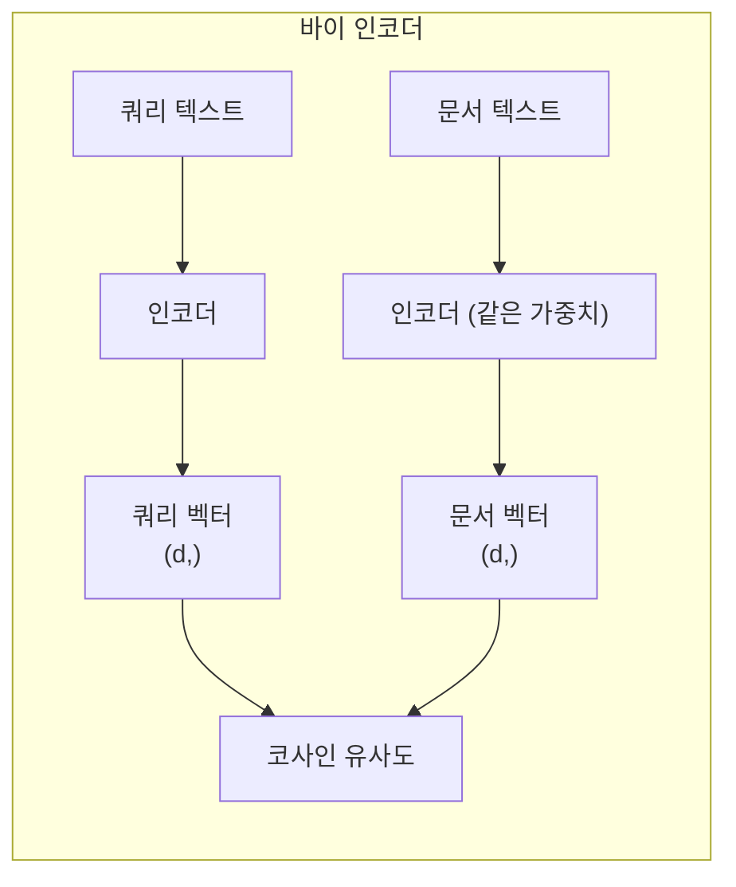
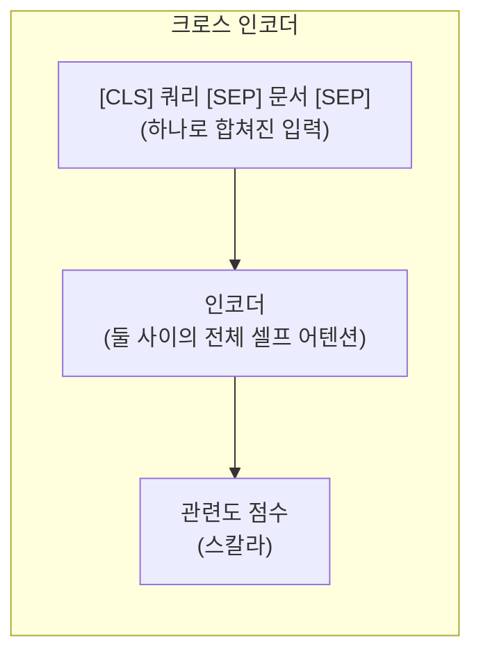
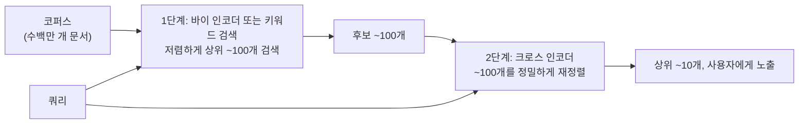

# Day 2 — 임베딩 모델과 재정렬(Reranking)

문서 수천 개를 넘어서는 시맨틱 검색은 모델 호출 한 번으로 끝나는 경우가 거의 없습니다. 대신 파이프라인으로 동작합니다: 빠르고 근사적인 1차 통과가 수백만 개의 후보를 수십 개로 좁히고, 그다음 느리지만 훨씬 꼼꼼한 2차 통과가 그 수십 개만 다시 점수를 매겨 실제로 사용자에게 보여줄 순서를 정합니다. 이 구조를 이해하려면 텍스트를 관련도 점수로 바꾸는 두 가지 아키텍처 — **바이 인코더(bi-encoder)**와 **크로스 인코더(cross-encoder)** — 를 이해해야 합니다. 구체적으로는 빠른 쪽이 *왜* 빠른지, 그 속도가 정확도 면에서 어떤 실제 대가를 치르는지, 그리고 이 2단계 설계가 단순한 최적화가 아니라 규모가 커지면 사실상 피할 수 없는 이유를 이해해야 합니다.

## 바이 인코더: 한 번 인코딩하고 여러 번 비교한다

바이 인코더는 쿼리와 모든 후보 문서를 *같은* 인코더에, **독립적으로** 통과시킵니다 — 모델은 쿼리와 문서를 동시에 보는 일이 절대 없습니다. 각 텍스트는 고정 크기의 벡터 하나로 나오고, 관련도는 쿼리 벡터와 각 문서 벡터 사이의 단순한 벡터 비교(코사인 유사도 또는 내적)가 됩니다.



이 구조가 확장 가능한 이유: 문서 쪽 인코딩이 쿼리에 전혀 의존하지 않기 때문에, 모든 문서의 벡터를 **오프라인에서 미리 한 번만** 계산해 벡터 인덱스(FAISS, HNSW, 벡터 데이터베이스 등)에 저장해 둘 수 있습니다. 쿼리 시점에는 쿼리 자체만 인코더를 통과하면 되고, 이미 계산돼 있는 백만 개의 문서 벡터와 비교하는 작업은 백만 번의 인코더 호출이 아니라 최근접 이웃 조회 하나로 끝납니다. 바이 인코더가 이 노트의 다른 어떤 방식도 직접 다룰 수 없는 규모의 코퍼스를 검색할 수 있는 이유가 바로 여기에 있습니다.

그 독립성이 치르는 대가: 인코더는 쿼리와 특정 문서를 *함께* 읽어볼 기회를 절대 갖지 못합니다. 나란히 놓고 봐야만 드러나는 관련도 신호 — 문서의 특정 구절이 쿼리의 특정 절에 정확히 답하는 경우, 의미를 뒤집는 부정어, 서로 다른 의미로 쓰인 같은 단어 — 는 실제 짝을 직접 들여다볼 기회 없이 각 벡터가 *스스로* 이미 담고 있어야만 합니다.

## 크로스 인코더: 함께 읽고, 한 번에 점수를 매긴다

크로스 인코더는 대신 쿼리와 후보 문서 *하나*를 하나의 입력으로 이어 붙입니다 — `[CLS] 쿼리 [SEP] 문서 [SEP]` — 그리고 이 쌍을 함께 트랜스포머에 통과시켜, 그 특정 짝에 대한 관련도 점수 하나를 출력합니다. 셀프 어텐션이 쿼리 토큰과 문서 토큰에 대해 함께 작동하기 때문에, 점수가 나오기 전에 모든 쿼리 토큰이 모든 문서 토큰에(그리고 그 반대로도) 직접 주목할 수 있습니다.



이 결합된 어텐션이야말로 바이 인코더가 할 수 없는 것이고, 두 텍스트의 상호작용 안에만 존재하는 관련도 신호를 크로스 인코더가 포착할 수 있게 해주는 이유입니다. 대가는 이점과 정확히 대칭적입니다: 점수가 *특정 쌍*에 의존하기 때문에 아무것도 미리 계산해 둘 수 없습니다 — 쿼리 하나에 대해 후보 문서 1,000개에 점수를 매긴다는 것은 트랜스포머 전체 순전파를 1,000번 돌린다는 뜻이며, 그것도 매 쿼리마다입니다. 이는 백만 문서짜리 코퍼스를 직접 검색하는 데는 전혀 맞지 않지만, 짧은 후보 목록을 다시 점수 매기는 데는 문제없이 확장됩니다.

## 순수 어휘 기반 인코더가 실패하는 모습 직접 보기 (검증됨)

독립 인코딩이 왜 정보 손실을 일으키는지 가장 깔끔하게 보는 방법은, 핵심 구조적 약점만 남기고 나머지를 다 걷어내는 것입니다: 동의어 개념이 전혀 없이 문자 그대로의 단어 중복만 보는 인코더 말입니다. TF-IDF가 정확히 그렇습니다 — 각 텍스트를 독립적으로 고정 벡터로 인코딩한다는 점에서(학습된 시맨틱 특징 대신 손으로 만든 어휘 특징을 쓴다는 점만 다를 뿐, 바이 인코더와 동일한 형태의 계산입니다) 이 실패 *유형*을 보여주는 데는 충분히 정당하고 직접 실행 가능한 대체물입니다. 실제 신경망 바이 인코더는 순수 단어 일치를 넘어 일반화하는 능력이 이보다 훨씬 뛰어나다는 점은 감안해야 합니다:

```python
import numpy as np
from sklearn.feature_extraction.text import TfidfVectorizer

query = "how do I reset my account password"

docs = [
    # 실제로 관련 있지만 다르게 표현됨 -- 쿼리와 문자 그대로 겹치는 단어가 거의 없음
    "Forgot your login credentials? Use the 'Trouble signing in' link on the sign-in page to create a new one.",
    # 주제는 완전히 다름(스마트 도어락 설명서)이지만 'account', 'password', 'reset'을 그대로 재사용
    "The account password reset button on our smart lock clears a stored 4-digit code back to its factory default.",
]

vectorizer = TfidfVectorizer()
tfidf = vectorizer.fit_transform([query] + docs).toarray()  # shape: (3, vocab_size)
q_vec, d_vecs = tfidf[0], tfidf[1:]                          # q_vec: (vocab_size,), d_vecs: (2, vocab_size)

def cosine_sim(a, b):
    return np.dot(a, b) / (np.linalg.norm(a) * np.linalg.norm(b) + 1e-9)

for i, doc in enumerate(docs):
    print(f"sim={cosine_sim(q_vec, d_vecs[i]):.4f}  {doc[:60]}...")
```

실제 출력:

```
sim=0.0000  Forgot your login credentials? Use the 'Trouble signing in'...
sim=0.2027  The account password reset button on our smart lock clears...
```

실제로 관련 있는 패러프레이즈는 정확히 0점을 받습니다 — 쿼리와 문자 그대로 겹치는 단어가 하나도 없으니 내용이 아무리 관련 있어도 TF-IDF가 활용할 게 없습니다 — 반면 주제가 완전히 다른 스마트 도어락 설명서는 순전히 "account", "password", "reset"을 그대로 재사용했다는 이유만으로 0.20점을 받습니다. 학습된 신경망 바이 인코더는 이런 문제 대부분을 해결합니다("잊어버린 로그인 정보"와 "비밀번호 재설정"이 거의 동의어라는 걸 학습했으므로, 위 패러프레이즈는 더 이상 0점을 받지 않을 것입니다). 하지만 학습 방식은 동일합니다 — 짝이 맞는 쌍의 벡터를 서로 당기고, 짝이 안 맞는 쌍은 밀어냅니다 — 그래서 같은 실패 양상을 더 약한 형태로 물려받습니다: 표면적인 어휘는 공유하지만 실제로 중요한 부분이 다른 두 텍스트가, 학습 데이터가 그 둘을 구분하도록 특별히 가르치지 않았다면 벡터 공간에서 필요 이상으로 가까이 있을 수 있습니다.

실제 신경망 바이 인코더와 크로스 인코더를 사용하는 현재 API — 올바른 메서드 시그니처를 보여주기 위한 것이며, 이 환경에서는 실행하지 않았습니다(GPU 없음, `sentence-transformers`/`torch` 미설치):

```python
from sentence_transformers import SentenceTransformer, CrossEncoder
import numpy as np

bi_encoder = SentenceTransformer("sentence-transformers/all-MiniLM-L6-v2")
query = "how do I reset my account password"
docs = [
    "Forgot your login credentials? Use the 'Trouble signing in' link on the sign-in page to create a new one.",
    "The account password reset button on our smart lock clears a stored 4-digit code back to its factory default.",
]

q_vec = bi_encoder.encode(query)          # shape: (384,), 이 모델 기준
d_vecs = bi_encoder.encode(docs)          # shape: (2, 384)
bi_scores = d_vecs @ q_vec / (np.linalg.norm(d_vecs, axis=1) * np.linalg.norm(q_vec))

cross_encoder = CrossEncoder("cross-encoder/ms-marco-MiniLM-L-6-v2")
cross_scores = cross_encoder.predict([(query, d) for d in docs])  # shape: (2,) -- 쌍마다 스칼라 하나
```

## 검색 후 재정렬(Retrieve-then-rerank)

실무적인 답은 두 단계를 순서대로 실행해, 각 단계가 실제로 잘하는 일만 하게 만드는 것입니다:



1단계(바이 인코더의 벡터 검색, 흔히 BM25 같은 전통적인 키워드 검색과 결합)는 전체 코퍼스에서 넓은 후보 집합 — 예를 들어 상위 100개 — 을 저렴하게 끌어옵니다. 이미 계산돼 있는 벡터에 대한 최근접 이웃 조회일 뿐이기 때문입니다. 2단계는 크로스 인코더를 그 100개에 대해서만 실행해, 전체 코퍼스가 아니라 이미 그럴듯한 소규모 집합에 대해서만 쌍당 비용 전체를 지불합니다. 결과적으로 바이 인코더의 *확장성*과 크로스 인코더의 *정확도* 대부분을 함께 얻으면서, 크로스 인코더 비용을 100만 번 지불하지는 않게 됩니다.

## 바이 인코더가 이런 식으로 실패하는 이유: 대조 학습(Contrastive Learning)

바이 인코더는 **대조 학습**으로 훈련됩니다: 쿼리와 실제로 관련 있는 문서(긍정 쌍)가 주어지면 두 임베딩을 서로 당기고, 쿼리와 관련 없는 문서(부정 예시)가 주어지면 서로 밀어냅니다. 이것이 얼마나 잘 일반화되는지는 학습 중에 어떤 부정 예시를 봤는지에 거의 전적으로 달려 있습니다. **쉬운 부정 예시** — 무작위로 뽑힌, 명백히 관련 없는 문서 — 는 밀어내기 쉬워서 세밀한 구분을 거의 가르쳐주지 못합니다. **어려운 부정 예시(hard negative)** — 위의 스마트 도어락 설명서처럼 쿼리와 어휘, 주제, 구조를 공유하지만 실제로는 정답이 아닌 문서 — 야말로 모델이 "표면적으로 비슷함"과 "실제로 관련 있음" 사이의 경계를 학습하도록 강제하는 것입니다. 어려운 부정 예시가 충분하지 않은 데이터셋으로 학습된 바이 인코더는 위에서 보여준 것과 정확히 같은 실수를 계속 저지를 것입니다. 학습 과정 어디에서도 그 구분이 중요하다는 걸 가르쳐준 적이 없기 때문입니다.

## 마트료시카 임베딩, 짧게

일부 최신 임베딩 모델은 출력 벡터를 **잘라내도**(예를 들어 1024차원 중 중요도 순으로 앞 256차원만 남겨도) 조금 덜 정확할 뿐 여전히 쓸 만한 임베딩이 나오도록 명시적으로 학습됩니다. 이는 학습 시점에 의도적으로 부여된 속성입니다(손실 함수가 전체 차원뿐 아니라 여러 절단 길이에서도 함께 적용됩니다) — 아무 임베딩 모델에서나 공짜로 얻어지는 성질이 아닙니다. 덕분에 모델 하나로 대략적인 1차 검색용 저차원 인덱스와, 더 정확한 비교용 전체 차원 임베딩을 별도 모델을 학습하거나 저장하지 않고도 함께 서비스할 수 있습니다 — 규모가 커질수록 벡터 인덱스 저장 비용과 검색 비용을 낮게 유지하는 데 실질적으로 유용한 기법입니다.

## 검색 품질 측정: Recall@k와 MRR

"재정렬이 도움이 되는 것 같다"는 파이프라인 변경 전후를 비교할 수 있는 수치가 아닙니다. 각 쿼리의 순위 매겨진 결과 목록과 그 쿼리의 실제 정답 문서만 있으면 계산되는 두 지표가 대부분의 경우를 커버합니다:

- **Recall@k** — 전체 쿼리 중, 정답 문서가 상위 *k*개 결과 안에 있었던 비율은 얼마인가? 이 지표는 1단계(검색)에 중요합니다: 정답 문서가 재정렬기에 넘겨지는 상위 *k*개 후보 안에 없다면, 재정렬을 아무리 잘해도 그것을 되살릴 수 없습니다 — 재정렬은 검색이 이미 찾아낸 것의 순서만 바꿀 뿐입니다.
- **MRR(Mean Reciprocal Rank, 평균 역순위)** — 각 쿼리에 대해 정답 문서 순위의 역수(1등이면 1.0, 2등이면 0.5, 아예 없으면 0)를 구한 뒤 쿼리 전체에 대해 평균을 냅니다. 이 지표는 2단계(재정렬)와 파이프라인 전체에 중요합니다: 단순히 긴 목록 어딘가에 정답이 있는지가 아니라, 정답이 *상단 가까이* 있는지를 보상하기 때문입니다.

정답 문서 1개씩을 가진 5개의 쿼리와, 쿼리별 순위 매겨진 결과 목록으로 이루어진 장난감 데이터셋으로 검증했습니다:

```python
import numpy as np

relevant_doc = {"q1": "d7", "q2": "d3", "q3": "d9", "q4": "d1", "q5": "d5"}
ranked_results = {
    "q1": ["d2", "d7", "d4", "d9", "d1"],   # 정답 d7이 2위
    "q2": ["d3", "d8", "d1", "d2", "d4"],   # 정답 d3이 1위
    "q3": ["d2", "d4", "d1", "d8", "d6"],   # 정답 d9가 상위 5개 안에 없음
    "q4": ["d5", "d2", "d1", "d3", "d9"],   # 정답 d1이 3위
    "q5": ["d5", "d1", "d2", "d3", "d4"],   # 정답 d5가 1위
}

def recall_at_k(ranked, relevant, k):
    hits = sum(relevant[q] in docs[:k] for q, docs in ranked.items())
    return hits / len(ranked)

def mrr(ranked, relevant):
    reciprocal_ranks = []
    for q, docs in ranked.items():
        if relevant[q] in docs:
            reciprocal_ranks.append(1.0 / (docs.index(relevant[q]) + 1))  # 1부터 시작하는 순위
        else:
            reciprocal_ranks.append(0.0)
    return np.mean(reciprocal_ranks)
```

실제 출력: `Recall@1 = 0.40`, `Recall@3 = 0.80`, `Recall@5 = 0.80`, `MRR = 0.567`. 이 숫자들을 함께 읽으면 이 장난감 데이터셋이 보여주려던 구체적인 이야기가 드러납니다: Recall@3과 Recall@5가 동일한(0.80) 이유는 3위와 5위 사이에 상위 5개 목록에 새로 들어오는 정답이 없기 때문입니다 — q3의 정답 문서는 애초에 이 후보 목록에 전혀 등장하지 않고, 이는 어떤 k값의 Recall@k로도, 재정렬로도 고칠 수 없습니다(1단계 검색 자체의 누락입니다). MRR 0.567은 Recall@1보다 체감상 더 엄격한데, 누락(0점 기여)뿐 아니라 찾아내긴 했지만 1위가 아닌 결과들에도 벌점을 주기 때문입니다(q1은 2위라서 0.5, q4는 3위라서 0.33을 기여). 즉 Recall@k가 더 대략적으로 요약하는 같은 결과를, 순위에 더 민감하게 엄격히 바라본 것이 MRR입니다.

## 흔한 함정

- **바이 인코더의 품질을 유사도 점수 몇 개만 눈으로 보고 판단하는 것.** 코사인 유사도에는 모델이나 도메인을 가로지르는 고정된 의미 있는 임계값이 없습니다 — 0.6이 어떤 모델의 임베딩 공간에서는 강한 매치일 수 있지만 다른 모델에서는 약한 매치일 수 있습니다. *순위*를 비교하거나, 그 특정 모델에 대해 레이블이 달린 데이터로 임계값을 보정하세요.
- **"바이 인코더가 이미 1위 결과는 제대로 맞히니까"라며 재정렬을 생략하는 것.** 실제로 중요한 케이스는 바로 위 TF-IDF 예시가 보여주는 방식으로 어휘 중복이 사람을 오도하는 경우들입니다 — 이런 케이스는 대충 훑어보는 점검에서는 과소평가되고, 애매하거나 전문 용어가 많은 실제 사용자 쿼리에서는 과대표됩니다.
- **재정렬할 후보 집합을 너무 크게 잡는 것.** 크로스 인코더의 비용은 점수를 매기는 쌍의 수에 선형입니다 — 상위 100개 대신 상위 1,000개를 재정렬하면 실제로는 대개 불필요한 10배의 지연이 발생합니다. 라운드 넘버를 고르지 말고 검색 컷오프를 실험적으로 조정하세요.
- **검색 품질을 추론 시점에는 손댈 수 없는 학습 데이터 문제로만 여기는 것.** 쿼리 재작성, 하이브리드 검색(밀집 벡터 검색과 키워드/BM25 검색의 결합), 메타데이터 필터링은 모델을 전혀 건드리지 않고도 1단계 재현율(recall)을 개선하며, 대개 파인튜닝보다 저렴하게 얻을 수 있는 개선입니다.

**핵심 정리:** 바이 인코더는 인코딩이 쿼리와 무관하게 독립적이기 때문에 확장 가능하지만, 바로 그 독립성이 표면적인 단어 중복에 속아 넘어가게 만드는 원인이기도 합니다. 크로스 인코더는 쿼리와 문서를 함께 읽어 이 문제를 해결하지만, 그 대가로 짧은 후보 목록 이상으로는 확장되지 않습니다 — 검색 후 재정렬은 하나의 파이프라인에서 두 특성을 함께 얻는 표준적인 방법입니다.
