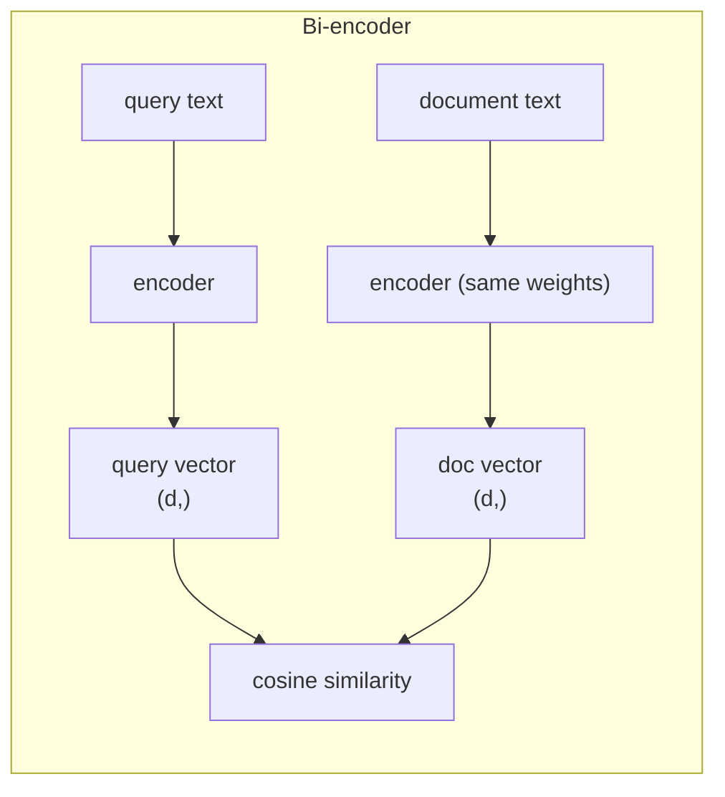
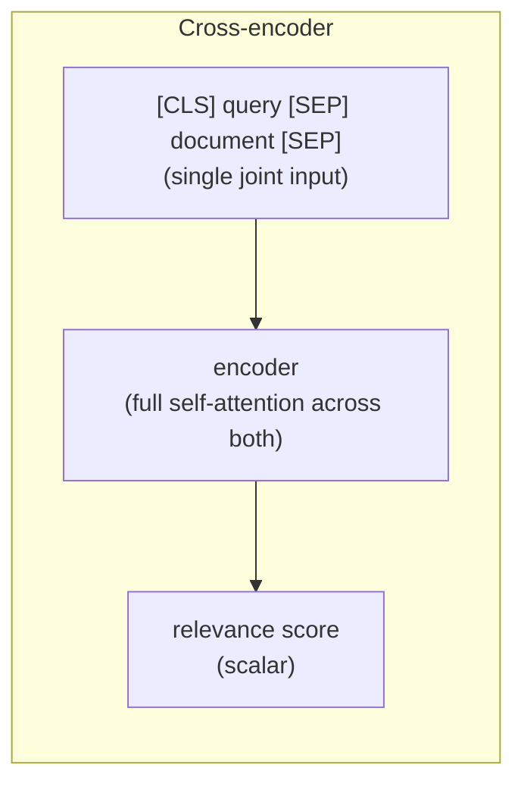
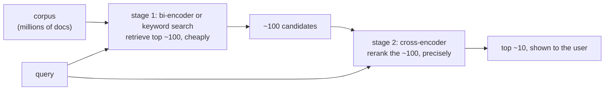

# Day 2 — Embedding Models and Reranking

Semantic search over more than a few thousand documents almost never runs as a single model call. It runs as a pipeline: a fast, approximate pass narrows millions of candidates down to a few dozen, then a slower, more careful pass re-scores just those few dozen for the order that actually gets shown. Understanding why requires understanding two different architectures for turning text into a relevance score — a **bi-encoder** and a **cross-encoder** — and specifically *why* the fast one is fast, why that speed has a real accuracy cost, and why the two-stage design is not just an optimization but close to unavoidable at scale.

## Bi-encoders: encode once, compare many times

A bi-encoder runs the query and every candidate document through the *same* encoder, **independently** — the model never sees the query and a document at the same time. Each text comes out as one fixed-size vector, and relevance becomes a plain vector comparison (cosine similarity or dot product) between the query vector and each document vector.



The reason this architecture scales: because the document side never depends on the query, every document's vector can be computed **once, offline**, and stored in a vector index (FAISS, HNSW, a vector database). At query time, only the query itself needs to go through the encoder — comparing it against a million precomputed document vectors is then a nearest-neighbor lookup, not a million encoder calls. That's the entire reason bi-encoders can search corpora too large for anything else in this note to touch directly.

The cost of that independence: the encoder never gets to read the query and a specific document *together*. Any relevance signal that only shows up from a side-by-side reading — a specific phrase in the document directly answering a specific clause in the query, a negation that flips meaning, a shared word used in unrelated senses — has to already be captured in each vector *on its own*, with no chance to look at the actual pairing.

## Cross-encoders: read both together, score once

A cross-encoder instead concatenates the query and *one* candidate document into a single input — `[CLS] query [SEP] document [SEP]` — and runs the pair jointly through a transformer, outputting a single relevance score for that specific pairing. Because self-attention runs over query tokens and document tokens together, every query token can directly attend to every document token (and vice versa) before the score is produced.



That joint attention is exactly what a bi-encoder can't do, and it's what lets a cross-encoder catch relevance signals that only exist in the interaction between the two texts. The cost is symmetric with the benefit: because the score depends on the *specific pair*, nothing can be precomputed — scoring 1,000 candidate documents against one query means 1,000 full forward passes through the transformer, every single query. That doesn't scale to searching a million-document corpus directly; it scales fine to re-scoring a short list.

## Watching a purely lexical encoder fail (verified)

The clean way to see *why* independent encoding is lossy is to strip away everything except the core structural weakness: an encoder that only sees literal word overlap, with zero notion of synonymy. TF-IDF is exactly that — it encodes each text independently into a fixed vector (same shape of computation as a bi-encoder, just with hand-built lexical features instead of learned semantic ones) — which makes it a legitimate, runnable stand-in for demonstrating the *class* of failure, even though a real neural bi-encoder is considerably better than this at generalizing beyond exact words:

```python
import numpy as np
from sklearn.feature_extraction.text import TfidfVectorizer

query = "how do I reset my account password"

docs = [
    # actually relevant, but paraphrased -- shares almost no literal words with the query
    "Forgot your login credentials? Use the 'Trouble signing in' link on the sign-in page to create a new one.",
    # wrong topic (a smart-lock manual), but shares 'account', 'password', 'reset' literally
    "The account password reset button on our smart lock clears a stored 4-digit code back to its factory default.",
]

vectorizer = TfidfVectorizer()
tfidf = vectorizer.fit_transform([query] + docs).toarray()  # shape: (3, vocab_size)
q_vec, d_vecs = tfidf[0], tfidf[1:]                          # q_vec: (vocab_size,), d_vecs: (2, vocab_size)

def cosine_sim(a, b):
    return np.dot(a, b) / (np.linalg.norm(a) * np.linalg.norm(b) + 1e-9)

for i, doc in enumerate(docs):
    print(f"sim={cosine_sim(q_vec, d_vecs[i]):.4f}  {doc[:60]}...")
```

Real output:

```
sim=0.0000  Forgot your login credentials? Use the 'Trouble signing in'...
sim=0.2027  The account password reset button on our smart lock clears...
```

The genuinely relevant paraphrase scores exactly 0 — zero literal word overlap with the query means TF-IDF has nothing to work with, no matter how relevant the content is — while the wrong-topic smart-lock manual scores 0.20 purely because it happens to reuse "account," "password," and "reset" verbatim. A trained neural bi-encoder fixes most of this (it's learned that "forgot your login credentials" and "reset my password" are near-synonymous, so the paraphrase would no longer score 0), but it's trained the same way — pull matching pairs' vectors together, push mismatched pairs apart — and inherits a milder version of the same failure mode: two texts that share surface vocabulary but differ in what actually matters can still end up closer in vector space than they should be, if the training data never taught the model to specifically separate that pair.

The real (current) API for doing this with an actual neural bi-encoder and cross-encoder — shown for the correct method signatures, not executed in this environment (no GPU, and `sentence-transformers`/`torch` aren't installed here):

```python
from sentence_transformers import SentenceTransformer, CrossEncoder
import numpy as np

bi_encoder = SentenceTransformer("sentence-transformers/all-MiniLM-L6-v2")
query = "how do I reset my account password"
docs = [
    "Forgot your login credentials? Use the 'Trouble signing in' link on the sign-in page to create a new one.",
    "The account password reset button on our smart lock clears a stored 4-digit code back to its factory default.",
]

q_vec = bi_encoder.encode(query)          # shape: (384,) for this model
d_vecs = bi_encoder.encode(docs)          # shape: (2, 384)
bi_scores = d_vecs @ q_vec / (np.linalg.norm(d_vecs, axis=1) * np.linalg.norm(q_vec))

cross_encoder = CrossEncoder("cross-encoder/ms-marco-MiniLM-L-6-v2")
cross_scores = cross_encoder.predict([(query, d) for d in docs])  # shape: (2,) -- one scalar per pair
```

## Retrieve-then-rerank

The practical answer is to run both stages, in sequence, so each one only does the job it's actually good at:



Stage 1 (a bi-encoder's vector search, often combined with classic keyword search like BM25) pulls a broad candidate set — say, the top 100 — from the full corpus, cheaply, because it's just a nearest-neighbor lookup against precomputed vectors. Stage 2 runs the cross-encoder only on those 100, paying its full per-pair cost on a small, already-plausible set instead of the entire corpus. You get the bi-encoder's ability to *scale*, plus most of the cross-encoder's *accuracy*, without paying cross-encoder cost 1,000,000 times.

## Why bi-encoders fail this specific way: contrastive training

Bi-encoders are trained with **contrastive learning**: given a query and a known-relevant document (a positive pair), pull their embeddings together; given the query and unrelated documents (negatives), push them apart. How well this generalizes depends almost entirely on what negatives it saw during training. **Easy negatives** — a randomly sampled, obviously unrelated document — are trivial to push away and teach the model almost nothing about fine-grained distinctions. **Hard negatives** — documents that share vocabulary, topic, or structure with the query but aren't actually the right answer, like the smart-lock manual above — are what actually force the model to learn the boundary between "superficially similar" and "actually relevant." A bi-encoder trained on a dataset with too few hard negatives will keep making exactly the mistake demonstrated above, because nothing in training ever taught it that distinction mattered.

## Matryoshka embeddings, briefly

Some newer embedding models are explicitly trained so that **truncating** the output vector — keeping only the first 256 of 1024 dimensions, say, sorted by importance — still produces a usable embedding, just a slightly less accurate one. This is a deliberate training-time property (the loss function is applied at multiple truncation lengths during training, not just the full dimension), not something that falls out of an arbitrary embedding model for free. It means a single model can serve a cheap, low-dimensional index for coarse first-pass retrieval and a full-dimensional embedding for higher-accuracy comparison, without training or storing two separate models — a genuinely useful trick for keeping vector index storage and search cost down at scale.

## Measuring retrieval quality: Recall@k and MRR

"The reranker seems to help" isn't a number you can compare across changes to the pipeline. Two metrics cover most of what matters, both computed from nothing more than each query's ranked result list and its known-relevant document:

- **Recall@k** — across all queries, what fraction had their relevant document somewhere in the top *k* results? This is the metric that matters for stage 1 (retrieval): if the relevant document isn't in the top *k* candidates handed to the reranker, no amount of reranking can recover it — reranking only reorders what retrieval already found.
- **MRR (Mean Reciprocal Rank)** — for each query, take `1 / rank` of the relevant document (1.0 if it's first, 0.5 if second, 0 if it's missing entirely), then average across queries. This is the metric that matters for stage 2 (reranking) and for the pipeline overall: it rewards getting the right answer *near the top*, not just somewhere in a long list.

Verified on a toy set of 5 queries, each with one known-relevant document, and a ranked result list per query:

```python
import numpy as np

relevant_doc = {"q1": "d7", "q2": "d3", "q3": "d9", "q4": "d1", "q5": "d5"}
ranked_results = {
    "q1": ["d2", "d7", "d4", "d9", "d1"],   # relevant d7 at rank 2
    "q2": ["d3", "d8", "d1", "d2", "d4"],   # relevant d3 at rank 1
    "q3": ["d2", "d4", "d1", "d8", "d6"],   # relevant d9 missing from top 5
    "q4": ["d5", "d2", "d1", "d3", "d9"],   # relevant d1 at rank 3
    "q5": ["d5", "d1", "d2", "d3", "d4"],   # relevant d5 at rank 1
}

def recall_at_k(ranked, relevant, k):
    hits = sum(relevant[q] in docs[:k] for q, docs in ranked.items())
    return hits / len(ranked)

def mrr(ranked, relevant):
    reciprocal_ranks = []
    for q, docs in ranked.items():
        if relevant[q] in docs:
            reciprocal_ranks.append(1.0 / (docs.index(relevant[q]) + 1))  # 1-indexed rank
        else:
            reciprocal_ranks.append(0.0)
    return np.mean(reciprocal_ranks)
```

Real output: `Recall@1 = 0.40`, `Recall@3 = 0.80`, `Recall@5 = 0.80`, `MRR = 0.567`. Reading these together tells a specific story this toy set was built to show: Recall@3 and Recall@5 are identical (0.80) because nothing new enters the top 5 between rank 3 and rank 5 — q3's relevant document simply never appears in this candidate list at all, which Recall@k at any k cannot fix and reranking cannot fix either (it's a stage-1 retrieval miss). MRR of 0.567 sits below Recall@1 in spirit because it's penalized by both the miss (contributes 0) and by results that were found but not ranked first (q1 at rank 2 contributes 0.5, q4 at rank 3 contributes 0.33) — it's a stricter, rank-sensitive view of the same results Recall@k summarizes more coarsely.

## Common pitfalls

- **Judging a bi-encoder's quality by eyeballing a handful of similarity scores.** Cosine similarity has no fixed meaningful threshold across models or domains — 0.6 might be a strong match for one model's embedding space and a weak one for another's. Compare *rankings*, or calibrate a threshold against labeled data for that specific model.
- **Skipping the reranker because "the bi-encoder already gets the top result right."** The cases that matter are the ones where lexical overlap is misleading in exactly the way the TF-IDF example shows — those are undercounted by casual spot-checks and overrepresented in real user queries with ambiguous or jargon-heavy phrasing.
- **Reranking too large a candidate set.** A cross-encoder's cost is linear in the number of pairs scored — reranking the top 1,000 instead of the top 100 is a real, often unnecessary, 10x latency cost. Tune the retrieval cutoff empirically instead of picking a round number.
- **Assuming retrieval quality is a training-data problem you can't affect at inference time.** Query rewriting, hybrid search (combining dense vector search with keyword/BM25 search), and metadata filtering all improve stage-1 recall without touching the model at all, and are usually cheaper wins than fine-tuning.

**Takeaway:** bi-encoders scale because encoding is independent of the query, but that same independence is exactly what lets surface-level word overlap fool them; cross-encoders fix that by reading query and document together, at a cost that doesn't scale past a short candidate list — retrieve-then-rerank is the standard way to get both properties in one pipeline.
