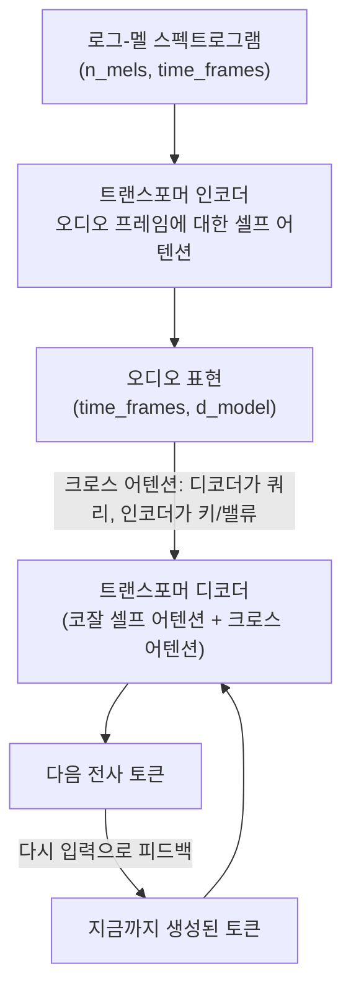

# Day 3 — 오디오 AI: 음성 인식과 음성 합성

텍스트는 모델에게 이산적인 토큰으로 도착합니다 — 유한하고 깔끔한 어휘 집합입니다. 오디오는 연속적인 물리 신호로 도착합니다: 초당 수천 번 샘플링되는 공기 압력이며, 단어나 서브워드처럼 자연스러운 "단위"라는 게 없습니다. 트랜스포머가 음성으로 뭔가 유용한 일을 하려면, 먼저 이 연속 신호를 적절한 형태와 적절한 정보 밀도를 가진 무언가로 바꿔야 합니다 — 너무 원시적이어도 안 되고(1초 분량의 오디오에 대해 16,000개의 원시 숫자를 트랜스포머에 그대로 넣는 것은 낭비이기도 하고 학습하기도 어렵습니다), 너무 손실이 커도 안 됩니다(엉뚱한 정보를 압축해 버리면 모델이 실제로 무슨 말이었는지 복원할 수 없습니다). 오늘은 이 문제를 해결하는 구체적인 변환 방법과, 그것이 해결된 뒤 오디오 AI가 나아가는 두 방향을 다룹니다.

## 파형에서 스펙트로그램으로

원시 오디오 파일은 시간에 따른 진폭 샘플들의 1차원 배열입니다 — 음성에 표준적으로 쓰이는 16kHz 샘플링 레이트에서는, 1초의 오디오가 16,000개의 부동소수점 숫자가 됩니다. 이 표현은 주파수 정보(어떤 음높이, 어떤 배음, 어떤 음운 구조인지)를 길고 파악하기 어려운 시계열 속에 파묻어 버립니다. **단시간 푸리에 변환(STFT, Short-Time Fourier Transform)**은 파형 위로 짧은 윈도우를 슬라이딩시켜(보통 25ms짜리 윈도우를 10ms씩 이동시켜, 연속된 윈도우끼리 겹치게 합니다) 이 문제를 해결합니다. 각 윈도우 위치에서 그 구간을 푸리에 변환으로 주파수 성분으로 분해합니다. 결과는 2차원 **스펙트로그램**입니다: 한 축은 시간, 다른 축은 주파수, 값은 강도(그 순간, 그 주파수에 얼마나 많은 에너지가 있는지)입니다.

인간의 청각은 주파수를 선형적으로 지각하지 않습니다 — 200Hz 부근에서의 100Hz 차이는 8000Hz 부근에서의 같은 100Hz 차이보다 훨씬 민감하게 느껴집니다. **로그-멜 스펙트로그램**은 원시 STFT 위에 두 가지 보정을 추가로 적용합니다: 주파수 축을 **멜 스케일**(지각적 음높이 민감도에 맞춰 구성된 척도로, 대략 1000Hz 이상에서는 로그에 가깝습니다)로 뒤틀고, 강도 값에 로그를 취합니다(마찬가지로 대략 로그에 가까운 음량 지각과 맞춰줍니다). 원시 파형도, 원시 STFT도 아닌 바로 이 로그-멜 표현이, 사실상 모든 최신 음성 모델(ASR 포함)의 표준 입력입니다.


### 직접 처음부터 만들어보기 (검증됨)

위의 모든 단계는 오디오 전용 라이브러리 없이도 구현할 수 있습니다 — "스펙트로그램"이란 게 결국 겹치는 윈도우에 적용한 푸리에 변환에, 손으로 계산 가능한 고정된 재가중 행렬을 곱한 것뿐임을 확인하는 차원에서 한 번쯤 직접 해볼 가치가 있습니다:

```python
import numpy as np
from scipy.signal import stft

sample_rate = 16000  # Hz -- Whisper를 포함한 표준 ASR 입력 레이트
duration_s = 1.0
t = np.linspace(0, duration_s, int(sample_rate * duration_s), endpoint=False)  # shape: (16000,)

# "음성 비슷한" 합성 신호: 기본 주파수 + 배음 2개(노래하는 모음처럼),
# 음성 특유의 켜짐/꺼짐 포락선을 흉내 낸 진폭 변조, 약간의 노이즈를 더함.
np.random.seed(42)  # 아래 노이즈 항을 고정해 출력이 재현되도록 함
f0 = 150  # Hz, 그럴듯한 음높이
signal = (1.0*np.sin(2*np.pi*f0*t) + 0.5*np.sin(2*np.pi*2*f0*t) + 0.3*np.sin(2*np.pi*3*f0*t))
envelope = 0.5 * (1 + np.sin(2*np.pi*2*t - np.pi/2))
signal = signal * envelope + 0.02 * np.random.randn(len(t))   # shape: (16000,) float64

# --- STFT: 25ms 윈도우, 10ms 홉 ---
win_length = int(0.025 * sample_rate)   # 400 샘플
hop_length = int(0.010 * sample_rate)   # 160 샘플
freqs, frame_times, Zxx = stft(signal, fs=sample_rate, nperseg=win_length, noverlap=win_length - hop_length)
magnitude = np.abs(Zxx)   # shape: (201, 101) -> (freq_bins, time_frames); 201 = win_length//2 + 1

# --- 멜 필터뱅크: 표준 공식으로 직접 구현 (이 샌드박스엔 librosa 없음) ---
def hz_to_mel(f): return 2595 * np.log10(1 + f / 700)
def mel_to_hz(m): return 700 * (10 ** (m / 2595) - 1)

n_mels = 40
n_fft_bins = magnitude.shape[0]
mel_points = np.linspace(hz_to_mel(0), hz_to_mel(sample_rate / 2), n_mels + 2)  # n_mels+2개 경계
bin_points = np.floor((n_fft_bins - 1) * 2 * mel_to_hz(mel_points) / sample_rate).astype(int)

filterbank = np.zeros((n_mels, n_fft_bins))   # shape: (40, 201)
for m in range(1, n_mels + 1):
    left, center, right = bin_points[m-1], bin_points[m], bin_points[m+1]
    for k in range(left, center):
        if center != left:
            filterbank[m-1, k] = (k - left) / (center - left)     # 삼각형의 상승 구간
    for k in range(center, right):
        if right != center:
            filterbank[m-1, k] = (right - k) / (right - center)   # 삼각형의 하강 구간

with np.errstate(all="ignore"):                      # 일부 플랫폼에서 0이 많은 행렬곱에 나오는 무해한 BLAS 경고
    mel_spec = filterbank @ magnitude                 # shape: (40, 201) @ (201, 101) -> (40, 101)
log_mel_spec = np.log(mel_spec + 1e-6)                # shape: (40, 101) -- 최종 모델 입력, 지각된 음량에 맞춰 로그 압축
```

실제 검증된 출력:

```
waveform shape: (16000,) dtype: float64
STFT magnitude shape: (201, 101)  -> (freq_bins, time_frames)
log-mel spectrogram shape: (40, 101)  -> (n_mels, time_frames)
value range: -8.06 to -0.58
```

1초 분량의 오디오(원시 숫자 16,000개)가 `(40, 101)` 배열이 됩니다 — 지각적으로 척도가 조정된 40개의 주파수 대역이 10ms 간격의 101개 시간 스텝에 걸쳐 있습니다. 이것이 바로 음성 트랜스포머의 인코더가 실제로 소비하는 대상입니다. 이후의 모든 처리는 이 격자 위에서 이루어지며, 원시 샘플을 직접 다루는 일은 없습니다.

## 두 방향

- **ASR / STT (자동 음성 인식 / Speech-to-Text)** — 오디오가 들어가고 텍스트가 나옵니다. 길고 시끄러운 연속 신호를 언어적 내용으로 압축합니다.
- **TTS (Text-to-Speech, 음성 합성)** — 텍스트가 들어가고 오디오가 나옵니다. 압축된 이산적 의미를 다시 길고 자연스러운 연속 신호로 펼쳐냅니다.

둘은 서로 역방향 문제이며, 완전히 통합된 일부 멀티모달 모델을 제외하면 대체로 서로 다른 아키텍처를 씁니다. 구조적인 이유가 있습니다: ASR은 다대소(many-to-few) 압축(수천 개의 오디오 프레임 -> 단어 몇십 개)이고, TTS는 소대다(few-to-many) 확장(단어 몇십 개 -> 수천 개의 오디오 샘플)입니다. 각 방향에서 더 어려운 엔지니어링 문제도 서로 다릅니다(각각: 노이즈/억양/전문 용어에 대한 강건성, 그리고 발화 전체 구조에 대한 감각 없이 오디오를 생성할 때 생기는 평탄하고 부자연스러운 억양을 피하는 것).

## 인코더-디코더 ASR 모델 내부

Whisper 같은 모델은 로그-멜 스펙트로그램을 트랜스포머 **인코더**에 통과시켜 오디오 표현의 시퀀스를 만들어냅니다 — Day 1에서 본 것과 같은 셀프 어텐션 메커니즘이 텍스트 토큰이 아니라 스펙트로그램의 시간 프레임에 대해 적용된 것뿐입니다. 그다음 트랜스포머 **디코더**가 토큰 단위로 전사문을 생성하는데, 매 디코딩 스텝마다 **크로스 어텐션**을 사용해 인코더의 전체 오디오 표현을 다시 들여다보고, 지금 쓰려는 단어와 오디오의 어느 부분이 관련 있는지를 결정합니다.



이는 텍스트-이미지 크로스 어텐션과 같은 구조를 그대로 반영합니다: 메커니즘은 동일하고(한 모달리티의 쿼리가 다른 모달리티의 키/밸류에 주목합니다), 다리를 놓는 모달리티 쌍만 다를 뿐입니다.

## 현실적인 실패 양상과 저렴한 완화책

Whisper는 넓고 일반적인 코퍼스로 학습됩니다 — 어느 한 팀의 제품 어휘에 특별히 과적합되어 있지 않습니다. 흔히, 재현 가능하게 나타나는 실패: 도메인 특화 전문 용어나 고유명사가 음성적으로 가장 가까운 흔한 단어나 구절로 전사되는 경우가 있습니다. 오디오가 조금이라도 애매하면 디코더의 언어모델 사전(prior)이 "가장 흔한 단어"를 선호하기 때문입니다. "We shipped the Kubernetes ingress patch"가 "we shipped the cooper Nettie's ingress patch"로 돌아오는 것이 정확히 이런 경우입니다: "Kubernetes"는 음성적으로 비슷한 흔한 표현들에 비해 학습 데이터 분포에서 드물기 때문에, 디코더의 사전이 이 판정에서 이깁니다.

실제 최신 Whisper API와 완화책입니다:

```python
import whisper

model = whisper.load_model("base")
result = model.transcribe("standup_notes.wav")
print(result["text"])
```

**초기 프롬프트(initial prompt)** — 오디오와 함께 전달하는 짧은 문맥 텍스트 — 는 디코더가 전사문을 생성하기 전에 그 텍스트로 조건을 걸어, 디코딩을 예상 어휘 쪽으로 편향시킵니다:

```python
result = model.transcribe(
    "standup_notes.wav",
    initial_prompt="Kubernetes, ingress, staging, deployment pipeline",
)
```

(이 환경에서는 실행하지 않았습니다 — Whisper 모델 가중치는 수백 MB짜리 다운로드이고, 추론에는 이 환경에서 감당하기 어려운 수준의 연산이 필요합니다. 위에 보여드린 API는 현재 `openai-whisper` 패키지의 실제 시그니처와 일치합니다. 반면 Whisper가 내부적으로 수행하는 실제 전처리 과정인 위의 STFT/로그-멜 파이프라인은 처음부터 끝까지 실제로 실행해 검증했습니다.)

이것이 정확성을 보장하지는 않습니다 — 사전이 완전히 뒤집히는 게 아니라 편향될 뿐입니다 — 하지만 오디오 자체가 애매해서 두 단어 모두 음향적으로 그럴듯한 경우, 확률을 정답 토큰 쪽으로 유의미하게 기울여줍니다. 고정된, 알려진 어휘(제품명, 사내 용어, 사람 이름)에 대해서는 재학습 없이 거의 공짜로 얻는 정확도 향상입니다.

## TTS 폴백 패턴

모든 프로젝트가 신경망 TTS 모델을 필요로 하는 것은 아닙니다. 주요 OS 두 곳 모두 별도 의존성 없이 접근 가능한 내장 합성기를 제공합니다 — 별도 설정이 필요 없는 폴백으로 쓰거나, 더 고품질의 신경망 음성으로 넘어가기 전에 파이프라인 구조를 프로토타이핑하는 데 유용합니다:

```python
import pyttsx3

engine = pyttsx3.init()
engine.say("Your build finished successfully.")
engine.runAndWait()
```

이 방식은 최신 신경망 TTS 모델(대개 마찬가지로 텍스트로부터 스펙트로그램을 예측한 뒤, 별도의 **보코더** 네트워크로 그 스펙트로그램에서 파형을 복원합니다 — 위의 ASR 파이프라인을 거울처럼 뒤집은 구조입니다)보다 눈에 띄게 로봇 같고 부자연스러운 억양을 만들어냅니다. 하지만 OS 레벨 엔진을 명시적인 폴백으로 남겨두면, 알림이나 경고 파이프라인이 신경망 모델의 가용성/라이선스/접근성에 대한 하드한 의존성을 절대 갖지 않게 됩니다.

## 흔한 함정

- **원시 파형을 트랜스포머에 그대로 넣는 것.** 스펙트로그램 단계 없이는, 모델이 관련된 구조(음높이, 포먼트, 음소)가 필요 이상으로 훨씬 길고 노이즈가 많은 시퀀스 속에 뭉개져 있는 신호를 봐야 합니다 — 실용적인 음성 모델은 하나같이 원시 샘플이 아니라 스펙트로그램 계열의 표현 위에서 동작합니다.
- **샘플링 레이트 불일치를 무시하는 것.** 16kHz 오디오로 학습된 모델에 리샘플링 없이 44.1kHz나 8kHz 입력을 넣으면 주파수 내용을 조용히 잘못 해석합니다 — 이 불일치는 에러를 던지지 않고 그냥 원인이 불분명한 나쁜 전사 결과나 나쁜 합성 결과를 냅니다.
- **전문 용어가 많은 도메인(의료, 법률, 기술 분야)에서 어휘 힌트나 후처리 교정 과정 없이 ASR 출력을 그대로 신뢰하는 것.** 위에서 설명한 음성적 최근접-이웃 실패 양상은 바로 이런 도메인들에서 드문 게 아니라 체계적으로 나타납니다.
- **TTS의 자연스러움을 순전히 모델 품질 문제로만 여기는 것.** 억양(속도, 강조, 인토네이션)은 발화의 구조를 계획할 만큼 충분한 주변 텍스트 문맥이 있는지에 크게 좌우됩니다 — 아주 짧고 고립된 조각을 하나씩 합성하면, 모델 품질과 무관하게 전체 문장이나 문단을 한 번에 합성하는 것보다 더 평탄하게 들리는 경향이 있습니다.

**핵심 정리:** 음성 모델은 원시 파형이 아니라 로그-멜 스펙트로그램 위에서 동작합니다. 이 표현이 지각적으로, 언어적으로 중요한 구조를 트랜스포머가 실제로 학습할 수 있는 형태로 압축해 담아내기 때문입니다. ASR과 TTS는 서로 역방향의 압축 문제이며 대체로 서로 다른 아키텍처를 필요로 합니다. 그리고 초기 프롬프트 힌트 같은, 재학습이 필요 없는 저렴한 트릭이 실제로 체계적으로 발생하는 전사 오류 유형을 유의미하게 줄일 수 있습니다.
