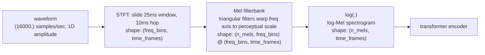
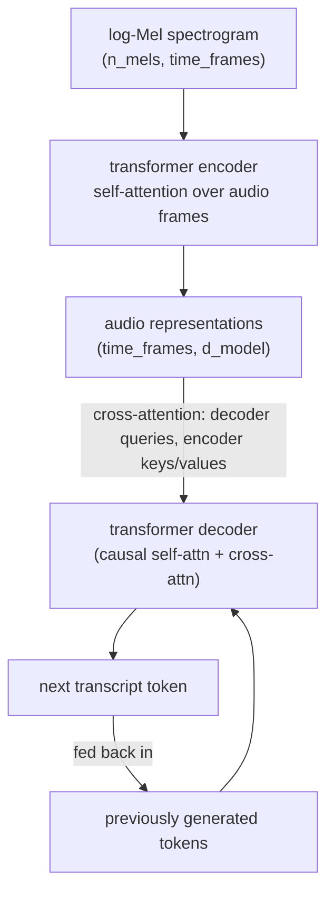

# Day 3 — Audio AI: Speech Recognition and Synthesis

Text arrives at a model as discrete tokens — a clean, finite vocabulary. Audio arrives as a continuous physical signal: air pressure sampled thousands of times a second, with no natural "unit" the way a word or subword is a unit. Before a transformer can do anything useful with speech, that continuous signal has to be turned into something with the right shape and the right information density — not too raw (a transformer over 16,000 raw numbers per second of audio is both wasteful and hard to learn from), not too lossy (compress away the wrong things and the model can't recover what was said). Today: the specific transformation that solves this, and the two directions audio AI runs once it's solved.

## From waveform to spectrogram

A raw audio file is a 1D array of amplitude samples over time — at a 16kHz sample rate (standard for speech), one second of audio is 16,000 floating-point numbers. That representation buries frequency information (which pitches, which harmonics, which phonetic structure) inside a long, hard-to-parse time series. The **Short-Time Fourier Transform (STFT)** fixes this by sliding a short window across the waveform — typically 25ms, moved forward 10ms at a time, so consecutive windows overlap — and, at each window position, decomposing that slice into its frequency components via a Fourier transform. The result is a 2D **spectrogram**: time along one axis, frequency along the other, and intensity (how much energy is at that frequency, at that moment) as the value.

Human hearing doesn't perceive frequency linearly — we're far more sensitive to a 100Hz difference around 200Hz than the same 100Hz difference around 8000Hz. The **log-Mel spectrogram** applies two corrections on top of the raw STFT: it warps the frequency axis onto the **Mel scale** (a scale constructed to match perceptual pitch sensitivity, roughly logarithmic above ~1000Hz), and it takes the log of the intensity values (matching how loudness is perceived — also roughly logarithmic). This log-Mel representation, not the raw waveform and not the raw STFT, is the standard input to essentially every modern speech model, ASR included.



### Building one from scratch (verified)

Every step above is implementable without any audio-specific library — worth doing once, to see that a "spectrogram" is just a Fourier transform applied in overlapping windows, plus a fixed, hand-computable reweighting matrix:

```python
import numpy as np
from scipy.signal import stft

np.random.seed(42)  # fixes the noise term below so the printed output is reproducible
sample_rate = 16000  # Hz -- the standard ASR input rate, including Whisper's
duration_s = 1.0
t = np.linspace(0, duration_s, int(sample_rate * duration_s), endpoint=False)  # shape: (16000,)

# Synthetic "voice-like" signal: a fundamental + two harmonics (like a sung vowel),
# amplitude-modulated to fake a speech-like on/off envelope, plus a little noise.
f0 = 150  # Hz, a plausible pitch
signal = (1.0 * np.sin(2*np.pi*f0*t) + 0.5*np.sin(2*np.pi*2*f0*t) + 0.3*np.sin(2*np.pi*3*f0*t))
envelope = 0.5 * (1 + np.sin(2*np.pi*2*t - np.pi/2))
signal = signal * envelope + 0.02 * np.random.randn(len(t))   # shape: (16000,) float64

# --- STFT: 25ms window, 10ms hop ---
win_length = int(0.025 * sample_rate)   # 400 samples
hop_length = int(0.010 * sample_rate)   # 160 samples
freqs, frame_times, Zxx = stft(signal, fs=sample_rate, nperseg=win_length, noverlap=win_length - hop_length)
magnitude = np.abs(Zxx)   # shape: (201, 101) -> (freq_bins, time_frames); 201 = win_length//2 + 1

# --- Mel filterbank, built from the standard formulas (no librosa needed) ---
def hz_to_mel(f): return 2595 * np.log10(1 + f / 700)
def mel_to_hz(m): return 700 * (10 ** (m / 2595) - 1)

n_mels = 40
n_fft_bins = magnitude.shape[0]
mel_points = np.linspace(hz_to_mel(0), hz_to_mel(sample_rate / 2), n_mels + 2)  # n_mels+2 boundaries
bin_points = np.floor((n_fft_bins - 1) * 2 * mel_to_hz(mel_points) / sample_rate).astype(int)

filterbank = np.zeros((n_mels, n_fft_bins))   # shape: (40, 201)
for m in range(1, n_mels + 1):
    left, center, right = bin_points[m-1], bin_points[m], bin_points[m+1]
    for k in range(left, center):
        if center != left:
            filterbank[m-1, k] = (k - left) / (center - left)     # rising edge of triangle
    for k in range(center, right):
        if right != center:
            filterbank[m-1, k] = (right - k) / (right - center)   # falling edge of triangle

with np.errstate(all="ignore"):                      # benign BLAS warning on some platforms for zero-heavy matmuls
    mel_spec = filterbank @ magnitude                 # shape: (40, 201) @ (201, 101) -> (40, 101)
log_mel_spec = np.log(mel_spec + 1e-6)                # shape: (40, 101) -- final model input
```

Verified real output:

```
waveform shape: (16000,) dtype: float64
STFT magnitude shape: (201, 101)  -> (freq_bins, time_frames)
log-mel spectrogram shape: (40, 101)  -> (n_mels, time_frames)
value range: -8.06 to -0.58
```

One second of audio (16,000 raw numbers) becomes a `(40, 101)` array — 40 perceptually-scaled frequency bands across 101 time steps, 10ms apart. That's the actual object a speech transformer's encoder consumes; everything downstream operates on this grid, never on the raw samples.

## Two directions

- **ASR / STT (Automatic Speech Recognition / Speech-to-Text)** — audio in, text out. Compress a long, noisy, continuous signal down to its linguistic content.
- **TTS (Text-to-Speech)** — text in, audio out. Expand compact, discrete meaning back out into a long, natural, continuous signal.

They're inverse problems, and outside of some fully unified multimodal models, they mostly use different architectures for a structural reason: ASR is a many-to-few compression (thousands of audio frames -> a few dozen words), while TTS is a few-to-many expansion (a few dozen words -> thousands of audio samples) — the harder engineering problem in each direction is different (respectively: robustness to noise/accent/jargon, and avoiding the flat, unnatural prosody that comes from generating audio with no sense of the utterance's overall structure).

## Inside an encoder-decoder ASR model

A model like Whisper processes the log-Mel spectrogram through a transformer **encoder**, producing a sequence of audio representations — the same self-attention mechanism from Day 1, just applied over spectrogram time-frames instead of text tokens. A transformer **decoder** then generates the transcript token by token, using **cross-attention** at every decoding step to look back at the encoder's full audio representation and decide which part of the audio is relevant to the word it's about to write.



This mirrors text-to-image cross-attention: same mechanism (queries from one modality attending over keys/values from another), different pair of modalities being bridged.

## A realistic failure mode, and a cheap mitigation

Whisper is trained on a broad, general corpus — it hasn't specifically overfit to any one team's product vocabulary. A common, reproducible failure: domain-specific jargon or proper nouns get transcribed as the nearest phonetically similar common word or phrase, because "the nearest common word" is what the decoder's language-model prior favors when the audio is even slightly ambiguous. "We shipped the Kubernetes ingress patch" coming back as "we shipped the cooper Nettie's ingress patch" is exactly this: "Kubernetes" is rare in the training distribution relative to phonetically-similar filler, so the decoder's prior wins the tiebreak.

The real, current Whisper API, and the mitigation:

```python
import whisper

model = whisper.load_model("base")
result = model.transcribe("standup_notes.wav")
print(result["text"])
```

An **initial prompt** — a short piece of context text passed alongside the audio — biases decoding toward expected vocabulary by conditioning the decoder on that text before it starts generating the transcript:

```python
result = model.transcribe(
    "standup_notes.wav",
    initial_prompt="Kubernetes, ingress, staging, deployment pipeline",
)
```

(Not executed in this environment — Whisper's model weights are a multi-hundred-MB download and inference needs meaningfully more compute than is practical here. The API shown matches the current `openai-whisper` package signature; the STFT/log-Mel pipeline above, which is the actual preprocessing Whisper performs internally, was verified running end to end.)

It doesn't guarantee correctness — the prior is biased, not overridden — but it meaningfully shifts the odds toward the right token whenever the audio itself is ambiguous enough that either word is acoustically plausible. For a fixed, known vocabulary (product names, internal jargon, people's names), it's a close-to-free accuracy win with no retraining.

## TTS fallback pattern

Not every project needs a neural TTS model. Both major OSes ship a built-in synthesizer accessible without any extra dependency — worth using as a zero-setup fallback, or for prototyping a pipeline's structure before reaching for a higher-quality neural voice:

```python
import pyttsx3

engine = pyttsx3.init()
engine.say("Your build finished successfully.")
engine.runAndWait()
```

This produces noticeably more robotic, less natural prosody than a modern neural TTS model (which typically also predicts a spectrogram from text, then reconstructs a waveform from that spectrogram with a separate **vocoder** network — the mirror image of the ASR pipeline above). But keeping the OS-level engine as an explicit fallback means a notification or alerting pipeline never has a hard runtime dependency on a neural model being available, licensed, or reachable.

## Common pitfalls

- **Feeding raw waveforms directly into a transformer.** Without the spectrogram step, the model is looking at a signal whose relevant structure (pitch, formants, phonemes) is smeared across a much longer, much noisier sequence than it needs to be — every practical speech model operates on a spectrogram-family representation, not raw samples.
- **Ignoring sample rate mismatches.** A model trained on 16kHz audio fed 44.1kHz or 8kHz input without resampling will silently misinterpret the frequency content — the mismatch doesn't throw an error, it just produces bad transcriptions or bad synthesis with no obvious cause.
- **Trusting ASR output verbatim for anything jargon-heavy** (medical, legal, technical domains) without a vocabulary hint or a post-processing correction pass — the phonetic-nearest-neighbor failure mode above is systematic, not rare, in exactly these domains.
- **Assuming TTS naturalness is purely a model-quality problem.** Prosody (pacing, emphasis, intonation) depends heavily on having enough surrounding text context to plan an utterance's shape — synthesizing very short, isolated fragments one at a time tends to sound flatter than synthesizing a full sentence or paragraph at once, independent of model quality.

**Takeaway:** speech models operate on log-Mel spectrograms, not raw waveforms, because that representation concentrates the perceptually and linguistically relevant structure into a shape a transformer can actually learn from; ASR and TTS are inverse compression problems that mostly warrant different architectures; and cheap, no-retraining tricks like an initial-prompt hint can meaningfully reduce a real, systematic class of transcription errors.
