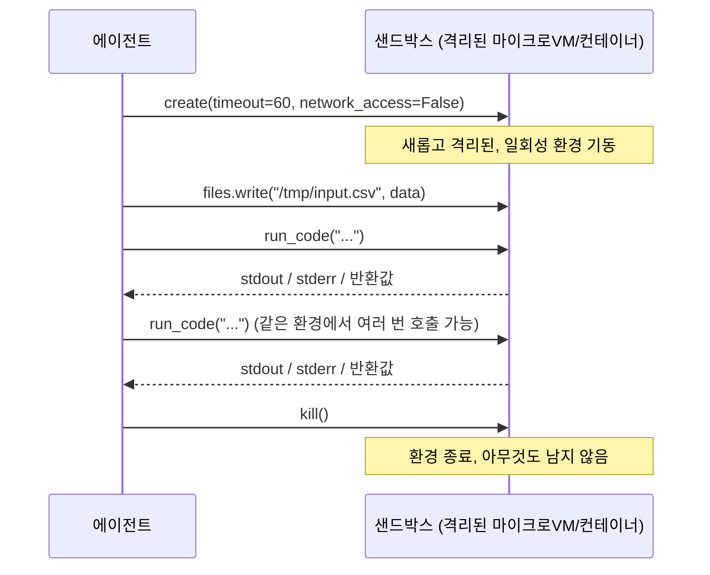
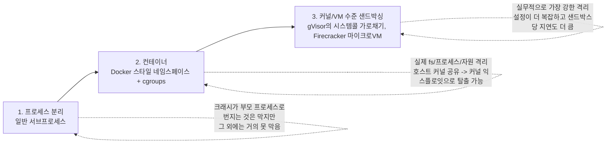

# Day 4 — 코드 실행 에이전트 샌드박싱

미리 승인된 고정 함수 집합만 호출할 수 있는 도구 사용 에이전트는 추론하기 쉽습니다: 그 에이전트가 취할 수 있는 모든 가능한 행동을 사람이 미리 검토했기 때문입니다. 반면 임의의 코드를 작성하고 실행할 수 있는 에이전트는 질적으로 더 강력합니다 — 아무도 미리 특정 도구를 만들어두지 않은 문제도 풀 수 있습니다 — 그리고 질적으로 더 위험하기도 합니다. "임의의 코드"는 더 작고 안전한 버전의 도구 호출이 아니기 때문입니다. 이는 에이전트가 자신이 실행되고 있는 프로세스가 할 수 있는 일이라면 무엇이든 할 수 있다는 뜻입니다: 그 프로세스가 읽을 수 있는 어떤 파일이든 읽고, 그 프로세스가 열 수 있는 어떤 소켓이든 열고, 그 프로세스가 소모할 수 있는 어떤 자원이든 소모할 수 있습니다. 이 글의 나머지는 "코드가 괜찮아 보인다"는 것과 "코드를 실행해도 안전하다"는 것 사이의 구체적인 간극, 그리고 실제로 그 간극을 메워주는 것이 무엇인지에 관한 이야기입니다.

## 고정 도구만으로는 충분하지 않은 이유, 그리고 경계 없이 벌어지는 일

`search_database(query)`, `send_email(to, body)` 같은 고정 함수 도구는 그 작성자가 명시적으로 구현한 것만 정확히 할 수 있습니다. `run_python(code)` 같은 코드 실행 도구는 Python이 할 수 있는 무엇이든 할 수 있는데, 이것이 바로 개방형 작업(데이터 정리, 일회성 계산, 파일 형식 변환)에 이 도구가 유용한 이유이자, 동시에 고정 도구는 구조적으로 만들어낼 수 없는 실패 양상을 만들어낼 수 있는 이유이기도 합니다:

- **파괴적인 파일 조작** — 생성된 스크립트가 잘못된 경로를 향한 `shutil.rmtree(...)`를 실행하거나, 예상치 못한 작업 디렉터리에서 상대 경로가 풀리면서 실제 프로젝트 파일을 삭제하는 경우.
- **폭주하는 자원 소비** — 미묘하게 잘못된 반복문 조건(절대 종료되지 않는 off-by-one 오류, 기저 조건이 빠진 재귀 함수)이 CPU 코어 하나 혹은 전부를 무한정 붙잡아 두는 경우.
- **원치 않는 네트워크 외부 통신** — 생성된 코드가 조용히 HTTP 요청을 보내거나, 예상치 못한 무언가를 다운로드하거나, 읽기 권한이 있던 데이터를 엉뚱한 곳으로 전송하는 경우.

이 중 어느 것도 모델이 악의적이어야 하거나, 심지어 추론 과정이 의미 있게 "틀려야" 하는 것도 아닙니다 — 생성된 코드의 그럴듯해 보이는 버그 하나면 충분합니다. 사람이 작성한 코드의 버그 하나로도 충분한 것과 마찬가지입니다. 해결책은 "코드를 더 꼼꼼히 검토하기"가 아닙니다(코드를 반복해서 생성하고 무인으로 실행하는 에이전트 루프에는 구조적으로 그 루프 안에 사람이 없습니다) — 진짜 해결책은, 버그나 예상치 못한 행동이 정말로 중요한 어떤 것에도 닿을 수 없는 곳에서 코드를 실행하는 것입니다.

## 호스팅형 샌드박스의 요청/응답 구조

대부분의 호스팅형 코드 실행 샌드박스 제품은 비슷한 생명주기와 API 형태로 수렴합니다:



```python
sandbox = Sandbox.create(timeout=60, network_access=False)

result = sandbox.run_code("print(sum(range(100)))")

sandbox.files.write("/tmp/input.csv", csv_bytes)
sandbox.commands.run("pip install pandas")

sandbox.kill()
```

정확한 메서드 이름은 제공업체마다 다르지만 구조는 거의 보편적입니다: `create`는 격리된, 일회성 환경을 기동합니다 — 흔히 마이크로VM(자체 경량 커널과 가상화된 하드웨어를 가지며, 단순히 네임스페이스로 분리된 프로세스가 아닙니다)이거나 전용 단일 테넌트 컨테이너입니다. `run_code` / `commands.run`은 그 환경 내부에서 실행되고 stdout/stderr/결과를 다시 스트리밍하며, 호스트 프로세스를 직접 건드리지 않습니다. `files` 인터페이스는 샌드박스 안의 코드가 호스트 파일시스템을 직접 뒤지는 대신, 데이터를 명시적으로 안팎으로 옮깁니다. 명시적인 네트워크 토글은 외부로 나갈 정당한 이유가 없는 것에 대해 모든 외부 통신을 비활성화할 수 있게 해줍니다. `kill`은 환경 전체를 허물어버려서, 설치된 패키지든 작성된 파일이든 폭주하는 백그라운드 프로세스든 그 무엇도 다음 호출로 넘어가지 않습니다. "에이전트 프로세스"와 "샌드박스" 사이의 이 요청/응답 경계가 실제 보안 경계입니다. 이 글의 나머지는 그 경계를 만드는 이야기이거나, 명백히 그 경계가 *아닌* 것에 관한 이야기입니다.

## 로컬 DIY 근사 — 그리고 그것이 정확히 어디서 멈추는가

호스팅형 샌드박스를 쓸 수 없거나 아직 통합할 만큼 가치가 없을 때, 표준 라이브러리 몇 조각을 조합한 대략적인 로컬 근사가 있습니다. 이 머신에서 실제로 실행해 검증했습니다:

```python
import resource
import subprocess

def limit_cpu():
    # preexec_fn은 자식 프로세스에서, fork() 이후 exec() 이전에 실행됨 -- 이 제한은
    # 서브프로세스에만 적용되며, 에이전트 부모 프로세스 자체에는 절대 적용되지 않음.
    resource.setrlimit(resource.RLIMIT_CPU, (2, 2))  # 2 CPU초, (soft, hard)

# 정상적으로 동작하는 코드: 정상적으로 실행되고 반환됨
r1 = subprocess.run(["python3", "-c", "print(sum(range(1000)))"],
                     timeout=10, preexec_fn=limit_cpu, capture_output=True, text=True)
# r1.returncode == 0, r1.stdout == '499500\n'

# CPU를 붙잡아 먹는 무한 루프
r2 = subprocess.run(["python3", "-c", "while True: pass"],
                     timeout=10, preexec_fn=limit_cpu, capture_output=True, text=True)
# r2.returncode == -24  (SIGXCPU, 시그널 24로 종료됨) 약 2.0초 후 -- 10초짜리 timeout보다 훨씬 먼저
```

실제 검증된 출력: 정상 케이스는 반환 코드 `0`과 stdout `499500`을 냈고, 무한 루프는 **2.01초** 후 반환 코드 **-24**(`SIGXCPU`)로 종료됐습니다 — 외부의 `timeout=10`이 발동하기 훨씬 전에, OS 자체가 CPU초 제한을 초과한 프로세스를 종료한 것입니다. 이 부분은 플랫폼에 관계없이 실제로 잘 동작하며, 버그가 있는 생성된 루프의 폭주하는 CPU 사용에 대한 1차 방어선으로 가질 만한 가치가 있습니다.

깔끔하게 동작하지 않는 것: `RLIMIT_AS`(주소 공간)로 메모리도 함께 제한하는, 똑같이 흔한 패턴입니다:

```python
resource.setrlimit(resource.RLIMIT_AS, (256 * 1024 * 1024,) * 2)  # 의도: 256MB로 제한
```

이 머신(macOS)에서 검증된 결과: 이 호출은 `ValueError: current limit exceeds maximum limit`로 아예 실패합니다 — `RLIMIT_AS` 적용은 플랫폼마다 일관되지 않고, 특히 macOS는 Linux처럼 프로세스가 이 값을 낮추도록 허용하지 않습니다. 이 제한이 어디서나 조용히 적용된다고 가정한 코드는 실제로는 적용되지 않는 일부 플랫폼에서 그 사실을 조용히 모르고 지나갑니다. 이는 아예 시도하지 않은 것보다 더 나쁩니다. 보호받고 있는 것처럼 보이지만 실제로는 보호받고 있지 않기 때문입니다.

또 하나 흔한 패턴은 생성된 코드를 제한된 `exec()` 안에서 실행하는 것입니다 — 실행 전에 globals 딕셔너리에서 `open`, `__import__`, `eval` 같은 위험한 이름을 제거하는 방식입니다. **이것도 실제 보안 경계가 아닙니다.** 제한된 빌트인 `exec()` 샌드박스는 순수 Python만으로 탈출할 수 있다는 오래되고 잘 알려진 역사를 가지고 있습니다 — 객체 introspection을 통해(`().__class__.__bases__` 방식으로 여전히 "제거된" 것들을 노출하는 베이스 클래스까지 거슬러 올라가는 식으로) 제거된 이름을 직접 호출하지 않고도 임의 코드 실행에 도달할 수 있습니다. 이는 워낙 잘 알려진 우회 유형이라, "제한된 `exec()`"는 "더 약한 샌드박스"가 아니라 "샌드박스가 아님"으로 읽는 게 맞습니다.

종합하면: `subprocess.run(timeout=...)`에 `RLIMIT_CPU`를 더한 것은 *우발적인* CPU 폭주에 대한 실제로 검증된 진짜 방지턱입니다. 하지만 파일시스템 격리는 **전혀** 없고, 네트워크 격리도 **전혀** 없으며, 메모리 격리는 신뢰할 수 없고, 이를 특별히 탈출하려는 코드에 대한 방어는 아예 없습니다. 신뢰하는 코드의 버그에 대한 저렴한 방어로 쓰되, 신뢰하지 않는 코드를 둘러싼 경계로는 절대 쓰지 마세요.

## 프롬프트 수준 제약이 통제 수단이 아닌 이유

솔깃한 지름길 하나: 실제 격리 대신(혹은 그에 더해), 시스템 프롬프트에서 모델에게 파괴적이거나 위험한 코드를 작성하지 말라고 지시하는 것 — "`/workspace` 밖의 파일은 절대 삭제하지 마", "절대 네트워크 요청을 하지 마" 같은 식입니다. 부드러운 가이드로는 해볼 만합니다(*일반적인* 경우를 더 안전한 코드 쪽으로 기울여줍니다). 하지만 이것은 보안 통제 수단이 아니며, 여기에는 구조적인 이유가 있습니다: 시스템 프롬프트는 모델이 *무엇을 생성할 가능성이 높은지*를 제약할 뿐, 일단 실행된 생성 코드가 *무엇을 할 수 있는지*를 제약하지 못합니다. 모델의 출력은 스스로의 실수에 대해 적대적으로도 견고하지 않으며, 모델이 코드를 작성하는 동시에 그 코드가 무엇을 하도록 허용되는지를 강제하는 유일한 존재이기도 한 에이전트 아키텍처에는 독립적인 강제 계층이 전혀 없습니다 — 애초에 추론 오류를 낸 바로 그 모델이, 그 오류를 잡아낼지 말지도 "결정"하고 있는 셈입니다. 위에서 설명한 실제 통제 수단들은 하나같이 실행 경계(샌드박스 프로세스, 컨테이너 런타임, 하이퍼바이저)에서 강제되며, 생성된 코드가 무엇을 담고 있든 이 계층은 말로 구슬려서 우회할 수 없습니다.

## 실무 체크리스트

실제로 프로덕션에 도달하는 코드 실행 도구라면, 아래 각 항목은 독립적으로 갖출 가치가 있으며 서로 다른 항목을 대체하지 않습니다:

- **기본적으로 일회성(ephemeral)** — 실행마다(혹은 짧은 세션마다) 새 환경을 쓰고 이후 폐기해서, 이전 실행이 한 일이 다음 실행으로 넘어가지 않게 합니다.
- **명시적이고 환경 수준에서 강제되는 네트워크 정책** — 기본적으로 외부 통신을 거부하고, 필요한 목적지만 샌드박스/네트워크 계층에서 허용 목록에 올립니다. 내부 코드가 스스로 결정하게 두지 않습니다.
- **읽기 전용이거나 범위가 제한된 파일시스템 접근** — 샌드박스는 필요한 특정 파일만 보게 하고(공유 마운트가 아니라 `files` 인터페이스 방식으로), 호스트의 다른 어떤 것도 원리적으로도 접근할 수 없게 합니다.
- **샌드박스 프로세스 바깥에서 강제되는 자원 할당량** — CPU, 메모리, 디스크, 벽시계 시간 제한은 오케스트레이션 계층(컨테이너 런타임, 하이퍼바이저)이 설정하며, 내부에서 실행되는 코드가 협조적으로 요청하는 방식이어서는 안 됩니다.
- **실제로 실행된 것에 대한 감사 로그** — 실행된 모든 코드 문자열과 그 결과를 샌드박스 바깥에 기록해서, 그 결과를 만들어낸 환경이 이미 사라진 뒤에도 나쁜 결과를 사후에 디버깅할 수 있게 합니다.

## 격리 스펙트럼

대략, 가장 약한 것부터 가장 강한 것 순서로:



1. **프로세스 분리**(일반 서브프로세스, `resource` 제한 포함 여부와 무관) — 크래시와, 약하게나마 CPU/메모리를 격리하지만 호스트의 파일시스템과 네트워크 네임스페이스를 완전히 공유합니다. 보안 관점에서는 격리가 아닙니다.
2. **컨테이너**(Docker 스타일 Linux 네임스페이스 + cgroups) — 실제 파일시스템, 프로세스 트리, 자원 격리를 제공합니다. 컨테이너는 파일시스템과 프로세스 목록에 대해 자기만의 뷰를 가집니다. 간극은: 컨테이너가 호스트 커널을 공유한다는 것이며, 그래서 커널 수준 취약점은 여전히 컨테이너 경계를 탈출할 수 있습니다. *대체로 신뢰할 수 있는* 코드끼리, 그리고 우발적인 손상으로부터 서로를 격리하는 데는 충분하지만, 진짜로 신뢰할 수 없는 코드에 대해서는 가장 강한 경계가 아닙니다.
3. **커널 수준 / VM 샌드박싱**(gVisor 스타일 시스템콜 가로채기, 또는 Firecracker 같은 진짜 경량 마이크로VM) — 이 용도로 실무적으로 얻을 수 있는 가장 강한 격리입니다. 유저스페이스에서 시스템콜을 가로채 재구현하거나(gVisor), 샌드박스 코드를 자기만의 커널을 가진 실제로 분리된 최소한의 가상머신에서 실행하는 방식(Firecracker, AWS Lambda 격리를 뒷받침하는 기술)입니다. 컨테이너보다 설정이 더 복잡하고 대개 샌드박스 인스턴스당 지연도 더 큽니다.

어느 계층이 맞는지는 에이전트가 무엇을 하도록 허용되고 무엇에 닿을 수 있는지의 함수이지, 고정된 기본값이 아닙니다: 자신이 이미 배타적으로 소유한 파일만 네트워크 접근 없이 변환하는 에이전트는, 공유 인프라나 자격 증명, 다른 테넌트의 데이터로 가는 경로가 조금이라도 있는 에이전트와는 질적으로 다른 위험입니다. 그리고 후자의 경우가 바로 "그냥 컨테이너 쓰면 되지"가 더 이상 충분한 답이 되지 않는 지점입니다.

## 흔한 함정

- **`subprocess.run`의 `timeout=`을 보안 통제 수단으로 취급하는 것.** 이는 벽시계 시간만 제한할 뿐, 프로세스가 실행되는 동안 파일시스템이나 네트워크로 무엇을 했는지에 대해서는 아무것도 하지 못합니다.
- **컨테이너가 진짜로 신뢰할 수 없는, 적대적인 코드에도 충분하다고 가정하는 것.** 컨테이너는 우발적인 버그와 대체로 신뢰할 수 있는 워크로드 간의 상호 격리에는 실제 격리이지만, 커널을 공유하기 때문에 "신뢰할 수 없음"이 "적극적으로 탈출을 시도할 수도 있음"을 뜻하게 되는 순간 올바른 계층이 아닙니다.
- **`network_access=False`가 에이전트 자신의 코드가 아니라 샌드박스 자체에 의해 강제되어야 한다는 점을 잊는 것.** 샌드박스 안의 코드가 네트워크 호출을 할지 말지를 스스로 선택할 수 있다면 그건 네트워크 경계가 아닙니다 — 진짜 경계는 내부 코드가 무엇을 시도하든 상관없이 환경 수준에서 외부 통신을 막습니다.
- **환경을 명시적으로 종료하지 않는 것.** 사용 후 명시적으로 kill되지 않은 샌드박스는 백그라운드 프로세스, 열린 포트, 디스크 사용량 등이 새어나갈 수 있습니다 — 특히 한 세션 안에서 짧게 사는 샌드박스를 여러 개 만드는 에이전트 루프에서는 더욱 그렇습니다.

**핵심 정리:** 코드 실행 능력은 고정 도구 호출과 질적으로 다른 위험입니다. "임의의 코드"가 할 수 있는 일의 범위에는 경계가 없기 때문입니다. 로컬 `subprocess` + `RLIMIT_CPU` 샌드박스는 우발적인 버그에 대해 실제로 검증된 진짜 방지턱이지만 — 보안 경계는 아니며, 짝을 이루는 메모리 제한은 플랫폼을 넘나들며 신뢰성 있게 강제되지도 않습니다. 신뢰할 수 없는 코드나 실제로 위험 부담이 큰 상황에 대해서는, 진짜 경계는 컨테이너, 더 나아가 커널/VM 수준의 격리이며 여기에 명시적이고 환경 차원에서 강제되는 네트워크 정책이 더해져야 합니다.
