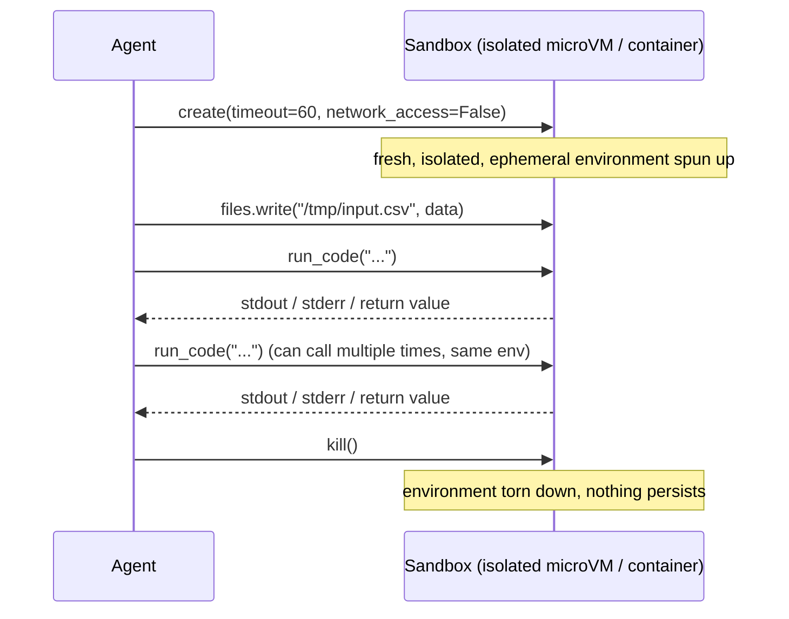
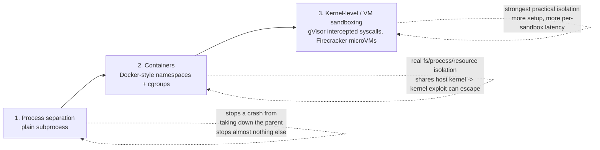

# Day 4 — Sandboxing Code-Execution Agents

A tool-calling agent restricted to a fixed, pre-approved set of functions is easy to reason about: every possible action it can take was reviewed by a human before the agent ever ran. An agent that can write and execute arbitrary code is categorically more capable — it can solve problems nobody anticipated a specific tool for — and categorically more dangerous, because "arbitrary code" is not a smaller, safer version of a tool call. It means the agent can do anything the process it runs in is permitted to do: read any file that process can read, open any socket that process can open, consume any resource that process can consume. The rest of this note is about the specific gap between "the code looks fine" and "the code is safe to run," and what actually closes that gap.

## Why fixed tools aren't enough, and what goes wrong without a boundary

A fixed-function tool — `search_database(query)`, `send_email(to, body)` — can only do exactly what its author explicitly implemented. A code-execution tool — `run_python(code)` — can do anything Python can do, which is what makes it valuable for open-ended tasks (data wrangling, one-off calculations, file format conversions) and exactly what makes it able to produce failure modes a fixed tool structurally cannot:

- **Destructive file operations** — a generated script with `shutil.rmtree(...)` pointed at the wrong path, or a relative path resolved from an unexpected working directory, deleting real project files.
- **Runaway resource consumption** — a subtly wrong loop condition (an off-by-one that never terminates, a recursive function missing its base case) pinning a CPU core, or all of them, indefinitely.
- **Unwanted network egress** — generated code silently making an HTTP request, downloading something unexpected, or sending data it had read access to somewhere it shouldn't go.

None of these require the model to be malicious, or even meaningfully "wrong" in its reasoning — a single plausible-looking bug in generated code is sufficient for any of them, the same way a bug in human-written code is sufficient. The fix is not "review the code more carefully" (an agent loop generating and running code repeatedly, unattended, doesn't have a human in that loop by construction) — it's running the code somewhere a bug or an unexpected action genuinely cannot reach anything that matters.

## The request/response shape of a hosted sandbox

Most hosted code-execution sandbox products converge on a similar lifecycle and API shape:



```python
sandbox = Sandbox.create(timeout=60, network_access=False)

result = sandbox.run_code("print(sum(range(100)))")

sandbox.files.write("/tmp/input.csv", csv_bytes)
sandbox.commands.run("pip install pandas")

sandbox.kill()
```

Exact method names vary by provider, but the shape is close to universal: `create` spins up an isolated, ephemeral environment — often a microVM (its own lightweight kernel and virtualized hardware, not just a namespaced process) or a dedicated, single-tenant container; `run_code` / `commands.run` execute inside that environment and stream back stdout/stderr/results, never touching the host process directly; a `files` interface moves data in and out explicitly, rather than the sandboxed code reaching for the host filesystem; an explicit network toggle lets you disable all egress for anything that has no legitimate reason to call out; and `kill` tears the whole environment down, so nothing — installed packages, written files, a runaway background process — persists to the next call. The request/response boundary between "agent process" and "sandbox" is the actual security boundary; everything else in this note is either building that boundary or is explicitly *not* that boundary.

## A local, DIY approximation — and exactly where it stops

When a hosted sandbox isn't available or isn't worth the integration cost yet, a rough local approximation combines a couple of standard-library pieces. Verified running on this machine:

```python
import resource
import subprocess

def limit_cpu():
    # preexec_fn runs in the child, after fork() and before exec() -- the limit
    # applies only to the subprocess, never to the parent agent process itself.
    resource.setrlimit(resource.RLIMIT_CPU, (2, 2))  # 2 CPU-seconds, (soft, hard)

# well-behaved code: runs and returns normally
r1 = subprocess.run(["python3", "-c", "print(sum(range(1000)))"],
                     timeout=10, preexec_fn=limit_cpu, capture_output=True, text=True)
# r1.returncode == 0, r1.stdout == '499500\n'

# a CPU-bound infinite loop
r2 = subprocess.run(["python3", "-c", "while True: pass"],
                     timeout=10, preexec_fn=limit_cpu, capture_output=True, text=True)
# r2.returncode == -24  (killed by SIGXCPU, signal 24) after ~2.0s -- well before the 10s timeout
```

Verified real output: the well-behaved case returns `0` with stdout `499500`; the infinite loop is killed after **2.01 seconds** with return code **-24** (`SIGXCPU`) — the OS itself terminates the process once it exceeds the CPU-second limit, well before the outer `timeout=10` would have fired. That part genuinely works, cross-platform, and is worth having as a first line of defense against runaway CPU usage from a buggy generated loop.

What doesn't work as cleanly: the equally common pattern of also capping memory with `RLIMIT_AS` (address space):

```python
resource.setrlimit(resource.RLIMIT_AS, (256 * 1024 * 1024,) * 2)  # intended: cap at 256MB
```

Verified on this machine (macOS): this call fails outright with `ValueError: current limit exceeds maximum limit` — `RLIMIT_AS` enforcement is platform-inconsistent, and macOS in particular does not let a process lower it the way Linux does. Code that assumes this limit silently applies everywhere will silently *not* be capping memory on some platforms it runs on, which is worse than not attempting it, because it looks protected without being protected.

A second common pattern is running generated code inside a restricted `exec()` — stripping dangerous names like `open`, `__import__`, or `eval` out of the globals dict before executing. **This is not a real security boundary either.** Restricted-builtins `exec()` sandboxes have a long, well-documented history of being escapable using nothing but pure Python — reaching arbitrary code execution through object introspection (`().__class__.__bases__`-style traversal back to base classes that still expose what was "removed"), without ever calling a stripped name directly. It's a well-known enough class of bypass that "restricted `exec()`" should be read as "not a sandbox" rather than "a weaker sandbox."

Put together: `subprocess.run(timeout=...)` plus `RLIMIT_CPU` is a real, verified speed bump against *accidental* runaway CPU usage. It provides **zero** filesystem isolation, **zero** network isolation, unreliable memory isolation, and no defense at all against code specifically trying to escape it. Use it as a cheap guard against bugs in trusted code, never as a boundary around code you don't trust.

## The isolation spectrum

Roughly, from weakest to strongest real isolation:



1. **Process separation** (a plain subprocess, with or without `resource` limits) — isolates crashes and, weakly, CPU/memory, but shares the host's filesystem and network namespace entirely. Not isolation from a security standpoint.
2. **Containers** (Docker-style Linux namespaces + cgroups) — real filesystem, process-tree, and resource isolation; a container has its own view of the filesystem and process list. The gap: containers share the host kernel, so a kernel-level vulnerability can still escape the container boundary. Adequate for isolating *mostly-trusted* code from each other and from accidental damage; not the strongest available boundary for genuinely untrusted code.
3. **Kernel-level / VM sandboxing** (gVisor-style syscall interception, or a real lightweight microVM like Firecracker) — the strongest practical isolation available for this use case, either by intercepting and reimplementing syscalls in userspace (gVisor) or by running the sandboxed code in an actual separate, minimal virtual machine with its own kernel (Firecracker, the technology behind AWS Lambda's isolation). Costs more setup complexity and typically more latency per sandbox instance than a container.

The right layer is a function of what the agent is allowed to do and what it can reach, not a fixed default: an agent that only transforms files it already exclusively owns, with no network access, is a materially different risk than one with any path to shared infrastructure, credentials, or another tenant's data — and the second case is where "just use a container" stops being an adequate answer.

## Why prompt-level restriction isn't a control

A tempting shortcut: instead of (or in addition to) real isolation, instruct the model in its system prompt not to write destructive or dangerous code — "never delete files outside `/workspace`," "never make network requests." This is worth doing as a soft guide (it shifts the *typical* case toward safer code), but it is not a security control, for a structural reason: a system prompt constrains what the model is *likely* to generate, not what the generated code is *capable* of once it runs. Model output is not adversarially robust against its own mistakes, and an agent architecture where the model both writes the code and is the only thing enforcing what that code is allowed to do has no independent enforcement layer at all — the same model that made the original reasoning error is also the one "deciding" whether to catch it. Every real control described above enforces at the execution boundary (the sandbox process, the container runtime, the hypervisor), a layer the generated code cannot talk its way around regardless of what it contains.

## A practical checklist

For a code-execution tool actually reaching production, each of these is independently worth having, and none substitutes for another:

- **Ephemeral by default** — a fresh environment per execution (or per short session), destroyed afterward, so nothing a previous run did persists into the next one.
- **Explicit, environment-enforced network policy** — default-deny egress, with any needed destination allowlisted at the sandbox/network layer, not decided by the code inside.
- **Read-only or scoped filesystem access** — the sandbox sees only the specific files it needs (via the `files` interface pattern, not a shared mount), and nothing else on the host is reachable even in principle.
- **Resource quotas enforced outside the sandboxed process** — CPU, memory, disk, and wall-clock limits set by the orchestrating layer (container runtime, hypervisor), not requested cooperatively by the code running inside.
- **Audit logging of what actually ran** — every code string executed and its result, logged outside the sandbox, so a bad outcome is debuggable after the fact even though the environment that produced it is already gone.

## Common pitfalls

- **Treating `timeout=` on `subprocess.run` as a security control.** It bounds wall-clock time only — it does nothing about what the process did with the filesystem or network in the time it *was* running.
- **Assuming a container is sufficient for genuinely untrusted, adversarial code.** Containers are real isolation for accidental bugs and mutual isolation between mostly-trusted workloads; they share a kernel, so they are not the right layer once "untrusted" means "might be actively trying to escape."
- **Forgetting that `network_access=False` needs to be enforced by the sandbox itself, not by the agent's own code.** If the sandboxed code can choose whether to make a network call, that's not a network boundary — a real one blocks egress at the environment level regardless of what the code inside tries to do.
- **Not tearing environments down.** A sandbox that isn't explicitly killed after use can leak — background processes, open ports, disk usage — especially under agent loops that create many short-lived sandboxes in a session.

**Takeaway:** code-execution capability is a qualitatively different risk than fixed tool calls, because "arbitrary code" has no bounded set of things it might do; a local `subprocess` + `RLIMIT_CPU` sandbox is a verified, real speed bump against accidental bugs — not a security boundary, and its sibling memory limit isn't even reliably enforced cross-platform; for anything touching untrusted code or real stakes, the actual boundary is container or, better, kernel/VM-level isolation with an explicit, environment-enforced network policy.
