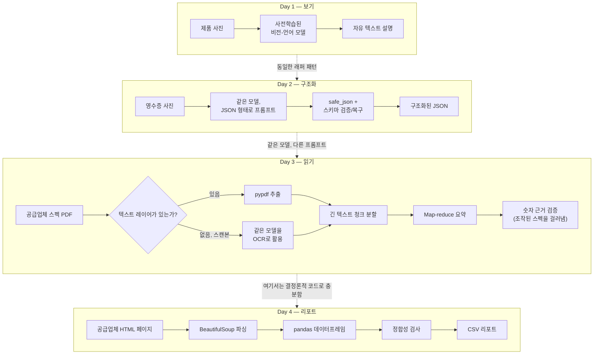

# Week 3 — 멀티모달 문서 & 이미지 AI

오늘날 "AI 비전" 작업의 대부분은 모델을 학습시키는 일이 아니라, 사전학습된 멀티모달 모델을 올바르게 호출하고, 그 출력을 기본적으로 의심하며, 애초에 모델이 필요 없는 문제라면 결정론적인 일반 코드로 되돌아가는 판단력의 문제입니다. 이번 주는 사진, 영수증, PDF, HTML 테이블이라는 네 가지 서로 다른 입력 유형을 통해 이 판단 과정을 다룹니다.

이번 주 전체를 관통하는 시나리오는 작은 철물점이 백오피스 업무를 자동화하는 상황입니다. 제품 사진에 태그를 달고, 영수증을 읽고, 공급업체 스펙시트를 요약하고, 공급업체 웹페이지를 가격 리포트로 바꿉니다. 각 Day는 앞선 Day의 결과를 이어받지만, 각각 독립적으로도 읽을 수 있습니다 — Day 1을 읽지 않고 Day 4만 읽어도 무방합니다.

| Day | 주제 | 노트 |
|---|---|---|
| Day 1 | [학습 없이 보기: 사전학습된 멀티모달 모델](daily/Day1_multimodal-vision-intro.md) | CNN이 층을 쌓아가며 "보는 법"을 만드는 과정, 직접 분류기를 학습시킬 때의 실제 비용, 대부분의 가게에 사전학습된 비전-언어 모델이 더 나은 이유, mock-first 래퍼 패턴 |
| Day 2 | [사진을 구조화된 JSON으로](daily/Day2_image-to-structured-json.md) | JSON 형태를 명시하는 프롬프트 작성, `safe_json()` 방어적 파싱, 스키마 검증 및 복구, 최신 대안인 structured outputs, 객체 탐지와 의미 기반 추출의 차이, PII 마스킹 |
| Day 3 | [PDF를 읽고 지어내지 않고 요약하기](daily/Day3_pdf-parsing-and-summarization.md) | `pypdf` 텍스트 추출, PDF가 사실은 "텍스트 문서"가 아닌 이유, 스캔 PDF 대응 폴백, 청크 단위 map-reduce 요약, 환각을 막는 숫자 근거 검증 |
| Day 4 | [웹 페이지를 CSV 리포트로 바꾸기](daily/Day4_html-table-parsing-and-reporting.md) | BeautifulSoup 파싱, 테이블 행을 데이터프레임으로, 스크래핑 에티켓(`robots.txt`, 요청 속도 조절), 배치 오류 처리, 결과물 검증 |

## 4일치 내용이 서로 이어지는 방식

이번 주를 관통하는 하나의 질문이 매일 반복됩니다. **이 단계에 모델이 필요한가, 아니면 결정론적 코드로 충분한가?** Day 1~3의 답은 "모델이 필요하지만, 신중하게 감싸서 써야 한다"이고, Day 4의 답은 "아니다 — 여기서 모델을 쓰면 파이프라인이 더 느려지고, 비용이 더 들고, 신뢰성은 더 떨어질 뿐 얻는 것이 없다"입니다.

Day 1과 Day 2는 동일한 모델 호출을 사용하며, 달라지는 것은 프롬프트뿐입니다(설명 vs. 스키마 기반 추출). Day 3은 `pypdf`가 처리하지 못하는 유일한 경우(스캔된 페이지)에 대한 폴백 OCR 도구로 같은 모델을 그대로 재사용하지만, Day 3의 대부분은 일단 글자가 페이지에서 텍스트로 추출되고 나면 순수한 텍스트 처리에 가깝습니다. Day 4는 모델을 전혀 쓰지 않습니다 — HTML 테이블은 이미 구조화된 데이터이므로, 여기서 필요한 것은 "이해"가 아니라 "파싱"입니다.

매일 반복되는 두 번째 패턴도 있습니다. **모델의 출력을 그대로 신뢰하지 않는다.** `safe_json()`과 스키마 검증(Day 2), 숫자 근거 검증(Day 3), 데이터프레임 정합성 검사(Day 4)는 모두 같은 아이디어를 서로 다른 실패 유형에 적용한 것입니다 — 스스로의 실수를 조용히 그대로 내보내는 대신 파이프라인이 직접 잡아내도록 만드는 것입니다.

## 노트북

4일치 내용을 모두 담은 실행 가능한 노트북 1개는 [`concepts/3rd_week_Concepts.ipynb`](concepts/3rd_week_Concepts.ipynb)를 참고하세요. 두 번째 예시 시나리오(중고 서점)를 함께 다루며, 각 예제는 독립적으로 실행되고 주석이 상세히 달려 있습니다. 네트워크 호출이나 API 키가 필요 없는 모든 코드 셀은 실제로 실행하여 출력을 검증했으며, 이 환경에서 실행할 수 없는 유일한 셀 유형(실시간 멀티모달 API 호출)은 노트북 상단의 안내와 함께 명확히 표시되어 있습니다.
