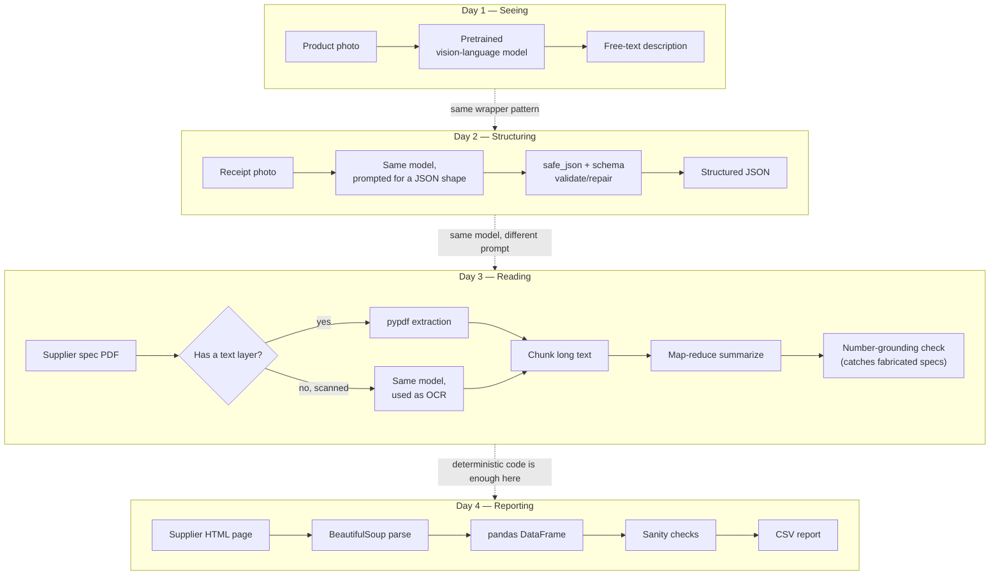

# Week 3 — Multimodal Document & Image AI

Most real-world "AI vision" work today is not model training — it's calling a
pretrained multimodal model correctly, distrusting its output by default, and
falling back to plain deterministic code whenever the problem doesn't
actually need a model at all. This week works through that judgment call
across four different input types: photos, receipts, PDFs, and HTML tables.

The running scenario is a small hardware store automating its back office:
tagging product photos, reading receipts, summarizing supplier spec sheets,
and turning supplier web pages into price reports. Each day picks up where
the last left off, but each also stands alone — you can read Day 4 without
having read Day 1.

| Day | Topic | Notes |
|---|---|---|
| Day 1 | [Seeing without training: pretrained multimodal models](daily/Day1_multimodal-vision-intro.md) | How a CNN builds up "seeing" in layers, the real cost of training your own classifier, why a pretrained vision-language model wins for most stores, the mock-first wrapper pattern |
| Day 2 | [From photo to structured JSON](daily/Day2_image-to-structured-json.md) | Prompting for a JSON shape, `safe_json()` defensive parsing, schema validation + repair, structured outputs as the modern alternative, object detection vs. semantic extraction, PII masking |
| Day 3 | [Reading PDFs and summarizing without making things up](daily/Day3_pdf-parsing-and-summarization.md) | `pypdf` text extraction, why PDFs aren't really "text documents," the scanned-PDF fallback, chunked map-reduce summarization, a number-grounding check against hallucination |
| Day 4 | [Turning a web page into a CSV report](daily/Day4_html-table-parsing-and-reporting.md) | BeautifulSoup parsing, table rows to a dataframe, scraping etiquette (`robots.txt`, rate limiting), batch error handling, sanity-checking the output |

## How the four days connect

The throughline is a single question asked four times: **does this step need
a model, or does it need deterministic code?** Days 1–3 answer "a model,
carefully wrapped." Day 4 answers "no — and reaching for one would make the
pipeline slower, costlier, and less reliable for no benefit."

Day 1 and Day 2 use the same underlying model call — the only thing that
changes is the prompt (describe vs. extract-to-schema). Day 3 reuses that
exact model as a fallback OCR tool for the one case `pypdf` can't handle
(scanned pages), but the bulk of Day 3 is plain text processing once the
words are on the page. Day 4 uses no model at all: HTML tables are already
structured, so the job is parsing, not understanding.

Every day also repeats a second pattern: **never trust model output blindly.**
`safe_json()` and schema validation (Day 2), the number-grounding check (Day
3), and dataframe sanity checks (Day 4) are all the same idea applied to
different failure modes — a pipeline that catches its own mistakes instead of
silently shipping them.

## Notebook

See [`concepts/3rd_week_Concepts.ipynb`](concepts/3rd_week_Concepts.ipynb) for
a single runnable notebook covering all four days with a second worked
scenario (a used bookstore) and self-contained, heavily commented examples.
Every code cell that doesn't require a network call or an API key has been
executed and its output verified; the one cell type that can't run in this
environment (a live multimodal API call) is clearly marked, with a note at
the top of the notebook explaining why.
