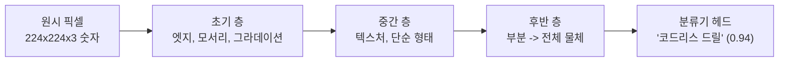
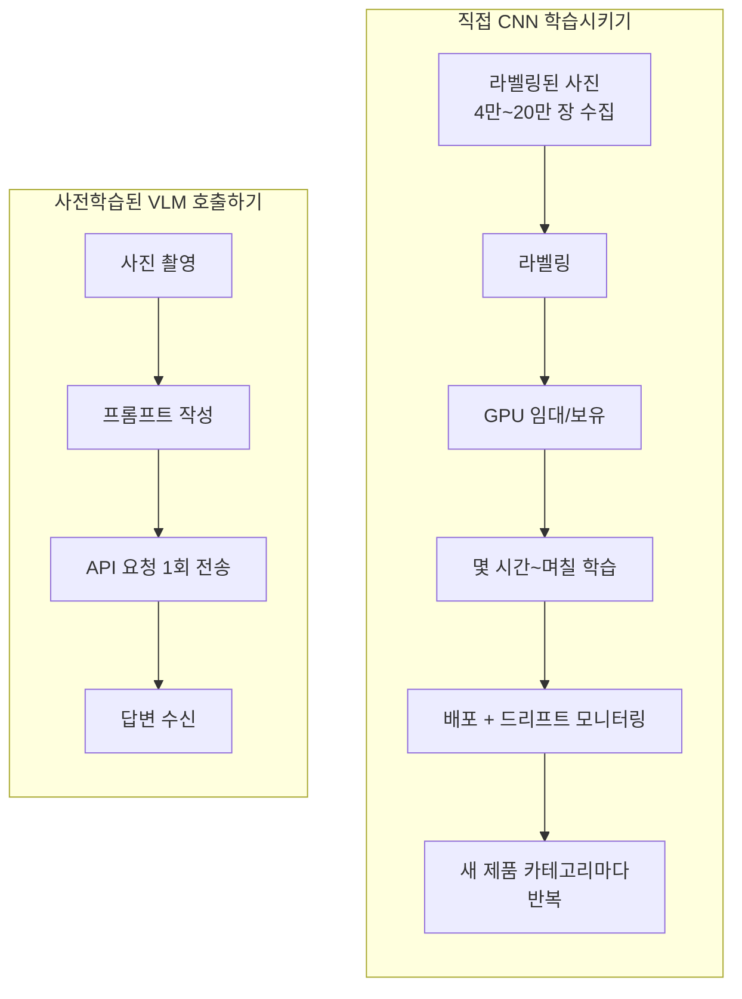

# Day 1 — 학습 없이 보기: 사전학습된 멀티모달 모델

**이번 주 시나리오:** 작은 철물점이 백오피스 업무 일부를 자동화하려 합니다 — 제품 사진에 태그를 달고, 영수증을 읽고, 스펙시트를 요약하고, 공급업체 웹페이지를 가격 리포트로 바꾸는 일입니다. Day 1은 사진에서 시작합니다. 창고 직원이 입고된 물품 사진을 찍으면, 시스템이 그것이 무엇인지 파악해야 합니다.

## "보는 것"이 생각보다 어려운 이유

사진은 그저 숫자들의 격자입니다 — 224×224 크기의 평범한 컬러 이미지라도 224 × 224 × 3 = 150,528개의 개별 픽셀 값(각 0~255)으로 이루어져 있습니다. "이것이 코드리스 드릴이라는 것을 인식한다"는 것은 이 150,528개의 숫자에서 *드릴*이라는 단 하나의 단어로 넘어가는 일이며, 둘을 연결하는 명시적인 규칙은 어디에도 없습니다. 같은 드릴을 5초 간격으로, 각도나 조명을 살짝 다르게 해서 찍은 두 장의 사진은 픽셀 값이 거의 완전히 다르지만, 사람은(그리고 좋은 모델은) 즉시 같은 물체라고 판단합니다. 원시 픽셀과 의미 사이의 이 간극이 바로 실제 문제이며, 이 노트의 나머지 내용은 그 간극을 직접 학습 없이 메우는 방법에 관한 것입니다.

## CNN이 이미지를 "보는" 방식 (개념적으로)

직접 구현할 필요는 없지만, 유용한 직관을 쌓아둘 가치는 있습니다. 합성곱 신경망(CNN)은 이 간극을 층을 쌓아가며 점진적으로 메웁니다. 각 층은 바로 앞 층의 출력을 입력으로 받습니다.

1. **초기 층**은 작은 필터(예: 3×3 또는 5×5 픽셀 윈도우)를 이미지 전체에 적용하며 엣지, 모서리, 색상 그라데이션에 반응합니다 — "여기 밝음에서 어두움으로 급격히 전환되는 지점이 있다" 정도의 정보입니다.
2. **중간 층**은 이 엣지 반응들을 결합해 텍스처와 단순한 형태를 만듭니다. 곡선 엣지와 일정한 색상이 결합하면 "둥근 금속 표면"이 되고, 반복되는 엣지 격자는 "메시 패턴"이 됩니다.
3. **후반 층**은 형태들을 조립해 부분, 그다음 전체 물체를 만듭니다. "원통형 형태, 방아쇠 모양 돌출부, 회전하는 팁이 함께 있는 이 덩어리는 전동 드릴이다"라는 식입니다.



각 층의 출력이 다음 층으로 흘러가기 때문에, 네트워크는 드릴을 드릴로 직접 "보는" 것이 아니라 수십 겹의 필터를 거치며 근거를 축적합니다. 얼굴을 알아보기 전에 친구의 실루엣부터 알아보는 것과 비슷합니다. 이런 작업에 쓰이는 실제 네트워크(ResNet이나 EfficientNet 계열)는 수천만 개의 조정 가능한 숫자(파라미터)를 가지고 있습니다 — 흔히 기준선으로 쓰이는 ResNet-50은 약 2,500만 개입니다 — 이 숫자들이 학습 과정에서 조정되면서, 축적된 근거가 결국 올바른 레이블을 가리키도록 만들어집니다.

## 왜 직접 학습시키면 안 될까?

"전동 드릴", "나사 박스", "페인트 통"을 인식하도록 CNN을 처음부터 학습시키는 일은 주말에 끝낼 수 있는 프로젝트가 아닙니다. 구체적으로, 약 200개의 SKU(재고 관리 단위 — 개별 제품 종류)를 취급하는 가게라면 다음과 같은 규모가 필요합니다.

| 필요 요소 | 대략적인 수치 |
|---|---|
| 필요한 라벨링된 이미지 | 카테고리당 200~1,000장 → 총 40,000~200,000장 |
| 라벨링 비용 (외주 시, 장당 약 $0.10~$0.50) | $4,000~$100,000 |
| 컴퓨팅 자원 | 학습 1회당 몇 시간~며칠 걸리는 GPU(임대 또는 보유) |
| 반복 비용 | 새 제품 카테고리가 하나 늘 때마다 데이터 수집·라벨링·재학습이 필요 |
| 유지보수 | 제품군이 조금씩 바뀌면서 모델 품질이 소리 없이 저하되고, 정확도가 떨어질 때까지 아무도 눈치채지 못함 |

작은 가게 입장에서 이런 비용 구조는 절대 회수되지 않습니다. 이미 훨씬 더 큰 규모에서 해결된 문제를, 굳이 전용 비전 시스템을 새로 만들어 풀려는 셈입니다.

## 사전학습된 멀티모달 모델이라는 대안

**대안:** 사전학습된 멀티모달 비전-언어 모델(VLM)은 이미 웹 전역에서 수집된 방대한 이미지-텍스트 데이터로 학습되어 있습니다 — 수억에서 수십억 개의 이미지/캡션 쌍입니다. 이 학습 과정에서 모델은 드릴 사진과 "드릴"이라는 단어가 서로 가까이 위치하는 공유된 표현 공간을 익혔고, 이는 명시적으로 별도 클래스로 외우라고 지시받은 적 없는 수백만 가지의 다른 시각적 개념에도 마찬가지로 적용됩니다. 바로 이것이 *제로샷* 인식을 가능하게 만드는 원리입니다 — 모델은 학습된 200개의 고정된 카테고리 목록과 매칭하는 것이 아니라, 훨씬 풍부한 공간에서 추론하고 있으며, 그 공간은 철물점 누군가가 코드리스 드릴에 라벨을 달아준 적이 있든 없든 이미 "코드리스 드릴"이라는 개념을 포함하고 있습니다.

실무적으로 이는 이미지(바이트 또는 URL)와 텍스트 프롬프트를 함께 보내면 모델이 답을 돌려준다는 뜻입니다 — 학습 단계도, 라벨링된 데이터셋도, 자체 GPU 예산도 필요 없습니다. 비전 시스템을 *만드는* 대신 *호출*하는 것입니다.



| | 직접 CNN 학습 | 사전학습된 멀티모달 모델 호출 |
|---|---|---|
| 필요한 데이터 | 수천 장의 라벨링된 이미지 | 없음(많아야 예시 몇 개) |
| 준비 시간 | 며칠~몇 주 | API 호출 1회 |
| 비용 구조 | 선불: 라벨링 인건비 + GPU 시간 | 지속: 요청당 추론 비용 |
| 유연성 | 학습된 카테고리에 고정 | 예상하지 못한 것까지 이미지에 대해 무엇이든 물어볼 수 있음 |
| 새 제품 카테고리 | 데이터 수집, 재라벨링, 재학습 | 아무것도 바뀌지 않음 — 같은 프롬프트가 그대로 작동 |

이 거래가 공짜는 아닙니다. 요청량이 많아지면 요청당 비용이 쌓이고, 지연 시간은 로컬 순전파 대신 네트워크 왕복이 되며, 다른 누군가의 모델과 API 가동률에 의존하게 됩니다. 매주 수백 장의 제품 사진을 처리하는 철물점이라면 이 거래는 명백히 이득입니다. 하지만 컨베이어 벨트 위에서 초당 50개 품목을 실시간으로 불량 검사해야 하는 공장 라인이라면 이야기가 다를 수 있습니다 — 이런 경우에는 로컬에서 돌아가는, 목적에 맞게 작게 학습된 모델이 여전히 옳은 선택일 수 있습니다. 여기서 얻어야 할 교훈은 "절대 모델을 학습시키지 말라"가 아니라, "만들기 전에 이 문제가 정말로 모델을 필요로 하는지부터 확인하라"입니다.

## mock-first 래퍼 패턴

실제 API 호출은 비용이 들고 네트워크 접근이 필요하므로, 둘 다 사용할 수 없을 때 정해진 응답으로 대체되는 얇은 래퍼를 만들어두는 것이 좋습니다. 그러면 파이프라인의 나머지 부분 — Day 2의 JSON 추출, 각종 테스트, 로컬 개발 — 을 매번 네트워크를 거치지 않고도 작성하고 실행해볼 수 있습니다.

```python
import os

def describe_product_photo(image_path: str, api_key: str | None = None) -> str:
    """제품 사진에 대한 짧은 설명을 반환한다.

    API 키/네트워크가 없을 때는 정해진(deterministic) 응답으로 대체되므로,
    이후 단계(Day 2의 JSON 추출, 테스트, CI)를 매번 네트워크를 거치거나
    추론 비용을 지불하지 않고도 작성하고 실행해볼 수 있다.
    """
    # -> str | None: 명시적으로 전달된 키를 우선하고, 없으면 환경 변수를 확인
    api_key = api_key or os.getenv("VISION_API_KEY")
    if not api_key:
        # -> str, 고정된 리터럴 — 반복 호출해도 바이트 단위로 동일한 값을
        # 반환하며, 이는 결정론적인 테스트와 데모에서 중요하다
        return "[mock] A cordless power drill, viewed from the side, on a white background."

    # 실제 호출은 여기에 들어간다: 이미지 파일을 읽어 base64로 인코딩하고,
    # 텍스트 프롬프트와 함께 하나의 vision 지원 요청으로 전송한다.
    # 정확한 최신 요청 형태(이미지 콘텐츠 블록 + 텍스트 콘텐츠 블록을
    # 하나의 user 메시지에 담는 방식)는 Day 2를 참고.
    response = call_multimodal_api(image_path, prompt="Describe this product photo.", api_key=api_key)
    return response.text  # -> str, 모델의 자유 텍스트 답변
```

검증됨: API 키가 설정되지 않은 상태에서 `describe_product_photo("drill.jpg")`를 두 번 호출하면 두 번 모두 동일한 문자열이 반환됩니다 — 이 함수를 독립적으로 실행하고 `r1 == r2`를 assert하여 확인했습니다. 이 결정론적 동작이야말로 mock 분기의 핵심입니다. 네트워크를 전혀 거치지 않고도 "내 파이프라인 로직이 깨졌는가"라는 질문에 답할 수 있게 해줍니다.

이 "mock-first" 습관 — 먼저 인터페이스와 가짜 구현을 작성하고, 나중에 실제 호출로 교체하는 것 — 은 개발 흐름을 끊기지 않게 하고 테스트를 결정론적으로 만들어줍니다. 또한 돈을 써가며 함수 설계가 잘못됐다는 사실을 뒤늦게 깨닫기 전에, 함수의 *계약*(무엇이 들어가고 무엇이 나오는지)을 미리 확정하도록 강제합니다.

## 흔한 함정

- **VLM의 답변을 그대로 정답으로 취급하기.** 이런 모델들은 틀렸을 때조차 유창하고 자신감 있게 답합니다 — 흐릿하게 찍힌 육각렌치 사진이 정답과 똑같은 확신에 찬 어조로 드라이버라고 설명될 수 있습니다. Day 1의 자유 텍스트 설명은 자동으로 검증할 방법이 전혀 없으며, 바로 그래서 Day 2에서는 검증 *가능한* 구조화된 출력으로 넘어갑니다.
- **위치 정보가 없음.** VLM은 사진에 드릴이 *있다*는 것은 알려줄 수 있지만, *어디에* 있는지는 알려주지 못합니다 — 바운딩 박스도, 픽셀 좌표도 없습니다. 선반 위 물품 6개를 세거나 특정 결함의 위치를 찾아야 한다면 이 도구는 적합하지 않습니다(Day 2의 객체 탐지 관련 설명 참고).
- **프롬프트 민감성.** "이 사진을 설명해줘"와 "이건 무슨 제품이야?"는 같은 이미지에 대해 의미 있게 다른 답을 낼 수 있습니다. 작은 프롬프트 변경도 함수 로직을 바꿀 때만큼 신중해야 합니다.
- **규모가 커질 때의 비용과 지연.** 요청 1건은 저렴하고 빠르지만, 하루 1만 건이 되면 실제 비용 항목이자 실제 지연 예산이 됩니다. 가능한 부분은 배치로 처리하고, 다시 처리할 일 없는 이미지의 결과는 캐시해두세요.
- **보내면 안 되는 데이터를 보내기.** 제품 사진은 대개 제3자 API로 보내도 괜찮습니다. 하지만 우연히 고객의 얼굴, 자동차 번호판, 개인정보가 담긴 문서가 함께 찍힌 사진은 그렇지 않습니다 — 이 문제는 사진이 영수증이 되는 Day 2에서 핵심 주제가 됩니다.

## 정리

오늘날 대부분의 실무 이미지 작업에서는 CNN을 처음부터 학습시키는 것보다 사전학습된 멀티모달 모델을 호출하는 편이 낫습니다 — 데이터 수집과 학습 파이프라인을, 잘 다듬은 프롬프트 하나와 맞바꾸는 셈이며, 그 대가로 선불 비용 대신 요청당 비용을 지불하게 됩니다. 무언가를 만들기 전에, 이 거래에서 자신이 어느 쪽에 서 있는지부터 파악하세요.
