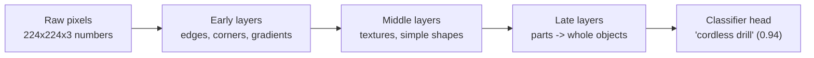
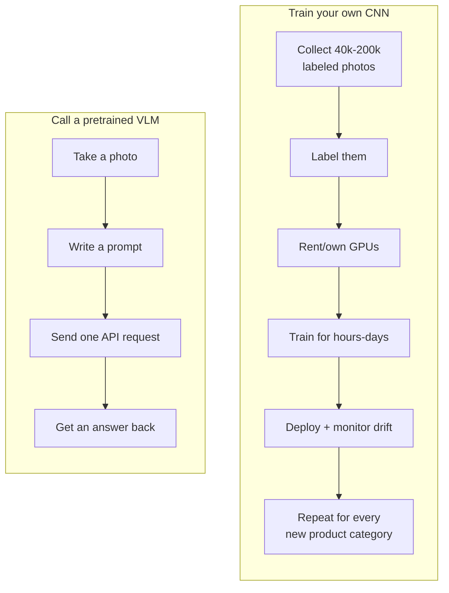

# Day 1 — Seeing Without Training: Pretrained Multimodal Models

**Scenario for the week:** a small hardware store wants to automate parts of
its back office — tagging product photos, reading receipts, summarizing spec
sheets, and turning supplier web pages into price reports. Day 1 starts with
the photos: a stockroom worker snaps a picture of an incoming item, and the
system needs to figure out what it's looking at.

## Why "seeing" is a harder problem than it sounds

A photo is just a grid of numbers — for a modest 224×224 color image, that's
224 × 224 × 3 = 150,528 individual pixel values, each 0–255. "Recognize that
this is a cordless drill" means going from those 150,528 numbers to the
single word *drill*, with no explicit rule connecting the two. Two photos of
the same drill taken five seconds apart, at a slightly different angle or
under different light, produce almost entirely different pixel values — yet
a human (and a good model) calls them the same object instantly. That gap
between raw pixels and semantic meaning is the actual problem; everything
else in this note is about how to close it without doing the work yourself.

## How a CNN "sees" an image (conceptually)

You don't need to implement one to build useful intuition. A convolutional
neural network (CNN) closes that gap gradually, in layers, each one looking
at the output of the layer before it:

1. **Early layers** apply small filters (say, 3×3 or 5×5 pixel windows)
   across the image and respond to edges, corners, and color gradients —
   nothing more than "there's a sharp light-to-dark transition here."
2. **Middle layers** combine those edge responses into textures and simple
   shapes: a curved edge plus a consistent color becomes "a rounded metal
   surface"; a repeating grid of edges becomes "a mesh pattern."
3. **Late layers** assemble shapes into parts, then whole objects: "this
   cluster of a cylindrical shape, a trigger-shaped protrusion, and a
   rotating tip is a power drill."



Each layer's output feeds the next, so the network never "sees" a drill as a
drill directly — it accumulates evidence across dozens of stacked filters,
the way you might recognize a friend's silhouette before you can make out
their face. A real network for this kind of task (something in the ResNet or
EfficientNet family) has tens of millions of tunable numbers (parameters) —
ResNet-50, a common baseline, has about 25 million — that get adjusted during
training until the accumulated evidence reliably points to the right label.

## Why not just train one?

Training a CNN from scratch to recognize "power drill," "box of screws," and
"paint can" is not a weekend project. Concretely, for a store carrying maybe
200 distinct SKUs (stock keeping units — individual product types):

| Requirement | Rough figure |
|---|---|
| Labeled images needed | 200–1,000 photos *per category* → 40,000–200,000 total |
| Labeling cost (if outsourced, ~$0.10–$0.50/image) | $4,000–$100,000 |
| Compute | A GPU, rented or owned, for hours to days per training run |
| Iteration cost | Every new product category means collecting and labeling more data, then retraining |
| Maintenance | Model quality silently degrades as the product catalog drifts — nobody notices until accuracy drops |

For a small store, that cost structure never pays for itself. You'd be
building a specialized vision system to solve a problem that a general one
has already solved, at a scale you can't match.

## The pretrained multimodal alternative

**The alternative:** a pretrained multimodal vision-language model (VLM) has
already been trained on enormous amounts of image-and-text data scraped from
across the web — hundreds of millions to billions of image/caption pairs.
During that training, it learned a shared representation space where a photo
of a drill and the word "drill" end up close together, along with millions
of other visual concepts it was never explicitly told to memorize as
separate classes. That's what makes *zero-shot* recognition work: the model
isn't matching against a fixed list of 200 trained categories, it's
reasoning in a much richer space that happens to cover "cordless drill"
whether or not anyone at the hardware store ever labeled one.

Practically, this means you send the image (as bytes or a URL) plus a text
prompt, and the model returns an answer — no training step, no labeled
dataset, no GPU budget of your own. Instead of *building* a vision system,
you *call* one.



| | Train your own CNN | Call a pretrained multimodal model |
|---|---|---|
| Data needed | Thousands of labeled images | Zero (a handful of examples at most) |
| Setup time | Days to weeks | One API call |
| Cost structure | Upfront: labeling labor + GPU hours | Ongoing: per-request inference cost |
| Flexibility | Fixed to the categories you trained | Ask it anything about the image, including things you didn't anticipate |
| New product category | Collect data, relabel, retrain | Nothing changes — same prompt works |

The trade isn't free: per-request cost adds up at high volume, latency is a
network round trip instead of a local forward pass, and you're depending on
someone else's model and API uptime. For a hardware store processing a few
hundred product photos a week, that trade is obviously worth it. For a
factory floor doing real-time defect detection on a conveyor belt at 50
items/second, it might not be — that's a case where a small, purpose-trained
model running locally could still be the right call. The lesson isn't "never
train a model," it's "check whether the problem actually requires one before
you commit to building it."

## A mock-first wrapper pattern

Because a real API call costs money and needs network access, it's worth
building a thin wrapper around it that falls back to a canned response when
neither is available. That lets the rest of the pipeline — Day 2's JSON
extraction, any tests, local development — be written and exercised without
hitting the network on every run.

```python
import os

def describe_product_photo(image_path: str, api_key: str | None = None) -> str:
    """Return a short description of a product photo.

    Falls back to a deterministic canned response when no API key/network
    is available, so downstream code (Day 2's JSON extraction, tests, CI)
    can be written and exercised without hitting the network or paying
    for inference on every run.
    """
    # -> str | None: prefer an explicitly-passed key, else check the environment
    api_key = api_key or os.getenv("VISION_API_KEY")
    if not api_key:
        # -> str, a fixed literal — repeated calls return byte-identical
        # output, which matters for deterministic tests and demos
        return "[mock] A cordless power drill, viewed from the side, on a white background."

    # Real call would go here: read the image file, base64-encode it, and
    # send it alongside a text prompt in a single vision-capable request.
    # See Day 2 for the exact current request shape (image content block +
    # text content block in one user message).
    response = call_multimodal_api(image_path, prompt="Describe this product photo.", api_key=api_key)
    return response.text  # -> str, the model's free-text answer
```

Verified: calling `describe_product_photo("drill.jpg")` twice with no API key
set returns the identical string both times — confirmed by running this
function in isolation and asserting `r1 == r2`. That determinism is the
whole point of the mock branch: it turns "did my pipeline logic break" into
a question you can answer without ever touching the network.

This "mock-first" habit — write the interface and a fake implementation
first, swap in the real call later — keeps development moving and makes
tests deterministic. It also forces you to nail down the function's
*contract* (what type goes in, what type comes out) before you've spent any
money finding out the hard way that you designed it wrong.

## Common pitfalls

- **Treating a VLM's answer as ground truth.** These models are fluent and
  confident even when wrong — a blurry photo of a hex wrench can get
  described as a screwdriver with the same tone of certainty as a correct
  answer. Nothing about Day 1's free-text description is checkable
  automatically; that's exactly why Day 2 moves to structured output you
  *can* validate.
- **No localization.** A VLM can tell you *that* there's a drill in the
  photo, but not *where* — no bounding box, no pixel coordinates. If you
  need to count six items on a shelf or find a specific defect's location,
  this is the wrong tool (see Day 2's note on object detection).
- **Prompt sensitivity.** "Describe this photo" and "What product is this?"
  can produce meaningfully different answers on the same image. Small
  prompt changes deserve the same care as changing a function's logic.
- **Cost and latency at scale.** One request is cheap and fast; ten
  thousand requests a day is a real line item and a real latency budget.
  Batch what you can, and cache results for images you'll never re-process.
- **Sending data you shouldn't.** Product photos are usually fine to send to
  a third-party API. Photos that incidentally capture a customer's face, a
  license plate, or a document with personal information are not — this
  becomes central on Day 2, when the photos are receipts.

## Takeaway

For most real-world image tasks today, reaching for a pretrained multimodal
model beats training a CNN from scratch — you trade a data-collection and
training pipeline for a single well-crafted prompt, at the cost of paying
per request instead of paying upfront. Know which side of that trade you're
on before you start building.
