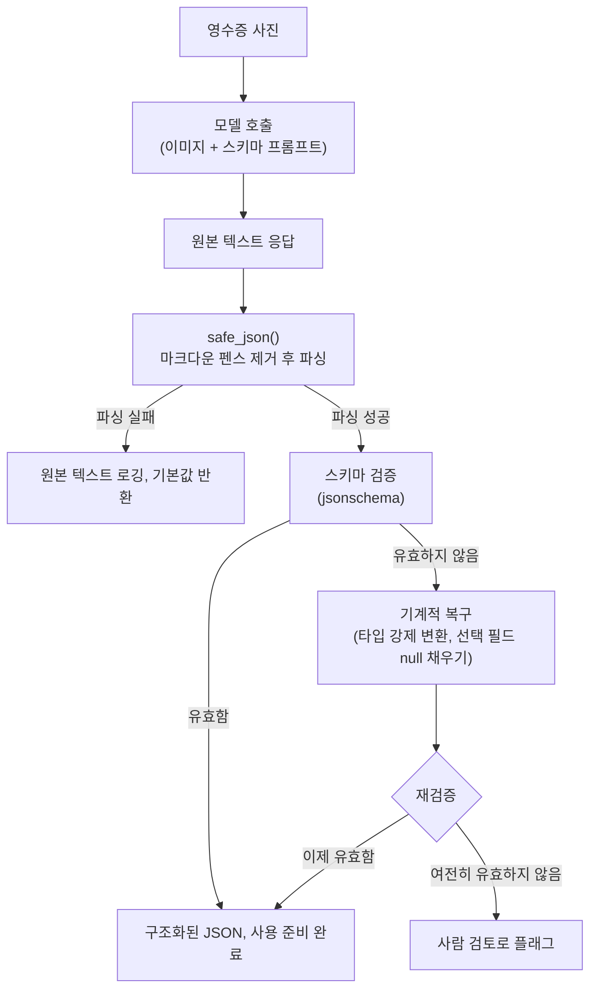

# Day 2 — 사진을 구조화된 JSON으로

어제는 멀티모달 모델에게 사진을 자유 텍스트로 *설명*해달라고 요청했습니다. 오늘 할 일은 다릅니다: 영수증 사진을 프로그램이 실제로 사용할 수 있는 데이터로 바꾸는 것입니다 — 총액, 날짜, 항목 목록이 데이터베이스에 삽입되고, 재고와 대조되며, 문제가 생기지 않는 한 다시는 사람이 들여다보지 않게 됩니다.

## 이 작업이 보기보다 어려운 이유

비전-언어 모델도 근본적으로는 다음 토큰을 예측하는 모델일 뿐입니다. 이 구조 자체는 유효한 JSON을 *보장하지* 않습니다 — 모델이 여는 중괄호를 닫지 않거나, 마지막에 쉼표를 하나 더 붙이거나, "네, 추출한 데이터는 다음과 같습니다:"라는 문장으로 전체를 감쌀 가능성은 얼마든지 있습니다. 게다가 영수증은 시각적으로 지저분합니다. 기울어진 사진, 색이 바랜 감열지 인쇄, 손으로 쓴 총액, 지역마다 다른 통화 기호, 그리고 가장 어려운 부분인 — 페이지 위 어떤 숫자가 총액*인지*에 대한 진짜 의미론적 모호성입니다. 영수증에는 흔히 소계, 세금, 팁, 총액이 모두 비슷한 형식의 숫자로 나란히 표시되어 있고, 오직 맥락(라벨, 위치, 산술 관계)만이 이를 구별해줍니다. 이는 OCR 엔진이 할 수 없지만 언어 모델은 할 수 있는 판단의 영역입니다.

## 자유 텍스트 vs. 구조화된 출력

"이 영수증에 뭐가 있어?"라고 물으면 문단 하나를 얻습니다. 사람에게는 괜찮지만 데이터베이스에는 쓸모가 없습니다. 대신 원하는 형태를 명시해서 JSON을 요청하세요.

```python
PROMPT = """
Extract the following fields from this receipt image and return ONLY JSON,
no commentary:

{
  "store_name": string,
  "purchase_date": string or null,
  "line_items": [{"name": string, "price": number}],
  "total": number
}

If a field is not visible or not present, use null rather than guessing.
"""
```

필드 이름을 나열하는 것 외에 중요한 세부사항이 두 가지 있습니다. *타입*(문자열 vs. 숫자)을 명시하면 모델이 파싱 가능한 결과를 반환할 확률이 눈에 띄게 올라갑니다. 그리고 "추측하지 말고 null을 사용하라"는 지시는, 실제로 읽을 수 없는 필드에 대해 그럴듯해 보이는 값을 지어내는 실패 유형을 직접 겨냥합니다 — 커피 얼룩에 가려진 상점 이름은 그럴듯하게 지어내기 쉬운 대표적인 예입니다.

## 파이프라인: 프롬프트, 파싱, 검증, 복구



이 다이어그램의 화살표 하나하나가, 파이프라인이 멈추거나 — 더 나쁘게는 — 조용히 쓰레기 데이터를 저장하는 대신 우아하게 실패할 수 있는 지점입니다. 이 노트의 나머지 부분은 각 단계를 하나씩 구현합니다.

## `safe_json()`: 출력을 그대로 신뢰하지 않기

좋은 프롬프트를 쓰더라도 모델은 가끔 JSON을 마크다운 펜스로 감싸거나, 문장을 하나 덧붙이거나, 거의 유효한(almost-valid) JSON을 내놓습니다. 프로덕션 코드에서는 모델의 원본 출력에 `json.loads()`를 직접 호출하지 말고 감싸서 사용하세요.

```python
import json

def safe_json(raw_text: str, default=None):
    """모델 출력을 JSON으로 파싱해본다. 실패하면 무조건 `default`를 반환한다.

    파싱을 시도하기 전에, 모델이 JSON 주변에 가장 흔히 덧붙이는 래퍼인
    마크다운 코드 펜스를 제거한다. 모델은 코드 형태의 출력을 습관적으로
    그렇게 포맷하도록 프롬프트되거나 파인튜닝된 경우가 많기 때문이다.
    """
    # -> str, 양쪽 끝의 공백과 펜스 마커가 제거된 문자열
    cleaned = raw_text.strip().removeprefix("```json").removesuffix("```").strip()
    try:
        return json.loads(cleaned)  # -> dict | list | str | int | float | bool | None
    except (json.JSONDecodeError, TypeError):
        return default  # "포기"가 무엇을 의미하는지는 호출자가 결정한다

result = safe_json(model_response, default={"error": "could not parse"})
```

파싱을 시도하고, 실패하면 안전한 기본값으로 대체하고, 디버깅을 위해 원본 텍스트를 로깅하는 이 패턴은 — 가끔 잘못된 레코드 하나를 건너뛰는 파이프라인과, 그 레코드에서 그대로 멈춰버리는 파이프라인 사이의 차이를 만듭니다. 다만 한계도 분명히 짚어야 합니다. `safe_json`은 *단 하나의 특정한* 래퍼 패턴(맨 처음/끝의 마크다운 펜스)만 제거합니다. `"네, JSON입니다:\n\`\`\`json\n{...}\n\`\`\`\n더 필요한 게 있으면 알려주세요!"` 같은 응답은 여전히 파싱에 실패합니다. 문장이 `strip()` + `removeprefix()`가 확인하는 양 끝에 있지 않기 때문입니다 — 실제로 이 문자열로 `safe_json`을 테스트해본 결과 파싱된 dict가 아니라 `default`가 반환되는 것을 확인했습니다. 이것은 가상의 한계가 아니라 실제로 검증된 한계이며, 프롬프트에서 "오직 JSON만, 부연 설명 없이 반환하라"고 명시적으로 요구하는 이유이자, 프로덕션 시스템들이 점점 더 프롬프트+파싱 대신 structured outputs 쪽으로 옮겨가는 이유입니다(아래 참고).

## 스키마에 대해 검증하고 복구하기

응답이 *유효한 JSON*이면서도 *형태가 틀릴* 수 있습니다 — `total`이 숫자 `11.99` 대신 문자열 `"$11.99"`로 오거나, 선택 필드가 아예 빠져 있는 경우입니다. 이런 경우를 무조건 거부하면 충분히 복구 가능한 데이터까지 버리게 되므로, 포기하기 전에 작고 기계적인 복구 단계를 거칠 가치가 있습니다.

```python
import json
from jsonschema import Draft202012Validator

# 모델의 JSON이 어떤 형태여야 하는지를 나타내는 스키마.
# 형식이 다양한 부분(purchase_date는 아예 없을 수도 있음)은 느슨하게,
# 어떤 키가 반드시 존재해야 하는지는 엄격하게 정의한다.
RECEIPT_SCHEMA = {
    "type": "object",
    "properties": {
        "store_name": {"type": "string"},
        "purchase_date": {"type": ["string", "null"]},
        "line_items": {
            "type": "array",
            "items": {
                "type": "object",
                "properties": {
                    "name": {"type": "string"},
                    "price": {"type": "number"},
                },
                "required": ["name", "price"],
            },
        },
        "total": {"type": "number"},
    },
    "required": ["store_name", "line_items", "total"],
}

def validate_and_repair(data: dict, schema: dict) -> tuple[dict | None, list[str]]:
    """`data`를 `schema`에 대해 검증한다. 가장 흔한 근접 실패(near-miss)에
    대해 몇 가지 기계적인 복구를 시도한 뒤 한 번 재검증한다.

    (복구된_데이터_또는_None, 복구_기록_목록) 튜플을 반환한다. 첫 번째
    값이 None이면 자동으로는 스키마를 만족시킬 수 없었다는 뜻이며,
    호출자는 이를 데이터베이스가 아니라 사람의 검토로 보내야 한다.
    """
    validator = Draft202012Validator(schema)
    errors = list(validator.iter_errors(data))
    if not errors:
        return data, []  # -> 이미 유효함, 할 일 없음

    notes = []
    repaired = json.loads(json.dumps(data))  # 저렴한 deep copy, 호출자의 dict를 변경하지 않기 위함

    # 복구 1: "number"로 선언된 필드에 숫자처럼 보이는 문자열이 오면 float로 변환.
    # "$11.99", "1,199.00", 그냥 "11.99" 모두 동일하게 처리한다.
    def coerce_number(value):
        if isinstance(value, str):
            try:
                return float(value.replace(",", "").replace("$", "").strip())
            except ValueError:
                return value  # 조용히 포기 — 아래 검증 단계에서 걸러진다
        return value

    if isinstance(repaired.get("total"), str):
        before = repaired["total"]
        repaired["total"] = coerce_number(repaired["total"])
        if repaired["total"] != before:
            notes.append(f"coerced total {before!r} -> {repaired['total']!r}")

    for item in repaired.get("line_items", []):
        if isinstance(item.get("price"), str):
            before = item["price"]
            item["price"] = coerce_number(item["price"])
            if item["price"] != before:
                notes.append(f"coerced line_item price {before!r} -> {item['price']!r}")

    # 복구 2: 선택 필드가 빠져 있으면 null로 채워서, 키가 없어서 실패하는
    # 대신 스키마의 ["string", "null"] 유니온을 만족시키도록 한다.
    if "purchase_date" not in repaired:
        repaired["purchase_date"] = None
        notes.append("filled missing purchase_date with null")

    # 복구 후 딱 한 번만 재검증한다 — 그래도 여전히 깨져 있다면 이건
    # 기계적으로 해결 가능한 근접 실패가 아니라 진짜 추출 실패다.
    errors_after = list(validator.iter_errors(repaired))
    if errors_after:
        return None, notes + [f"unrepairable: {e.message}" for e in errors_after]
    return repaired, notes
```

**실제 세 가지 케이스로 검증함** (이 환경에서 `jsonschema` 4.25.1로 직접 실행):

1. 깨끗하고 유효한 모델 출력 → `validate_and_repair`가 변경 없이 그대로 반환하며 `notes == []`.
2. `{"total": "$11.99"}`, `purchase_date` 누락 → `{"total": 11.99, "purchase_date": None, ...}`로 복구되고, notes는
   `["coerced total '11.99' -> 11.99", "coerced line_item price '$11.99' -> 11.99", "filled missing purchase_date with null"]`.
3. 필수 키인 `line_items`가 아예 없는 경우 → `(None, [..., "unrepairable: 'line_items' is a required property"])`를 반환 — 목록을 지어내지 않고 올바르게 포기함.

세 번째 케이스는 앞의 두 케이스만큼이나 중요합니다. *항상* 유효한 결과를 만들어내는 복구 함수는 위험합니다. "유효해 보이는 것"과 "정확한 것"은 서로 다른 속성이기 때문입니다. 언제 복구를 멈추고 사람에게 넘길지 아는 것은 나중에 덧붙이는 부가 기능이 아니라 설계의 일부입니다.

## 최신 대안: structured outputs

위의 프롬프트-후-파싱 방식은 범용적이고 제공자에 구애받지 않는 패턴이며, 어떤 제공자를 쓰든 이 방식의 일부(스키마 검증, 복구, PII 처리)는 필요할 것이므로 이해해둘 가치가 있습니다. 하지만 사용 중인 제공자가 지원한다면 더 직접적인 방법이 있습니다. 프롬프트로 정중하게 요청하고 나중에 답을 방어적으로 처리하는 대신, API 자체에 응답이 JSON 스키마를 따르도록 보장해달라고 요청하는 것입니다.

```python
from pydantic import BaseModel
import anthropic
import base64

class LineItem(BaseModel):
    name: str
    price: float

class Receipt(BaseModel):
    store_name: str
    purchase_date: str | None
    line_items: list[LineItem]
    total: float

client = anthropic.Anthropic()

with open("receipt.jpg", "rb") as f:
    image_data = base64.standard_b64encode(f.read()).decode("utf-8")

response = client.messages.parse(
    model="claude-opus-5",
    max_tokens=1024,
    messages=[{
        "role": "user",
        "content": [
            {"type": "image", "source": {"type": "base64", "media_type": "image/jpeg", "data": image_data}},
            {"type": "text", "text": "Extract the receipt fields."},
        ],
    }],
    output_format=Receipt,  # API가 서버 측에서 이 형태를 강제한다
)

receipt = response.parsed_output  # -> Receipt, 이미 검증됨 — safe_json 불필요
print(receipt.total)  # -> float, 항상 존재하며 숫자임이 보장됨
```

이 코드는 이 샌드박스에서 실행할 수 없습니다 — 실제 API 키, 네트워크 접근, 실제 영수증 이미지가 필요한데 여기에는 그중 어느 것도 없기 때문입니다. 요청 형태(하나의 `user` 메시지에 `image` 콘텐츠 블록과 `text` 블록을 함께 담는 방식, Pydantic `output_format`을 쓰는 `client.messages.parse`)는 현재 Claude API와 일치합니다. 이 코드를 여기에 실은 이유는 앞의 파이프라인 다이어그램을 구체적으로 바꾸기 때문입니다. 서버가 구조화된 출력을 강제하면 "유효하지 않음 → 복구 → 재검증" 분기는 대부분 사라집니다. 모델이 애초에 `Receipt`와 맞지 않는 응답을 반환하는 것 자체가 불가능해지기 때문입니다. 그럼에도 이런 보장을 제공하지 않는 제공자나 자체 호스팅 모델에는 `validate_and_repair` 방식의 사고가 여전히 필요하며, 보장을 제공하는 경우에도 심층 방어(defense-in-depth) 차원에서 유용합니다 — 다만 제공자가 structured outputs를 지원한다면 그것을 가장 먼저 시도할 방법으로 삼으세요.

## 객체 탐지(YOLO 방식)가 맞는 곳 — 그리고 맞지 않는 곳

전통적인 객체 탐지 모델(YOLO 등)은 물체 주변에 바운딩 박스를 그리고 라벨을 붙입니다. 사진 하나에 대한 출력은 `(class, confidence, x_center, y_center, width, height)` 튜플의 목록처럼 생겼습니다 — "이 정규화된 픽셀 좌표에 *병*이 있음, 신뢰도 92%"라는 식입니다. 이는 선반 위 물품 개수를 세거나 상자가 올바른 칸에 있는지 확인하는 등 픽셀 단위의 위치 정보가 필요할 때 적합한 도구입니다. 반면 영수증을 읽는 데는 *부적합한* 도구입니다. 탐지 모델은 "총액"이나 "구매 날짜"라는 개념을 전혀 모르며, 오직 학습된 고정된 물체 클래스와 그 위치만 알 뿐입니다. 반대로 멀티모달 모델을 이용한 프롬프트 기반 추출은 문서의 *의미*를 이해합니다 — 어떤 숫자가 소계이고 어떤 숫자가 총액인지 추론할 수 있습니다 — 다만 그 텍스트가 이미지의 *어디에* 있었는지는 알려주지 못한다는 대가를 치릅니다. 이 둘은 경쟁 관계가 아니라 상호보완적입니다. 실제 재고 관리 파이프라인이라면 하역장 사진에서 상자 개수를 셀 때는 YOLO를, 함께 온 포장 명세서를 읽을 때는 VLM을 쓸 수 있습니다.

## 실제 문서에서 PII 다루기

영수증이나 신분증 형태의 문서에는 개인정보가 담겨 있습니다 — 이름, 카드 번호 일부, 주소, 서명 등입니다. 추출한 JSON을 저장하기 전에, 되돌릴 수 있는 형태로 보관할 필요가 없는 항목은 마스킹하세요.

```python
import re

def mask_card_number(raw: str) -> str:
    """텍스트에서 찾은 카드 형태의 번호에서 마지막 4자리를 제외하고 마스킹한다.

    저장하거나 로깅하기 전에 추출된 필드에 적용하므로, 우연히 카드 번호가
    찍힌 영수증 사진이 데이터베이스나 로그 파일에 바로 사용 가능한
    형태로 남는 일을 막는다.
    """
    digits_only = re.sub(r"\D", "", raw)  # -> 숫자만 남은 문자열, 예: "4111111111111111"
    if len(digits_only) < 4:
        return "****"
    last4 = digits_only[-4:]
    return "*" * (len(digits_only) - 4) + last4  # -> str, 예: "************1234"
```

검증됨: `mask_card_number("4111 1111 1111 1234")` → `"************1234"`,
`mask_card_number("card ending 4111-1111-1111-5678")` → `"************5678"` — 숫자만 추출하는 정규식이 공백, 대시, 주변 단어를 어느 쪽이든 올바르게 무시합니다.

마스킹 외에도 실제 운영 환경에서 중요한 습관이 세 가지 있습니다.

- 전혀 필요 없는 필드(서명 이미지 전체, 카드 번호 전체)는 저장한 뒤 읽을 때 마스킹하는 대신 애초에 저장하지 않거나 마스킹해서 저장하세요 — 애초에 영구 저장하지 않은 데이터는 유출될 수 없습니다.
- 데이터 처리 정책상 허용되지 않는다면 이미지를 제3자 API로 보내지 마세요 — 민감한 문서에는 로컬 호스팅 VLM을 고려하세요.
- 원본 이미지나 전체 PII 페이로드를 로깅하지 말고 추출 *실패*만 로깅하세요. 영수증 사진이 통째로 박힌 스택 트레이스는 그 자체로 별도의 사고입니다.

## 흔한 함정

- **지역별로 다른 숫자 형식.** `1,234.56`(미국)과 `1.234,56`(유럽 대부분)은 같은 두 문자를 정반대 의미로 씁니다. 순진하게 `float(text.replace(",", ""))`를 쓰면 후자의 형식이 조용히 망가집니다. 파싱 규칙을 정하기 전에 공급업체 분포를 파악하세요.
- **자신 있게 틀린 값.** 그럴듯한 만큼만 틀린 총액(예: $47짜리 영수증에서 $2 차이)은 명백히 깨진 값보다 훨씬 위험합니다. 파이프라인 어디에서도 이를 걸러내지 않기 때문입니다 — 이는 Day 3에서 PDF의 환각을 겨냥하는 근거 검증과 정확히 같은 종류의 오류이며, 여기서도 같은 직관이 적용됩니다. 총액과 line item 합계를 둘 다 얻었다면 서로 교차 검증하세요.
- **스키마 드리프트.** 스키마를 확장할 때(`tax`, `payment_method`, `currency` 추가) 기존 복구 로직을 다시 살펴보지 않으면 새 필드는 조용히 커버 범위 밖으로 빠집니다 — 스키마 변경은 설정 값 수정이 아니라 코드 변경입니다.
- **여러 페이지 또는 여러 영수증이 담긴 사진.** 영수증 두 장이 나란히 찍힌 사진이나, 2페이지에 항목이 이어지는 영수증은 "영수증 한 장, 페이지 한 장"을 전제로 만든 스키마에 맞지 않습니다 — 이를 아예 범위 밖으로 둘지, `receipts: [...]` 형태의 래퍼가 필요할지 명시적으로 정하세요.

## 정리

구조화된 추출은 프롬프팅 문제이면서 동시에 방어적 파싱 문제입니다 — 원하는 형태를 명확히 요청한 다음, 모델이 실제로 그 형태를 지켰다고 절대 그냥 믿지 마세요. API가 강제된 structured outputs를 지원한다면 그것을 우선하고, 지원하지 않는다면 `safe_json`에 스키마 검증과 기계적 복구를 더해 거의 같은 수준의 신뢰성을 확보할 수 있습니다 — 단, 언제 복구를 멈추고 사람에게 물어봐야 하는지에 대해 스스로 솔직해야 합니다.
