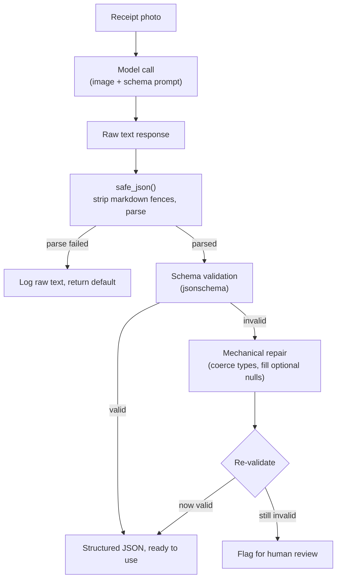

# Day 2 — From Photo to Structured JSON

Yesterday we asked a multimodal model to *describe* a photo in free text.
Today's job is different: turn a photo of a receipt into data a program can
actually use — a total, a date, a list of line items that get inserted into
a database, reconciled against inventory, and never looked at by a human
again unless something goes wrong.

## Why this is harder than it looks

A vision-language model is, underneath, still a model that predicts the next
token of text. Nothing about that architecture *guarantees* valid JSON —
it's entirely possible for the model to open a brace it never closes, add a
trailing comma, or wrap the whole thing in a sentence like "Sure, here's the
extracted data:". On top of that, receipts are visually messy: skewed
photos, faded thermal-printer ink, handwritten totals, currency symbols that
vary by locale, and — the hardest part — genuine semantic ambiguity about
which number on the page *is* the total. A receipt often shows a subtotal, a
tax line, a tip line, and a total, all as similarly-formatted numbers; only
context (labels, position, arithmetic) disambiguates them, and it's exactly
the kind of judgment call an OCR engine can't make but a language model can.

## Free text vs. structured output

Asking "what's on this receipt?" gets you a paragraph. That's fine for a
human, useless for a database. Instead, prompt the model to return JSON
matching a shape you specify:

```python
PROMPT = """
Extract the following fields from this receipt image and return ONLY JSON,
no commentary:

{
  "store_name": string,
  "purchase_date": string or null,
  "line_items": [{"name": string, "price": number}],
  "total": number
}

If a field is not visible or not present, use null rather than guessing.
"""
```

Two details matter here beyond just listing field names: being explicit
about *types* (string vs. number) measurably improves how often the model
returns something parseable, and the "use null rather than guessing"
instruction directly targets the failure mode where a model fabricates a
plausible-looking value for a field it can't actually read — a store name is
easy to hallucinate convincingly if it's blocked by a coffee stain.

## The pipeline: prompt, parse, validate, repair



Every arrow in that diagram is a place where the pipeline can fail
gracefully instead of crashing or — worse — silently storing garbage. The
rest of this note builds each stage.

## `safe_json()`: don't trust the output blindly

Even with a good prompt, models occasionally wrap JSON in markdown fences,
add a stray sentence, or emit almost-valid JSON. Never call `json.loads()`
directly on raw model output in production code — wrap it:

```python
import json

def safe_json(raw_text: str, default=None):
    """Try to parse model output as JSON; return `default` on any failure.

    Strips the most common wrapper the model adds around JSON (a markdown
    code fence) before attempting to parse, since models are often prompted
    or fine-tuned to format code-like output that way by habit.
    """
    # -> str, whitespace and fence markers removed from both ends
    cleaned = raw_text.strip().removeprefix("```json").removesuffix("```").strip()
    try:
        return json.loads(cleaned)  # -> dict | list | str | int | float | bool | None
    except (json.JSONDecodeError, TypeError):
        return default  # caller decides what "give up" means for their pipeline

result = safe_json(model_response, default={"error": "could not parse"})
```

This pattern — try the parse, fall back to a safe default, and log the raw
text for debugging — is the difference between a pipeline that occasionally
skips a bad record and one that crashes on it. Note its limit, though:
`safe_json` only strips a *single, specific* wrapper pattern (markdown
fences at the very start/end). A response like `"Sure, here's the JSON:\n\`\`\`json\n{...}\n\`\`\`\nLet me know if you need anything else!"`
still fails to parse, because the prose isn't at the edges the `strip()` +
`removeprefix()` calls check — confirmed by testing `safe_json` against
exactly that string, which returns the `default` rather than the parsed
dict. That's a real, tested limitation, not a hypothetical one — it's the
reason the prompt explicitly says "return ONLY JSON, no commentary," and why
production systems increasingly reach for structured outputs instead of
prompting-plus-parsing (see below).

## Validating and repairing against a schema

A response can be *valid JSON* and still be the *wrong shape* — a `total`
sent as the string `"$11.99"` instead of the number `11.99`, or a missing
optional field. Rejecting those outright throws away perfectly recoverable
data, so it's worth a small, mechanical repair step before giving up:

```python
import json
from jsonschema import Draft202012Validator

# Schema describing what we expect the model's JSON to look like.
# Loose on types where formatting varies (purchase_date can be missing
# entirely), strict on which keys must exist at all.
RECEIPT_SCHEMA = {
    "type": "object",
    "properties": {
        "store_name": {"type": "string"},
        "purchase_date": {"type": ["string", "null"]},
        "line_items": {
            "type": "array",
            "items": {
                "type": "object",
                "properties": {
                    "name": {"type": "string"},
                    "price": {"type": "number"},
                },
                "required": ["name", "price"],
            },
        },
        "total": {"type": "number"},
    },
    "required": ["store_name", "line_items", "total"],
}

def validate_and_repair(data: dict, schema: dict) -> tuple[dict | None, list[str]]:
    """Validate `data` against `schema`; attempt a small set of mechanical
    repairs for the most common near-misses, then re-validate once.

    Returns (repaired_data_or_None, list_of_repair_notes). A `None` first
    element means the data could not be made schema-valid automatically —
    the caller should route it to human review, not the database.
    """
    validator = Draft202012Validator(schema)
    errors = list(validator.iter_errors(data))
    if not errors:
        return data, []  # -> already valid, nothing to do

    notes = []
    repaired = json.loads(json.dumps(data))  # cheap deep copy, avoids mutating caller's dict

    # Repair 1: numeric-looking strings for declared "number" fields -> float.
    # Handles "$11.99", "1,199.00", and plain "11.99" the same way.
    def coerce_number(value):
        if isinstance(value, str):
            try:
                return float(value.replace(",", "").replace("$", "").strip())
            except ValueError:
                return value  # give up silently; validation will catch it below
        return value

    if isinstance(repaired.get("total"), str):
        before = repaired["total"]
        repaired["total"] = coerce_number(repaired["total"])
        if repaired["total"] != before:
            notes.append(f"coerced total {before!r} -> {repaired['total']!r}")

    for item in repaired.get("line_items", []):
        if isinstance(item.get("price"), str):
            before = item["price"]
            item["price"] = coerce_number(item["price"])
            if item["price"] != before:
                notes.append(f"coerced line_item price {before!r} -> {item['price']!r}")

    # Repair 2: fill a missing optional key with null so the ["string","null"]
    # union in the schema is satisfied instead of failing on a missing key.
    if "purchase_date" not in repaired:
        repaired["purchase_date"] = None
        notes.append("filled missing purchase_date with null")

    # Re-validate exactly once after repairs — if it's still broken, this is
    # not a mechanical near-miss, it's a real extraction failure.
    errors_after = list(validator.iter_errors(repaired))
    if errors_after:
        return None, notes + [f"unrepairable: {e.message}" for e in errors_after]
    return repaired, notes
```

**Verified against three real cases** (run via `jsonschema` 4.25.1 in this
environment):

1. Clean, valid model output → `validate_and_repair` returns it unchanged,
   `notes == []`.
2. `{"total": "$11.99"}`, missing `purchase_date` → repaired to
   `{"total": 11.99, "purchase_date": None, ...}` with notes
   `["coerced total '11.99' -> 11.99", "coerced line_item price '$11.99' -> 11.99", "filled missing purchase_date with null"]`.
3. Missing the required `line_items` key entirely → returns `(None, [...,
   "unrepairable: 'line_items' is a required property"])` — correctly gives
   up rather than fabricating a line-items list.

That third case matters as much as the first two: a repair function that
*always* finds a way to produce something valid is dangerous, because
"valid-looking" and "correct" are different properties. Knowing when to stop
repairing and flag for a human is part of the design, not an afterthought.

## The modern alternative: structured outputs

The prompt-and-parse approach above is the general, provider-agnostic
pattern, and it's worth understanding because you'll need pieces of it
regardless of provider (schema validation, repair, PII handling). But when
your provider supports it, there's a more direct route: ask the API itself
to guarantee the response matches a JSON schema, instead of asking nicely in
the prompt and defending against the answer afterward.

```python
from pydantic import BaseModel
import anthropic
import base64

class LineItem(BaseModel):
    name: str
    price: float

class Receipt(BaseModel):
    store_name: str
    purchase_date: str | None
    line_items: list[LineItem]
    total: float

client = anthropic.Anthropic()

with open("receipt.jpg", "rb") as f:
    image_data = base64.standard_b64encode(f.read()).decode("utf-8")

response = client.messages.parse(
    model="claude-opus-5",
    max_tokens=1024,
    messages=[{
        "role": "user",
        "content": [
            {"type": "image", "source": {"type": "base64", "media_type": "image/jpeg", "data": image_data}},
            {"type": "text", "text": "Extract the receipt fields."},
        ],
    }],
    output_format=Receipt,  # the API enforces this shape server-side
)

receipt = response.parsed_output  # -> Receipt, already validated — no safe_json needed
print(receipt.total)  # -> float, guaranteed present and numeric
```

This isn't executable in this sandbox — it needs a real API key, network
access, and an actual receipt image, none of which are available here. The
request shape (an `image` content block plus a `text` block in one `user`
message, `client.messages.parse` with a Pydantic `output_format`) matches
the current Claude API. It's shown here specifically because it changes the
earlier pipeline diagram: with server-enforced structured output, the
"invalid → repair → re-validate" branch mostly disappears, because the model
literally cannot return a response that doesn't match `Receipt`. You still
want `validate_and_repair`-style thinking for providers or self-hosted
models that don't offer this guarantee, and it's good defense-in-depth even
when it does — but treat structured outputs as the first thing to reach for
when your provider supports them.

## Where object detection (YOLO-style) fits — and doesn't

Classic object detection models (YOLO and similar) draw bounding boxes
around objects and label them: for a photo, the output looks like a list of
`(class, confidence, x_center, y_center, width, height)` tuples — "there is
a *bottle* at these normalized pixel coordinates, 92% confidence." That's
the right tool when you need pixel-level localization, e.g. counting items
on a shelf or verifying a package is in the correct bin. It is the *wrong*
tool for reading a receipt: a detector has no notion of "total" or "purchase
date," only a fixed set of trained object classes and their locations.
Prompted extraction from a multimodal model, by contrast, understands
document *semantics* — it can reason about which number is the total versus
a subtotal — at the cost of not telling you *where* on the image that text
was. The two are complementary, not competing: a real inventory pipeline
might use YOLO to count boxes on a loading-dock photo and a VLM to read the
packing slip that came with them.

## Handling PII in real documents

Receipts and ID-like documents contain personal data: names, partial card
numbers, addresses, signatures. Before storing extracted JSON, mask what you
don't need to keep in reversible form:

```python
import re

def mask_card_number(raw: str) -> str:
    """Mask all but the last 4 digits of a card-like number found in text.

    Applied to extracted fields before they're stored or logged, so a
    receipt photo that happens to capture a card number never lands in a
    database or log file in a directly usable form.
    """
    digits_only = re.sub(r"\D", "", raw)  # -> str of digits only, e.g. "4111111111111111"
    if len(digits_only) < 4:
        return "****"
    last4 = digits_only[-4:]
    return "*" * (len(digits_only) - 4) + last4  # -> str, e.g. "************1234"
```

Verified: `mask_card_number("4111 1111 1111 1234")` → `"************1234"`,
and `mask_card_number("card ending 4111-1111-1111-5678")` →
`"************5678"` — the digit-stripping regex correctly ignores spaces,
dashes, and surrounding words either way.

Beyond masking, three habits matter for real deployments:

- Strip or mask fields you don't need at all (a full signature image, a
  full card number) rather than storing and masking on read — data you
  never persisted can't leak.
- Avoid sending images to third-party APIs if your data-handling policy
  forbids it — consider a locally-hosted VLM for sensitive documents.
- Log extraction *failures* without logging the raw image or full PII
  payload; a stack trace with an embedded receipt photo is its own
  incident waiting to happen.

## Common pitfalls

- **Locale-dependent number formats.** `1,234.56` (US) and `1.234,56`
  (much of Europe) use the same two characters with opposite meaning. A
  naive `float(text.replace(",", ""))` silently mangles the second format.
  Know your supplier base before you pick a parsing rule.
- **Confidently wrong values.** A hallucinated total that's off by a
  plausible amount (say, $2 on a $47 receipt) is far more dangerous than an
  obviously broken one, because nothing in the pipeline flags it — this is
  exactly the class of error Day 3's grounding check targets for PDFs, and
  the same instinct applies here: cross-check extracted totals against the
  sum of line items when both are present.
- **Schema drift.** As you extend the schema (adding `tax`, `payment_method`,
  `currency`), old repair logic silently stops covering new fields unless
  you revisit it — a schema change is a code change, not just a config edit.
- **Multi-page or multi-receipt photos.** A photo showing two receipts side
  by side, or a receipt with an itemized page 2, doesn't fit a schema built
  for "one receipt, one page" — decide explicitly whether that's out of
  scope or needs a `receipts: [...]` wrapper.

## Takeaway

Structured extraction is a prompting problem plus a defensive parsing
problem — ask clearly for a shape, then never trust that the model actually
gave it to you. Where the API supports enforced structured outputs, prefer
it; where it doesn't, `safe_json` plus schema validation and mechanical
repair gets you most of the same reliability, as long as you're honest about
when to stop repairing and ask a human instead.
