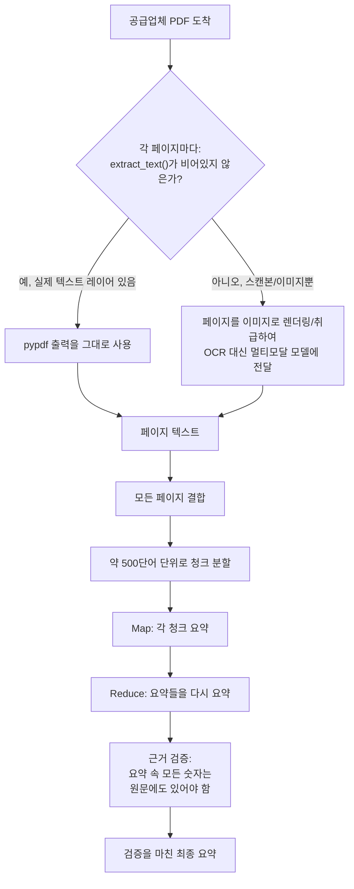

# Day 3 — PDF를 읽고 지어내지 않고 요약하기

이 가게는 수백 개의 공급업체 스펙시트 PDF를 보관하고 있습니다 — 토크 수치, 배터리 사양, 보증 조건 등입니다. 오늘 할 일은 이 텍스트를 신뢰성 있게 뽑아내고, 구매 담당자가 실제로 믿고 행동에 옮길 수 있을 만큼 신뢰할 수 있는 AI 요약을 만드는 것입니다.

## PDF는 문서 형식이 아니라 레이아웃 형식이다

PDF 내부를 다뤄본 적이 없다면 가장 놀라운 사실은 이것입니다. PDF는 `.docx`나 `.txt` 파일처럼 "문서"를 저장하지 않습니다. 대신 페이지마다 그리기 명령을 저장합니다 — "폰트 F를 사용해서 이 글리프를 (x, y) 위치에 놓아라" 같은 식입니다. 문단, 읽는 순서, 심지어 단어라는 개념조차 보장되지 않습니다. PDF 렌더러는 그저 이 그리기 명령들을 실행할 뿐이고, 그 결과가 사람 눈에는 "문서"처럼 *보이는* 것입니다. 텍스트 추출 도구는 이 그리기 명령들로부터 구조(읽는 순서, 단어 경계, 문단)를 역공학해야 합니다. 그래서 화면상으로는 똑같아 보이는 PDF들 사이에서도 추출 품질이 크게 갈립니다 — 2단 레이아웃은 실제 그리기 순서가 시각적 레이아웃과 일치하지 않으면 A열과 B열이 줄 단위로 뒤섞여 추출될 수 있고, 특이한 폰트 인코딩을 쓰는 PDF는 글리프-유니코드 매핑이 제대로 없으면 읽을 수 있는 문자 대신 `\x00\x01\x02` 같은 값으로 추출될 수 있습니다.

## `pypdf`로 텍스트 추출하기

실제 문서에서 "PDF로 내보내기"나 "PDF로 인쇄하기"로 만들어진 대부분의 PDF는 시각적 레이아웃과 함께 진짜 텍스트 레이어를 저장하고 있으며, `pypdf`로 페이지 단위로 읽을 수 있습니다.

```python
from pypdf import PdfReader

reader = PdfReader("cordless-drill-spec.pdf")
# -> .pages를 가진 PdfReader, 지연 시퀀스 — 접근하기 전까지는 아무것도 디코딩되지 않음

# 페이지에 복구 가능한 텍스트 레이어가 없으면 extract_text()는 None이나 ""를
# 반환하므로, `or ""` 방어 코드는 형식적인 것이 아니라 실제로 필요한 부분이다
full_text = "\n".join(page.extract_text() or "" for page in reader.pages)
print(len(reader.pages), "pages,", len(full_text), "characters extracted")
```

**실제로 새로 생성한 2페이지 PDF로 검증함** (`reportlab`으로 만들었으며, 1페이지에는 "Max torque: 60 Nm", 2페이지에는 "Limited warranty: 24 months from purchase date"가 들어 있음): `len(reader.pages)`는 `2`를 반환했고, `full_text`는 정확히
`"Cordless Drill CD-450 - Specification Sheet\nMax torque: 60 Nm\nBattery: 18V lithium-ion, 400 charge cycles\n\nPage 2: Warranty Information\nLimited warranty: 24 months from purchase date\n"`
로 돌아왔습니다 — 183자, 두 핵심 수치 모두 온전히 남아 있어 단순 부분 문자열 검사로도 추출 가능했습니다. 이것이 `pypdf`가 잘 처리하는 경우입니다.

## 스캔 PDF라는 함정

일부 스펙시트는 종이를 스캐너로 훑어 PDF로 저장한, 사실상 종이 사진일 뿐입니다. 텍스트 그리기 명령이 전혀 없고, 페이지마다 래스터 이미지 객체 하나만 있습니다. `pypdf`는 애초에 텍스트로 존재한 적 없는 것을 텍스트로 추출할 수 없습니다.



**검증됨**: `reportlab`으로 만든 가짜 "스캔" PDF — 채워진 사각형 하나만 있고 텍스트 그리기 호출은 전혀 없는, 래스터 스캔본을 흉내 낸 페이지 — 는 `extract_text()` 결과를 `strip()` 했을 때 빈 문자열이 됩니다. `pypdf`는 오류나 경고를 내지 않고, 그냥 조용히 아무것도 주지 않습니다. 바로 이 침묵이 진짜 위험입니다. 빈 결과를 확인하지 않는 파이프라인은 추출된 텍스트 0자를 태연히 "요약"하려 들 것이고, 언어 모델은 근거로 삼을 것을 아무것도 받지 못했음에도 그럴듯하게 들리는(완전히 지어낸) 요약을 여전히 돌려줄 수 있습니다.

해결책은 추출 가능한 텍스트가 없는 페이지를 *이미지*로 취급해서, OCR 대체 수단으로 멀티모달 모델에 넘기는 것입니다: "이 페이지의 텍스트를 그대로 읽어서 반환해줘." Day 1에서 제품 사진을 설명하고 Day 2에서 영수증을 읽었던 것과 같은 모델이 스캔된 페이지도 옮겨 적을 수 있습니다 — 그저 다른 질문을 던지는 것뿐입니다. 합리적인 경험칙: `(page.extract_text() or "").strip()`의 길이가 예컨대 20자 미만이라면, 그 20자가 정말로 페이지의 전부라고 믿는 대신 스캔본으로 간주하고 OCR로 폴백하세요.

## 긴 문서 청크 분할하기 (map-reduce 요약)

40페이지짜리 매뉴얼은 대략 15,000~25,000단어 정도이며, 한 번의 요청으로 보내기엔 지나치게 깁니다 — 컨텍스트 윈도우가 기술적으로 들어간다 해도, 하나의 거대한 요청은 무언가 잘못됐을 때 통째로 실패하며, 환각이 어느 부분에서 나왔는지도 전혀 알 수 없습니다. 표준적인 해결책은 map-reduce 패턴입니다. 문서를 나누고, 각 조각을 독립적으로 요약한 뒤(map), 그 요약들을 다시 한 번 요약해 최종본을 만듭니다(reduce).

```python
def chunk_text(text: str, max_words: int = 500) -> list[str]:
    """`text`를 최대 `max_words` 단어로 이루어진 청크들로 나눈다.
    공백에서만 자르므로 단어가 중간에 잘리는 일은 없다.

    이것이 map-reduce 요약의 "map" 절반이다. 각 청크는 모델 호출 1회의
    컨텍스트와 비용 예산 안에 여유 있게 들어가야 한다.
    """
    words = text.split()  # -> list[str], 공백으로 구분된 토큰 하나당 항목 하나
    chunks = []
    for i in range(0, len(words), max_words):
        chunk_words = words[i:i + max_words]
        chunks.append(" ".join(chunk_words))
    return chunks  # -> list[str], 각 항목은 max_words 단어 이하
```

**검증됨**: 12,000단어짜리 합성 문서(스펙 문단을 반복시켜 생성)에 대해
`chunk_text(long_text, max_words=500)`를 실행한 결과 정확히 24개 청크가 만들어졌고, 앞의 23개는 정확히 500단어씩, 마지막 하나는 나머지 단어를 담았으며, 모든 청크를 공백으로 다시 이어 붙이면 원본 단어 순서를 정확히 재현했습니다 — 어떤 단어도 빠지거나, 중복되거나, 순서가 바뀌지 않았습니다.

```python
def summarize_long_document(chunks: list[str], summarize_fn) -> str:
    # Map: 각 청크는 독립적으로, 서로 고립된 채 요약된다 — 이것이
    # 청크 간 맥락(두 청크에 걸쳐 문장 중간에서 잘린 사양)이 이
    # 패턴의 알려진 약점인 이유다. 아래 함정 항목 참고.
    chunk_summaries = [summarize_fn(c) for c in chunks]  # -> list[str], len == len(chunks)

    # Reduce: (이미 원문보다 훨씬 짧아진) 청크 요약들을 이어 붙여
    # 다시 한 번 요약해서 최종 결과 하나를 만든다.
    combined = "\n".join(chunk_summaries)  # -> str, 원본 문서보다 훨씬 짧음
    return summarize_fn(combined, instruction="Combine these into one summary")  # -> str
```

**검증됨**: 위의 24개 청크에 대해 결정론적인 자리표시자 `summarize_fn`(실제 요약에는 라이브 모델 호출이 필요하며 이 샌드박스에서는 불가능함)을 사용해 실행한 결과, 함수는 24개 청크 요약 모두로부터 파생된 최종 결합 요약 문자열 하나를 정확히 생성했습니다 — map 단계가 청크당 한 번씩, reduce 단계가 결합 결과에 대해 정확히 한 번 실행됐음을 위 다이어그램과 일치하게 확인했습니다.

이 방식은 각 개별 요청을 컨텍스트와 비용 한도 안에 유지하면서도 문서 전체를 다룰 수 있게 해주며, 그 대가로 "reduce" 호출 1회가 추가되고 map과 reduce 사이에서 정보가 손실될 약간의 위험을 감수합니다.

## 믿되, 검증하라: 숫자 확인하기

구체적인 숫자("최대 토크: 60 Nm", "24개월 보증")가 포함된 요약이야말로 환각이 가장 위험한 지점입니다 — 지어낸 사양은 실제 사양만큼이나 자신 있고 잘 정리된 형태로 보이며, 잘못된 토크 수치를 근거로 행동하는 구매 담당자는 요약만 보고는 그것을 구별할 방법이 없습니다. 저렴하고 기계적인 안전장치 하나: 요약을 생성한 뒤, 요약이 인용한 모든 숫자가 실제로 원문 어딘가에 존재하는지 확인하는 것입니다.

```python
import re

def numbers_in_summary_are_grounded(summary: str, source_text: str) -> bool:
    """환각 방지 검사: `summary`에 인용된 모든 숫자는 `source_text`
    어딘가에 리터럴 부분 문자열로 존재해야 한다.

    의도적으로 단순하게 만들었다 — 의미론적 검증이 아니라 부분 문자열
    일치 검사다. 목표가 완전한 정확성 증명이 아니라, 가장 피해가 큰
    오류 유형(숫자 조작)을 걸러내는 빠르고 기계적인 필터이기 때문이다.
    """
    cited_numbers = re.findall(r"\d+(?:\.\d+)?", summary)  # -> list[str], 예: ["60", "18"]
    return all(num in source_text for num in cited_numbers)  # -> bool
```

**검증됨**: 합성 드릴 스펙 텍스트("...delivers up to 60 Nm of torque and operates on an 18-volt lithium-ion battery...")를 기준으로 두 가지 요약을 테스트했습니다. "60 Nm"과 "18-volt"를 올바르게 인용한 요약은 `True`를 반환했고, "75 Nm"과 "24-volt"로 바꾼(원문 어디에도 없는 숫자) 요약은 의도한 그대로 `False`를 반환했습니다.

이 검사가 모든 종류의 환각을 잡아내지는 못하지만(숫자 자체는 *근거가 있으면서* 잘못된 주장에 붙을 수도 있습니다 — 아래 함정 참고), 스펙시트에서 가장 중요한 오류 유형에 대한 빠르고 기계적인 검사이며, 모든 요약이 나가기 전에 실행할 만큼 비용이 저렴합니다.

## 흔한 함정

- **근거는 있지만 여전히 틀림.** 이 검사는 "60"이라는 숫자가 원문 어딘가에 있다는 것만 확인할 뿐, 요약이 "60"을 올바른 주장에 붙였는지는 확인하지 않습니다. 원문에 "60 Nm 토크"와, 다른 곳에 "60일 환불 기간"이 함께 언급되어 있다면, 요약이 둘을 뒤바꿔도 이 검사를 통과합니다. 이것을 정확성의 보증이 아니라 1차 필터로 취급하세요.
- **우연한 일치.** 페이지 번호, 저작권 연도, 부품 번호도 숫자입니다. 보증 연도가 아니라 저작권 표기를 그대로 옮겨서 "2026"을 인용한 요약도 이 검사를 통과하면서 여전히 오해를 불러일으킬 수 있습니다.
- **청크 간 맥락 손실.** `chunk_text`가 한 사양을 문장 중간에서 두 청크로 나눠버리면, 각 청크의 독립적인 요약은 그 사양을 아예 놓치거나, 더 나쁘게는 각 절반을 마치 완전한 내용인 것처럼 요약할 수 있습니다. `max_words`를 키우면(분할이 줄어들면) 이 위험은 줄지만 요청이 커지고 비용이 늘어납니다 — 공짜 점심은 없고, 조절 가능한 손잡이가 하나 있을 뿐입니다. 인접한 청크 사이에 작게 겹치는 구간을 두는 것이 흔한 완화책입니다.
- **요약의 요약이 만드는 드리프트.** reduce 단계는 이미 원본을 손실 압축한 텍스트를 다시 요약합니다 — map 단계에서 생긴 오류와 누락이 reduce 단계에서 전파되고 누적될 수 있습니다. 중요도가 높은 작업이라면 청크별 요약을 남겨두어, 사람이 최종 요약 속 주장을 어느 청크(그리고 그에 따라 어느 페이지)에서 나온 것인지 거슬러 확인할 수 있게 하세요.
- **OCR이 만들어내는 환각.** 스캔 페이지 폴백은 다른 곳에서 환각을 일으킬 수 있는 것과 같은 종류의 모델을 사용합니다. "이 페이지를 그대로 읽어줘"는 "이 페이지를 설명해줘"보다 좁은 요청이라 더 신뢰할 만한 편이지만, 완벽한 OCR은 아니며, 이 단계에서 생긴 오류는 마치 진짜 원문인 것처럼 그대로 근거 검증 단계로 흘러 들어갑니다.

## 정리

PDF 텍스트 추출은 쉬워 보이지만 스캔된 페이지, 깨진 폰트 인코딩, 시각적 순서와 다른 읽기 순서 앞에서는 그렇지 않습니다. 긴 문서 요약도 쉬워 보이지만, 인용된 숫자가 실제로 진짜인지 확인하기 전까지만 그렇습니다. 요약하기 전의 빈 텍스트 방어와, 요약 후의 숫자 근거 검증을 처음부터 함께 만들어두세요. 구매 결정이 잘못된 뒤에야 그 빈틈을 발견하지 않도록 말입니다.
