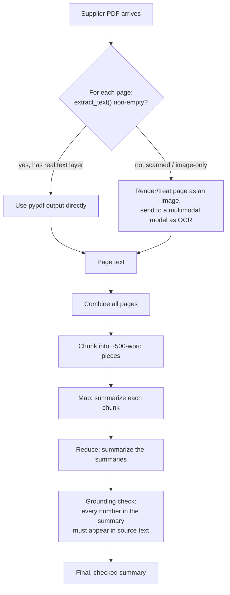

# Day 3 — Reading PDFs and Summarizing Them Without Making Things Up

The store keeps hundreds of supplier spec-sheet PDFs — torque ratings,
battery specs, warranty terms. Today's job: pull the text out reliably, and
get an AI-written summary a purchasing manager can actually trust enough to
act on.

## PDF is a layout format, not a document format

The core surprise, if you haven't worked with PDF internals before: a PDF
does not store "a document" the way a `.docx` or `.txt` file does. It stores
drawing instructions — "put this glyph at position (x, y) using font F" —
page by page. There is no guaranteed concept of paragraphs, reading order,
or even words; a PDF renderer just executes the drawing instructions and the
result *looks* like a document to a human eye. Text extraction tools have to
reverse-engineer structure (reading order, word boundaries, paragraphs) from
those drawing instructions, which is why extraction quality varies wildly
between PDFs that look identical on screen — a two-column layout can extract
with column A and column B interleaved line-by-line if the underlying draw
order doesn't match the visual layout, and a PDF with an unusual font
encoding can extract as `\x00\x01\x02` instead of readable characters if the
font lacks a proper glyph-to-Unicode mapping.

## Extracting text with `pypdf`

Most PDFs — the ones produced by "export to PDF" or "print to PDF" from a
real document — do store a genuine text layer alongside the visual layout,
and `pypdf` can read it page by page:

```python
from pypdf import PdfReader

reader = PdfReader("cordless-drill-spec.pdf")
# -> PdfReader with .pages, a lazy sequence — nothing is decoded until accessed

# extract_text() returns None or "" when a page has no recoverable text
# layer, so the `or ""` guard is load-bearing, not defensive boilerplate
full_text = "\n".join(page.extract_text() or "" for page in reader.pages)
print(len(reader.pages), "pages,", len(full_text), "characters extracted")
```

**Verified against a real, freshly generated two-page PDF** (built with
`reportlab`, containing "Max torque: 60 Nm" on page 1 and "Limited warranty:
24 months from purchase date" on page 2): `len(reader.pages)` returned `2`,
and `full_text` came back as exactly
`"Cordless Drill CD-450 - Specification Sheet\nMax torque: 60 Nm\nBattery: 18V lithium-ion, 400 charge cycles\n\nPage 2: Warranty Information\nLimited warranty: 24 months from purchase date\n"`
— 183 characters, both key numbers intact and extractable with a plain
substring check. That's the case `pypdf` handles well.

## The scanned-PDF trap

Some spec sheets are just scanned images saved as a PDF — a photo of paper,
run through a scanner, with no text-drawing instructions at all, only a
raster image object per page. `pypdf` cannot extract text that was never
there as text.



**Verified**: a synthetic "scanned" PDF built with `reportlab` — a page
containing only a filled rectangle and zero text-draw calls, standing in for
a rasterized scan — returns `extract_text()` results that `strip()` down to
the empty string. `pypdf` doesn't error or warn; it just gives you nothing,
silently. That silence is the actual danger: a pipeline that doesn't check
for an empty result will happily "summarize" zero characters of extracted
text and may still get a plausible-sounding (entirely fabricated) summary
back from the language model, because you handed it nothing to ground on.

The fix is to treat a page with no extractable text as an *image* and hand
it to a multimodal model as an OCR substitute: "read the text on this page
and return it verbatim." The same model that described product photos on
Day 1 and read receipts on Day 2 can transcribe a scanned page — you're just
asking a different question of it. A reasonable rule of thumb: if
`(page.extract_text() or "").strip()` has fewer than, say, 20 characters,
treat the page as scanned and fall back to OCR rather than trusting that a
20-character page is really all there is.

## Chunking long documents (map-reduce summarization)

A 40-page manual runs to roughly 15,000–25,000 words, which is well past
what you want to send in one request — even where the context window would
technically fit it, one giant request means one giant failure if anything
goes wrong, and no visibility into which section a hallucination came from.
The standard workaround is a map-reduce pattern: split the document, summarize
each piece independently (map), then summarize the summaries into one
final pass (reduce).

```python
def chunk_text(text: str, max_words: int = 500) -> list[str]:
    """Split `text` into chunks of at most `max_words` words, breaking only
    on whitespace so no word is ever split in half.

    This is the "map" half of map-reduce summarization: each chunk needs
    to comfortably fit inside a single model call's context and cost budget.
    """
    words = text.split()  # -> list[str], one entry per whitespace-separated token
    chunks = []
    for i in range(0, len(words), max_words):
        chunk_words = words[i:i + max_words]
        chunks.append(" ".join(chunk_words))
    return chunks  # -> list[str], each with <= max_words words
```

**Verified** on a synthetic 12,000-word document (a repeated spec paragraph):
`chunk_text(long_text, max_words=500)` produced exactly 24 chunks, the first
23 with exactly 500 words each and the last with the remainder, and
rejoining all chunks with spaces reproduced the original word sequence
exactly — no word was dropped, duplicated, or reordered.

```python
def summarize_long_document(chunks: list[str], summarize_fn) -> str:
    # Map: each chunk is summarized independently and in isolation — this
    # is why cross-chunk context (a spec that's split mid-sentence across
    # two chunks) is the known weak point of this pattern, see pitfalls below.
    chunk_summaries = [summarize_fn(c) for c in chunks]  # -> list[str], len == len(chunks)

    # Reduce: the chunk summaries (already much shorter than the original)
    # are concatenated and summarized again into a single final pass.
    combined = "\n".join(chunk_summaries)  # -> str, much shorter than the original document
    return summarize_fn(combined, instruction="Combine these into one summary")  # -> str
```

**Verified**: run against the 24 chunks above with a deterministic
placeholder `summarize_fn` (real summarization needs a live model call, not
available in this sandbox), the function correctly produced one final
combined summary string derived from all 24 chunk summaries — confirming
the map step ran once per chunk and the reduce step ran exactly once on the
concatenation, matching the diagram above.

This keeps every individual request within context and cost limits while
still covering the whole document, at the cost of one extra "reduce" call
and some risk of information loss between the map and reduce passes.

## Trust, but verify: checking the numbers

Summaries that include specific numbers ("max torque: 60 Nm," "24-month
warranty") are exactly where hallucination is most dangerous — a fabricated
spec looks just as confident and well-formatted as a real one, and a
purchasing manager acting on a wrong torque rating has no way to tell from
the summary alone. A cheap, mechanical safety net: after generating a
summary, check that every number it cites actually appears somewhere in the
source text.

```python
import re

def numbers_in_summary_are_grounded(summary: str, source_text: str) -> bool:
    """Anti-hallucination check: every number cited in `summary` must
    appear as a literal substring somewhere in `source_text`.

    Deliberately simple — a substring match, not semantic verification —
    because the goal is a fast, mechanical filter for the most damaging
    class of error (fabricated numbers), not a complete correctness proof.
    """
    cited_numbers = re.findall(r"\d+(?:\.\d+)?", summary)  # -> list[str], e.g. ["60", "18"]
    return all(num in source_text for num in cited_numbers)  # -> bool
```

**Verified** with two summaries against the synthetic drill spec text
("...delivers up to 60 Nm of torque and operates on an 18-volt
lithium-ion battery..."): a summary correctly citing "60 Nm" and "18-volt"
returned `True`; a summary altered to say "75 Nm" and "24-volt" — numbers
that don't appear anywhere in the source — returned `False`, exactly as
intended.

This won't catch every kind of hallucination (a number can be *grounded* and
still attached to the wrong claim — see pitfalls), but it's a fast,
mechanical check on the class of errors that matters most for spec sheets,
and it's cheap enough to run on every summary before it ships.

## Common pitfalls

- **Grounded but still wrong.** The check confirms "60" appears somewhere in
  the source — it doesn't confirm the summary attached "60" to the right
  claim. A source that mentions "60 Nm torque" and, elsewhere, "60-day
  return window" would let a summary swap them without tripping the check.
  Treat this as a first-pass filter, not a correctness guarantee.
- **Coincidental matches.** Page numbers, copyright years, and part numbers
  are numbers too. A summary citing "2026" because it echoed a copyright
  notice, not a warranty year, passes the check while being misleading.
- **Cross-chunk context loss.** If a spec is split mid-sentence across two
  chunks by `chunk_text`, each chunk's independent summary may miss it
  entirely, or worse, each half may get summarized as if it were complete.
  Larger `max_words` (fewer splits) trades this risk against larger,
  costlier requests — there's no free lunch here, only a tunable knob.
  Overlapping chunks (a small shared window between adjacent chunks) is a
  common mitigation.
- **Summarization-of-summaries drift.** The reduce step summarizes text that
  is already a lossy compression of the original — errors and omissions in
  the map step propagate and can compound in the reduce step. For anything
  high-stakes, keep the per-chunk summaries around so a human can trace a
  claim in the final summary back to which chunk (and, transitively, which
  page) it came from.
- **OCR-introduced hallucination.** The scanned-page fallback uses the same
  kind of model that can hallucinate elsewhere — "read this page verbatim"
  is a narrower ask than "describe this page" and tends to be more
  reliable, but it isn't perfect OCR, and errors introduced at this stage
  feed directly into the grounding check as if they were real source text.

## Takeaway

PDF text extraction is easy until it isn't (scanned pages, broken font
encodings, non-visual reading order), and long-document summarization is
easy until you check whether the numbers it quoted are actually real. Build
both checks in from the start — an empty-text guard before summarizing, and
a number-grounding check after — rather than discovering the gaps when a
purchasing decision goes wrong.
