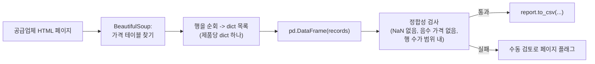

# Day 4 — 웹 페이지를 CSV 리포트로 바꾸기

공급업체들은 가격 목록을 자사 웹사이트에 평범한 HTML 테이블로 공개합니다. 오늘 할 일은 이 페이지를 파싱해서 테이블을 뽑아내고, 깔끔한 CSV 리포트를 만드는 것입니다 — AI 모델을 학습시키거나 호출할 필요가 전혀 없습니다.

## 오늘은 왜 모델이 등장하지 않는가

Day 1부터 Day 3까지는 모두 사전학습된 멀티모달 모델을 사용했습니다. 입력값 — 사진, 스캔된 페이지 — 이 애초에 내재된 데이터 모델이 없는 비구조화된 픽셀 덩어리로 시작했기 때문입니다. HTML 테이블은 정반대의 경우입니다. *이미* 구조화된 데이터이며, 1990년대부터 표준 도구들이 존재해온, 잘 정의된 기계 파싱 가능한 마크업 언어에 담겨 있습니다. 이 테이블의 스크린샷을 비전 모델에 보내서 "가격을 읽어줘"라고 요청해도 기술적으로는 작동하겠지만, 더 느리고(페이지마다 로컬 파싱 대신 네트워크 왕복이 필요), 비결정적이며(같은 테이블이라도 옮겨 적을 때마다 미묘하게 다르게 읽힐 수 있음), 20년 된 파싱 라이브러리가 정확하고 공짜로 풀어주는 문제에 굳이 비용을 지불하는 셈이 됩니다. 이번 주 전체를 관통하는 교훈은 이것입니다. 도구는 입력이 구조화되어 있는지 아닌지에 맞춰 골라야지, 습관적으로 모델부터 찾아서는 안 됩니다.

## BeautifulSoup으로 HTML 파싱하기

```python
from bs4 import BeautifulSoup
import requests

response = requests.get("https://example-supplier.test/catalog/fasteners")
# -> BeautifulSoup, 페이지를 파싱한 트리; "html.parser"는 파이썬 내장
# 파서(별도 의존성 불필요)이며, lxml이 있다면 더 빠르다
soup = BeautifulSoup(response.text, "html.parser")

# find()는 첫 번째 매치만 반환한다; 태그 이름과 클래스를 함께 검색하는
# 것이 중요한 이유는, 한 페이지에 <table>이 여러 개 있을 수 있기
# 때문이다 — 관련 없는 "관련 상품" 테이블, 광고 위젯 등
price_table = soup.find("table", class_="price-list")
rows = price_table.find_all("tr")  # -> list[Tag], 그 테이블 안의 모든 <tr>

# 중첩된 구조에 접근할 때는 CSS 선택자가 더 짧은 경우가 많다
product_names = soup.select("table.price-list td:nth-of-type(1)")
```

`find`/`find_all`은 태그 이름과 속성으로 검색하고, `select`는 익숙한 CSS 선택자 문법을 사용합니다. 둘 다 유용하니, 탐색하려는 구조에 따라 더 명확하게 읽히는 쪽을 선택하세요.

**검증됨**: 테이블 두 개(관련 없는 `related-products` 테이블과, 실제 데이터 행 3개를 가진 `price-list` 테이블)가 있는 현실적인 합성 페이지로 테스트했습니다. `soup.find("table", class_="price-list")`는 관련 없는 테이블을 올바르게 건너뛰었고, `len(rows)`는 `4`(헤더 1개 + 데이터 3개)였으며, `soup.select("table.price-list td:nth-of-type(1)")`는 정확히 세 개의 제품명 셀을 순서대로 반환했습니다.

## 파이프라인: HTML에서 CSV까지



## 테이블 행을 데이터프레임으로

`<tr>` 요소들을 확보했다면, 각 행의 `<td>` 셀들을 dict 목록으로 순회한 뒤 데이터프레임에 로드합니다.

```python
import pandas as pd

records = []
for row in rows[1:]:  # 헤더 행 건너뛰기 — 인덱스 0은 <td>가 아니라 <th>
    cells = [td.get_text(strip=True) for td in row.find_all("td")]
    # -> list[str], 컬럼당 문자열 하나, 공백 제거됨
    records.append({
        "item": cells[0],
        "unit_price": float(cells[1]),  # str -> float; 데이터가 잘못되면 ValueError 발생
        "stock": int(cells[2]),         # str -> int
    })

df = pd.DataFrame(records)
# -> 컬럼이 [item: object, unit_price: float64, stock: int64]인 DataFrame
```

이후로는 일반적인 데이터프레임 연산이 그대로 적용됩니다. 관심 있는 컬럼을 선택하고, 가격순으로 정렬하고, 리포트를 씁니다.

```python
report = df[["item", "unit_price", "stock"]].sort_values("unit_price")
report.to_csv("supplier_price_report.csv", index=False)
```

**전체 과정을 검증함**: 같은 합성 페이지에 대해, 결과 데이터프레임은 정확히 3개 행을 가졌고 컬럼은 `["item", "unit_price", "stock"]`, dtype은 각각 `object`, `float64`, `int64`였습니다. 디스크에 쓴 CSV를 다시 읽어 출력해보니 정렬된 데이터프레임과 정확히 일치했고, 가장 저렴한 항목이 맨 위에 왔습니다.

```
item,unit_price,stock
Wood screws 1in (50ct),6.49,120
Hex bolts M8 (20ct),11.99,45
Anchor bolts M10 (10ct),14.25,0
```

## 스크래핑 에티켓

어떤 사이트든 스크래퍼를 겨냥하기 전에 다음을 확인하세요.

- **`robots.txt`를 확인하세요** (예: `https://example.com/robots.txt`). 사이트가 크롤러에게 접근하지 말라고 요청한 경로를 확인하고 존중하세요. 파이썬 표준 라이브러리로 별도 의존성 없이 파싱할 수 있습니다.

  ```python
  from urllib.robotparser import RobotFileParser

  rp = RobotFileParser()
  rp.set_url("https://example-supplier.test/robots.txt")
  rp.read()
  if rp.can_fetch("*", "https://example-supplier.test/catalog/fasteners"):
      ...  # 진행
  ```

  **검증됨**: 합성 `robots.txt`(`Disallow: /internal-pricing/`, `Allow: /catalog/`, 실제 네트워크 요청 대신 `rp.parse(lines)`로 파싱)를 기준으로 테스트한 결과, `can_fetch("*", "/catalog/fasteners")`는 `True`, `can_fetch("*", "/internal-pricing/costs")`는 `False`를 반환해 규칙과 정확히 일치했습니다.

- **요청 속도를 조절하세요** — 서버를 촘촘한 루프로 두드리는 대신 페이지 요청 사이에 짧은 지연을 두세요. 요청 사이에 `time.sleep(1)`을 넣는 `for` 루프는 소규모 작업에 합리적인 기본값입니다.
- **자신을 밝히세요** — 브라우저를 사칭하는 대신 설명이 담긴 `User-Agent` 헤더를 설정하세요.
- **`robots.txt`뿐 아니라 사이트의 이용약관도 존중하세요** — 둘은 서로 다를 수 있으며, `robots.txt`를 지켰다고 해서 해당 페이지 스크래핑이 자동으로 허용되는 것은 아닙니다.

## 배치 오류 처리

한 번의 실행에서 여러 공급업체 페이지를 스크래핑할 때, 페이지 하나의 문제(타임아웃, 레이아웃 변경, 테이블 누락)가 배치 전체를 죽여서는 안 됩니다.

```python
results, failures = [], []
for url in supplier_urls:
    try:
        results.append(scrape_price_table(url))
    except Exception as exc:
        failures.append({"url": url, "error": str(exc)})

print(f"{len(results)} succeeded, {len(failures)} failed")
```

**검증됨**: 가운데 URL이 의도적으로 예외를 던지도록 만든 3개 URL 배치에서, 출력은 정확히 `2 succeeded, 1 failed`였고, 실패한 URL과 그 오류 메시지는 `failures`에 올바르게 담겼으며 `results`에서는 제외되었습니다 — 나머지 두 페이지는 영향 없이 실행을 완료했습니다.

즉시 예외를 던지는 대신 실패를 수집해두면, 배치를 끝까지 마친 뒤 문제가 있던 몇몇 페이지만 나중에 고칠 수 있습니다.

## 리포트를 내보내기 전 정합성 검사

스크래핑이 "성공"했다는 것(예외가 발생하지 않았다는 것)이 데이터가 *올바르다*는 것과 같은 말은 아닙니다 — 레이아웃이 조용히 바뀐 페이지도 데이터프레임 자체는 만들어낼 수 있고, 다만 컬럼이 잘못되거나 값이 누락되어 있을 뿐입니다. 저렴한 구조적 검사 하나가 잘못된 리포트가 누군가에게 도달하기 전에 이를 잡아냅니다.

```python
def sanity_check_report(df: pd.DataFrame, expected_min_rows: int = 1) -> list[str]:
    """리포트로 내보내기 전, 스크래핑한 데이터프레임에 대한 저렴한 구조적
    검사. 스크래핑이 "성공"했지만(예외 없음) 페이지 레이아웃이 바뀌어
    데이터가 엉망이 된 실패 유형을 잡아낸다.
    """
    problems = []
    if len(df) < expected_min_rows:
        problems.append(f"only {len(df)} rows, expected >= {expected_min_rows}")
    if df["unit_price"].isna().any():
        problems.append("unit_price has missing values")
    if (df["unit_price"] <= 0).any():
        problems.append("unit_price has non-positive values")
    if df["item"].duplicated().any():
        problems.append("duplicate item rows (possible double-parsed table)")
    return problems  # -> list[str], 비어 있으면 "문제없음"
```

**검증됨**: 잘 만들어진 2행 데이터프레임은 `[]`(문제없음)을 반환했고, 의도적으로 망가뜨린 데이터프레임(중복된 item, 0인 가격, `NaN` 가격)은 대응하는 세 가지 문제 문자열을 모두 반환했습니다. 이는 Day 2의 스키마 검증, Day 3의 숫자 근거 검증과 같은 직관을 표 형태 데이터에 적용한 것입니다. "예외 없이 실행됐다"가 곧 "출력이 정확하다"를 뜻한다고 믿지 마세요.

## 흔한 함정

- **테이블 구조는 공급업체마다 다릅니다.** `colspan`/`rowspan` 셀, 중첩된 테이블, 두 개의 `<tr>`에 걸친 헤더 행은 모두 위에서 사용한 "0번 행이 헤더, 나머지가 데이터"라는 가정을 깨뜨립니다 — 균일한 형태를 가정하지 말고 공급업체별로 실제 마크업을 확인하세요.
- **JavaScript로 렌더링되는 테이블.** 테이블이 클라이언트 측 JavaScript 실행 이후에만 나타난다면 `requests.get(...).text`에는 그 내용이 전혀 담기지 않습니다 — `bs4`는 서버가 보낸 HTML을 파싱할 뿐, 브라우저가 스크립트를 실행한 후 렌더링하는 결과를 파싱하지 않습니다. 이런 경우에는 `bs4`로 고칠 문제가 아니라 헤드리스 브라우저(이 노트의 범위 밖)가 필요합니다.
- **조용히 잘못 파싱되는 경우.** `float(cells[1])`은 뜬금없는 줄바꿈 없는 공백(non-breaking space)이나 통화 기호를 만나면 순순히 예외를 던지는데, 이건 그나마 시끄러운 실패입니다. 더 위험한 경우는 `"1O.99"`(공급업체 측의 복사-붙여넣기 실수로 숫자 0 대신 알파벳 O가 들어간 값)처럼 파싱에 실패해 `try`/`except`에 걸려버리는 경우입니다. 주의를 끄는 대신 진짜 행 하나가 조용히 사라집니다.
- **페이지네이션.** 500개 품목이 10개 페이지에 나뉘어 있는 카탈로그는 `requests.get` 한 번이 아니라 페이지 URL을 순회하는 루프가 필요합니다. 요청 한 번으로 전부 가져올 수 있다고 가정하기 전에 "다음 페이지" 링크나 예측 가능한 `?page=N` 패턴이 있는지 확인하세요.
- **사이트가 바뀌어도 스크래퍼는 눈치채지 못합니다.** 공급업체가 페이지를 리디자인하면 `price_table.find_all("tr")`이 조용히 빈 목록이 되거나 완전히 엉뚱한 테이블을 가리킬 수 있습니다. 바로 이것이 위의 정합성 검사가 중요한 이유입니다 — 이번 주 매일 반복되는 검증 습관의 Day 4 버전입니다.

## 정리

HTML 테이블 스크래핑은 이미 해결된, AI가 필요 없는 문제입니다 — 정중하게 스크래핑하고, 페이지별 실패를 배치 전체 중단 없이 처리하고, "예외가 없다"를 "데이터가 맞다"로 착각하지 않고 결과를 정합성 검사하는 한, BeautifulSoup과 pandas만으로 웹 페이지에서 CSV 리포트까지 도달할 수 있습니다. 이 마지막 습관은 Day 2와 Day 3을 다른 형태로 관통했던 것과 같은 습관입니다 — 데이터의 형태에 따라 구체적인 검사는 달라지지만, 출력을 기본적으로 신뢰하지 않는다는 원칙 자체는 달라지지 않습니다.
