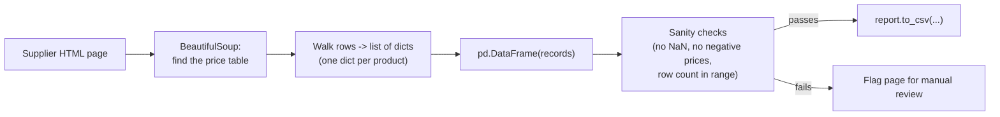

# Day 4 — Turning a Supplier Web Page Into a CSV Report

Suppliers publish price lists as plain HTML tables on their websites. Today's
task: parse the page, pull out the table, and produce a clean CSV report —
without training or calling any AI model at all.

## Why this day has no model in it

Days 1 through 3 all reached for a pretrained multimodal model because the
input — a photo, a scanned page — started out as unstructured pixels with no
inherent data model. An HTML table is the opposite case: it's *already*
structured data, wrapped in a well-defined, machine-parseable markup
language that's had standard tooling for it since the 1990s. Sending a
screenshot of this table to a vision model and asking it to "read out the
prices" would work, technically, but it would be slower (a network round
trip per page instead of local parsing), non-deterministic (the same table
could occasionally get transcribed slightly differently), and would cost
money for a problem that a twenty-year-old parsing library solves exactly
and for free. The general lesson from this week: match the tool to whether
the input is structured or not — don't reach for a model out of habit.

## Parsing HTML with BeautifulSoup

```python
from bs4 import BeautifulSoup
import requests

response = requests.get("https://example-supplier.test/catalog/fasteners")
# -> BeautifulSoup, a parsed tree of the page; "html.parser" is Python's
# built-in parser (no extra dependency); lxml is faster if you have it
soup = BeautifulSoup(response.text, "html.parser")

# find() returns the FIRST match; searching by both tag name and class
# matters here because a page can have more than one <table> — an
# unrelated "related products" table, an ad widget, etc.
price_table = soup.find("table", class_="price-list")
rows = price_table.find_all("tr")  # -> list[Tag], every <tr> inside that one table

# CSS selectors are often shorter for reaching into nested structure
product_names = soup.select("table.price-list td:nth-of-type(1)")
```

`find`/`find_all` search by tag name and attributes; `select` uses familiar
CSS selector syntax. Both are useful — reach for whichever reads more
clearly for the structure you're navigating.

**Verified** against a realistic synthetic page with two tables (an
unrelated `related-products` table plus the real `price-list` table, three
data rows): `soup.find("table", class_="price-list")` correctly skipped the
unrelated table, `len(rows)` was `4` (1 header + 3 data rows), and
`soup.select("table.price-list td:nth-of-type(1)")` returned exactly the
three product-name cells, in order.

## The pipeline: HTML to CSV



## Table rows to a dataframe

Once you have the `<tr>` elements, walk each row's `<td>` cells into a list
of dicts, then load that into a dataframe:

```python
import pandas as pd

records = []
for row in rows[1:]:  # skip the header row — index 0 is <th>, not <td>
    cells = [td.get_text(strip=True) for td in row.find_all("td")]
    # -> list[str], one string per column, whitespace-trimmed
    records.append({
        "item": cells[0],
        "unit_price": float(cells[1]),  # str -> float; raises ValueError on bad data
        "stock": int(cells[2]),         # str -> int
    })

df = pd.DataFrame(records)
# -> DataFrame with columns [item: object, unit_price: float64, stock: int64]
```

From there, normal dataframe operations apply: select the columns you care
about, sort by price, and write a report.

```python
report = df[["item", "unit_price", "stock"]].sort_values("unit_price")
report.to_csv("supplier_price_report.csv", index=False)
```

**Verified end to end** against the same synthetic page: the resulting
dataframe had exactly 3 rows, columns `["item", "unit_price", "stock"]` with
dtypes `object`, `float64`, `int64` respectively, and the CSV written to
disk — read back and printed — matched the sorted dataframe exactly, cheapest
item first:

```
item,unit_price,stock
Wood screws 1in (50ct),6.49,120
Hex bolts M8 (20ct),11.99,45
Anchor bolts M10 (10ct),14.25,0
```

## Scraping etiquette

Before pointing a scraper at any site:

- **Check `robots.txt`** (e.g. `https://example.com/robots.txt`) for paths
  the site asks crawlers not to access, and respect them. Python's standard
  library can parse this without any extra dependency:

  ```python
  from urllib.robotparser import RobotFileParser

  rp = RobotFileParser()
  rp.set_url("https://example-supplier.test/robots.txt")
  rp.read()
  if rp.can_fetch("*", "https://example-supplier.test/catalog/fasteners"):
      ...  # proceed
  ```

  **Verified** against a synthetic `robots.txt` (`Disallow: /internal-pricing/`,
  `Allow: /catalog/`, parsed with `rp.parse(lines)` rather than a live fetch):
  `can_fetch("*", "/catalog/fasteners")` returned `True` and
  `can_fetch("*", "/internal-pricing/costs")` returned `False`, exactly
  matching the rule.

- **Pace your requests** — add a short delay between page fetches instead of
  hammering the server in a tight loop; a `for` loop with `time.sleep(1)`
  between requests is a reasonable default for a small job.
- **Identify yourself** — set a descriptive `User-Agent` header rather than
  spoofing a browser.
- **Respect the site's terms of service**, not just `robots.txt` — the two
  can diverge, and `robots.txt` compliance doesn't automatically make
  scraping a given page permitted.

## Batch error handling

When scraping many supplier pages in one run, one bad page (timeout, changed
layout, missing table) shouldn't kill the whole batch:

```python
results, failures = [], []
for url in supplier_urls:
    try:
        results.append(scrape_price_table(url))
    except Exception as exc:
        failures.append({"url": url, "error": str(exc)})

print(f"{len(results)} succeeded, {len(failures)} failed")
```

**Verified** with a 3-URL batch where the middle URL was engineered to
raise: output was exactly `2 succeeded, 1 failed`, with the failing URL and
its error message correctly captured in `failures` and excluded from
`results` — the other two pages completed the run unaffected.

Collecting failures instead of raising immediately lets you finish the batch
and go fix the handful of problem pages afterward.

## A sanity check before the report ships

The scrape "succeeding" (no exception raised) isn't the same thing as the
data being *right* — a page whose layout quietly changed can still produce
a dataframe, just one full of wrong columns or missing values. A cheap
structural check catches this before a bad report reaches anyone:

```python
def sanity_check_report(df: pd.DataFrame, expected_min_rows: int = 1) -> list[str]:
    """Cheap structural checks on a scraped dataframe before it ships as a
    report. Catches the failure mode where the scrape "succeeds" (no
    exception) but the page layout changed and the data is garbage.
    """
    problems = []
    if len(df) < expected_min_rows:
        problems.append(f"only {len(df)} rows, expected >= {expected_min_rows}")
    if df["unit_price"].isna().any():
        problems.append("unit_price has missing values")
    if (df["unit_price"] <= 0).any():
        problems.append("unit_price has non-positive values")
    if df["item"].duplicated().any():
        problems.append("duplicate item rows (possible double-parsed table)")
    return problems  # -> list[str], empty means "looks fine"
```

**Verified**: a well-formed 2-row dataframe returned `[]` (no problems); a
deliberately broken dataframe (a duplicated item, a zero price, a `NaN`
price) returned all three corresponding problem strings. This is the same
instinct as Day 2's schema validation and Day 3's number-grounding check,
applied to tabular data instead of JSON or prose: don't trust that "it ran
without an exception" means "the output is correct."

## Common pitfalls

- **Table structure varies by supplier.** `colspan`/`rowspan` cells, nested
  tables, and header rows spanning two `<tr>`s all break the "row 0 is the
  header, the rest are data" assumption used above — inspect the actual
  markup per supplier rather than assuming a uniform shape.
- **JavaScript-rendered tables.** If the table only appears after
  client-side JavaScript runs, `requests.get(...).text` never contains it —
  `bs4` parses the HTML the server sent, not what a browser would render
  after executing scripts. That case needs a headless browser (outside the
  scope of this note), not a `bs4` fix.
- **Silent bad parses.** `float(cells[1])` will happily raise on a stray
  non-breaking space or currency symbol, which is at least loud — the more
  dangerous case is a value like `"1O.99"` (a letter O instead of a zero,
  from a copy-paste error on the supplier's end) that fails to parse and
  gets caught by your `try`/`except`, silently dropping a real row instead
  of raising your attention to it.
- **Pagination.** A catalog with 500 items spread across 10 pages needs a
  loop over page URLs, not a single `requests.get` — check for a "next
  page" link or a predictable `?page=N` pattern before assuming one request
  gets everything.
- **The site changes and the scraper doesn't notice.** A supplier
  redesigning their page can silently turn `price_table.find_all("tr")`
  into an empty list or the wrong table entirely. This is exactly why the
  sanity check above matters — it's the Day 4 version of the validation
  habit that runs through every day this week.

## Takeaway

HTML table scraping is a solved, non-AI problem — BeautifulSoup plus pandas
gets you from a web page to a CSV report, as long as you scrape politely,
handle per-page failures without aborting the whole run, and sanity-check
the result instead of trusting that "no exception" means "correct data."
That last habit is the same one that ran through Days 2 and 3 in a different
form — the specific check changes with the data shape, but the discipline
of not trusting output by default doesn't.
