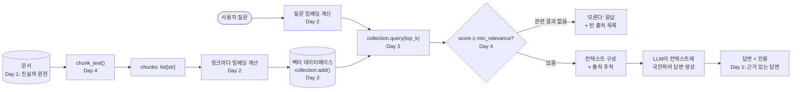

# Week 4 — 검색증강생성(RAG) 기초

일반적인 LLM은 학습 시점에 가중치 안에 저장된 것만 답할 수 있는, 닫힌 책으로
시험을 치르는 사람과 같습니다. 이번 주에는 문서 근거 기반 Q&A 시스템을 기초부터
만들어봅니다 — 어떤 공개 모델도 본 적 없는 자사 직원 매뉴얼이나 제품 매뉴얼에
대한 질문에 답할 수 있는, 작은 회사가 실제로 사용할 법한 종류의 어시스턴트입니다.

4일치 내용은 다음과 같이 순서대로 쌓입니다.

- **Day 1**은 일반 LLM이 이 작업을 할 수 *없는 이유*(환각, 지식 컷오프, 사적
  데이터에 대한 접근 불가)를 규명하고, 그 해결책을 개념적 수준에서 소개합니다 —
  RAG의 4단계 흐름입니다.
- **Day 2**는 그 흐름의 첫 번째 실제 구성 요소를 만듭니다: 텍스트를 벡터(임베딩)로
  바꾸고 코사인 유사도로 비교하여, "관련성"을 추측이 아니라 숫자로 다룰 수 있게
  합니다.
- **Day 3**은 그 비교 작업을 "파이썬 반복문 안의 몇 개 문단"에서 "수십만 개의
  청크"로 확장합니다 — 모든 벡터 데이터베이스가 공통으로 제공하는
  create/add/query 형태를 그대로 사용합니다.
- **Day 4**는 마지막 고리를 닫습니다: 실제 문서를 검색 가능한 청크로 나누고,
  실제로 검색된 내용에서만 답하며 관련된 내용이 없을 때는 정직하게 모른다고
  답하는 `answer()` 함수를 작성합니다.

## 4일치 내용이 하나의 시스템으로 합쳐지는 방식

아래 그림에서 위쪽 줄(인덱싱)은 문서 집합이 바뀔 때마다 한 번, 오프라인으로
일어납니다. 아래쪽 줄(질의)은 사용자의 질문마다 한 번, 답변 시점에 일어납니다.
두 흐름은 유사도 검색 단계에서 만납니다 — 인덱싱 중에 만들어둔 벡터가 바로
질의가 비교되는 대상입니다.

| Day | 주제 | 노트 |
|---|---|---|
| Day 1 | [왜 당신의 LLM은 회사 매뉴얼을 모를까](daily/Day1_llm-limits-and-rag-intro.md) | 환각과 컷오프가 왜 버그가 아니라 구조적 한계인지; RAG vs. 파인튜닝; 오픈북 시험 비유; RAG 4단계 흐름 |
| Day 2 | [텍스트를 비교 가능한 숫자로 바꾸기](daily/Day2_embeddings-and-cosine-similarity.md) | 임베딩 공간이란 무엇인지, 처음부터 만든 n-그램 토이 임베딩, 손으로 검증한 코사인 유사도 수식, 실제로 실행되는 TF-IDF 검색 데모, 철자 vs. 의미의 한계 |
| Day 3 | [임베딩을 대규모로 저장하기: 벡터 데이터베이스](daily/Day3_vector-databases.md) | 무차별 대입 검색이 확장되지 않는 이유, 실제로 동작하는 인메모리 벡터 스토어(n=20,000에서 파이썬 반복문 대비 약 150배 빠름을 측정), 거리 vs. 유사도, 개념 수준의 ANN 인덱싱 |
| Day 4 | [문서를 청크로 나누고 검색된 내용만으로 답변하기](daily/Day4_chunking-and-grounded-answers.md) | 문서 전체를 보내지 않는 이유, 테스트를 거친 overlap 포함 단어 수 기반 청킹, 전체 검색 파이프라인, 인용과 정직한 거부를 포함한 `answer()` 패턴, 실제로 재현한 오탐(false positive) 검색 사례 |

4일치를 모두 담은 실행 가능한 노트북 1개는
[`concepts/4th_week_Concepts.ipynb`](concepts/4th_week_Concepts.ipynb)를
참고하세요 — 이 안의 모든 코드 셀은 이 환경에서 직접 실행되었고(numpy,
scikit-learn, 순수 파이썬만 사용, 네트워크 호출 없음, 무거운 ML 프레임워크
없음), 표시된 출력은 실제 실행 결과입니다.

한국어 노트: [`daily/`](daily/) 폴더의 각 `.ko.md` 파일과
[`concepts/4th_week_Concepts.ko.ipynb`](concepts/4th_week_Concepts.ko.ipynb)를
참고하세요.
