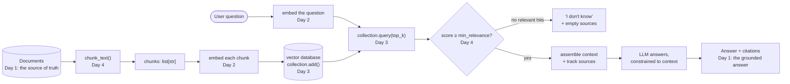

# Week 4 — Retrieval-Augmented Generation (RAG) Fundamentals

A general-purpose LLM is a closed-book test-taker: it answers from whatever
got baked into its weights during training, and nothing else. This week
builds a document-grounded Q&A system from first principles — the kind of
system a small company would use to let an assistant answer questions about
its own employee handbook or product manuals, documents no public model has
ever seen.

The four days build on each other in a straight line:

- **Day 1** establishes *why* a plain LLM can't do this (hallucination,
  knowledge cutoff, no access to private data) and introduces the fix at a
  conceptual level — the four-stage RAG flow.
- **Day 2** builds the first real piece of that flow: turning text into
  vectors (embeddings) and comparing them with cosine similarity, so
  "relevant" becomes a number instead of a guess.
- **Day 3** scales that comparison from "a handful of passages in a Python
  loop" to "hundreds of thousands of chunks," using the same
  create/add/query shape every vector database exposes.
- **Day 4** closes the loop: splitting real documents into retrievable
  chunks, and writing the `answer()` function that only ever answers from
  what was actually retrieved — refusing honestly when nothing relevant
  was found.

## How the four days fit into one system

Indexing (top row below) happens once, offline, whenever your document set
changes. Querying (bottom row) happens once per user question, at answer
time. They meet at the similarity search step — the vectors built during
indexing are exactly what a query gets compared against.

| Day | Topic | Notes |
|---|---|---|
| Day 1 | [Why your LLM doesn't know your company's handbook](daily/Day1_llm-limits-and-rag-intro.md) | Why hallucination and cutoff are structural, not bugs; RAG vs. fine-tuning; the open-book-exam analogy; the 4-stage RAG flow |
| Day 2 | [Turning text into numbers you can compare](daily/Day2_embeddings-and-cosine-similarity.md) | What an embedding space is, a from-scratch n-gram toy embedding, cosine similarity math worked by hand, a real TF-IDF retrieval demo, the spelling-vs-meaning limitation |
| Day 3 | [Storing embeddings at scale: vector databases](daily/Day3_vector-databases.md) | Why brute-force search stops scaling, a real in-memory vector store (add/query, measured ~150x faster than a Python loop at n=20,000), distance vs. similarity, ANN indexing at a conceptual level |
| Day 4 | [Chunking documents and answering only from what you retrieved](daily/Day4_chunking-and-grounded-answers.md) | Why not send whole documents, a tested word-count chunker with overlap, a full retrieval pipeline, the `answer()` pattern with citations and honest refusal, a real false-positive-retrieval pitfall |

See [`concepts/4th_week_Concepts.ipynb`](concepts/4th_week_Concepts.ipynb) for a
single runnable notebook covering all four days — every code cell in it was
executed in this environment (numpy, scikit-learn, and pure Python only; no
network calls, no heavy ML frameworks) and the outputs shown are real.

Korean translation: [`README.ko.md`](README.ko.md).
