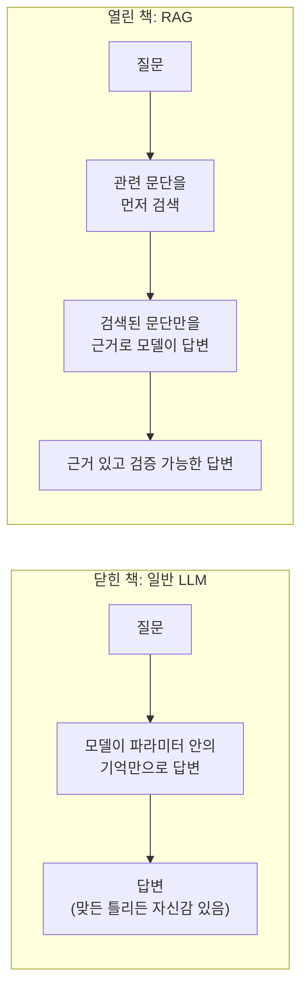

# Day 1 — 왜 당신의 LLM은 회사 매뉴얼을 모를까

**이번 주의 시나리오:** 어느 작은 회사가 자사의 직원 매뉴얼과 제품 매뉴얼에
대한 질문에 답할 수 있는 사내 어시스턴트를 원합니다 — 어떤 공개 모델도 본 적
없고, 누군가 답변 시점에 직접 건네주지 않는 이상 앞으로도 볼 수 없는 문서들
입니다.

일반적인 LLM에게 "우리 회사 신입사원은 연차를 며칠 받나요?"라고 물으면 모델은
답을 내놓습니다. 이게 바로 문제이지, 안심할 부분이 아닙니다 — 실제로 알고
있든 모르든 모델은 답을 하고, 그 둘을 겉으로 구분할 방법이 없습니다. 이유를
이해하려면 모델이 답변할 때 실제로 무엇을 하고 있는지부터 이해해야 합니다.

## 일반 LLM이 실제로 하는 일

LLM은 거대한 학습 코퍼스 전체에 걸쳐, 앞에 나온 모든 내용을 바탕으로 다음
토큰을 예측하도록 반복해서 학습됩니다. 학습이 끝난 뒤 "질문에 답하기"는 바로
그 예측 과정을 다시 반복하는 것일 뿐입니다: 질문을 프롬프트로 주면, 통계적으로
가장 그럴듯한 다음 내용을 한 토큰씩 만들어냅니다. 이 과정 어디에도 사실
데이터베이스를 조회하거나, 무언가를 찾아보거나, 주장이 참인지 확인하는 절차는
없습니다. 모델이 맞히는 사실들은 그런 종류의 프롬프트에 대해 학습 데이터에서
올바른 이어짐이 통계적으로 우세했기 때문에 맞는 것이지, 모델이 사실을 조회하고
검증했기 때문이 아닙니다.

이 점이 중요한 이유는, 유창함과 정확함이 서로 독립적인 두 가지라는 뜻이기
때문입니다. 모델은 "신입사원은 연차를 15일 받습니다"처럼 문법적으로 완벽하고
자신감 있고 구체적인 문장을, 그 숫자가 진짜든 지어낸 것이든 정확히 같은
메커니즘으로 만들어낼 수 있습니다. 모델을 특별히 불확실성을 표현하도록
학습시키지 않는 한 출력에 안정적으로 드러나는 내부적인 "확실하지 않음" 신호는
없으며, 설령 그렇게 학습시켰다 해도 그것은 실제 진실 여부를 검증한 결과가
아니라 학습된 행동일 뿐입니다.

## 일반 LLM의 세 가지 한계

이런 메커니즘을 전제로 하면 세 가지 서로 다른 실패 양상이 자연스럽게
따라옵니다.

1. **환각(Hallucination)** — 실제 정답에 대한 강한 신호가 없을 때 모델은
   답변을 거부하지 않습니다. 그저 *가장 그럴듯하게 들리는* 이어짐을
   만들어낼 뿐입니다. "그럴듯한 이어짐을 만드는 것"이 모델이 학습받은
   유일한 목표이기 때문입니다. 그럴듯하게 들리는 숫자와 실제로 맞는 숫자는
   출력에서 똑같아 보입니다.
2. **지식 컷오프(Knowledge cutoff)** — 거대한 코퍼스를 학습하는 데는 시간이
   걸리고, 그 코퍼스는 어떤 시점까지 수집됩니다. 그 시점 이후에 작성되거나
   변경되거나 갱신된 내용은 학습 예시에 단 한 번도 등장하지 않았으므로, 모델이
   그에 대해 학습할 만한 통계적 패턴 자체가 존재하지 않습니다. 회사가 지난달에
   바꾼 정책은 모델에게는 어떤 형태로도 존재하지 않습니다 — 낡은 버전으로도,
   부분적인 신호로도, 아무것도 아닙니다.
3. **사적 문서에 대한 접근 불가** — 이건 시점의 문제가 전혀 아닙니다. 당신
   회사의 직원 매뉴얼은 애초에 공개 데이터였던 적이 없으므로, 컷오프와
   무관하게 애초에 학습 데이터 후보가 된 적도 없습니다. 어제 학습을 마친
   모델이라 해도, 어디에도 공개된 적 없는 문서에 대해서는 전혀 알지
   못합니다. 이 한계는 모델이 아무리 최신이고 아무리 커지더라도 사라지지
   않습니다.

이 세 가지는 최악의 방식으로 겹칩니다: 모델은 자신이 지금 어떤 한계에
부딪혔는지 알려줄 수 없습니다. 내부적으로 보면 "이건 모른다"와 "알고 있고
맞다"가 완전히 동일한 생성 메커니즘을 사용하기 때문입니다.

## 왜 프롬프트나 파인튜닝으로는 이 문제를 피해갈 수 없을까

자연스러운 본능은 "그냥 조심하라고 말해주면 되지 않나"입니다 — 프롬프트에
"확실할 때만 답하라"를 추가하는 식입니다. 이건 어느 정도 도움이 됩니다
(자신감 있게 들리는 환각을 어느 정도 줄일 수 있습니다)만, 구조적인 문제는
고치지 못합니다: 모델은 여전히 자신을 검증할 근거 진실(ground truth)이
없습니다. 이건 추측을 사실로 바꾸는 게 아니라, 추측을 *얼마나 자신감 있게*
표현하는지를 조정하는 것뿐입니다.

다른 자연스러운 본능은 파인튜닝입니다 — 회사 문서로 모델을 추가 학습시켜서
그 사실들도 가중치에 녹여 넣는 방식입니다. 이건 실제로 효과가 있을 수
있지만, 한 문제를 다른 문제로 바꾸는 셈입니다.

| | 사적 문서로 파인튜닝 | RAG |
|---|---|---|
| **사실 하나를 갱신하려면** | 학습을 다시 돌려야 함 | 문서 하나를 다시 인덱싱하면 됨 |
| **갱신 비용** | 높음 (컴퓨팅 + 엔지니어링 시간) | 낮음 (바뀐 텍스트에 대한 임베딩 계산 한 번) |
| **추적 가능성** | 모델이 그냥 "알고 있을" 뿐 — 출처를 짚을 방법이 없음 | 모든 답변이 실제로 나온 문단을 인용할 수 있음 |
| **최신성** | 학습이 끝나는 순간 다시 고정됨 | 마지막 인덱스 갱신 시점만큼 최신 |
| **작고 자주 바뀌는 문서(매뉴얼 같은)** | 잘 맞지 않음 — 작은 수정마다 계속 재학습해야 함 | 잘 맞음 — 정확히 이 용도를 위한 방식 |

RAG가 모든 경우에 파인튜닝을 대체하는 건 아닙니다 (모델에게 새로운 *사실*이
아니라 새로운 *기술*이나 *스타일*을 가르치는 데는 여전히 파인튜닝이 맞는
도구입니다). 하지만 "특정하고 계속 바뀌는 문서 집합에서 질문에 답하기"라는
용도에는 RAG가 더 저렴하면서도 더 정직합니다. 근거를 보여줄 수 있기
때문입니다.

## RAG: 오픈북 시험

검색증강생성(Retrieval-Augmented Generation)은 사적 문서 문제를, 오픈북
시험이 "정확한 수치가 기억나지 않는다"는 문제를 해결하는 것과 똑같은 방식으로
해결합니다: 기억에 의존하는 대신, 학습 데이터에 무엇이 있었는지와 무관하게
*답변하는 바로 그 순간에* 관련 페이지를 모델에게 건네줍니다.

오픈북 시험 비유는 왜 RAG가 더 똑똑한 모델을 요구하지 않는지도 설명해줍니다.
아무것도 공부하지 않았지만 정확한 페이지가 펼쳐진 교과서를 손에 든 학생은,
이런 종류의 질문에서는 기억에만 의존하는 훨씬 뛰어난 학생을 이깁니다. RAG
시스템에서 병목이 되는 건 대개 모델 크기가 아니라 검색 품질입니다.

## 4단계 흐름

구현 방식이 무엇이든, 모든 RAG 시스템은 결국 같은 4단계로 귀결됩니다.

1. **문서** — 매뉴얼, 정책 문서 등 진실의 원천이 되는 원본 자료입니다. 실제
   세계에서 갱신되는 대상이며, 모든 답변이 궁극적으로 거슬러 올라가야 할
   대상이기도 합니다.
2. **인덱싱** — 문서를 검색 가능한 조각으로 나누고(Day 4), 각 조각을 의미를
   담아내는 벡터로 바꿔서(Day 2), 질의를 키워드 매칭이 아니라 숫자로 비교할
   수 있게 합니다.
3. **검색** — 사용자의 질문을 같은 방식으로 벡터로 바꾸고, 저장된 조각들 중
   그 벡터와 가장 가까운 것을 찾습니다(Day 2, 3). 이 단계는 질문마다 새로
   일어나며, 모델 안에 미리 내장되어 있지 않습니다.
4. **생성** — 질문과 검색된 조각들을 함께 모델에 건네고, 주어진 내용만으로
   답하라고, 그리고 검색된 내용이 실제로 질문에 답하지 못한다면 정직하게
   그렇다고 말하라고 명시적으로 지시합니다(Day 4).

인덱싱은 드물게 일어나지만(문서가 바뀔 때마다), 검색과 생성은 질문마다
일어납니다. 이 비대칭성이야말로 "한 번 청킹하고 여러 번 질의한다"(Day 2-4)가
매 질문마다 문서 집합 전체를 다시 처리하는 것보다 옳은 구조인 이유입니다.

## 근거 없는 답변 vs. 근거 있는 답변

**질문:** "신입사원은 연차를 며칠 받나요?"

| 근거 없음 (일반 LLM) | RAG (근거 있음) |
|---|---|
| "일반적으로 회사들은 신입사원에게 약 15일의 연차를 제공합니다." | "매뉴얼(4.2절)에 따르면: '신입사원은 입사 첫 해에 연차 12일을 적립합니다.' → **12일**." |
| 그럴듯하게 들립니다. 사실은 업계 일반론에 대한 추측을 구체적인 답처럼 포장한 것입니다. | 답변이 나온 정확한 출처 문단을 인용합니다. |
| 이미 정답을 아는 사람에게 물어보지 않는 이상 확인할 방법이 없습니다. | 아무 독자나 4.2절을 직접 펼쳐서 비교해볼 수 있습니다. |

근거 없는 답변이 명백하게 틀린 건 아닙니다 — 그럴듯한 범위 안의 숫자라는
점이야말로 환각을 위험하게 만드는 요소입니다. 조용히 실패합니다. 근거 있는
답변도 여전히 틀릴 수 있습니다(검색이 잘못된 절을 골랐거나, 매뉴얼 자체가
낡았다면). 하지만 이제 그 실패는 *눈에 보이고 검증 가능*하다는 점에서 근본적으로
다른 종류의 위험입니다.

## 흔한 함정 (이번 주 나머지 내용의 예고편)

- **RAG는 어려운 문제를 옮길 뿐, 없애지 않습니다.** Day 2-3의 검색 단계가
  잘못된 문단을 반환하면, 모델은 여전히 유창하고 자신감 있게 답합니다 — 이번엔
  아무 근거도 없는 게 아니라 *잘못된* 출처에 근거해서 말이죠. 잘못된 인용은
  근거 없는 추측보다 더 설득력이 있으며, 그래서 검색 품질이 시스템 전체에서
  가장 중요한 변수가 됩니다.
- **모델은 컨텍스트 안에 머무르라는 지시를 무시할 수 있습니다.** "아래
  컨텍스트에서만 답하라"는 지시는 특히 검색된 컨텍스트가 빈약하거나 질문과
  간접적으로만 관련될 때, 모델이 외부 지식을 섞어 넣는 것을 줄여주긴 하지만
  완전히 막아주지는 못합니다. Day 4의 answer 함수가 명시적인 관련성 검사를
  포함하는 이유가 바로 이것입니다.
- **오래된 인덱스는 새로운 형태의 낡은 지식 문제입니다.** RAG는 "모델이
  이걸 학습한 적이 없다"는 문제를 해결하지만, 인덱스가 실제 문서와 계속
  동기화되어 있을 때만 그렇습니다. 한 번 만들고 다시 갱신하지 않은 인덱스는
  RAG가 원래 해결하려던 낡은 지식 문제를 한 단계 위에서 그대로 재현하게
  됩니다.

## 정리

RAG는 모델을 더 똑똑하게 만들지 않습니다 — 답하기 전에 읽을 수 있는 진짜
정보를 모델에게 줄 뿐입니다. 환각과 지식 컷오프는 LLM이 텍스트를 생성하는
방식에서 비롯된 구조적 속성이지 프롬프트로 피해갈 수 있는 버그가 아니며,
사적 문서는 애초에 컷오프와 무관하게 학습 데이터에 들어갈 일이 없었습니다.
이번 주 나머지 내용은 바로 그 "답하기 전에 읽을 수 있는 진짜 정보"를 만드는
방법을 다룹니다: 텍스트를 비교 가능한 숫자로 바꾸고(Day 2), 그 숫자들을
대규모로 저장하고 검색하고(Day 3), 최종 답변이 실제로 찾아낸 내용 안에서만
머무르도록 규율을 세우는 것입니다(Day 4).
