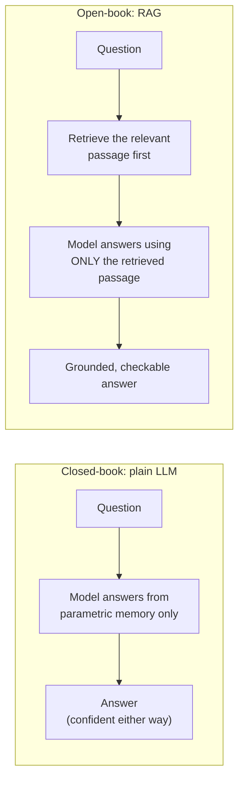
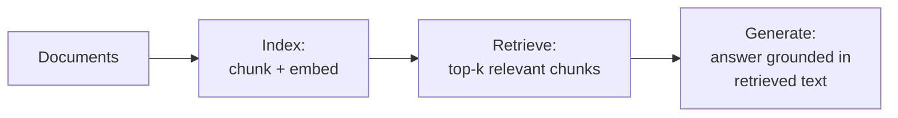

# Day 1 — Why Your LLM Doesn't Know Your Company's Handbook

**Scenario for the week:** a small company wants an internal assistant that
can answer questions about its own employee handbook and product manuals —
documents no public model has ever seen, and never will see, unless someone
hands them over at answer time.

Ask a general-purpose LLM "how many vacation days do new hires get at [our
company]?" and it will answer. That's the problem, not the reassurance —
it will answer whether or not it actually knows, and there is no visible
difference between the two cases. Understanding *why* requires understanding
what the model is actually doing when it answers.

## What a plain LLM is actually doing

An LLM is trained to predict the next token given everything before it,
over and over, across a huge training corpus. After training, "answering a
question" is just running that same prediction repeatedly: given your
question as a prompt, produce the most statistically plausible continuation,
one token at a time. Nothing in that process consults a fact database,
looks anything up, or checks whether a claim is true. Facts the model gets
right are right because correct continuations were statistically dominant
in training data for that kind of prompt — not because the model retrieved
and verified them.

This matters because it means fluency and correctness are two independent
things. A model can produce a perfectly grammatical, confident, specific
sentence — "new hires accrue 15 vacation days" — using exactly the same
mechanism whether that number is real or fabricated. There is no internal
"I'm not sure" signal that reliably surfaces in the output unless the model
was specifically trained to express uncertainty, and even then it's a
learned behavior, not a genuine check against ground truth.

## Three limits of a plain LLM

Given that mechanism, three distinct failure modes fall out of it:

1. **Hallucination** — when the model has no strong signal for the actual
   answer, it doesn't refuse; it produces the *most plausible-sounding*
   continuation anyway, because "produce a plausible continuation" is the
   only thing it was ever trained to do. A number that sounds right and a
   number that is right look identical in the output.
2. **Knowledge cutoff** — training on a huge corpus takes time, and the
   corpus is collected up to some date. Anything written, changed, or
   updated after that date literally never appeared in any training
   example, so there's no statistical pattern for it to have learned at
   all. A policy the company changed last month doesn't exist to the model
   in any form — not as an outdated version, not as a partial signal,
   nothing.
3. **No access to private documents** — this one isn't about timing at all.
   Your employee handbook was never public data, so it was never candidate
   training data, cutoff or not. Even a model trained yesterday has zero
   knowledge of a document that was never published anywhere it could see.
   This is the limit that persists no matter how new or how large the model
   gets.

These three compound in the worst possible way: the model can't tell you
which one it's hitting, because from the inside, "I don't know this" and
"I know something and it's right" use the exact same generation mechanism.

## Why you can't prompt or fine-tune your way out of this

A natural instinct is "just tell it to be careful" — add "only answer if
you're sure" to the prompt. This helps at the margins (it can reduce
confident-sounding hallucination somewhat) but doesn't fix the structural
problem: the model still has no ground truth to check itself against. It's
adjusting *how confidently* it phrases a guess, not converting a guess into
a fact.

The other natural instinct is fine-tuning — retrain the model further on
your company's documents so the facts get baked into its weights too. This
actually can work, but it trades one set of problems for another:

| | Fine-tuning on private docs | RAG |
|---|---|---|
| **Updating a fact** | Requires re-running training | Requires re-indexing one document |
| **Cost per update** | High (compute + engineering time) | Low (an embedding pass over changed text) |
| **Traceability** | The model just "knows" it — no way to point at a source | Every answer can cite the exact passage it came from |
| **Staleness** | Frozen again the moment training ends | Current as of the last index refresh |
| **Small, frequently-changing docs (like a handbook)** | Poor fit — constant retraining for small edits | Good fit — this is exactly the use case |

RAG doesn't replace fine-tuning in every case (fine-tuning is still the
right tool for teaching a model a new *skill* or *style*, not new facts),
but for "answer questions from a specific, changing set of documents," RAG
is both cheaper and more honest, because it can show its work.

## RAG: the open-book exam

Retrieval-Augmented Generation fixes the private-document problem the same
way an open-book exam fixes "I don't remember the exact figure": instead of
relying on memory, you hand the model the relevant page *at answer time*,
every time, regardless of what happened to be in its training data.

The open-book exam framing also explains why RAG doesn't require a smarter
model. A student who studied nothing but has the textbook open to the right
page will out-perform a much stronger student working from memory alone,
on this specific kind of question. Retrieval quality, not model size, is
usually the bottleneck in a RAG system.

## The four-stage flow

Every RAG system, no matter how it's implemented, reduces to the same four
stages:

1. **Documents** — your handbook, manuals, policies: the raw source of
   truth. This is the thing that gets updated in the real world, and the
   thing every answer should ultimately trace back to.
2. **Index** — break documents into searchable pieces (Day 4) and turn each
   piece into a vector that captures its meaning (Day 2), so a query can be
   compared against it numerically rather than by keyword matching.
3. **Retrieve** — given a user's question, turn it into a vector the same
   way, and find the stored pieces whose vectors are closest to it (Days 2
   and 3). This step happens fresh for every question — it's not baked into
   the model at all.
4. **Generate** — hand the model the question *plus* the retrieved pieces,
   with an explicit instruction to answer only from what it was given, and
   to say so honestly if the retrieved pieces don't actually answer the
   question (Day 4).

Indexing happens rarely (whenever documents change); retrieval and
generation happen on every single question. That asymmetry is exactly why
"chunk once, query many times" (Days 2–4) is the right shape for the
system, rather than re-processing the whole document set on every question.

## Ungrounded vs. grounded, side by side

**Question:** "How many vacation days does a new hire get?"

| Ungrounded (plain LLM) | RAG (grounded) |
|---|---|
| "Typically, companies offer around 15 days of PTO for new employees." | "According to the handbook (Section 4.2): 'New hires accrue 12 vacation days in their first year.' → **12 days**." |
| Sounds reasonable. Is generic industry guesswork dressed up as a specific answer. | Cites the exact source snippet the answer came from. |
| No way to check it without asking someone who already knows the real answer. | Checkable by any reader — go open Section 4.2 and compare. |

The ungrounded answer isn't obviously wrong — a plausible-sounding number in
the right ballpark is precisely what makes hallucination dangerous. It fails
silently. The grounded answer might still be wrong (if retrieval picked the
wrong section, or the handbook itself is out of date), but the failure mode
is now *visible and checkable*, which is a fundamentally different kind of
risk.

## Common pitfalls (a preview of the rest of the week)

- **RAG only moves the hard problem, it doesn't remove it.** If Day 2–3's
  retrieval step returns the wrong passage, the model will still answer
  fluently and confidently — now grounded in the *wrong* source instead of
  in nothing at all. A wrong citation is more convincing than an
  unsupported guess, which makes retrieval quality the most important
  variable in the whole system.
- **A model can ignore the instruction to stay in-context.** Telling the
  model "answer only from the context below" reduces but does not
  guarantee against it blending in outside knowledge, especially when the
  retrieved context is thin or tangentially related. Day 4's answer
  function includes an explicit relevance check for exactly this reason.
- **An out-of-date index is a new source of staleness.** RAG fixes the
  "model was never trained on this" problem, but only if the index is kept
  in sync with the real documents. An index built once and never refreshed
  slowly becomes exactly the stale-knowledge problem RAG was built to
  solve, just one layer up.

## Takeaway

RAG doesn't make a model smarter — it gives a model something true to read
before it answers. Hallucination and knowledge cutoff are structural
properties of how an LLM generates text, not bugs you can prompt away, and
private documents were never going to be in the training data regardless.
The rest of this week is about building the "something true to read" part:
turning text into comparable numbers (Day 2), storing and searching those
numbers at scale (Day 3), and disciplining the final answer to stay inside
what was actually found (Day 4).
