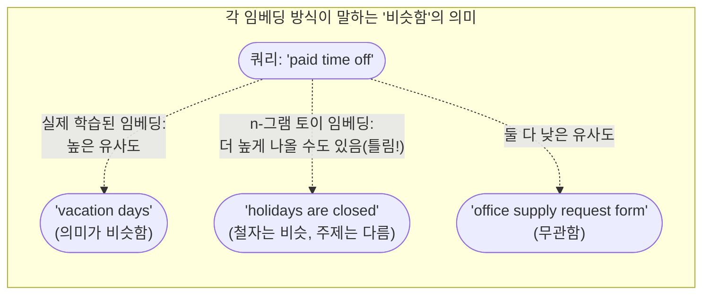

# Day 2 — 텍스트를 비교 가능한 숫자로 바꾸기

Day 1에서 말한 "관련 있는 매뉴얼 문단을 검색한다"를 실현하려면, 질문과 문단이
철자가 아니라 *의미*상으로 얼마나 가까운지 측정할 방법이 필요합니다. 키워드
검색(질문에 나온 단어가 문단에 있는가?)은 바로 이 지점에서 계속 실패합니다:
"paid time off(유급 휴가)"에 대한 질문과 "vacation days(연차)"에 대한 문단은
공유하는 단어가 거의 없지만, 같은 것을 묻고 있습니다. 임베딩은 바로 이 문제를
해결하기 위해 존재합니다.

## 임베딩이란 무엇인가

임베딩은 벡터입니다 — 텍스트 한 조각을 나타내는 고정 길이 숫자 목록으로,
의미가 비슷한 텍스트들이 비슷한 벡터로 자리 잡도록 고차원 공간에 배치됩니다.
여기서 "비슷하다"는 기하학적인 의미입니다: 정확한 위치나 크기와 무관하게,
대략 같은 방향을 가리키는 두 벡터를 말합니다. 실제로 학습된 임베딩
모델(임베딩 API를 통해 접근하거나, 로컬에서 실행하거나, 오픈소스 모델로 만든
것)은 방대한 텍스트로 학습되어 바로 이 기하학적 속성이 의미적 유사성을
추적하도록 만들어집니다 — 그래서 "time off"와 "vacation days"는 공유하는
단어가 하나도 없어도 가까이 자리 잡고, "vacation days"와 "vacation
destination"은 단어를 하나 공유해도 멀리 떨어집니다.

정확한 숫자보다 개념적으로 더 중요한 건 차원 수입니다: 64차원짜리 토이
벡터와 1536차원짜리 프로덕션 임베딩은 같은 *종류*의 일을 하고 있습니다 —
텍스트를 공간상의 한 점으로 바꾸는 것 — 다만 그 공간 안에 담긴 학습된 구조의
양이 완전히 다를 뿐입니다.

## API 없이 직접 만드는 토이 임베딩

네트워크 호출이나 학습된 모델 없이 직관을 쌓기 위해, **문자 n-그램**을
이용해 임베딩을 흉내 낼 수 있습니다: 텍스트를 겹치는 3글자 조각("trigram",
3-그램)으로 쪼개고, 각 조각을 고정 크기 벡터의 한 버킷으로 해싱하면서 등장할
때마다 카운터를 올립니다.

```python
import hashlib

def toy_embed(text: str, dims: int = 64) -> list[float]:
    # dims=64는 텍스트가 길든 짧든 항상 길이 64짜리 벡터가 된다는 뜻이다 --
    # 원본 텍스트 길이와 무관한 고정 크기 "지문"이다.
    vec = [0.0] * dims
    text = text.lower().replace(" ", "_")
    for i in range(len(text) - 2):
        trigram = text[i:i + 3]
        # 3-그램을 [0, dims) 범위의 버킷으로 해싱한다. 서로 다른 3-그램이
        # 같은 버킷으로 충돌할 수 있다 -- 이는 고정 크기와 완벽한 구분
        # 사이의 의도된 트레이드오프이지, 버그가 아니다.
        bucket = int(hashlib.md5(trigram.encode()).hexdigest(), 16) % dims
        vec[bucket] += 1.0
    return vec  # -> list[float], len == dims, 텍스트의 대략적인 "문자 모양"
```

쿼리에 대해 실행해보면 실제로 길이 64짜리 벡터가 만들어집니다:
`toy_embed("how much paid time off do I get")`는 `len(vec) == 64`이며, 그중
25개 버킷이 0이 아닙니다(아래에서 검증). 벡터 대부분이 0인 이유는, 짧은
문장이 64개 가능한 버킷 중 일부만 건드리기 때문입니다.

이렇게 하면 *어떤* 벡터든 만들어지고, 겹치는 부분 문자열이 많은 텍스트끼리는
실제로 비슷한 벡터를 얻습니다 — 하지만 곧 보게 되듯이 "비슷한 철자"는 "비슷한
의미"와 같지 않으며, 그 간극이야말로 학습된 임베딩 모델이 존재하는 이유
전부입니다.

## 코사인 유사도

두 벡터가 주어졌을 때, 코사인 유사도는 두 벡터 사이 각도의 코사인 값을
측정합니다: 1.0이면 정확히 같은 방향(두 벡터가 가질 수 있는 가장 비슷한
관계)이고, 0이면 직교(무관함), -1.0이면 정반대 방향입니다. 결정적으로 이
값은 **벡터의 길이를 무시**합니다 — 방향만 중요합니다 — 그래서 길고 반복적인
문서라고 해서 원시 카운트 값이 크다는 이유만으로 쿼리에 대해 자동으로 높은
점수를 받지 않습니다.

```python
import math

def cosine_similarity(a: list[float], b: list[float]) -> float:
    dot = sum(x * y for x, y in zip(a, b))          # a를 b에 투영한 값(정규화 전)
    norm_a = math.sqrt(sum(x * x for x in a))         # a의 길이(크기)
    norm_b = math.sqrt(sum(y * y for y in b))         # b의 길이(크기)
    return dot / (norm_a * norm_b) if norm_a and norm_b else 0.0
    # 두 노름으로 나누는 것이 바로 답에서 길이를 제거하는 부분이다
```

길이 무관성을 구체적으로 보여주는 예시가 있습니다. 2차원 벡터 네 개를
생각해봅시다: `a = [1, 0]`(동쪽), `b = [1, 1]`(북동쪽, 45°), `c = [0,
1]`(북쪽), `d = [5, 0]`(동쪽, `a`와 같은 방향이지만 길이는 5배). `numpy`로
계산하면:

```python
import numpy as np

def cos_np(u, v):
    return float(np.dot(u, v) / (np.linalg.norm(u) * np.linalg.norm(v)))

a, b, c, d = np.array([1.0, 0.0]), np.array([1.0, 1.0]), np.array([0.0, 1.0]), np.array([5.0, 0.0])
cos_np(a, b)  # -> 0.7071...  == cos(45°), math.cos(math.radians(45))와 정확히 일치
cos_np(a, c)  # -> 0.0        a와 c는 서로 수직: 완전히 "무관한" 방향
cos_np(a, a)  # -> 1.0        같은 방향, 가능한 최댓값
cos_np(a, d)  # -> 1.0        d가 5배 더 길어도 a와 방향이 같으므로 길이는 사라진다
```

네 결과 모두 손 계산과 정확히 일치합니다(추론이 아니라 실제로 실행한
결과입니다): `cos(a, b) = 0.7071067811865475`, `cos(a, c) = 0.0`, `cos(a,
a) = 1.0`, 그리고 핵심 포인트인 `cos(a, d) = 1.0` — `|d| = 5`이고 `|a| = 1`
임에도 그렇습니다. 코사인 유사도는 "vacation"이라는 단어를 500번 반복하는
문서를, *방향*(상대적인 단어 구성 비율)이 같기만 하다면 "vacation days"를
한 번만 언급하는 문서와 정확히 같은 유사도로 취급합니다. 이건 의도된
설계입니다: 문서가 길다는 이유만으로 관련성이 높아져서는 안 되기 때문입니다.

## 쿼리에 대해 후보 문단 순위 매기기

가장 잘 맞는 문단을 찾으려면: 쿼리를 임베딩하고, 모든 후보를 임베딩한 뒤,
각각에 코사인 유사도로 점수를 매기고 내림차순으로 정렬합니다.

```python
query_vec = toy_embed("how much paid time off do I get")
scored = sorted(
    ((cosine_similarity(query_vec, toy_embed(doc)), doc) for doc in passages),
    reverse=True,  # 유사도가 높은 순
)
top_match = scored[0]
```

실제 매뉴얼 스타일 문단 4개에 대해 실행하면, n-그램 토이 임베딩은 실제로
다음과 같은 결과를 반환합니다(검증된 출력이며, 예시로 지어낸 것이 아닙니다):

```
0.5362  The office is closed on all federal holidays.
0.5296  Paid time off requests must be submitted two weeks in advance.
0.4317  Employees may take a scenic vacation to the mountains.
0.3297  New hires accrue 12 vacation days in their first year.
```

이 순위를 잘 보면: "how much paid time off do I get"에 실제로 답하는
문장 — 구체적인 연차 일수를 명시한 문장 — 이 네 개 중 **가장 마지막**
순위입니다. "The office is closed on all federal holidays(사무실은 모든
공휴일에 문을 닫습니다)"가 1위를 차지한 이유는 순전히, 실제 답을 가진
문장보다 쿼리와 더 많은 3글자 부분 문자열을 공유하기 때문입니다. 이건 지어낸
사례가 아니라 실제 실패 사례입니다.



## 한 단계 발전: 실제로 실행 가능한 임베딩, TF-IDF

문자 n-그램은 학습된 표현이 아니라 해싱 트릭입니다. 실제 임베딩에 한 걸음 더
가까우면서도 `scikit-learn`으로 네트워크 호출 없이 완전히 실행 가능한
방법이 **TF-IDF**(단어 빈도-역문서 빈도)입니다: 각 문서를 (문자가 아니라)
*단어 어휘* 전체에 대한 벡터로 표현하되, 각 단어의 가중치는 그 문서 안에서는
자주 등장하면서 전체 컬렉션에서는 드물게 등장할수록 높아지도록 계산합니다.

```python
from sklearn.feature_extraction.text import TfidfVectorizer
from sklearn.metrics.pairwise import cosine_similarity as sk_cosine

passages = [
    "New hires accrue 12 vacation days in their first year.",
    "The office is closed on all federal holidays.",
    "Employees may take a scenic vacation to the mountains.",
    "Paid time off requests must be submitted two weeks in advance.",
]
query = "how much paid time off do I get"

# passages와 query를 함께 fit해서 둘이 같은 어휘 공간에 살도록 한다 --
# fit_transform은 나중에 점수를 매길 모든 단어를 미리 봐야 한다.
vectorizer = TfidfVectorizer()
doc_matrix = vectorizer.fit_transform(passages)   # shape: (문서 4개, V=34개 단어), sparse
query_vec = vectorizer.transform([query])          # shape: (1, V=34개 단어), sparse

sims = sk_cosine(query_vec, doc_matrix)[0]         # shape: (4,) 문서마다 점수 하나
```

검증된 출력(어휘 크기 `V = 34`, `doc_matrix.shape = (4, 34)`,
`query_vec.shape = (1, 34)`):

```
0.5315  Paid time off requests must be submitted two weeks in advance.
0.0000  The office is closed on all federal holidays.
0.0000  New hires accrue 12 vacation days in their first year.
0.0000  Employees may take a scenic vacation to the mountains.
```

TF-IDF는 1위를 정확히 맞춥니다 — "paid time off requests"는 쿼리와 "paid",
"time", "off"라는 단어를 그대로 공유하므로 0.53점을 받고, 나머지는 모두
정확히 0.0점입니다. 이건 문자 3-그램 버전 대비 실질적인 진전입니다: 임의의
3글자 조각이 아니라 단어 전체를 매칭하니 "holidays are closed" 오탐이
완전히 사라졌습니다. 하지만 실제 *의미상* 정답인 "New hires accrue 12
vacation days"가 여전히 정확히 **0.0**점이라는 점을 눈여겨봐야 합니다 —
"paid time off"와 공유하는 단어가 하나도 없기 때문입니다. TF-IDF는 여전히
벡터 모양을 하고 있을 뿐인 어휘 중복(lexical overlap) 검색입니다. "vacation
days"와 "paid time off"가 같은 뜻이라는 걸 전혀 모릅니다. 오직 단어들이
실제로 어떻게 함께 쓰이는지를 학습한 모델 — 진짜 임베딩 모델 — 만이 이 간극을
메울 수 있습니다. "PTO", "vacation days", "paid time off"가 모두 비슷한
맥락에서 등장한다는 걸 학습해서, 철자가 겹치지 않아도 벡터를 서로 가깝게
끌어당기기 때문입니다.

## 흔한 함정

- **서로 다른 두 임베딩 모델의 벡터를 비교하는 것.** 코사인 유사도는 두
  벡터가 같은 학습된 공간에 산다고 가정합니다. 모델 A로 임베딩한 쿼리를
  모델 B로 임베딩한 문서와 비교하면, 기술적으로는 계산 가능하지만 완전히
  무의미한 숫자가 나옵니다 — 비교하는 양쪽 모두 항상 같은 모델, 같은
  버전으로 임베딩해야 합니다.
- **라이브러리가 정규화를 기대하는 상황에서 정규화를 잊는 것.** 일부
  라이브러리는 미리 정규화된 벡터를 저장하고 전체 코사인 유사도 대신 단순
  내적을 지름길로 사용합니다. 두 벡터의 길이가 이미 1일 때는 내적이 곧
  코사인 유사도와 같기 때문입니다. 이 가정 아래에서 정규화된 벡터와
  정규화되지 않은 벡터를 섞으면 조용히 잘못된 순위가 나옵니다.
- **동의어와 전문용어가 많은 도메인에서 어휘 중복(키워드나 TF-IDF)을
  신뢰하는 것.** 위에서 보였듯, TF-IDF는 원시 문자 해싱보다 진짜 발전이지만
  여전히 정확한 단어가 등장해야 합니다. 사용자는 "고장났어요"라고 말하고
  매뉴얼은 "기기가 작동 불능 상태임"이라고 쓰여 있는 고객지원 코퍼스라면,
  TF-IDF는 문자 n-그램만큼이나 확실하게 이 연결을 놓칩니다 — 바로 이런
  경우가 실제 학습된 임베딩 모델에 비용을 지불할 가치가 있는 지점입니다.

## 정리

임베딩은 "이게 관련 있는가?"를 정렬 가능한 숫자로 바꿔줍니다. 문자 해싱
토이 임베딩은 그 *메커니즘*을 저렴하게 보여주고, TF-IDF는 여전히 단어
중복만 잡아내지만 더 실제에 가까운 메커니즘을 보여주며, 오직 학습된 임베딩
모델만이 진짜 *의미*를 포착합니다 — 그리고 바로 이 때문에 프로덕션 RAG
시스템은 문자를 해싱하는 대신 학습된 임베딩 모델에 비용을 지불하는
것입니다.
