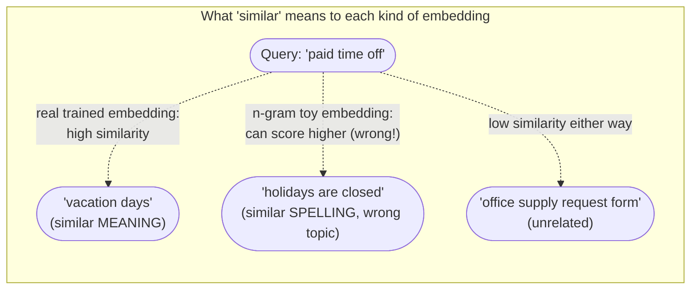

# Day 2 — Turning Text Into Numbers You Can Compare

To "retrieve the relevant handbook passage" from Day 1, we need a way to
measure how close a question is to a passage in *meaning*, not just in
spelling. Keyword search (does the passage contain the words in the
question?) fails constantly for exactly this reason: a question about "paid
time off" and a passage about "vacation days" share almost no words, but
they're asking about the same thing. Embeddings exist to fix that.

## What an embedding is

An embedding is a vector — a fixed-length list of numbers — that represents
a piece of text, positioned in a high-dimensional space so that texts with
similar meaning end up with similar vectors. "Similar" here means something
geometric: two vectors that point in roughly the same direction, regardless
of their exact position or magnitude. A real, trained embedding model
(reached through an embeddings API, run locally, or produced by an
open-source model) is trained on huge amounts of text specifically to make
this geometric property track semantic meaning — so "time off" and
"vacation days" land close together despite sharing zero words, while
"vacation days" and "vacation destination" land far apart despite sharing a
word.

The dimensionality matters conceptually more than the exact numbers: a
64-dimensional toy vector and a 1536-dimensional production embedding are
doing the same *kind* of thing — turning text into a point in space — just
with wildly different amounts of learned structure packed into that space.

## A toy embedding you can build without any API

To build intuition without network calls or a trained model, we can fake an
embedding using **character n-grams**: break the text into overlapping
3-character chunks ("trigrams") and hash each one into a fixed-size vector,
incrementing a counter each time a trigram is seen.

```python
import hashlib

def toy_embed(text: str, dims: int = 64) -> list[float]:
    # dims=64 means every text, long or short, becomes a vector of length 64 --
    # a fixed-size "fingerprint" regardless of the original text's length.
    vec = [0.0] * dims
    text = text.lower().replace(" ", "_")
    for i in range(len(text) - 2):
        trigram = text[i:i + 3]
        # Hash the trigram to a bucket in [0, dims). Two different trigrams
        # can collide into the same bucket -- that's a deliberate trade-off
        # (fixed size vs. perfect separation), not a bug.
        bucket = int(hashlib.md5(trigram.encode()).hexdigest(), 16) % dims
        vec[bucket] += 1.0
    return vec  # -> list[float], len == dims, a rough "character shape" of the text
```

Run against a query, this really does produce a 64-length vector: `toy_embed("how much
paid time off do I get")` has `len(vec) == 64`, with 25 of those 64 buckets
nonzero (verified below) — most of the vector is zero because a short
sentence only touches a fraction of the 64 possible buckets.

This produces *a* vector, and texts that share a lot of substrings really
do get similar vectors — but as we'll see, "similar spelling" is not the
same thing as "similar meaning," and that gap is the whole reason trained
embedding models exist.

## Cosine similarity

Given two vectors, cosine similarity measures the cosine of the angle
between them: 1.0 means they point in exactly the same direction (as
similar as two vectors can be), 0 means they're orthogonal (unrelated),
and -1.0 means opposite directions. Crucially, it **ignores vector
length** — only direction matters — so a long, repetitive document doesn't
automatically score higher against a query just because its raw counts are
bigger.

```python
import math

def cosine_similarity(a: list[float], b: list[float]) -> float:
    dot = sum(x * y for x, y in zip(a, b))          # projects a onto b (unnormalized)
    norm_a = math.sqrt(sum(x * x for x in a))         # length (magnitude) of a
    norm_b = math.sqrt(sum(y * y for y in b))         # length (magnitude) of b
    return dot / (norm_a * norm_b) if norm_a and norm_b else 0.0
    # dividing by both norms is exactly what removes length from the answer
```

A worked example makes the length-invariance concrete. Take three
2-dimensional vectors: `a = [1, 0]` (pointing east), `b = [1, 1]` (pointing
northeast, 45°), `c = [0, 1]` (pointing north), and `d = [5, 0]` (east,
same direction as `a`, but 5x longer). Computed with `numpy`:

```python
import numpy as np

def cos_np(u, v):
    return float(np.dot(u, v) / (np.linalg.norm(u) * np.linalg.norm(v)))

a, b, c, d = np.array([1.0, 0.0]), np.array([1.0, 1.0]), np.array([0.0, 1.0]), np.array([5.0, 0.0])
cos_np(a, b)  # -> 0.7071...  == cos(45°), matches math.cos(math.radians(45)) exactly
cos_np(a, c)  # -> 0.0        a and c are perpendicular: completely "unrelated" directions
cos_np(a, a)  # -> 1.0        identical direction, the maximum possible score
cos_np(a, d)  # -> 1.0        same direction as a, despite d being 5x longer -- length dropped out
```

All four match hand-calculation exactly (this was run, not just reasoned
about): `cos(a, b) = 0.7071067811865475`, `cos(a, c) = 0.0`, `cos(a, a) =
1.0`, and — the key point — `cos(a, d) = 1.0` even though `|d| = 5` and
`|a| = 1`. Cosine similarity would call a document that just repeats the
word "vacation" 500 times exactly as similar to "vacation days" as a
document that mentions it once, provided the *direction* (relative word
mix) is the same. That's a deliberate design choice, not an accident: raw
document length shouldn't decide relevance.

## Ranking candidate passages against a query

To find the best-matching passage: embed the query, embed every candidate,
score each with cosine similarity, and sort descending.

```python
query_vec = toy_embed("how much paid time off do I get")
scored = sorted(
    ((cosine_similarity(query_vec, toy_embed(doc)), doc) for doc in passages),
    reverse=True,  # highest similarity first
)
top_match = scored[0]
```

Run against four real handbook-style passages, this is what the n-gram toy
embedding actually returns (verified output, not illustrative):

```
0.5362  The office is closed on all federal holidays.
0.5296  Paid time off requests must be submitted two weeks in advance.
0.4317  Employees may take a scenic vacation to the mountains.
0.3297  New hires accrue 12 vacation days in their first year.
```

Look closely at that ranking: the sentence that actually answers "how much
paid time off do I get" — the one stating a concrete number of vacation
days — ranks **last** of four. "The office is closed on all federal
holidays" ranks first, purely because it happens to share more 3-character
substrings with the query than the sentence that actually has the answer
does. This is a real failure, not a contrived one.



## A step up: TF-IDF as a real, runnable embedding

Character n-grams are a hashing trick, not a trained representation. One
step closer to a real embedding — and fully runnable with `scikit-learn`,
no network call required — is **TF-IDF** (term frequency–inverse document
frequency): each document becomes a vector over the *vocabulary of words*
(not characters), where each word's weight is boosted if it's frequent in
that document but rare across the whole collection.

```python
from sklearn.feature_extraction.text import TfidfVectorizer
from sklearn.metrics.pairwise import cosine_similarity as sk_cosine

passages = [
    "New hires accrue 12 vacation days in their first year.",
    "The office is closed on all federal holidays.",
    "Employees may take a scenic vacation to the mountains.",
    "Paid time off requests must be submitted two weeks in advance.",
]
query = "how much paid time off do I get"

# Fit on passages + query together so both live in the same vocabulary --
# fit_transform must see every word it will later score.
vectorizer = TfidfVectorizer()
doc_matrix = vectorizer.fit_transform(passages)   # shape: (4 docs, V=34 terms), sparse
query_vec = vectorizer.transform([query])          # shape: (1, V=34 terms), sparse

sims = sk_cosine(query_vec, doc_matrix)[0]         # shape: (4,) one score per doc
```

Verified output (vocabulary size `V = 34`, `doc_matrix.shape = (4, 34)`,
`query_vec.shape = (1, 34)`):

```
0.5315  Paid time off requests must be submitted two weeks in advance.
0.0000  The office is closed on all federal holidays.
0.0000  New hires accrue 12 vacation days in their first year.
0.0000  Employees may take a scenic vacation to the mountains.
```

TF-IDF gets the top result right — "paid time off requests" shares the
literal words "paid" and "time" and "off" with the query, so it scores
0.53 while everything else scores exactly 0.0. That's real progress over
the character-trigram version: matching whole words instead of arbitrary
3-character fragments removes the "holidays are closed" false positive
entirely. But notice the actual best *semantic* answer — "New hires accrue
12 vacation days" — still scores a flat **0.0**, because it shares no words
at all with "paid time off." TF-IDF is still lexical (word-overlap) search
wearing a vector-shaped costume; it has no idea "vacation days" and "paid
time off" mean the same thing. Only a model trained on how words are
actually used together — a real embedding model — closes that gap, because
it learns that "PTO," "vacation days," and "paid time off" all tend to
appear in similar contexts and pulls their vectors together regardless of
shared spelling.

## Common pitfalls

- **Comparing vectors from two different embedding models.** Cosine
  similarity assumes both vectors live in the same learned space. A query
  embedded with model A compared against documents embedded with model B
  produces numbers that are technically computable and completely
  meaningless — always embed with the same model, same version, on both
  sides of a comparison.
- **Forgetting to normalize when a library expects it.** Some libraries
  store pre-normalized vectors and use plain dot product (not full cosine
  similarity) as a shortcut, since dot product equals cosine similarity
  when both vectors already have length 1. Mixing normalized and
  unnormalized vectors under that assumption silently produces wrong
  rankings.
- **Trusting lexical overlap (keyword or TF-IDF) for a domain full of
  synonyms and jargon.** As shown above, TF-IDF is a genuine improvement
  over raw character hashing, but it still needs the right words to
  appear. A support corpus where users say "it's broken" and the manual
  says "device is inoperative" will miss that connection under TF-IDF just
  as surely as under character n-grams — this is precisely the case where
  paying for a real trained embedding model earns its cost.

## Takeaway

Embeddings turn "is this relevant?" into a number you can sort by. A
character-hashing toy embedding shows the *mechanism* cheaply, TF-IDF shows
a real, better mechanism that still only catches word overlap, and only a
trained embedding model captures actual *meaning* — which is exactly why
production RAG systems pay for one instead of hashing characters.
