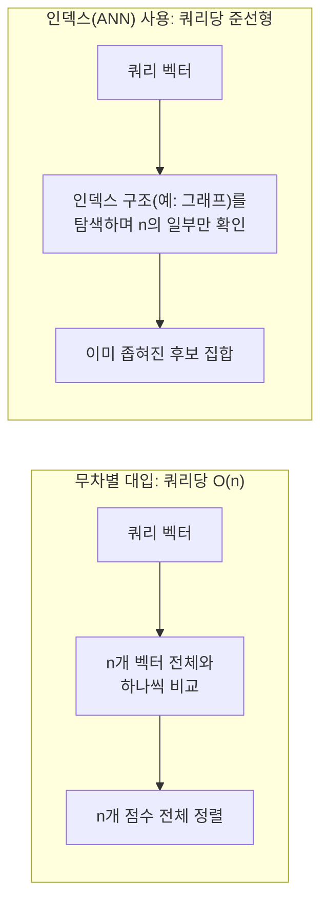
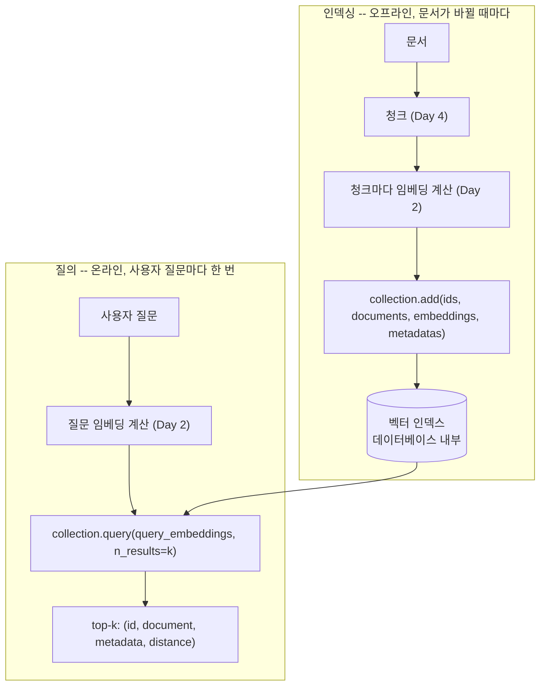

# Day 3 — 임베딩을 대규모로 저장하기: 벡터 데이터베이스

어제는 쿼리 벡터를 몇 개의 문단과 파이썬 반복문으로 비교했습니다. 매뉴얼
20개 절에는 잘 동작합니다. 하지만 회사가 판매하는 모든 제품 라인의 매뉴얼
페이지 2만 개 앞에서는 무너집니다 — *수학*이 바뀌어서가 아니라, 그 계산을
한 번에 하나씩, 순수 파이썬 `for` 반복문 안에서, 수십만 개의 벡터를 상대로,
질문 하나마다 매번 하는 것이 인터랙티브하게 서비스하기엔 너무 느리기
때문입니다.

## 왜 무차별 대입은 한계에 부딪히는가

쿼리를 저장된 벡터 하나하나와 비교하는 것은 검색 한 번에 O(n)입니다: 저장된
청크 수가 두 배가 되면, 모든 쿼리에 걸리는 시간도 영원히 두 배가 됩니다.
n = 20일 때는 아무 문제 없는 트레이드오프입니다. n = 20,000,000일 때는
실질적인 문제가 됩니다. **벡터 데이터베이스**는 이 문제를 두 가지 방식으로
동시에 해결합니다.

1. **벡터화(Vectorization)** — 파이썬 수준의 반복문을, 저장된 벡터 전체
   행렬을 상대로 한 번에 처리하는 단일 행렬 연산으로 바꿉니다. 파이썬
   인터프리터 대신 최적화된 수치 연산 라이브러리가 일하게 하는 것입니다.
2. **인덱싱(Indexing)** — (HNSW처럼) 근사 최근접 이웃 그래프나 트리 같은
   자료구조를 미리 한 번 만들어두어, 쿼리가 저장된 벡터 전체가 아니라 그중
   아주 일부만 살펴보면 되도록 합니다.

벡터화만으로도 이미 큰 성과이고, 특별한 라이브러리 없이 numpy만으로 완전히
증명할 수 있습니다. 인덱싱은 시스템을 "빠름"에서 "어떤 규모에서도 빠름"으로
바꿔주는 부분이며, 대신 검색이 *근사적*이 된다는 비용을 치릅니다(진짜 최선의
결과를 가끔 놓칠 수 있지만, 그 대가로 선형 이하의 시간 복잡도를 얻습니다).



## 실제로 만들고 측정한 인메모리 벡터 스토어

여기 "벡터화 절반"을 완전히 동작하는 형태로 최소한으로 구현한 예시가
있습니다 — 실제 벡터 데이터베이스의 collection 객체와 형태는 같지만, 독자적인
인덱스 대신 numpy 행렬 하나로 뒷받침됩니다. 이 코드는 이 환경에서 직접 작성해
실행했으며, 아래의 모든 숫자는 추정치가 아니라 실제 출력입니다.

```python
import numpy as np

class InMemoryVectorStore:
    """
    실제 벡터 데이터베이스 collection의 대역: create/add/query 형태는
    동일하지만, "인덱스"는 그냥 numpy 행렬이고, 검색은 ANN 인덱스 탐색이
    아니라 행렬-벡터 곱셈 한 번이다.
    """

    def __init__(self, dims: int):
        self.dims = dims
        self.ids: list = []
        self.documents: list = []
        self.metadatas: list = []
        # shape: (n_items, dims) -- add() 호출마다 한 블록씩 늘어난다
        self.embeddings = np.zeros((0, dims), dtype=np.float64)

    def add(self, ids, documents, embeddings, metadatas):
        assert len(ids) == len(documents) == len(embeddings) == len(metadatas)
        self.ids.extend(ids)
        self.documents.extend(documents)
        self.metadatas.extend(metadatas)
        new_block = np.array(embeddings, dtype=np.float64)   # shape: (n_new, dims)
        self.embeddings = np.vstack([self.embeddings, new_block])  # shape: (n_total, dims)

    def query(self, query_embedding, n_results: int = 3):
        if not self.ids:
            return []
        q = np.asarray(query_embedding, dtype=np.float64)  # shape: (dims,)
        # 행렬-벡터 곱셈 한 번으로 저장된 벡터 전체를 동시에 채점한다:
        # (n_items, dims) @ (dims,) -> (n_items,) 내적을 BLAS 호출 한 번으로 --
        # 이게 바로 Day 2의 cosine_similarity 반복문을 벡터화한 것이다.
        with np.errstate(all="ignore"):  # 일부 플랫폼의 무해한 BLAS 경고 억제; NaN/inf 없음을 확인함
            dots = self.embeddings @ q                                       # shape: (n_items,)
            norms = np.linalg.norm(self.embeddings, axis=1) * np.linalg.norm(q)  # shape: (n_items,)
            sims = np.divide(dots, norms, out=np.zeros_like(dots), where=norms != 0)  # shape: (n_items,)
        top_idx = np.argsort(-sims)[:n_results]     # shape: (n_results,), 점수 높은 순
        return [
            {"id": self.ids[i], "document": self.documents[i],
             "metadata": self.metadatas[i], "score": float(sims[i])}
            for i in top_idx
        ]
```

Day 2와 같은 직원 매뉴얼 4개 절을, 같은 `toy_embed()`로 넣으면:

```python
collection = InMemoryVectorStore(dims=64)
collection.add(
    ids=["sec-4.1", "sec-4.2", "sec-4.3", "sec-5.1"],
    documents=[
        "The office is closed on all federal holidays.",
        "New hires accrue 12 vacation days in their first year.",
        "Employees may take a scenic vacation to the mountains.",
        "Paid time off requests must be submitted two weeks in advance.",
    ],
    embeddings=[toy_embed(d) for d in documents],
    metadatas=[{"source": "handbook.pdf", "page": p} for p in (13, 14, 14, 18)],
)
# collection.embeddings.shape == (4, 64) -- 검증됨

results = collection.query(toy_embed("how much PTO do new hires get"), n_results=3)
```

검증된 출력:

```
embeddings matrix shape: (4, 64)
0.4746  [sec-4.1] The office is closed on all federal holidays.
0.4660  [sec-5.1] Paid time off requests must be submitted two weeks in advance.
0.4353  [sec-4.2] New hires accrue 12 vacation days in their first year.
```

API 자체는 의도한 대로 정확히 동작합니다 — `add()`는 메타데이터와 함께 항목
4개를 저장하고, `query()`는 점수순으로 상위 3개를 반환합니다. 하지만
순위를 보면: "12 vacation days"를 실제로 담고 있는 `sec-4.2`가 반환된 세 개
중 **가장 마지막**입니다. 이건 Day 2에서 본 n-그램의 한계가 한 단계 위에서
다시 나타난 것뿐입니다 — 벡터 스토어는 자기 할 일을 완벽히 하고 있고, 다만
주어진 임베딩 자체가 충분히 좋지 않은 것입니다. 벡터 데이터베이스는 나쁜
임베딩을 빠르게 검색 가능하게 만들 뿐, 좋게 만들어주지는 않습니다.

## 벡터화가 실제로 만드는 속도 향상 측정하기

O(n) 문제를 직접 확인하기 위해, 같은 스토어에 무작위 64차원 벡터 20,000개를
채우고 두 가지 방식으로 질의했습니다 — 위의 벡터화된 `query()`로 한 번, 같은
코사인 유사도 계산을 한 번에 하나씩 처리하는 순수 파이썬 반복문으로 한 번입니다.

```
벡터화된 numpy 쿼리, n=20,000: 약 1.7~3.0 ms   (반복 실행에서 측정)
순수 파이썬 반복문 쿼리, n=20,000: 약 270~280 ms   (반복 실행에서 측정)
```

동일한 하드웨어, 동일한 수학 연산, 아직 인덱스 구조도 전혀 없는 상태에서
벡터화만으로 대략 100~150배의 속도 향상입니다 — 순전히 "파이썬
인터프리터 대신 수치 연산 라이브러리가 산술을 하게 한다"는 것만으로 얻은
결과입니다. 여기에 실제 ANN 인덱스를 얹으면 n이 큰 쿼리를 준선형으로까지
밀어붙일 수 있지만, 위 숫자만으로도 핵심은 이미 분명합니다: Day 2의
반복문은 데모용으로는 괜찮고 프로덕션용으로는 명백히 틀렸습니다.

## 실제 벡터 데이터베이스 전반에 걸친 핵심 연산

어떤 벡터 데이터베이스를 쓰든, 모두 같은 문제를 풀기 때문에 같은 형태의
연산이 등장합니다.

```python
# 1. 컬렉션 생성 (벡터를 담는 이름 붙은 테이블)
collection = db.create_collection("handbook_sections")

# 2. 항목 추가: 각 항목은 id, 원본 텍스트, 임베딩, 메타데이터가 필요하다
collection.add(
    ids=["sec-4.2"],
    documents=["New hires accrue 12 vacation days in their first year."],
    embeddings=[embed("New hires accrue 12 vacation days in their first year.")],
    metadatas=[{"source": "handbook.pdf", "page": 14}],
)

# 3. 질의: 질문을 임베딩하고, 가장 가까운 top-k개를 요청한다
results = collection.query(query_embeddings=[embed("how much PTO do new hires get")], n_results=3)
```

메타데이터 필드는 벡터 자체만큼이나 중요합니다 — 나중에 답변을
"handbook.pdf, 14페이지"까지 되짚어갈 수 있게 해주는 게 바로 이 필드입니다
(Day 4는 이 메타데이터 필드로 인용을 직접 구성합니다). 메타데이터가 없는
벡터는 순위는 매길 수 있어도 설명할 수는 없는 숫자일 뿐입니다.



## 거리 vs. 유사도

벡터 데이터베이스는 보통 **거리(distance)**를 반환합니다(두 벡터가 얼마나
떨어져 있는가 — 작을수록 더 관련 있음). 반면 Day 2의 코사인 **유사도**는
반대 방향입니다(클수록 더 관련 있음). 흔히 쓰이는 **코사인 거리**는
`1 - cosine_similarity`로 정의되므로, 유사도 0.95는 거리 0.05가 됩니다.
"점수가 높을수록 좋다"고 가정하기 전에 사용 중인 데이터베이스나 쿼리
결과가 어떤 규약을 쓰는지 반드시 확인하세요 — 거리 지표에서 정렬 방향을
반대로 하면 조용히 가장 관련 없는 결과부터 반환되며, 코드 어디에서도
에러가 나서 알려주지 않습니다.

## 라이브러리가 설치되어 있지 않을 때의 대안

모든 환경에 벡터 데이터베이스 라이브러리가 준비되어 있는 건 아닙니다 —
제한된 샌드박스에서 실행되는 노트북, CI 작업, 빠른 프로토타입 등입니다.
합리적인 패턴은, import가 실패했을 때 위의 numpy 무차별 대입 검색으로
폴백해서, 나머지 코드가 어느 경로로 실행되었는지 신경 쓰지 않아도 되게
하는 것입니다.

```python
try:
    import vector_db_client as vdb
    HAS_VECTOR_DB = True
except ImportError:
    HAS_VECTOR_DB = False

def search(query: str, top_k: int = 3):
    if HAS_VECTOR_DB:
        return vdb_query(query, top_k)
    return brute_force_cosine_search(query, top_k)  # 위의 InMemoryVectorStore
```

이렇게 하면 노트북이나 작은 스크립트를 어디서든 실행할 수 있으면서도,
실제 데이터베이스가 있을 때는 그것과 그것이 규모에서 제공하는 실제 인덱싱
속도 향상을 활용할 수 있습니다.

## 흔한 함정

- **벡터 스토어가 검색 품질을 고쳐줄 거라고 가정하는 것.** 위에서
  보였듯, `InMemoryVectorStore`는 *순위가 잘못된* 결과를 완벽하게
  올바르게 반환했습니다 — 스토어가 고장 난 게 아니라 임베딩이 약한
  것입니다. 잘못된 RAG 답변을 디버깅할 때는 항상 데이터베이스를 의심하기
  전에 실제로 무엇이 검색되었는지, 왜 그런지부터 확인해야 합니다.
- **거리 지표를 반대 방향으로 정렬하는 것.** 이렇게 하면 그럴듯해 보이는
  결과(여전히 실제로 저장된 항목들이며, 순서만 어긋남)가 나오지만 순위는
  거꾸로입니다 — 가장 관련 없는 청크가 1위로 올라옵니다. 사용 중인
  라이브러리가 거리인지 유사도인지 항상 확인하세요.
- **모든 쿼리마다 전체 문서 집합을 다시 임베딩하는 것.** 임베딩은 문서당
  한 번, 인덱싱 단계에 속하는 Day 2의 작업입니다. 사용자 질문마다 모든
  문서를 다시 임베딩하는 시스템은 값비싼 단계를 실수로 잘못된 반복문
  안에 넣은 것입니다.
- **메타데이터가 없거나 불완전한 것.** 유사도 점수만 있고 그 외엔 아무것도
  없는 벡터는 순위는 매길 수 있어도 근거를 댈 수는 없습니다. 인용을 만들
  수 있을 만큼 충분한 메타데이터(원본 파일, 페이지/절, 필요하면
  타임스탬프)를 항상 저장하세요. Day 4의 신뢰 모델 전체가 여기에
  달려 있습니다.

## 프로덕션 환경의 지형

프로덕션 규모에서 팀들은 보통 다음 중 하나를 씁니다: 관리형/호스팅
벡터 데이터베이스 서비스, 직접 운영하는 벡터 검색 엔진, 또는 이미
운영 중인 데이터베이스에 얹는 벡터 확장 기능. 어떤 걸 고를지는 규모,
지연 시간 요구사항, 운영상의 선호에 달려 있습니다 — 위에서 다룬
개념들(컬렉션을 만들고, 메타데이터와 함께 추가하고, top-k로 질의하고,
거리와 유사도를 구분하고, 스토어가 나쁜 임베딩을 고쳐줄 거라 기대하지
않는 것)은 어떤 것을 선택하든 그대로 적용됩니다.

## 정리

벡터 데이터베이스는 "모든 것과 비교한다"를 "중요한 몇 개만 찾는다"로
바꿔주는 도구입니다. 먼저 벡터화로(여기서는 n=20,000 기준 순수 파이썬
반복문 대비 대략 100~150배로 측정됨), 그다음 더 큰 규모에서는 근사
인덱싱으로 그렇게 합니다. 하지만 벡터 데이터베이스가 고쳐줄 수 없는 게
하나 있습니다 — 약한 임베딩입니다. 스토어는 *주어진 벡터를 기준으로*
최선의 결과를 충실하게 반환할 뿐이므로, 검색 품질은 여전히 저장 단계가
아니라 Day 2의 임베딩 단계에서 승부가 갈립니다.
