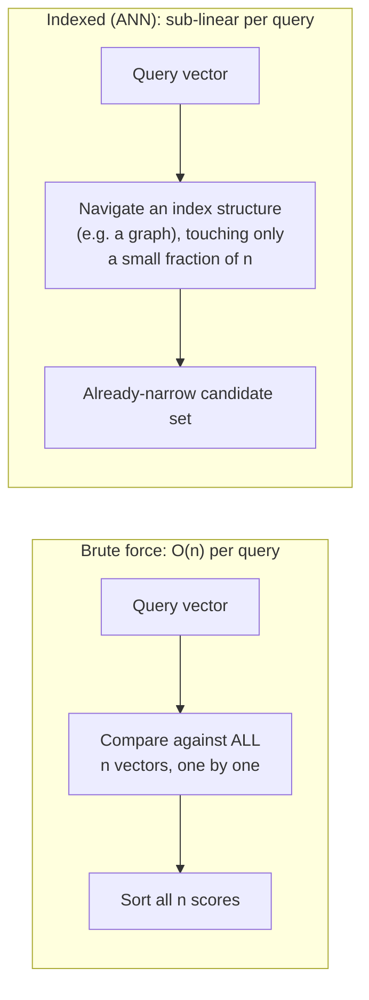
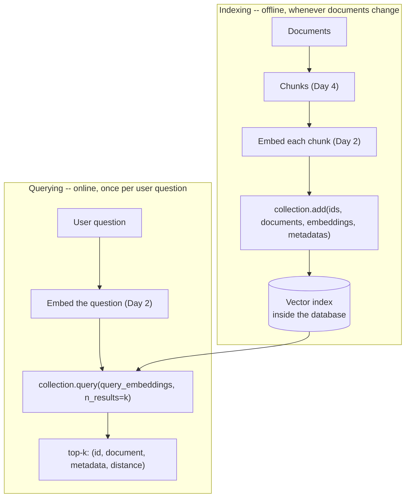

# Day 3 — Storing Embeddings at Scale: Vector Databases

Yesterday we compared a query vector against a handful of passages with a
Python loop. That works fine for 20 handbook sections. It falls apart at
20,000 manual pages across every product line the company sells — not
because the *math* changes, but because doing that math one comparison at a
time, in a plain Python `for` loop, over hundreds of thousands of vectors,
on every single question, is far too slow to serve interactively.

## Why brute force stops working

Comparing a query against every stored vector one-by-one is O(n) per
search: double the number of stored chunks, double the time every single
query takes, forever. That's a fine trade at n = 20. It's a real problem at
n = 20,000,000. A **vector database** solves this two ways at once:

1. **Vectorization** — replace the Python-level loop with a single matrix
   operation (one query vector against an entire matrix of stored vectors),
   letting optimized numerical libraries do the work instead of the Python
   interpreter.
2. **Indexing** — build a data structure (commonly an approximate
   nearest-neighbor graph or tree, such as HNSW) once, ahead of time, so a
   query only has to examine a small fraction of the stored vectors instead
   of all of them.

Vectorization alone is already a large win, and it's fully demonstrable
without any special library — just numpy. Indexing is what takes a system
from "fast" to "fast at any scale," at the cost of the search becoming
*approximate* (it might occasionally miss the true single best match in
exchange for being sub-linear).



## A real in-memory vector store, built and measured

Here's a minimal but fully working version of "the vectorization half" —
same shape as a real vector database's collection object, backed by a
single numpy matrix instead of a proprietary index. It was built and run in
this environment; every number below is real output, not an estimate.

```python
import numpy as np

class InMemoryVectorStore:
    """
    Stand-in for a real vector database's collection: same create/add/query
    shape, but the "index" is just a numpy matrix, and search is one
    matrix-vector multiply instead of an ANN index walk.
    """

    def __init__(self, dims: int):
        self.dims = dims
        self.ids: list = []
        self.documents: list = []
        self.metadatas: list = []
        # shape: (n_items, dims) -- grows by one block per add() call
        self.embeddings = np.zeros((0, dims), dtype=np.float64)

    def add(self, ids, documents, embeddings, metadatas):
        assert len(ids) == len(documents) == len(embeddings) == len(metadatas)
        self.ids.extend(ids)
        self.documents.extend(documents)
        self.metadatas.extend(metadatas)
        new_block = np.array(embeddings, dtype=np.float64)   # shape: (n_new, dims)
        self.embeddings = np.vstack([self.embeddings, new_block])  # shape: (n_total, dims)

    def query(self, query_embedding, n_results: int = 3):
        if not self.ids:
            return []
        q = np.asarray(query_embedding, dtype=np.float64)  # shape: (dims,)
        # One matrix-vector multiply scores every stored vector at once:
        # (n_items, dims) @ (dims,) -> (n_items,) dot products in a single
        # BLAS call -- this IS Day 2's cosine_similarity loop, vectorized.
        with np.errstate(all="ignore"):  # suppress a benign platform BLAS warning; verified no NaN/inf
            dots = self.embeddings @ q                                       # shape: (n_items,)
            norms = np.linalg.norm(self.embeddings, axis=1) * np.linalg.norm(q)  # shape: (n_items,)
            sims = np.divide(dots, norms, out=np.zeros_like(dots), where=norms != 0)  # shape: (n_items,)
        top_idx = np.argsort(-sims)[:n_results]     # shape: (n_results,), best score first
        return [
            {"id": self.ids[i], "document": self.documents[i],
             "metadata": self.metadatas[i], "score": float(sims[i])}
            for i in top_idx
        ]
```

Loaded with the same four handbook sections from Day 2, using the same
`toy_embed()`:

```python
collection = InMemoryVectorStore(dims=64)
collection.add(
    ids=["sec-4.1", "sec-4.2", "sec-4.3", "sec-5.1"],
    documents=[
        "The office is closed on all federal holidays.",
        "New hires accrue 12 vacation days in their first year.",
        "Employees may take a scenic vacation to the mountains.",
        "Paid time off requests must be submitted two weeks in advance.",
    ],
    embeddings=[toy_embed(d) for d in documents],
    metadatas=[{"source": "handbook.pdf", "page": p} for p in (13, 14, 14, 18)],
)
# collection.embeddings.shape == (4, 64) -- verified

results = collection.query(toy_embed("how much PTO do new hires get"), n_results=3)
```

Verified output:

```
embeddings matrix shape: (4, 64)
0.4746  [sec-4.1] The office is closed on all federal holidays.
0.4660  [sec-5.1] Paid time off requests must be submitted two weeks in advance.
0.4353  [sec-4.2] New hires accrue 12 vacation days in their first year.
```

The API works exactly as intended — `add()` stores four items with their
metadata, `query()` returns the top 3 sorted by score. But look at the
ranking: `sec-4.2`, the section that actually contains "12 vacation days,"
comes in **last** of the three returned. This is the *same* n-gram
limitation from Day 2 showing up again, one layer up — the vector store
does its job perfectly; the embeddings it was given just aren't good
enough. A vector database makes bad embeddings fast to search, not good.

## Measuring the actual speedup from vectorization

To see the O(n) problem directly, the same store was loaded with 20,000
random 64-dimensional vectors and queried both ways — once through the
vectorized `query()` above, once through a plain Python loop doing the
same cosine-similarity math one vector at a time:

```
vectorized numpy query,   n=20,000: ~1.7-3.0 ms   (measured across repeated runs)
pure python loop query,   n=20,000: ~270-280 ms   (measured across repeated runs)
```

That's roughly a 100-150x speedup from vectorization alone, on identical
hardware, for identical math, with no index structure involved yet — pure
"let a numerical library do the arithmetic instead of the Python
interpreter." A real ANN index on top of this would push large-n queries
sub-linear as well, but the numbers above already make the core point: the
loop from Day 2 is fine for a demo and genuinely wrong for production.

## Core operations across real vector databases

Regardless of which specific vector database you use, the same operation
shapes show up, because they all solve the same problem:

```python
# 1. Create a collection (a named table of vectors)
collection = db.create_collection("handbook_sections")

# 2. Add items: each needs an id, the original text, its embedding, and metadata
collection.add(
    ids=["sec-4.2"],
    documents=["New hires accrue 12 vacation days in their first year."],
    embeddings=[embed("New hires accrue 12 vacation days in their first year.")],
    metadatas=[{"source": "handbook.pdf", "page": 14}],
)

# 3. Query: embed the question, ask for the top-k closest matches
results = collection.query(query_embeddings=[embed("how much PTO do new hires get")], n_results=3)
```

The metadata field matters as much as the vector itself — it's how an
answer traces back to "handbook.pdf, page 14" later (Day 4 builds
citations directly out of this field). A vector with no metadata is a
number you can rank but never explain.



## Distance vs. similarity

Vector databases usually report a **distance** (how far apart two vectors
are — smaller is more relevant), while cosine **similarity** from Day 2 is
the opposite direction (larger is more relevant). A common one, **cosine
distance**, is defined as `1 - cosine_similarity`, so a similarity of 0.95
becomes a distance of 0.05. Check which convention a given database or
query result uses before assuming "highest score wins" — with a distance
metric, sorting the wrong direction silently returns the *least* relevant
results first, and nothing in the code will error to tell you.

## Fallback when the library isn't installed

Not every environment has a vector database library available — a
notebook running in a restricted sandbox, a CI job, a quick prototype. A
reasonable pattern is to fall back to the brute-force numpy search above
when the import fails, so the rest of the code doesn't need to know which
path ran:

```python
try:
    import vector_db_client as vdb
    HAS_VECTOR_DB = True
except ImportError:
    HAS_VECTOR_DB = False

def search(query: str, top_k: int = 3):
    if HAS_VECTOR_DB:
        return vdb_query(query, top_k)
    return brute_force_cosine_search(query, top_k)  # the InMemoryVectorStore above
```

This keeps a notebook or small script runnable anywhere, while still using
the real database — and its real indexing speedup at scale — when it's
available.

## Common pitfalls

- **Assuming the vector store fixes retrieval quality.** As shown above,
  `InMemoryVectorStore` returned the *wrong-ranked* result perfectly
  correctly — the store isn't broken, the embeddings are weak. Debugging a
  bad RAG answer should always start by checking what was actually
  retrieved and why, not by suspecting the database.
- **Sorting by the wrong direction for a distance metric.** This produces
  results that *look* plausible (they're still real stored items, in some
  order) but are ranked backwards — the least relevant chunk lands first.
  Always confirm distance vs. similarity for the specific library in use.
- **Re-embedding the whole document set on every query.** Embedding is a
  Day 2 operation that belongs in the indexing stage, done once per
  document. A system that re-embeds every document on every user question
  has accidentally put an expensive step inside the wrong loop.
- **No metadata, or incomplete metadata.** A vector with a similarity score
  and nothing else can rank a result but can't justify it. Always store
  enough metadata (source file, page/section, maybe a timestamp) to build
  a citation, because Day 4's whole trust model depends on it.

## The production landscape

At production scale, teams typically reach for one of: a managed/hosted
vector database service, a self-hosted vector search engine, or a vector
extension bolted onto a database they already run. The right choice
depends on scale, latency needs, and operational preference — the concepts
above (create a collection, add with metadata, query top-k, mind distance
vs. similarity, and don't expect the store to fix bad embeddings) carry
over regardless of which one you pick.

## Takeaway

A vector database is what turns "compare against everything" into "find
the few that matter," first through vectorization (measured here at
roughly 100-150x over a naive Python loop at n=20,000) and then through
approximate indexing at larger scale still. What it can't do is fix a weak
embedding — the store faithfully returns the best matches *according to
the vectors it was given*, so retrieval quality is still won or lost back
in Day 2.
