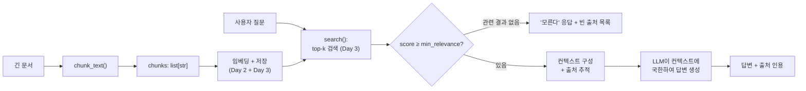

# Day 4 — 문서를 청크로 나누고 검색된 내용만으로 답변하기

이번 주 전체가 하나의 함수를 향해 쌓여왔습니다: 사용자의 질문이 주어지면
*검색된 매뉴얼 텍스트만으로* 답하고, 관련된 내용을 찾지 못했을 때는 정직하게
그렇다고 말하는 함수입니다. 여기까지 오려면 두 가지가 더 필요합니다: 실제
문서를 검색 가능한 단위로 나누는 것(청킹), 그리고 검색이 빈손으로 돌아왔을
때 거부할 만큼 규율 있는 최종 답변 단계입니다.

## 왜 매뉴얼 전체를 그냥 모델에 넣지 않을까

세 가지 이유로 이 방식은 확장되지 않습니다.

- **비용** — 한 문장짜리 질문에도 매 요청마다 문서 전체를 다시 보냅니다.
  60페이지짜리 매뉴얼은 대략 24,000단어입니다 — 일반적인 단어-토큰 비율로
  치면 3만 개가 넘는 토큰인데, 실제 답은 보통 한두 문단 안에 있습니다.
- **관련성** — 60페이지짜리 매뉴얼을 프롬프트 하나에 욱여넣으면 진짜
  관련된 한 문단이 잡음 속에 파묻힙니다. 실제 답이 그 컨텍스트 어딘가에
  기술적으로 존재하더라도, 무관한 컨텍스트가 많이 몰려 있으면 모델의
  답변 품질은 측정 가능한 수준으로 떨어집니다.
- **컨텍스트 윈도우 한계** — 비용과 무관하게, 언젠가는 문서와 질문과
  원하는 답변을 합친 것이 모델의 컨텍스트 윈도우에 아예 들어가지 않게
  됩니다.

청킹 + 검색(Day 2-3)은 정확히 이 문제를 피하기 위해 존재합니다: 이 질문에
실제로 중요한 몇 문단만 보내면, 3문단짜리 답에는 대략 3문단어치의 토큰만
들면 됩니다. 60페이지어치 토큰이 아니라요.

## 청크 크기와 overlap

문서를 청크로 나눈다는 건 두 개의 조절 값을 정하는 일입니다.

- **청크 크기** — 너무 작으면 청크가 맥락을 잃습니다(주변 의미 없이
  문장 조각만 남고, 검색 단계는 온전한 아이디어가 무엇이었는지 재구성하느라
  더 애써야 합니다). 너무 크면 검색된 청크 하나가 다시 관련성을 희석시키고,
  이번 질문에는 중요하지 않은 부분에까지 토큰을 낭비하게 됩니다.
- **Overlap** — 연속된 청크 사이에 텍스트를 조금 공유하면(예: 청크 N의
  마지막 20단어를 청크 N+1의 시작 부분에 그대로 반복) 청크 경계에 걸친
  사실이 반으로 잘려서 양쪽 청크 모두에서 사라지는 걸 막을 수 있습니다.

```python
def chunk_text(text: str, chunk_words: int = 120, overlap_words: int = 20) -> list[str]:
    # 단어 수(원시 문자 수가 아니라)는 청크가 담은 "의미의 양"을 더
    # 일관되게 반영한다 -- 단어당 문자 수는 문서마다 크게 다르지만,
    # 문장 길이는 단어 단위로 훨씬 덜 변한다.
    words = text.split()  # -> list[str], 공백으로 구분된 토큰 하나씩
    if chunk_words <= overlap_words:
        raise ValueError("chunk_words must be greater than overlap_words")

    chunks = []
    start = 0
    step = chunk_words - overlap_words  # 반복마다 창(window)이 얼마나 전진하는가
    while start < len(words):
        end = start + chunk_words
        chunks.append(" ".join(words[start:end]))    # -> str, chunk_words 이하 단어
        if end >= len(words):
            break
        start += step
    return chunks  # -> list[str]
```

20개 절로 이루어진 정책 문서를 이어붙인 합성 매뉴얼(760단어)에
`chunk_words=120, overlap_words=20`으로 테스트한 결과:

```
synthetic handbook word count: 760
num chunks: 8
chunk sizes: 120, 120, 120, 120, 120, 120, 120, 60   (마지막은 나머지 부분)
```

`step = 120 - 20 = 100`이고, `ceil((760 - 120) / 100) + 1 = 8`이 정확히
일치합니다. overlap도 직접 검증했습니다: 청크 0의 마지막 20단어와 청크
1의 처음 20단어가 글자 단위로 완전히 동일합니다(`chunk0_tail ==
chunk1_head`가 `True`로 평가됨). 이게 바로 경계에서 사실이 사라지는 걸
막는 메커니즘입니다 — 만약 "who to contact in HR"라는 문장이 하필 120번째
단어 근처에 걸렸다면, 이제 그 문장은 두 청크에서 각각 반으로 잘리는 대신
양쪽 청크 모두에서 온전하게 등장합니다.

보편적으로 "정답"인 크기는 없습니다 — 문서의 구조와 임베딩 모델 자체의
컨텍스트 한계에 맞춰 조율하는 트레이드오프입니다. 짧고 독립적인 조항으로
이루어진 법률/정책 텍스트는 작은 청크를 선호하는 경우가 많고, 서로 참조가
많은 서술형/기술 문서는 큰 청크를 선호하는 경우가 많습니다.

## 실제로 끝까지 실행한 검색 파이프라인

청킹을 실제(TF-IDF) 임베딩 및 검색과 결합해, 작은 합성 매뉴얼에 적용해
보았습니다.

```python
handbook = """
Section 4.1: The office is closed on all federal holidays including New Year's Day,
Independence Day, and Thanksgiving. Employees are not required to use PTO for these days.
Section 4.2: New hires accrue 12 vacation days in their first year of employment, credited
monthly at a rate of one day per month. After three years of service the accrual rate
increases to 18 days per year.
Section 4.3: Paid time off requests must be submitted through the HR portal at least two
weeks in advance for any absence longer than two consecutive days. Same-day sick leave
does not require advance notice.
Section 5.1: Employee laptops are replaced every three years or upon failure, whichever
comes first. Submit a replacement request through the IT ticketing system.
"""

chunks = chunk_text(handbook, chunk_words=40, overlap_words=8)
# -> 청크 4개: [40, 40, 40, 29] 단어

vectorizer = TfidfVectorizer()
chunk_matrix = vectorizer.fit_transform(chunks)  # shape: (4, 89) -- 89단어 어휘
```

"how many vacation days do new hires get?"(신입사원 연차는 며칠인가요?)를
질의하면, 다음 순서로 검색됩니다.

```
score=0.445  handbook.pdf#chunk0  "...Section 4.2: New hires accrue 12 vacation days in their first year"
score=0.134  handbook.pdf#chunk1  "accrue 12 vacation days in their first year of employment, credited monthly..."
```

두 결과 모두 실제로 답을 담고 있습니다 — 청크0의 끝부분과 청크1의
시작부분이 정확히 그 중요한 문장에서 겹칩니다. 이건 앞 절의 overlap
메커니즘이 합성된 경계 테스트뿐 아니라 실제 검색에서도 그대로 작동한
것입니다.



## `answer()` 패턴

RAG의 핵심 규율은 검색이 아니라, 검색으로 실제 찾은 것 이상은 답하지
않겠다는 거부입니다.

```python
def answer(question: str, top_k: int = 2, min_relevance: float = 0.05) -> dict:
    hits = search(question, top_k=top_k)              # Day 2/3의 검색
    relevant = [h for h in hits if h["score"] >= min_relevance]

    if not relevant:
        return {"answer": "I don't know — nothing relevant was found in the documents.", "sources": []}

    context = "\n\n".join(f"[{h['source']}] {h['text']}" for h in relevant)
    prompt = (
        "Answer the question using ONLY the context below. "
        "If the context doesn't contain the answer, say you don't know.\n\n"
        f"Context:\n{context}\n\nQuestion: {question}"
    )
    reply = call_llm(prompt)   # 위 프롬프트로 제약된 실제 LLM 호출
    return {"answer": reply, "sources": [h["source"] for h in relevant]}
```

이 함수를 신뢰할 수 있게 만드는 요소는 세 가지입니다: 생성보다 *먼저*
검색한다는 점(모델이 먼저 추측할 기회 자체를 주지 않음), 검색된 컨텍스트
안에 머무르라고 모델에게 지시한다는 점, 그리고 사람이 검증할 수 있도록
답변과 함께 출처를 보고한다는 점 — Day 1의 근거 있는 답변 예시를 그대로
반영합니다. 위 매뉴얼로 실행한 `answer("how many vacation days do new
hires get?")`는 앞서 나온 점수와 함께 청크0과 청크1을 모두 출처로
반환하며, 후속 근거 검증(grounding check)은 답변에서 인용한 숫자 `12`가
실제로 검색된 컨텍스트에 등장한다는 것을 확인해줍니다 — 모델이 실제
출처를 인용하면서도 *다른* 숫자를 지어내는 것을 막아주는, 저렴하고
기계적인 안전장치입니다.

## 실제 함정: 관련성 임계값은 보기보다 안전하지 않다

`min_relevance`는 "관련된 내용을 찾지 못함"을 잡아내서 정직하게 "모른다"고
답하기 위한 값입니다. 범위 밖 질문 — 합성 매뉴얼이 전혀 언급하지 않는
"회사의 육아휴직 정책은 무엇인가요?" — 로 테스트하면 이게 정확히 어떻게
실패할 수 있는지 드러납니다.

```
"what is the company's parental leave policy?"에 대한 청크 점수:  0.148, 0.147, ...
```

두 점수 모두 `min_relevance=0.05` 임계값을 넘기 때문에, 함수는 정직하게
"모른다"고 답하는 대신 출처까지 달린, 마치 진짜 같은 "답변"을 반환합니다.
*왜* 그런지 파고들어 보면: 영어 불용어(stop word)를 제거한 뒤에도 한
청크는 여전히 이 쿼리에 대해 0.235점을 받습니다 — 그리고 공유된 단어는
바로 단어 **"leave"** 하나입니다. 매뉴얼의 무관한 문장 "same-day sick
*leave* does not require advance notice"에 등장하고, 우연히 "parental
*leave* policy"에도 등장합니다. 검색이 어휘 중복을 잘못 판단한 게
아닙니다 — 실제로 중복이 있으니까요 — 문제는 그 중복이 두 주제가 관련
있다는 뜻이라고 착각한 것입니다.

이건 Day 2의 철자-vs-의미 간극이 가장 위험한 지점에서 다시 나타난
것입니다: 시스템을 "정직하게 모른다고 말함"에서 "질문과 무관한 출처를
자신 있게 인용함"으로 뒤바꿀 수 있습니다. 비용이 늘어나는 순서로 실질적인
완화책 세 가지가 있습니다: 추측한 상수가 아니라 실제 문서에서 진짜
관련 있는 질문과 무관한 질문에 대해 측정한 점수를 바탕으로
`min_relevance`를 올리는 것; TF-IDF 대신 실제 학습된 임베딩 모델을
쓰는 것("sick leave"와 "parental leave"를 단순 어휘 공유만으로 혼동할
가능성이 훨씬 낮습니다); 그리고 위험도가 높은 용도라면, 유사도 점수 하나만
믿지 말고 생성 전에 "이 검색된 텍스트가 실제로 이 질문에 답하는가?"를
묻는 두 번째 명시적 검사(더 작은 모델 호출이든 규칙이든)를 추가하는
것입니다.

## 흔한 함정

- **"모른다"를 일급 결과가 아니라 예외 처리로 취급하는 것.** 범위 밖
  질문을 충분히 테스트하지 않은 RAG 시스템은 항상 답을 내놓기만 합니다
  — 위의 육아휴직 예시처럼, 순진한 버전이 자신 있게 틀린 답을 낸 경우가
  그렇습니다.
- **청크 경계가 필요한 사실 하나를 정확히 반으로 자르는 것.** overlap이
  이를 완화하지만, overlap 범위보다 긴 사실에는 완전히 없애주지는
  못합니다 — 표나 여러 문장에 걸친 예외 조항은 여전히 경계에 걸쳐
  나쁘게 걸칠 수 있습니다.
- **`min_relevance`를 한 번 정하고 다시 들여다보지 않는 것.** 적절한
  임계값은 임베딩 모델, 문서 집합, 질문의 종류에 따라 달라집니다 — 한
  코퍼스에서 잘 작동하는 값이 다른 코퍼스에서는 위에서 본 것처럼 조용히
  무관한 매칭을 걸러내지 못하게 될 수 있습니다.
- **주장을 실제로 근거에 두지 않은 채 출처만 인용하는 것.** 답변 옆에
  `sources`를 나열하면 모델이 실제로 그걸 제대로 사용했든 아니든
  신뢰할 만해 보입니다 — (인용된 숫자가 검색된 텍스트에 등장하는지
  확인하는 것 같은) 저렴한 사후 검사가 아주 적은 엔지니어링 비용으로
  실제 오류의 한 부류를 잡아냅니다.

## 정리

RAG 시스템은 딱 그것이 답하기를 거부하는 정직함만큼만 믿을 수
있습니다. overlap을 포함한 청킹은 경계에서 사실을 잃지 않으면서 검색을
가능하게 하고, 실제로 끝까지 실행한 예시는 그 메커니즘이 실제로 작동함을
보여주었습니다 — 하지만 답변을 신뢰할 수 있게 만드는 건 명시적인 관련성
검사와 "모른다"고 말할 의지이며, 육아휴직 예시는 그 검사가 실제 범위 밖
질문에 대해 튜닝되고 테스트되지 않으면 어휘적 우연에 얼마나 쉽게 속을 수
있는지를 정확히 보여줍니다.
