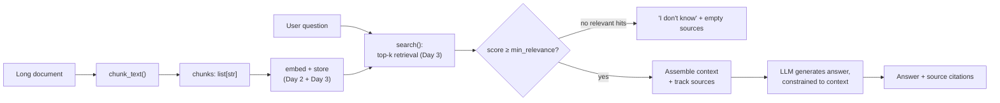

# Day 4 — Chunking Documents and Answering Only From What You Retrieved

Everything this week builds toward one function: given a user's question,
answer it *using only the retrieved handbook text* — and say so honestly
when nothing relevant was found. Getting there requires two more pieces:
splitting real documents into retrievable units (chunking), and a final
answer step disciplined enough to refuse when retrieval comes up empty.

## Why not just feed the whole handbook to the model?

Three reasons this doesn't scale:

- **Cost** — every request re-sends the entire document, even for a
  one-sentence question. A 60-page handbook is roughly 24,000 words —
  around 30,000+ tokens by typical word-to-token ratios — resent in full
  on every single question, when the actual answer usually lives in one or
  two paragraphs.
- **Relevance** — a 60-page handbook stuffed into one prompt buries the one
  relevant paragraph in noise. Models measurably answer worse with a lot of
  irrelevant context crowding the real answer, even when the real answer
  is technically present somewhere in that context.
- **Context window limits** — sooner or later the document plus the
  question plus the desired answer simply won't fit in the model's context
  window at all, regardless of cost.

Chunking + retrieval (Days 2-3) exists specifically to avoid this: send
only the few paragraphs that actually matter for this question, so a
3-paragraph answer costs roughly 3 paragraphs of tokens, not 60 pages of
tokens.

## Chunk size and overlap

Splitting a document into chunks means picking two knobs:

- **Chunk size** — too small and a chunk loses context (a sentence fragment
  with no surrounding meaning, and the retrieval step has to work harder to
  reassemble what a full idea even was); too large and a single retrieved
  chunk dilutes relevance again and burns tokens on parts of the chunk that
  don't matter for this question.
- **Overlap** — a bit of shared text between consecutive chunks (e.g. the
  last 20 words of chunk N repeated at the start of chunk N+1) prevents a
  fact sitting right at a chunk boundary from being split in half and lost
  entirely from both chunks.

```python
def chunk_text(text: str, chunk_words: int = 120, overlap_words: int = 20) -> list[str]:
    # Word counts (not raw character counts) track "how much meaning" a
    # chunk holds more consistently -- sentence length varies a lot less
    # in words than character-per-word does across different documents.
    words = text.split()  # -> list[str], one entry per whitespace-separated token
    if chunk_words <= overlap_words:
        raise ValueError("chunk_words must be greater than overlap_words")

    chunks = []
    start = 0
    step = chunk_words - overlap_words  # how far the window advances each iteration
    while start < len(words):
        end = start + chunk_words
        chunks.append(" ".join(words[start:end]))    # -> str, <= chunk_words words
        if end >= len(words):
            break
        start += step
    return chunks  # -> list[str]
```

Tested on a synthetic 760-word handbook (20 numbered policy sections
concatenated together) with `chunk_words=120, overlap_words=20`:

```
synthetic handbook word count: 760
num chunks: 8
chunk sizes: 120, 120, 120, 120, 120, 120, 120, 60   (last chunk is a partial remainder)
```

`step = 120 - 20 = 100`, and `ceil((760 - 120) / 100) + 1 = 8` matches
exactly. The overlap was also verified directly: the last 20 words of chunk
0 and the first 20 words of chunk 1 are character-for-character identical
(`chunk0_tail == chunk1_head` evaluated to `True`), which is exactly the
mechanism that keeps a fact from vanishing at a boundary — if the sentence
"who to contact in HR" happened to fall right at word 120, it now
appears whole in both chunks instead of being cut in half in each.

There's no universally "correct" size — it's a trade-off tuned against your
documents' structure and your embedding model's own context limits. Legal
or policy text with short, self-contained clauses often wants smaller
chunks; narrative or technical prose with cross-referencing sentences often
wants larger ones.

## A full retrieval pipeline, run end-to-end

Putting chunking together with a real (TF-IDF) embedding and retrieval, on
a small synthetic handbook:

```python
handbook = """
Section 4.1: The office is closed on all federal holidays including New Year's Day,
Independence Day, and Thanksgiving. Employees are not required to use PTO for these days.
Section 4.2: New hires accrue 12 vacation days in their first year of employment, credited
monthly at a rate of one day per month. After three years of service the accrual rate
increases to 18 days per year.
Section 4.3: Paid time off requests must be submitted through the HR portal at least two
weeks in advance for any absence longer than two consecutive days. Same-day sick leave
does not require advance notice.
Section 5.1: Employee laptops are replaced every three years or upon failure, whichever
comes first. Submit a replacement request through the IT ticketing system.
"""

chunks = chunk_text(handbook, chunk_words=40, overlap_words=8)
# -> 4 chunks: [40, 40, 40, 29] words

vectorizer = TfidfVectorizer()
chunk_matrix = vectorizer.fit_transform(chunks)  # shape: (4, 89) -- 89-word vocabulary
```

Querying "how many vacation days do new hires get?" retrieves, in order:

```
score=0.445  handbook.pdf#chunk0  "...Section 4.2: New hires accrue 12 vacation days in their first year"
score=0.134  handbook.pdf#chunk1  "accrue 12 vacation days in their first year of employment, credited monthly..."
```

Both hits genuinely contain the answer — chunk0's tail and chunk1's head
overlap on exactly the sentence that matters, which is the overlap
mechanism from the previous section paying off in a real retrieval, not
just in a synthetic boundary test.



## The `answer()` pattern

The core discipline of RAG isn't retrieval — it's refusing to answer beyond
what retrieval actually found:

```python
def answer(question: str, top_k: int = 2, min_relevance: float = 0.05) -> dict:
    hits = search(question, top_k=top_k)              # Day 2/3 retrieval
    relevant = [h for h in hits if h["score"] >= min_relevance]

    if not relevant:
        return {"answer": "I don't know — nothing relevant was found in the documents.", "sources": []}

    context = "\n\n".join(f"[{h['source']}] {h['text']}" for h in relevant)
    prompt = (
        "Answer the question using ONLY the context below. "
        "If the context doesn't contain the answer, say you don't know.\n\n"
        f"Context:\n{context}\n\nQuestion: {question}"
    )
    reply = call_llm(prompt)   # a real LLM call, constrained by the prompt above
    return {"answer": reply, "sources": [h["source"] for h in relevant]}
```

Three things make this trustworthy: it retrieves *before* generating (the
model never gets a chance to guess first), it instructs the model to stay
inside the retrieved context, and it reports sources alongside the answer
so a person can verify it — mirroring the grounded example from Day 1. Run
against the handbook above, `answer("how many vacation days do new hires
get?")` returns both chunk0 and chunk1 as sources with the scores shown
earlier, and a downstream grounding check confirms the number `12` cited in
the answer actually appears in the retrieved context — a cheap, mechanical
safety net against a model inventing a *different* number while still
citing a real source.

## A real pitfall: the relevance threshold isn't as safe as it looks

`min_relevance` is meant to catch "nothing relevant was found" and return
an honest "I don't know." Testing this on an out-of-scope question — "what
is the company's parental leave policy?", which the synthetic handbook
never mentions — exposes exactly how this can fail:

```
chunk scores for "what is the company's parental leave policy?":  0.148, 0.147, ...
```

Both scores clear the `min_relevance=0.05` threshold, so the function
returns a fabricated-looking "answer" with sources attached, instead of
honestly saying "I don't know." Digging into *why*: even with English stop
words removed, one chunk still scores 0.235 against this query — and the
shared term turns out to be the single word **"leave"**, present in the
handbook's unrelated "same-day sick *leave* does not require advance
notice" and coincidentally also present in "parental *leave* policy." The
retrieval isn't wrong about there being lexical overlap — there genuinely
is — it's wrong about that overlap meaning the topics are related.

This is the Day 2 spelling-vs-meaning gap resurfacing one more layer up, at
the point where it's most dangerous: it can flip a system from "honestly
says I don't know" to "confidently cites a source that isn't actually
about the question." Three real mitigations, in increasing cost order:
raise `min_relevance` based on measured scores for genuinely relevant vs.
irrelevant questions on your own documents (not a guessed constant); use a
real trained embedding model instead of TF-IDF, since it's far less likely
to conflate "sick leave" with "parental leave" through shared vocabulary
alone; and, for anything high-stakes, add a second, explicit check — either
a smaller model call or a rule — asking "does this retrieved text actually
answer this question?" before generation, rather than trusting a similarity
score alone.

## Common pitfalls

- **Treating "I don't know" as a fallback instead of a first-class
  outcome.** A RAG system that only ever produces answers wasn't tested
  against enough out-of-scope questions — see the parental-leave example
  above, where the naive version confidently answered wrong.
- **Chunk boundaries that split the one fact you needed.** Overlap
  mitigates this but doesn't eliminate it for facts longer than the
  overlap window — a table or a multi-sentence exception clause can still
  straddle a boundary badly.
- **Picking `min_relevance` once and never revisiting it.** The right
  threshold depends on the embedding model, the document set, and the kind
  of questions being asked — a value that works for one corpus can silently
  stop catching irrelevant matches on another, as shown above.
- **Citing sources without actually grounding the claim in them.** Listing
  `sources` next to an answer looks trustworthy whether or not the model
  actually used them correctly — a cheap post-hoc check (like verifying any
  cited number appears in the retrieved text) catches a real class of
  error for very little engineering cost.

## Takeaway

A RAG system is only as honest as its refusal to answer. Chunking with
overlap makes retrieval possible without losing facts at boundaries, and a
real end-to-end run showed that mechanism working — but it's the explicit
relevance check and the willingness to say "I don't know" that make the
answers trustworthy, and the parental-leave example shows exactly how
easily that check can be fooled by lexical coincidence if it isn't tuned
and tested against real out-of-scope questions.
