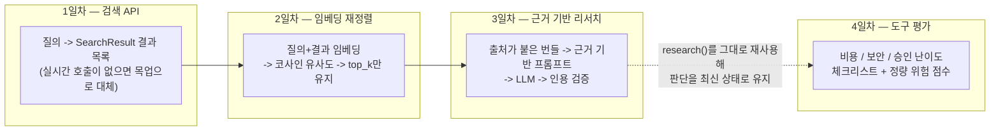

# Week 6 — 웹 검색 기반 리서치

LLM의 지식은 학습이 끝난 시점에 고정되어 있고, 로컬 문서 저장소를 활용하는 RAG 시스템조차 마지막으로
색인한 스냅샷 시점까지의 질문에만 답할 수 있습니다. 이번 주는 그다음 단계를 다룹니다: 문서 저장소를
갱신하는 속도보다 더 빠르게 바뀌는 정보는 살아있는 웹에서 직접 가져오고, 돌아온 결과 중 실제로 관련
있는 것만 추려내고, LLM이 그 자료에서만 답을 찾아 출처를 인용하도록 강제한 다음, "암기하지 말고 검색
하라"는 같은 원칙을 AI 도구 자체를 평가하는 데도 적용해 그 판단이 금방 낡아버리지 않도록 하는 방법까지
이어집니다.

4일 치 내용은 서로 직접 이어집니다 — 각 날짜는 그 자체로 독립적인 기법이면서 동시에 다음 날짜의
입력이 됩니다.

1일차는 이후 모든 것이 의존하는 단 하나의 계약을 정의합니다 — "질의를 넣으면 제목과 출처가 붙은
스니펫 목록이 나온다"는 것 — 그리고 이를 목업 우선으로 만들어서, 이후 단계는 결과가 실제 검색인지
고정된 테스트 데이터인지 신경 쓸 필요가 없게 합니다. 2일차는 인기도 기준으로 정렬된 원시 결과들을
가져와 실제 질의와의 코사인 유사도로 다시 점수를 매기므로, 진짜 관련 있는 소수만 다음 단계로
넘어갑니다. 3일차는 그렇게 추려진, 출처가 명확한 자료를 근거 기반 프롬프트로 감쌉니다 — 오직 이
자료에서만 답하고, 인용하고, 모르면 모른다고 말하라 — 그리고 그 지시를 그냥 믿는 대신 코드로 인용을
검증합니다. 4일차는 "낡은 스냅샷을 믿지 말라"는 같은 원칙을 AI 도구 생태계 자체에 적용합니다: 어떤
새 도구든 판단할 수 있는 고정된 체크리스트를 만들고, 3일차의 파이프라인을 그대로 재실행해 그 판단을
최신 상태로 유지합니다.

| Day | 주제 | 링크 |
| --- | --- | --- |
| 1 | 최신 정보를 위한 검색 API | [daily/Day1_search-apis-for-fresh-info.ko.md](daily/Day1_search-apis-for-fresh-info.ko.md) |
| 2 | 임베딩 기반 검색 결과 재정렬 | [daily/Day2_embedding-rerank-search-results.ko.md](daily/Day2_embedding-rerank-search-results.ko.md) |
| 3 | 검색 + LLM 근거 기반 리서치 | [daily/Day3_grounded-research-pipeline.ko.md](daily/Day3_grounded-research-pipeline.ko.md) |
| 4 | AI 도구 평가 프레임워크 | [daily/Day4_ai-tool-evaluation-framework.ko.md](daily/Day4_ai-tool-evaluation-framework.ko.md) |

개념 노트북: [concepts/6th_week_Concepts.ko.ipynb](concepts/6th_week_Concepts.ko.ipynb)

영문 버전: [README.md](README.md), 그리고 위 각 파일과 짝을 이루는 `.md` / `.ipynb` 원문.
