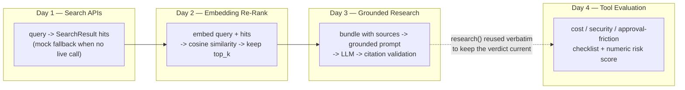

# Week 6 — Web-Search-Augmented Research

An LLM's knowledge is frozen at a training cutoff, and even a RAG system over a local document
store only answers questions about whatever snapshot was last indexed. This week is about the
next layer: reaching out to the live web for anything that changes faster than a document store
gets refreshed, narrowing what comes back to what's actually relevant, forcing the LLM to answer
only from that material with citations attached, and then applying the same "search, don't
memorize" instinct to judging AI tools themselves before they go stale.

The four days build directly on each other — each one is both a standalone technique and an input
to the next:

Day 1 defines the one contract everything else depends on — `query in, titled/sourced snippets
out` — and builds it mock-first so nothing downstream cares whether the results are real or
fixture data. Day 2 takes those raw, popularity-ranked hits and re-scores them against the actual
query with cosine similarity, so only the genuinely relevant few reach the next step. Day 3 wraps
that narrowed, sourced material in a grounded prompt — answer only from this, cite it, or admit
you don't know — and validates the citations in code rather than trusting the instruction alone.
Day 4 turns the same "don't trust a stale snapshot" instinct on the AI tooling landscape itself:
a fixed checklist for judging any new tool, kept current by literally re-running Day 3's pipeline
against it.

| Day | Topic | Link |
| --- | --- | --- |
| 1 | Search APIs for fresh information | [daily/Day1_search-apis-for-fresh-info.md](daily/Day1_search-apis-for-fresh-info.md) |
| 2 | Embedding-based re-ranking of search results | [daily/Day2_embedding-rerank-search-results.md](daily/Day2_embedding-rerank-search-results.md) |
| 3 | Search + LLM grounded research | [daily/Day3_grounded-research-pipeline.md](daily/Day3_grounded-research-pipeline.md) |
| 4 | AI tool evaluation framework | [daily/Day4_ai-tool-evaluation-framework.md](daily/Day4_ai-tool-evaluation-framework.md) |

Concepts notebook: [concepts/6th_week_Concepts.ipynb](concepts/6th_week_Concepts.ipynb)

Korean versions: [README.ko.md](README.ko.md), and a `.ko.md` / `.ko.ipynb` sibling next to every
file above.
