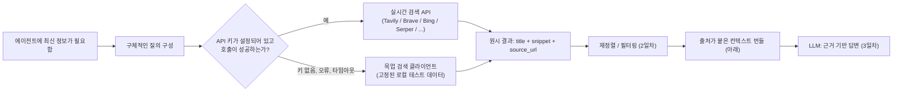

# 1일차 — 최신 정보를 위한 검색 API

LLM은 어떤 시점에 고정된 학습 데이터만 알고 있습니다. 이를 PDF나 위키 문서 폴더를 대상으로 하는
문서 검색(RAG) 시스템과 결합해도 이 문제는 해결되지 않습니다 — 그 문서들 역시 모델 가중치만큼이나
정적이기 때문입니다. 아무도 다시 색인하지 않는다면 "오늘"에 대한 답은 여전히 그 파일들이 마지막으로
저장된 시점에 참이었던 내용일 뿐입니다. 주가, 라이브러리의 최신 릴리스, 오늘 아침 뉴스, 업스트림에서
버그가 이미 수정되었는지 여부처럼 *지금 이 순간*에 대한 질문에 답하려면, 에이전트는 자신의 고정된
지식과 자신의 문서 저장소 바깥으로, 살아있는 웹으로 손을 뻗을 방법이 필요합니다.

이는 RAG가 푸는 문제와 다릅니다. 둘은 흔히 같은 것처럼 묶여 다뤄지지만 그렇지 않습니다. RAG는
"*우리* 말뭉치가 X에 대해 뭐라고 말하는가"를 고정된 스냅샷에서 답합니다. 웹 검색은 "지금 이 순간
기준으로 세상이 X에 대해 뭐라고 말하는가"에 답합니다 — 말뭉치 자체가 계속 움직입니다. 이것이
공학적으로 의미하는 바는, 검색으로 보강된 에이전트에는 더 큰 로컬 색인이 아니라 *실시간* I/O
경계(계속 다시 크롤링하고 다시 색인하는 서비스로의 네트워크 호출)가 필요하다는 것입니다.

## 검색 API라는 추상화

어떤 웹 검색 제품이든 — 유료 REST API든, 검색 엔진 자체의 웹 폼이든, 브라우저 플러그인이든 — 브랜딩을
걷어내면 인터페이스는 거의 항상 같은 모양입니다: 짧은 텍스트 **질의(query)**를 보내면, `title`,
일치하는 텍스트의 짧은 `snippet`, 그리고 `source_url`을 가진 순서 있는 **결과(results)** 목록을
돌려받습니다. 이후 에이전트가 검색으로 하는 모든 일 — 재정렬, 요약, 인용 — 은 이 단순한 계약 하나 위에
쌓입니다. 이 모양을 제대로 잡아두면, 이번 주의 나머지 파이프라인(2일차의 재정렬, 3일차의 근거 기반
답변)은 결과가 실제로 어디서 왔는지 거의 신경 쓸 필요가 없습니다.

```python
from dataclasses import dataclass

@dataclass
class SearchResult:
    title: str
    snippet: str
    source_url: str

def search_web(query: str, max_results: int = 5) -> list[SearchResult]:
    """목업이든 실제든, 모든 검색 백엔드가 만족해야 하는 계약.
    실제 구현이라면 `query`를 제공자의 HTTP 엔드포인트로 보내고
    그 JSON 응답을 이 SearchResult 형태로 그대로 매핑한다."""
    ...  # -> list[SearchResult], len <= max_results, 제공자 자체의 관련성 순위로 정렬됨
```

이 계약에 아직 의도적으로 들어있지 않은 것에 주목하세요: 재정렬도, 중복 제거도, 인용 형식화도
없습니다. 이 원시 fetch 함수를 이렇게 좁게 유지하는 것이 바로 교체 가능성을 만드는 핵심입니다 —
문자열 하나만 받아서 세 필드짜리 레코드 목록을 돌려주는 함수는 테스트에서 가짜로 만들기도 쉽고,
나중에 다른 제공자를 가리키게 바꾸기도 쉽습니다.

## 실시간 클라이언트만이 아니라 폴백 경로가 필요한 이유

실시간 검색 호출은 코드와는 무관한 이유로도 실패할 수 있습니다: API 키가 없거나 만료됐거나, 제공자가
속도 제한을 걸었거나, 네트워크 요청이 타임아웃되거나, 데모 도중 계정 할당량이 소진되거나. 검색 호출이
실패하는 순간 그냥 죽어버리는 에이전트(혹은 노트북, 혹은 CI 테스트)는 실제 작업과는 아무 상관 없는
방식으로 취약합니다. 해결책은 "실시간 검색을 쓸 수 없음"을 예외적으로 놓친 상황이 아니라 처음부터
당연히 존재하는 분기로 취급하는 것입니다 — 그리고 그 분기가 장애가 난 뒤에야 덧붙여지는 것이 아니라
첫날부터 실제로 실행되도록, 실제 클라이언트보다 목업 클라이언트를 *먼저* 만드는 것입니다.



점선으로 표시된 분기점 이후의 모든 것 — 재정렬, 번들링, 근거 부여 — 은 그 결과가 유료 API에서 왔든
테스트용 딕셔너리에서 왔든 동일합니다. 바로 이것이 `SearchResult` 계약을 처음부터 제대로 잡아두는
전체적인 이유입니다.

## 목업 우선 설계

유료 API 키를 연결하기 전에, 질의 텍스트를 키로 하는 작은 로컬 딕셔너리에서 현실적인 `SearchResult`
객체를 돌려주는 대체물을 먼저 만드세요. 실제 함수와 시그니처와 반환 타입만 맞으면, 나중에 스텁을
실시간 클라이언트로 바꾸는 것은 한 줄짜리 변경입니다 — 에이전트의 다른 어떤 부분도 차이를 알 필요가
없습니다.

```python
# 실제 검색 제공자의 백엔드를 대신하는 작은 로컬 "색인".
# 키는 정규화(소문자화, 공백 제거)된 질의 문자열이고, 값은 그 제공자가
# 해당 질의에 대해 그럴듯하게 돌려줄 법한 SearchResult 객체들이다.
_MOCK_INDEX: dict[str, list[SearchResult]] = {
    "rust ownership": [
        SearchResult(
            "Ownership - The Rust Book",
            "Each value in Rust has a variable that's called its owner, and there can only be one owner at a time.",
            "https://doc.rust-lang.org/book/ch04-01-what-is-ownership.html",
        ),
        SearchResult(
            "Borrowing rules explained",
            "References let you use a value without taking ownership of it, subject to strict borrow-checker rules.",
            "https://example-blog.dev/rust-borrow",
        ),
    ],
}

def search_web_stub(query: str, max_results: int = 5) -> list[SearchResult]:
    """search_web 계약의 목업 구현. 네트워크 호출 없이 완전히 결정론적이다."""
    key = query.lower().strip()
    return _MOCK_INDEX.get(key, [])[:max_results]  # -> list[SearchResult], len 0..max_results
```

`search_web_stub("rust ownership")`을 실행하면 매번 정확히 위의 두 `SearchResult` 객체가
네트워크 의존성 없이 나옵니다 — 그래서 단위 테스트로 돌리거나 API 키가 전혀 없는 CI 파이프라인에서
실행하기에 안전합니다.

## 질의 구성은 뒷전이 아니라 엔지니어링이다

`search_web_stub("rust ownership")`은 초점이 명확한 두 결과를 돌려줍니다. `search_web_stub("rust")`
하나만 넣으면 이 작은 테스트 데이터에서는 아무것도 안 나옵니다 — 그리고 *실제* 검색 엔진에서 이런
한 단어짜리 질의는 "아무것도 안 나오는" 것이 아니라, 튜토리얼, 크레이트 목록, 채용 공고, 관련 없는
포럼 스레드로 결과를 뒤덮어버립니다. 어느 쪽도 에이전트가 실제로 필요로 했던 것이 아닙니다. 모호한
질의의 실패 양상은 보통 결과 0개가 아니라, *기술적으로는 주제와 관련 있지만* *실제로 묻고자 한
구체적인 질문에는 쓸모없는* 상위 5개 목록입니다.

질의 구성을 사용자의 원문 문장을 그대로 전달하는 자리가 아니라 엔지니어링 영역으로 다루세요:

- **전체 질문이 아니라 개념의 이름을 대세요.** "함수에서 참조를 반환할 때 러스트 소유권 오류를
  고치려면 어떻게 해야 하나요"는 사람이 물어본 문장이고, "rust ownership return reference error"가
  검색 엔진을 정확한 페이지로 이끄는 데 더 가깝습니다.
- **모호한 용어에는 구분자를 덧붙이세요** — 단어 자체가 여러 의미로 쓰일 때는 "timeout"이 아니라
  "python asyncio wait_for timeout"처럼요.
- **사용자의 질문을 다시 풀어쓴 문장이 아니라 전문가가 실제로 타이핑할 법한 표현을 쓰세요.** 검색
  엔진은 (LLM 전용으로 만들어진 검색 API조차) 여전히 질의응답 시스템보다는 키워드·구절 매칭기에
  더 가깝습니다.

## 실제 호출은 실제로 어떻게 생겼는가

프로덕션 에이전트는 API 키를 가진, 문서화되고 이용약관을 준수하는 검색 API를 써야 합니다(아래 제공자
소개 참고) — 하지만 그 밑에 깔린 실제 메커니즘을 한 번쯤 직접 보는 것은 가치가 있습니다. 왜냐하면
그 모든 유료 API가 결국 같은 세 가지를 하고 있기 때문입니다: HTTPS로 질의를 보내고, 구조화된(보통
JSON) 결과를 받고, 그 응답을 `SearchResult` 같은 형태로 매핑하는 것. 아래는 API 키 없이 DuckDuckGo의
공개 HTML 결과 페이지를 대상으로 같은 형태를 구현한 것으로, 이 요청-파싱 루프를 구체적으로 보여줍니다.

```python
import requests
from bs4 import BeautifulSoup
from urllib.parse import urlparse, parse_qs, unquote

def search_web_live(query: str, max_results: int = 5) -> list[SearchResult]:
    """어디까지나 설명용. 문서화되지 않은 HTML 엔드포인트를 API 키 없이 호출하므로
    취약하고(마크업이 바뀔 수 있음) 프로덕션에는 적합하지 않다. 실제 통합이라면
    HTML을 스크래핑하는 대신 문서화되고 이용약관을 준수하는 제공자(Tavily,
    Brave Search API, Bing Web Search, Serper 등)를 정식 키로 호출해야 한다."""
    resp = requests.get(
        "https://html.duckduckgo.com/html/",
        params={"q": query},
        headers={"User-Agent": "Mozilla/5.0"},
        timeout=10,
    )
    soup = BeautifulSoup(resp.text, "html.parser")
    results: list[SearchResult] = []
    for row in soup.select(".result")[:max_results]:
        link = row.select_one(".result__title a")
        snippet_el = row.select_one(".result__snippet")
        if link is None:
            continue
        # 이 HTML 엔드포인트는 실제 목적지를 바로 링크하는 대신
        # `/l/?uddg=<url-encoded-url>` 형태의 리다이렉트 링크로 감싼다 —
        # 나중에 인용이 실제 위치를 가리키도록 이를 디코딩해서 실제 source_url을 복원한다.
        qs = parse_qs(urlparse(link.get("href", "")).query)
        real_url = unquote(qs["uddg"][0]) if "uddg" in qs else link.get("href", "")
        results.append(SearchResult(
            title=link.get_text(strip=True),
            snippet=snippet_el.get_text(strip=True) if snippet_el else "",
            source_url=real_url,
        ))
    return results  # -> list[SearchResult], len <= max_results
```

`search_web_live("python asyncio wait_for timeout")`을 실행한 실제 결과(한 번 실행해서 그대로
캡처한 것 — 실시간 웹 엔드포인트는 시점에 따라 비결정적이므로 정확한 결과 자체보다는 예시로
받아들이세요):

```
1. Asyncio wait_for() to Wait With a Timeout - SuperFastPython
   https://superfastpython.com/asyncio-wait_for/
2. Python asyncio.wait_for(): Cancel a Task with a Timeout
   https://www.pythontutorial.net/python-concurrency/python-asyncio-wait_for/
3. The Right Way to Set Timeouts in Async Python: wait_for vs. asyncio.timeout
   https://runebook.dev/en/docs/python/library/asyncio-task/asyncio.Timeout.expired
4. python - The asyncio Timeout Trap: Why wait_for() Doesn't Stop Tasks ...
   https://runebook.dev/en/docs/python/library/asyncio-task/timeouts
5. Coroutines and tasks — Python 3.14.7 documentation
   https://docs.python.org/3/library/asyncio-task.html
```

실제 결과는 모두 깨끗하게 디코딩된 `source_url`을 갖고 있습니다 — 정확히 3일차의 인용 단계가
의존하는 필드입니다. 이런 호출은 앞 절의 목업 클라이언트로 대체되는 `try/except`로 감싸세요. 이것이
위 다이어그램에서 그려진 폴백 분기이고, 네트워크 호출이 어떤 이유로든 실패했을 때 데모(혹은 불안정한
CI 실행)를 계속 동작하게 해주는 장치입니다.

**제공자 선택에 대해:** 범용 검색 API(Bing Web Search, Brave Search API, Serper)는 사람이 직접
검색했을 때 볼 법한 결과를 그대로 돌려줍니다. 더 최근에 생긴 카테고리 — Tavily, Exa 등 — 는 LLM
에이전트를 위해 특별히 만들어졌습니다: 이미 원시 결과와 함께 LLM 지향적인 요약을 돌려주거나, 콘텐츠
유형이나 최신성으로 필터링할 수 있게 해주는 경우도 있습니다. 어떤 것이 돈을 지불할 가치가 있는지는
계속 바뀌며, 이것이 정확히 4일차의 평가 프레임워크가 존재하는 이유입니다 — 여기 언급된 특정 이름을
영구적인 추천으로 받아들이지 마세요.

## 출처를 잃지 않고 결과를 묶기

결과를 확보했다면 — 목업이든 실시간이든 — LLM에 넘길 문자열 하나로 합칩니다. 이 단계에서 절대
깨져서는 안 되는 규칙 하나: 모든 스니펫은 자신의 URL과 계속 붙어 있어야 합니다. 이 단계에서 URL을
빼버리면 나중에 복구할 방법이 없습니다 — 출처를 인용하거나 독자가 주장을 검증할 능력을 잃게 되고,
이는 조용히 근거 부여(3일차)의 전체 취지를 무너뜨립니다.

```python
def build_context_bundle(results: list[SearchResult]) -> str:
    """검색 결과를 LLM 프롬프트용 문자열 하나로 합친다. 각 결과에 번호를 매겨서
    나중에 "[2]" 같은 인용이 results[1]로 곧바로 추적될 수 있도록 한다."""
    blocks = []
    for i, r in enumerate(results, start=1):
        blocks.append(f"[{i}] {r.title}\n{r.snippet}\nSource: {r.source_url}")
    return "\n\n".join(blocks)  # -> str, SearchResult 하나당 빈 줄로 구분된 블록 하나
```

## 흔한 함정

- **"결과 0개"를 신호가 아니라 오류로 취급하기.** 아무것도 안 나오는 질의도 정보입니다 — 보통
  질의가 너무 좁았거나, 철자가 틀렸거나, 색인이 실제로 다루지 않는 주제라는 뜻입니다. 죽어버리거나
  빈 컨텍스트 번들을 조용히 LLM에 넘기는 대신, 더 넓은 질의로 재시도하세요.
- **속도 제한을 처리하지 않기.** 실제 검색 API는 요청을 제한합니다. 프로덕션 클라이언트에는 그냥
  `requests.get`이 아니라 백오프와 재시도 로직이 필요합니다 — 목업 클라이언트는 이 문제를 완전히
  숨겨버리는데, 데모에는 괜찮지만 1분에 한 번 이상 실행될 무언가에는 그렇지 않습니다.
- **결과를 과도하게 가져오기.** "안전하게" 20개를 가져오는 것은 대부분 노이즈인 스니펫 20개가
  컨텍스트 윈도우에 들어가서 LLM이 다뤄야 할 신호를 희석시킨다는 뜻일 뿐입니다. 2일차가 재정렬로
  이를 해결하지만, 가장 값싼 해법은 애초에 더 적고 더 타깃팅된 결과를 요청하는 것입니다.
- **실제 답을 잘라내는 스니펫.** 검색 스니펫은 흔히 제공자 자체의 하이라이팅 로직이 고른 조각이지,
  질문에 답하는 문장이라는 보장은 없습니다. 답이 불완전해 보인다면, 이는 답을 추측할 신호가 아니라
  전체 페이지를 가져와야 할 신호입니다(3일차).
- **문서화되지 않은 엔드포인트를 프로덕션에서 스크래핑하기.** 위 DuckDuckGo HTML 예시는 메커니즘을
  이해하기 위한 것이지 출시용이 아닙니다 — 비공식 엔드포인트는 사전 통보 없이 마크업을 바꾸거나 당신을
  차단할 수 있고, 문의할 지원 채널도 없습니다. 실제 출시는 키가 있는 문서화된 API로 하세요.

**한 줄 요약:** 검색 API는 결국 "질의를 넣으면 제목과 출처가 붙은 스니펫이 나온다"는 것뿐입니다 —
이 형태를 먼저 목업으로 만들고, 폴백 경로를 처음부터 구축하고, URL을 모든 스니펫에 계속 붙여두면,
나중에 실제 키는 한 줄짜리 교체가 됩니다.
