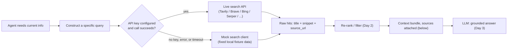

# Day 1 — Search APIs for Fresh Information

An LLM only knows what was baked into its training data, frozen at some cutoff date. Pairing it
with a document-retrieval (RAG) system over a folder of PDFs or wiki pages does not fix that —
those documents are just as static as the model's weights. If nobody re-indexes them, "today's"
answer is still whatever was true when the files were last saved. To answer questions about
*right now* — a stock price, a library's latest release, this morning's news, whether a bug was
already fixed upstream — an agent needs a way to reach outside its own frozen knowledge and
outside its own document store, out onto the live web.

That is a different problem than RAG solves, even though the two get lumped together. RAG answers
"what does *our* corpus say about X" from a fixed snapshot. Web search answers "what does the
world say about X, as of the moment I asked" — the corpus itself keeps moving under you. The
engineering consequence is that a search-augmented agent needs a *live* I/O boundary (a network
call to a service that itself keeps re-crawling and re-indexing), not just a bigger local index.

## The search API abstraction

Strip away the branding of any web search product — a paid REST API, a search engine's own web
form, a browser plugin — and the interface is almost always the same shape: you send a short text
**query**, and you get back an ordered list of **results**, each with a `title`, a short `snippet`
of matching text, and a `source_url`. Everything an agent does with search afterward — re-ranking,
summarizing, citing — builds on top of that one simple contract. If you get this shape right, the
rest of the week's pipeline (Day 2's re-ranking, Day 3's grounded answers) barely has to care where
the results actually came from.

```python
from dataclasses import dataclass

@dataclass
class SearchResult:
    title: str
    snippet: str
    source_url: str

def search_web(query: str, max_results: int = 5) -> list[SearchResult]:
    """The contract every search backend has to satisfy, mock or real.
    A real implementation sends `query` to a provider's HTTP endpoint and maps
    its JSON response onto this same SearchResult shape."""
    ...  # -> list[SearchResult], len <= max_results, ordered by the provider's own relevance ranking
```

Notice what is deliberately *not* in this contract yet: no re-ranking, no deduplication, no
citation formatting. Keeping the raw fetch function this narrow is what makes it swappable — a
function that only takes a string and returns a list of three-field records is trivial to fake in
tests and trivial to point at a different provider later.

## Why this needs a fallback path, not just a real client

A live search call can fail for reasons that have nothing to do with your code: the API key is
missing or expired, the provider is rate-limiting you, the network request times out, the account
ran out of quota mid-demo. An agent (or a notebook, or a CI test) that hard-crashes the moment a
search call fails is fragile in a way that has nothing to do with the actual task. The fix is to
treat "no live search available" as a first-class, expected branch, not an exception you forgot to
catch — and to build the mock client *before* the real one so that branch is exercised from day
one, not bolted on after an outage.



Everything downstream of the dashed decision point — re-ranking, bundling, grounding — is
identical whether the hits came from a paid API or a fixture dictionary. That is the entire point
of nailing the `SearchResult` contract early.

## Mock-first design

Before wiring up a paid API key, build a stand-in that returns realistic `SearchResult` objects
from a small local dictionary keyed by query text. As long as it matches the real function's
signature and return type, swapping the stub for a live client later is a one-line change —
nothing else in the agent has to know the difference.

```python
# A tiny local "index" standing in for a real search provider's backend.
# Keys are normalized (lowercased, stripped) query strings; values are the
# SearchResult objects that provider would plausibly return for that query.
_MOCK_INDEX: dict[str, list[SearchResult]] = {
    "rust ownership": [
        SearchResult(
            "Ownership - The Rust Book",
            "Each value in Rust has a variable that's called its owner, and there can only be one owner at a time.",
            "https://doc.rust-lang.org/book/ch04-01-what-is-ownership.html",
        ),
        SearchResult(
            "Borrowing rules explained",
            "References let you use a value without taking ownership of it, subject to strict borrow-checker rules.",
            "https://example-blog.dev/rust-borrow",
        ),
    ],
}

def search_web_stub(query: str, max_results: int = 5) -> list[SearchResult]:
    """Mock implementation of the search_web contract. No network call, fully deterministic."""
    key = query.lower().strip()
    return _MOCK_INDEX.get(key, [])[:max_results]  # -> list[SearchResult], len 0..max_results
```

Run `search_web_stub("rust ownership")` and you get exactly the two `SearchResult` objects above,
every time, with no network dependency — which is what makes this safe to unit-test and safe to
run in a CI pipeline that has no API key at all.

## Query construction is engineering, not an afterthought

`search_web_stub("rust ownership")` returns two focused hits. `search_web_stub("rust")` alone
returns nothing in this tiny fixture — and against a *real* search engine, a bare one-word query
like that would not return "nothing," it would flood the results with tutorials, crate listings,
job postings, and unrelated forum threads, none of which is what the agent actually needed. The
failure mode of a vague query is not usually zero results; it is a top-5 list that is *technically
on topic* and *practically useless* for the specific question being asked.

Treat query construction as part of the engineering surface, not a place to just forward the
user's raw sentence:

- **Name the concept, not the whole question.** "How do I fix a rust ownership error when
  returning a reference from a function" is a sentence a human asked; "rust ownership return
  reference error" is closer to what gets a search engine to the right page.
- **Add a disambiguating qualifier** when the bare term is overloaded — "python asyncio
  wait_for timeout", not "timeout".
- **Prefer the phrasing an expert would type**, not a restated version of the user's whole
  question. Search engines (and search-oriented APIs built for LLMs) are still closer to keyword
  and phrase matchers under the hood than they are to a question-answering system.

## What a real call actually looks like

A production agent should use a documented, ToS-compliant search API with an API key (see the
provider landscape note below) — but it is worth seeing the raw mechanics underneath at least
once, because every one of those paid APIs is doing the same three things: send a query over
HTTPS, get back structured (usually JSON) results, and map that response onto something like
`SearchResult`. Here is that same shape done against DuckDuckGo's public HTML results page,
without an API key, to make the underlying HTTP request-and-parse loop concrete:

```python
import requests
from bs4 import BeautifulSoup
from urllib.parse import urlparse, parse_qs, unquote

def search_web_live(query: str, max_results: int = 5) -> list[SearchResult]:
    """Illustrative only — hits an undocumented HTML endpoint with no API key, so it is
    fragile (the markup can change) and not appropriate for production use. A real
    integration should call a documented, ToS-compliant provider (Tavily, Brave Search
    API, Bing Web Search, Serper, etc.) with a proper key instead of scraping HTML."""
    resp = requests.get(
        "https://html.duckduckgo.com/html/",
        params={"q": query},
        headers={"User-Agent": "Mozilla/5.0"},
        timeout=10,
    )
    soup = BeautifulSoup(resp.text, "html.parser")
    results: list[SearchResult] = []
    for row in soup.select(".result")[:max_results]:
        link = row.select_one(".result__title a")
        snippet_el = row.select_one(".result__snippet")
        if link is None:
            continue
        # The HTML endpoint wraps the real destination in a `/l/?uddg=<url-encoded-url>`
        # redirect link rather than linking to it directly — decode that back to the
        # actual source URL so citations later point somewhere real.
        qs = parse_qs(urlparse(link.get("href", "")).query)
        real_url = unquote(qs["uddg"][0]) if "uddg" in qs else link.get("href", "")
        results.append(SearchResult(
            title=link.get_text(strip=True),
            snippet=snippet_el.get_text(strip=True) if snippet_el else "",
            source_url=real_url,
        ))
    return results  # -> list[SearchResult], len <= max_results
```

Run against `search_web_live("python asyncio wait_for timeout")`, this returned (captured
verbatim, one run — a live web endpoint is non-deterministic across time, so treat exact hits as
illustrative rather than reproducible):

```
1. Asyncio wait_for() to Wait With a Timeout - SuperFastPython
   https://superfastpython.com/asyncio-wait_for/
2. Python asyncio.wait_for(): Cancel a Task with a Timeout
   https://www.pythontutorial.net/python-concurrency/python-asyncio-wait_for/
3. The Right Way to Set Timeouts in Async Python: wait_for vs. asyncio.timeout
   https://runebook.dev/en/docs/python/library/asyncio-task/asyncio.Timeout.expired
4. python - The asyncio Timeout Trap: Why wait_for() Doesn't Stop Tasks ...
   https://runebook.dev/en/docs/python/library/asyncio-task/timeouts
5. Coroutines and tasks — Python 3.14.7 documentation
   https://docs.python.org/3/library/asyncio-task.html
```

Every real result carries a clean, decoded `source_url` — exactly the field the citation step in
Day 3 depends on. Wrap this kind of call in a `try/except` that falls back to the mock client from
the previous section; that is the fallback branch drawn in the diagram above, and it is what keeps
a demo (or a flaky CI run) working when the network call fails for any reason.

**On provider choice:** general-purpose search APIs (Bing Web Search, Brave Search API, Serper)
return the same kind of result a human searcher would see. A newer category — Tavily, Exa, and
similar — is built specifically for LLM agents: some already return LLM-oriented summaries
alongside raw results, or let you filter by content type and recency. Which one is worth paying
for changes constantly, which is exactly the kind of judgment call Day 4's evaluation framework is
for — do not treat any specific name here as a permanent recommendation.

## Bundling results without losing provenance

Once you have hits — mock or live — fold them into one string to hand to the LLM. The one rule
that must never break here: every snippet stays attached to its URL. Drop the URLs at this stage
and there is no way to recover them later; you lose the ability to cite a source or let a reader
verify a claim, which quietly defeats the entire point of grounding (Day 3).

```python
def build_context_bundle(results: list[SearchResult]) -> str:
    """Combine search results into one string for an LLM prompt, numbering each one so a
    later citation like "[2]" can be traced straight back to results[1]."""
    blocks = []
    for i, r in enumerate(results, start=1):
        blocks.append(f"[{i}] {r.title}\n{r.snippet}\nSource: {r.source_url}")
    return "\n\n".join(blocks)  # -> str, one blank-line-separated block per SearchResult
```

## Common pitfalls

- **Treating "zero results" as an error instead of a signal.** A query that returns nothing is
  information — it usually means the query was too narrow, misspelled, or about something the
  index genuinely doesn't cover. Retry with a broader query before giving up, rather than
  crashing or silently returning an empty context bundle to the LLM.
- **Not handling rate limits.** Real search APIs throttle you. A production client needs backoff
  and retry logic, not a bare `requests.get` — the mock client hides this problem entirely, which
  is fine for a demo but not for anything that will run more than once a minute.
- **Over-fetching.** Pulling 20 results "to be safe" just means 20 snippets of mostly noise enter
  the context window, diluting the signal the LLM has to work with. Day 2 fixes this with
  re-ranking, but the cheapest fix is simply asking for fewer, more targeted results in the first
  place.
- **Snippets that truncate the actual answer.** A search snippet is often a fragment chosen by the
  provider's own highlighting logic, not necessarily the sentence that answers your question. If
  an answer looks incomplete, that is a signal to fetch the full page (Day 3), not to guess at
  what the missing text probably said.
- **Scraping an undocumented endpoint in production.** The DuckDuckGo HTML example above is for
  understanding the mechanics, not for shipping — an unofficial endpoint can change its markup or
  block you with no notice and no support channel. Ship on a documented API with a key.

**Takeaway:** a search API is just "query in, titled/sourced snippets out" — mock that shape
first, build the fallback path in from day one, keep URLs glued to every snippet, and a real key
becomes a drop-in swap later.
