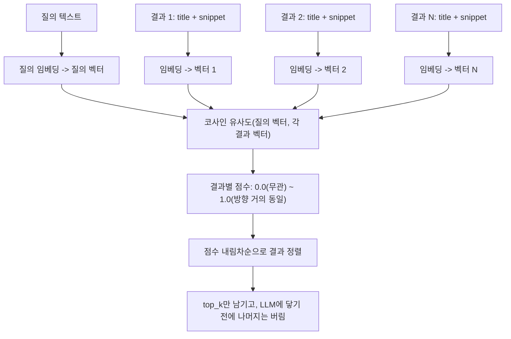

# 2일차 — 임베딩 기반 검색 결과 재정렬

검색 API 자체의 순위는 지금 당신의 에이전트가 답하려는 정확한 질문이 아니라, 웹 전체에 걸친 일반적인
인기도와 어휘적 중첩에 맞춰 최적화되어 있습니다. 결과 5개가 돌아왔을 때 실제로 관련 있는 것은 흔히
한두 개뿐이고, 나머지는 토큰을 낭비하고 LLM을 정답에서 멀어지게 할 수 있는 노이즈입니다 — 다섯 개
스니펫 중 세 개가 주제와 무관한 상태로 요약을 요청받은 모델은, 그것들을 무시하는 대신 무관한 내용을
답변에 섞어 넣기도 합니다. 해법은 벡터 검색 작업에서 쓰던 도구를 재사용하는 것입니다: 텍스트를
벡터로 바꾸고 **코사인 유사도**로 관련성을 점수화한 다음, 같은 기법을 문서 청크가 아니라 검색 결과에
적용합니다.

## 재정렬이 검색과 별개의 단계인 이유

검색 API가 처음부터 순서를 제대로 돌려주면 더 간단하지 않을까 싶겠지만, 구조적인 이유로 그렇게
되지 않습니다: 제공자의 순위 모델은 *당신의* 작업 맥락에서의 *당신의* 질의를 본 적이 없습니다 — 그
모델은 과거 수십억 건의 검색을 집계해서 전형적인 웹 검색자가 원하는 것에 맞춰 최적화되어 있습니다.
당신의 에이전트 질의는 좁고 기술적일 수 있는데("asyncio wait_for timeout"), 제공자의 순위 모델은
여전히 정밀한 기술 문서보다 대중적이고 일반적인 페이지를 위로 올릴 수 있습니다. 역사적으로 더 많은
사람이 그 일반적인 페이지를 클릭했기 때문입니다. 재정렬은 사후에, 로컬에서, 오직 *지금 이* 질의만
신경 쓰는 관련성 함수를 적용하는 단계입니다.

## 메커니즘: 임베딩 -> 코사인 점수화 -> 정렬

**임베딩**은 텍스트 한 조각을 고정 길이의 숫자 벡터로 매핑해서, 의미가 비슷한 텍스트들이 비슷한
방향을 가리키는 벡터가 되도록 합니다. **코사인 유사도**는 정확히 그것을 측정합니다 — 두 벡터 사이
각도의 코사인 값 — 그래서 벡터의 *길이*(텍스트가 얼마나 긴지)는 무시하고 오직 *방향*(텍스트가 무엇에
관한 것인지)만 측정합니다. 질의 벡터 하나와 각 검색 결과의 벡터가 주어지면, 코사인 유사도는 결과당
관련성 점수 하나를 만들어내고, 그 점수를 내림차순으로 정렬하는 것이 재정렬 알고리즘의 전부입니다.



## 의존성 없이 메커니즘만 보는, 밑바닥부터 만든 임베딩

실제 임베딩 모델은 API를 호출하거나 로컬에서 신경망을 실행합니다. 네트워크 호출도 무작위성도 없이
메커니즘만 보려면, 작은 해시 기반 bag-of-words 벡터화기만으로도 충분합니다: 단어 등장 횟수를 세고,
각 단어를 해시해서 고정된 개수의 버킷 중 하나에 흩뿌립니다. 같은 입력 텍스트는 항상 같은 벡터를
만듭니다 — 여기에는 학습되거나 의미론적인 것이 전혀 없지만, 이 벡터를 소비하는 코사인 유사도 계산
자체는 실제 임베딩 모델의 출력이 거치는 것과 동일합니다.

```python
import hashlib
import re
from collections import Counter

VECTOR_SIZE = 64

def embed_text(text: str) -> list[float]:
    """실제 임베딩 모델 호출을 대신하는, 결정론적이고 완전히 로컬인 대체물.
    모든 단어는 매번 같은 버킷으로 해시되므로 동일한 텍스트는 항상
    동일한 벡터를 만든다 -- 모델 가중치도 무작위성도 전혀 개입하지 않는다."""
    vector = [0.0] * VECTOR_SIZE          # -> list[float], len 64, 전부 0으로 시작
    words = re.findall(r"[a-z0-9]+", text.lower())
    for word, count in Counter(words).items():
        bucket = int(hashlib.md5(word.encode()).hexdigest(), 16) % VECTOR_SIZE
        vector[bucket] += count            # 충돌이 나면 그냥 같은 버킷에 개수가 더해질 뿐이다
    return vector

def cosine_similarity(a: list[float], b: list[float]) -> float:
    dot = sum(x * y for x, y in zip(a, b))
    norm_a = sum(x * x for x in a) ** 0.5
    norm_b = sum(y * y for y in b) ** 0.5
    return dot / (norm_a * norm_b) if norm_a and norm_b else 0.0  # -> [-1.0, 1.0] 사이의 float
```

이 해시 버킷 방식은 고정 길이 벡터로 위장한 **희소(sparse), 어휘적** 표현입니다: 두 텍스트가 실제
단어를 공유해야만(해시 충돌을 감안하더라도) 높은 점수를 받습니다. "starter hydration"(스타터
수화율)과 "flour-to-water ratio"(밀가루 대 물 비율)가 관련된 개념이라는 것을, 두 표현이 단어를
전혀 공유하지 않는다면 알아낼 수 없습니다. 이 한계가 정확히 실제 임베딩 모델이 제공하는 가치입니다 —
이 글 끝부분의 설명을 참고하세요.

## 검색 결과 재정렬

```python
def rerank_results(query: str, results: list[SearchResult], top_k: int = 2) -> list[SearchResult]:
    """각 SearchResult(title + snippet)를 질의와 비교해 점수를 매긴 다음,
    가장 관련성 높은 top_k개만 남긴다 -- 나머지는 LLM의 컨텍스트에 절대 들어가지 않는다."""
    query_vec = embed_text(query)
    scored = [
        (cosine_similarity(query_vec, embed_text(r.title + " " + r.snippet)), r)
        for r in results
    ]  # -> list[tuple[float, SearchResult]], results와 길이가 같음
    scored.sort(key=lambda pair: pair[0], reverse=True)
    return [r for _, r in scored[:top_k]]  # -> list[SearchResult], len == top_k
```

## 실제 숫자로 확인하는 예시: TF-IDF 재정렬

위 해시 버킷 임베딩은 의도적으로 최소한의 형태입니다. 임의로 고른 숫자가 아니라 실제로 검증 가능한
코사인 유사도 점수를 보려면, `scikit-learn`의 `TfidfVectorizer`가 진짜로 널리 쓰이는 희소 임베딩
방식입니다 — 단순히 등장 횟수를 세는 대신, 전체 말뭉치 대비 각 단어가 얼마나 구별력 있는지로 가중치를
매깁니다. 아래는 `"starter hydration ratio"`(스타터 수화 비율)라는 질의에 대한 후보 결과 5개를
대상으로 직접 실행한 것입니다.

```python
from sklearn.feature_extraction.text import TfidfVectorizer
from sklearn.metrics.pairwise import cosine_similarity
import numpy as np

query = "starter hydration ratio"
titles = [
    "History of Sourdough Bread",
    "Hydration Ratio for Sourdough Starter",
    "Best Bread Knives 2026",
    "Adjusting Starter Hydration for Climate",
    "Sourdough Discard Recipes",
]
docs = [
    "History of Sourdough Bread. This ancient bread-making technique dates back thousands of years to Ancient Egypt.",
    "Hydration Ratio for Sourdough Starter. A 100 percent hydration starter uses equal weights of flour and water by mass.",
    "Best Bread Knives 2026. A serrated knife makes cleaner slices through a crusty loaf without tearing it.",
    "Adjusting Starter Hydration for Climate. Lower hydration starter mixtures ferment more slowly in humid kitchens.",
    "Sourdough Discard Recipes. Use leftover starter portions in pancakes or crackers instead of discarding them.",
]

# fit_transform은 말뭉치 어휘를 학습함과 동시에 모든 문서를 한 번에 인코딩한다.
# shape: (n_docs=5, vocab_size) -- vocab_size는 위 VECTOR_SIZE처럼 고정값이 아니라 말뭉치에 따라 달라진다.
vectorizer = TfidfVectorizer(stop_words="english")
doc_matrix = vectorizer.fit_transform(docs)

# fit_transform이 아니라 transform을 쓰는 이유: 질의에도 같은 어휘를 재사용해야
# 질의와 문서가 정확히 같은 벡터 공간에 놓여 서로 비교 가능해지기 때문이다.
# shape: (1, vocab_size)
query_vec = vectorizer.transform([query])

sims = cosine_similarity(query_vec, doc_matrix)[0]  # -> np.ndarray, shape (5,), 문서당 점수 하나
order = np.argsort(-sims)                            # 관련성 내림차순
```

실제로 실행한 결과(`doc_matrix.shape == (5, 49)`, `query_vec.shape == (1, 49)`):

```
BEFORE (API 순서):                            AFTER (TF-IDF 코사인 재정렬):
1. History of Sourdough Bread                1. 0.5933  Hydration Ratio for Sourdough Starter
2. Hydration Ratio for Sourdough Starter     2. 0.4310  Adjusting Starter Hydration for Climate
3. Best Bread Knives 2026                    3. 0.0984  Sourdough Discard Recipes
4. Adjusting Starter Hydration for Climate   4. 0.0000  History of Sourdough Bread
5. Sourdough Discard Recipes                 5. 0.0000  Best Bread Knives 2026
```

실제로 주제와 관련 있는 두 결과(`0.59`, `0.43`)가 위로 올라오고, 빵칼 결과와 역사 결과는 정확히
`0.0000`점을 받습니다 — 영어 불용어를 제거하고 나면 질의와 어휘를 *전혀* 공유하지 않기 때문입니다.
전혀 겹치지 않는 벡터 사이의 코사인 유사도는 "낮다"가 아니라 수학적으로 정확히 0입니다. 여기서
`top_k=2`로 설정하면 관련 있는 두 결과만 정확히 남기고 나머지 셋은 LLM의 컨텍스트에 닿기 전에
버려집니다.

## 실제(밀집) 임베딩 모델이라면 의역에서 더 잘한다

TF-IDF는 여전히 근본적으로 어휘적입니다: "starter hydration ratio"를 "flour-to-water proportions"에
대한 결과와 연결하지 못합니다 — 정확히 그 표현이 등장하지 않으면요. 실제 밀집(dense) 임베딩
모델(언어 모델링 목적함수로 학습된)은 단어를 세는 대신 의미를 인코딩하기 때문에, 공유하는 단어가
전혀 없어도 의역이나 동의어를 벡터 공간에서 가깝게 배치합니다. 코드는 거의 동일해 보입니다 —
`embed_text`만 바뀝니다.

```python
# 설명용: sentence-transformers의 현재 API 기준으로는 정확하지만, 이 셀은 이 환경에서
# 실행되지 않는다 -- torch/transformers/sentence-transformers가 설치되어 있지 않다
# (이 환경에서 실제로 검증된 것은 개념 노트북 끝의 안내 참고: 위 TF-IDF 예시,
# 목업 검색 클라이언트, 인용 검증 함수는 모두 실제로 실행해 확인했다).
from sentence_transformers import SentenceTransformer

model = SentenceTransformer("all-MiniLM-L6-v2")  # 사전학습된 소형 트랜스포머를 한 번 로드한다

def embed_text_dense(texts: list[str]) -> np.ndarray:
    # normalize_embeddings=True는 단위 벡터를 반환하므로, 이후 단계에서
    # 단순 내적만으로도 이미 코사인 유사도와 같아진다 -- 별도로 norm으로 나눌 필요가 없다.
    return model.encode(texts, normalize_embeddings=True)  # -> shape (len(texts), 384)
```

트레이드오프: 밀집 모델 호출은 텍스트 배치당 TF-IDF보다 더 큰 지연 시간을(그리고 호스팅 API를 통한
경우 비용을) 요구하는 반면, TF-IDF는 한 번 fit하고 나면 사실상 공짜입니다. 짧은 검색 스니펫이라면
TF-IDF 같은 값싼 희소 방식으로 "충분히 좋은" 경우가 많고 모델 다운로드 없이 훨씬 간단하게 돌아갑니다.
질의와 관련 결과가 서로 매우 다르게 표현될 가능성이 높을 때 밀집 모델을 꺼내 쓰세요.

## 흔한 함정

- **재정렬은 검색 단계가 애초에 아무것도 관련 있는 걸 돌려주지 못한 문제를 고칠 수 없다.** 이건
  필터이지 검색기가 아닙니다 — 원시 결과 5개 중 실제로 주제와 관련된 것이 하나도 없다면, 코사인
  유사도로 정렬해봐야 그나마 덜 나쁜 노이즈를 고르는 것뿐입니다. 쓰레기를 넣으면 쓰레기가 나옵니다;
  먼저 질의(1일차)를 고치세요.
- **캐싱 없이 결과마다, 호출마다 임베딩하면 비용이 쌓인다.** 밀집 임베딩 모델 호출에는 실제 지연
  시간과(호스팅 API라면) 실제 토큰당 비용이 듭니다. 결과마다 한 번씩 호출하는 대신 모든 결과를 한
  번의 호출로 배치 처리하고, 다시 볼 가능성이 있는 질의나 문서의 임베딩은 캐싱하세요.
- **서로 다른 두 임베딩 모델의 벡터를 절대 비교하지 마세요.** 코사인 유사도는 *같은* 모델이 만든
  벡터 사이에서만 의미가 있습니다 — 한 모델의 벡터 공간 좌표축은 다른 모델의 좌표축과 아무 관계가
  없습니다. 모델을 바꾸면 전부 다시 임베딩하세요; 캐시된 예전 모델 벡터를 새 벡터와 섞지 마세요.
- **스니펫이 잘려 있으면 재정렬기가 필요한 신호 자체를 잃는다.** `embed_text`에 넘긴 스니펫이 관련
  문장 앞에서 잘려 있다면, 어떤 재정렬 방식으로도 이를 복구할 수 없습니다 — 임베딩은 오직 주어진
  텍스트만 볼 수 있습니다.
- **`top_k`를 너무 크게 두면 취지가 무색해진다.** 원시 결과 5개 중 `top_k=5`로 재정렬하는 것은
  단계만 추가된 무의미한 작업입니다. 가치는 공격적으로 좁히는 데서 나옵니다 — `top_k=2`나 `3` 정도로
  — 그래야 LLM의 컨텍스트가 신호로 조밀하게 채워집니다.

**한 줄 요약:** 재정렬은 벡터 검색에서 쓰던 임베딩-코사인-정렬 기법을 문서 청크가 아니라 원시 검색
결과에 다시 적용하는 것입니다 — TF-IDF는 오늘 당장 값싸고 검증 가능한 버전을 제공하고, 표현이
어휘적으로 맞아떨어지지 않을 때는 밀집 임베딩 모델이 (어휘가 아니라) 의미적 매칭을 제공합니다.
