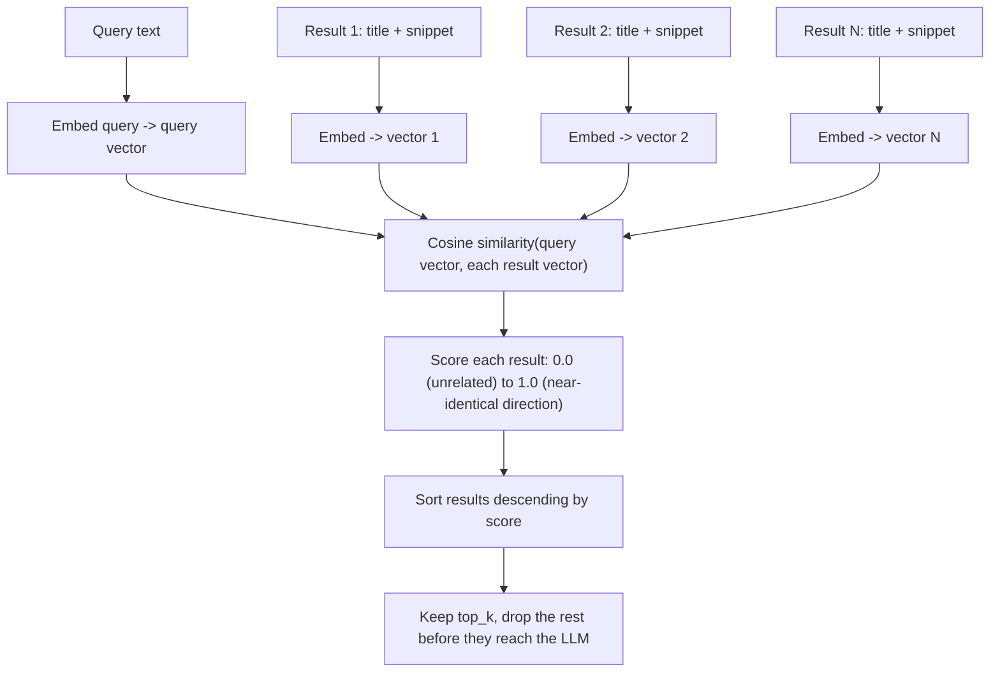

# Day 2 — Embedding-Based Re-Ranking of Search Results

A search API's own ranking is optimized for general popularity and lexical overlap across the
whole web, not for the exact question your agent is answering right now. Five results come back;
often only one or two are actually relevant, and the rest are noise that wastes tokens and can
actively distract the LLM from the right answer — a model asked to summarize five snippets where
three are off-topic will sometimes blend the off-topic material into its answer rather than
ignoring it. The fix reuses a tool from vector-retrieval work: turn text into vectors and score
relevance by **cosine similarity**, then apply that same trick to sort search hits instead of
document chunks.

## Why re-ranking is a separate step from search

It would be simpler if the search API just returned things in the right order to begin with. It
doesn't, for a structural reason: the provider's ranking model has never seen *your* query in the
context of *your* task — it optimizes for what a typical web searcher wants, aggregated across
billions of past searches. Your agent's query might be narrow and technical ("asyncio wait_for
timeout") while the provider's ranker still surfaces the popular, general-audience page over the
precise technical one, because more people historically clicked the general page. Re-ranking is
the step where you apply a relevance function that only cares about *this* query, locally, after
the fact.

## The mechanism: embed, then cosine-score, then sort

An **embedding** maps a piece of text to a fixed-length vector of numbers such that texts with
similar meaning end up as vectors that point in similar directions. **Cosine similarity** measures
exactly that — the cosine of the angle between two vectors — which is why it ignores vector
*length* (how much text there is) and only measures *direction* (what the text is about). Given a
query vector and a vector for each search result, cosine similarity produces one relevance score
per result, and sorting by that score descending is the entire re-ranking algorithm.



## A from-scratch embedding, to see the mechanics with no dependencies

A real embedding model calls out to an API or runs a neural network locally. To see the mechanics
with no network call and no randomness, a small hash-based bag-of-words vectorizer is enough: it
counts word occurrences and scatters each word into one of a fixed number of buckets by hashing
it. Same input text always produces the same vector — nothing here is learned or semantic, but the
cosine-similarity math that consumes it is identical to what a real embedding model's output would
go through.

```python
import hashlib
import re
from collections import Counter

VECTOR_SIZE = 64

def embed_text(text: str) -> list[float]:
    """Deterministic, fully local stand-in for a real embedding model call.
    Every word hashes to the same bucket every time, so identical text always
    produces an identical vector -- there is no model weight or randomness involved."""
    vector = [0.0] * VECTOR_SIZE          # -> list[float], len 64, starts all zero
    words = re.findall(r"[a-z0-9]+", text.lower())
    for word, count in Counter(words).items():
        bucket = int(hashlib.md5(word.encode()).hexdigest(), 16) % VECTOR_SIZE
        vector[bucket] += count            # collisions just add counts into the same bucket
    return vector

def cosine_similarity(a: list[float], b: list[float]) -> float:
    dot = sum(x * y for x, y in zip(a, b))
    norm_a = sum(x * x for x in a) ** 0.5
    norm_b = sum(y * y for y in b) ** 0.5
    return dot / (norm_a * norm_b) if norm_a and norm_b else 0.0  # -> float in [-1.0, 1.0]
```

This hash-bucket approach is a **sparse, lexical** representation dressed up as a fixed-length
vector: two texts only score highly if they share actual words (mod hash collisions). It cannot
tell that "starter hydration" and "flour-to-water ratio" are related concepts if the two phrases
share no words. That limitation is exactly what a real embedding model buys you — see the note
near the end of this file.

## Re-ranking search hits

```python
def rerank_results(query: str, results: list[SearchResult], top_k: int = 2) -> list[SearchResult]:
    """Score each SearchResult (title + snippet) against the query, then keep only the
    top_k most relevant ones -- the rest never make it into the LLM's context."""
    query_vec = embed_text(query)
    scored = [
        (cosine_similarity(query_vec, embed_text(r.title + " " + r.snippet)), r)
        for r in results
    ]  # -> list[tuple[float, SearchResult]], same length as `results`
    scored.sort(key=lambda pair: pair[0], reverse=True)
    return [r for _, r in scored[:top_k]]  # -> list[SearchResult], len == top_k
```

## Worked example, with real numbers: TF-IDF re-ranking

The hash-bucket embedding above is deliberately minimal. For a worked example with real,
verifiable cosine-similarity scores (rather than hand-picked numbers), `scikit-learn`'s
`TfidfVectorizer` is a genuine, widely-used sparse embedding — it weights each word by how
distinctive it is to a document relative to the whole corpus, rather than just counting raw
occurrences. This was run directly against five candidate results for the query
`"starter hydration ratio"`:

```python
from sklearn.feature_extraction.text import TfidfVectorizer
from sklearn.metrics.pairwise import cosine_similarity
import numpy as np

query = "starter hydration ratio"
titles = [
    "History of Sourdough Bread",
    "Hydration Ratio for Sourdough Starter",
    "Best Bread Knives 2026",
    "Adjusting Starter Hydration for Climate",
    "Sourdough Discard Recipes",
]
docs = [
    "History of Sourdough Bread. This ancient bread-making technique dates back thousands of years to Ancient Egypt.",
    "Hydration Ratio for Sourdough Starter. A 100 percent hydration starter uses equal weights of flour and water by mass.",
    "Best Bread Knives 2026. A serrated knife makes cleaner slices through a crusty loaf without tearing it.",
    "Adjusting Starter Hydration for Climate. Lower hydration starter mixtures ferment more slowly in humid kitchens.",
    "Sourdough Discard Recipes. Use leftover starter portions in pancakes or crackers instead of discarding them.",
]

# fit_transform learns the corpus vocabulary AND encodes every doc in one call.
# shape: (n_docs=5, vocab_size) -- vocab_size depends on the corpus, not fixed like VECTOR_SIZE above.
vectorizer = TfidfVectorizer(stop_words="english")
doc_matrix = vectorizer.fit_transform(docs)

# transform (not fit_transform!) re-uses that same vocabulary for the query,
# so query and docs land in the exact same vector space and are comparable.
# shape: (1, vocab_size)
query_vec = vectorizer.transform([query])

sims = cosine_similarity(query_vec, doc_matrix)[0]  # -> np.ndarray, shape (5,), one score per doc
order = np.argsort(-sims)                            # descending order of relevance
```

Actual output from running this (`doc_matrix.shape == (5, 49)`, `query_vec.shape == (1, 49)`):

```
BEFORE (API order):                          AFTER (TF-IDF cosine rerank):
1. History of Sourdough Bread                1. 0.5933  Hydration Ratio for Sourdough Starter
2. Hydration Ratio for Sourdough Starter     2. 0.4310  Adjusting Starter Hydration for Climate
3. Best Bread Knives 2026                    3. 0.0984  Sourdough Discard Recipes
4. Adjusting Starter Hydration for Climate   4. 0.0000  History of Sourdough Bread
5. Sourdough Discard Recipes                 5. 0.0000  Best Bread Knives 2026
```

The two genuinely on-topic results (`0.59`, `0.43`) rise to the top; the bread-knife result and
the history result score exactly `0.0000` because after removing English stop-words they share
*zero* vocabulary with the query — cosine similarity between vectors that don't overlap at all is
mathematically zero, not just "low." `top_k=2` here would keep exactly the two relevant results and
drop the other three before they ever reach the LLM's context.

## A real (dense) embedding model would do better on paraphrase

TF-IDF is still fundamentally lexical: it cannot connect "starter hydration ratio" to a result
about "flour-to-water proportions" if that exact wording never appears. A real, dense embedding
model (trained on a language-modeling objective) places paraphrases and synonyms close together in
vector space even with no shared words, because it encodes meaning rather than counting tokens.
The code for this looks nearly identical — only `embed_text` changes:

```python
# Illustrative: correct against the current sentence-transformers API, but this specific
# cell is NOT executed in this environment -- torch/transformers/sentence-transformers are
# not installed here (see the note at the end of the concepts notebook for what WAS verified
# to run: the TF-IDF example above, the mock search client, and the citation validator).
from sentence_transformers import SentenceTransformer

model = SentenceTransformer("all-MiniLM-L6-v2")  # loads a small pretrained transformer once

def embed_text_dense(texts: list[str]) -> np.ndarray:
    # normalize_embeddings=True returns unit vectors, so a plain dot product
    # already equals cosine similarity -- no separate norm division needed downstream.
    return model.encode(texts, normalize_embeddings=True)  # -> shape (len(texts), 384)
```

The tradeoff: a dense model call costs more latency (and, via a hosted API, money) per batch of
text than TF-IDF, which is nearly free once fit. For short search snippets, a cheap sparse method
like TF-IDF is often "good enough" and much simpler to run with no model download; reach for a
dense model when the query and the relevant result are likely to be worded very differently.

## Common pitfalls

- **Re-ranking cannot fix a search step that returned nothing relevant.** This is a filter, not a
  retriever — if none of the five raw hits are actually on-topic, sorting them by cosine
  similarity just picks the least-bad noise. Garbage in, garbage out; fix the query (Day 1) first.
- **Embedding cost adds up if done per-result, per-call, with no caching.** A dense embedding
  model call has real latency and (for a hosted API) real per-token cost. Batch all results into
  one call instead of one call per result, and cache embeddings for queries or documents you'll
  see again.
- **Never compare vectors from two different embedding models.** Cosine similarity is only
  meaningful between vectors produced by the *same* model — the coordinate axes of one model's
  vector space carry no relationship to another's. Re-embed everything if you switch models; do
  not mix cached old-model vectors with new ones.
- **Truncated snippets lose the signal a re-ranker needs.** If the snippet fed into `embed_text`
  is cut off before the relevant sentence, no re-ranking scheme can recover from that — the
  embedding only ever sees what text it was given.
- **Keeping too large a `top_k` defeats the purpose.** Re-ranking to `top_k=5` out of 5 raw
  results is a no-op with extra steps. The value comes from aggressively narrowing — `top_k=2` or
  `3` — so the LLM's context stays dense with signal.

**Takeaway:** re-ranking re-applies the embed-and-cosine-sort trick from vector retrieval to raw
search hits instead of document chunks — TF-IDF gives a cheap, verifiable version of this today; a
dense embedding model buys semantic (not just lexical) matching when the wording won't line up.
