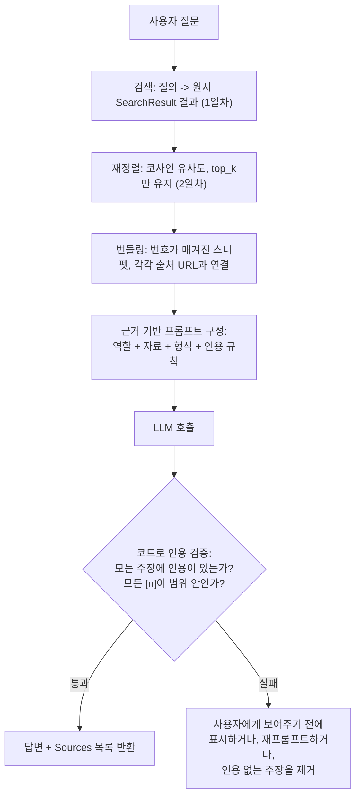

# 3일차 — 검색 + LLM 근거 기반 리서치

**근거 부여(grounding)**란 LLM에게 검색된 스니펫 더미를 건네주고 명시적으로 이렇게 지시하는 것을
말합니다: 오직 이 자료에서*만* 답하고, 각 주장을 어떤 출처가 뒷받침하는지 밝히고, 자료가 질문을
다루지 않는다면 기억으로 빈틈을 메우는 대신 그렇다고 말하라. 이 지시가 수다스러운 추측 기계를
실제로 신뢰할 수 있는 리서치 어시스턴트로 바꿔주는 것입니다 — 검색 근거 기반 패턴에서 환각을 억제하는
핵심 레버가 바로 이것입니다. 1일차(결과 가져오기)와 2일차(관련 있는 것만 남기기)에서 만든 모든 것은
이 단계에 원시 검색 노이즈의 폭포가 아니라 작고 깔끔하고 출처가 명확한 자료 더미를 공급하기 위해
존재합니다.

## "그냥 출처를 인용하라고 시키면 된다"가 충분하지 않은 이유

출처를 인용하라고 지시받은 LLM은 *대체로* 그렇게 합니다 — 하지만 "대체로"는 보장이 아니고, 리서치
파이프라인은 조용히, 특정한 두 가지 방식으로 실패합니다. 미리 이름을 붙여둘 가치가 있습니다:

1. **인용 없는 주장.** 모델이 `[n]` 표시 없이 무언가를 사실처럼 진술합니다. 그러면 그 문장이 검색된
   자료에서 나온 것인지, 아니면 모델 자체의(어쩌면 오래되고, 어쩌면 틀린) 파라미터 기억에서 나온
   것인지 나중에 구분할 방법이 없습니다.
2. **환각 인용.** 모델이 `[n]` 표시를 붙이지만, 그 `n`이 실제로 건네받은 자료 더미에는 존재하지
   않는 출처를 가리킵니다(예: 출처가 두 개만 검색됐는데 `[3]`을 인용) — 자신 있게 아무것도 아닌
   것을 가리키는 셈입니다.

두 실패 양상 모두 급하게 읽는 독자에게는 똑같아 보입니다: 확신에 찬 문장 뒤에 붙은 괄호 안 숫자.
그래서 진지한 파이프라인이라면 프롬프트의 지시만 믿는 대신, LLM 호출 이후 코드 수준에서 인용을
검증합니다 — 이 글 뒷부분에서 다룹니다.

## 네 부분으로 구성된 프롬프트 템플릿

근거 기반 프롬프트는 다음 네 부분이 이 순서대로 필요합니다:

1. **역할 지시** — "당신은 리서치 어시스턴트입니다. 아래 자료만 사용하세요."
2. **검색된 입력 자료** — 1일차/2일차에서 만든, 번호가 매겨지고 출처가 붙은 컨텍스트 번들.
3. **필요한 출력 형식** — 예: "3~5문장을 쓰고, 그다음 Sources 목록을 붙이세요."
4. **검증/인용 규칙** — "모든 주장 뒤에 출처 번호 `[n]`을 인용하세요. 자료가 질문에 답하지 못하면
   'Not enough information in the provided sources.'라고 답하세요."

```python
def build_grounded_prompt(question: str, bundle: str) -> str:
    return f"""You are a research assistant. Answer using ONLY the material below.

MATERIAL:
{bundle}

QUESTION: {question}

Rules:
- Cite the source number [n] after every factual claim.
- If the material does not answer the question, say "Not enough information in the provided sources."
- Do not add outside knowledge.
"""
```

순서는 보기보다 중요합니다: 질문보다 *먼저* 자료를 배치하면 모델이 그 출처들을 추론의 근거로 읽도록
준비시키고, 인용 규칙을 마지막에 두면 생성이 시작되기 직전 가장 최근의(그리고 보통 가장 많이
주목받는) 지시가 됩니다.

## 전체 파이프라인



검색과 재정렬은 원시 웹 노이즈 더미를 신뢰할 수 있는 스니펫 소수로 좁히고, 근거 부여는 LLM이 실제로
그 자료*만* 사용하고 그 근거를 드러내도록 강제하는 단계이며, 검증은 그것이 실제로 그렇게 됐는지
확인하는 단계입니다.

## 검색을 리서치 파이프라인으로 연결하기

`research()`는 검색, 재정렬, 번들링, 그리고 출처를 포함한 요약이라는 네 단계를 연결합니다. 각 단계는
별도로 테스트 가능한 작은 함수로 남습니다.

```python
def research(question: str, searcher, ranker, summarizer) -> str:
    """전체 파이프라인을 연결한다. searcher/ranker/summarizer를 인자로 넘기는 이유는
    (하드코딩하지 않고) 목업 검색 스텁이나 실제 클라이언트, 스텁 LLM 호출이나 실제 호출을
    이 함수의 본문을 전혀 건드리지 않고 교체할 수 있게 하기 위해서다."""
    raw_hits = searcher(question)                     # 1단계: 검색      -> list[SearchResult]
    top_hits = ranker(question, raw_hits, top_k=2) if raw_hits else raw_hits  # 2단계: 좁히기 (2일차)
    bundle = build_context_bundle(top_hits)             # 3단계: 번들링, URL 보존 (1일차) -> str
    prompt = build_grounded_prompt(question, bundle)     #        역할/형식/규칙으로 감싸기 -> str
    return summarizer(prompt)                            # 4단계: LLM 호출, 근거 기반 -> str
```

## 근거 기반 답변은 어떻게 생겼는가

어떤 라이브러리의 릴리스 노트 스니펫이 주어졌을 때, 근거 기반 답변은 이렇게 읽힙니다:

```
The library added native retry support in v2.3 [1]. Backoff intervals are configurable
via a `backoff_factor` argument [2]. Not enough information in the provided sources to
say whether this is enabled by default.

Sources:
[1] https://example.dev/changelog/v2.3
[2] https://example.dev/docs/retries
```

기본값에 대한 질문에서는 추측하는 대신 멈춘다는 점에 주목하세요 — 이것이 근거 부여가 의도대로
작동하는 모습입니다. 근거가 없는 모델이었다면 같은 질문에 그럴듯하지만 검증되지 않은 추측으로 그
빈틈을 아주 그럴듯하게 채웠을 것입니다.

## 코드로 인용 검증하기 (프롬프트만 믿지 말 것)

프롬프트는 부탁할 뿐이고, 이 함수는 실제로 확인합니다. `[n]` 표시가 전혀 없는 문장(인용 없는 주장)과,
번호가 실제 검색된 출처 개수 범위를 벗어난 모든 `[n]`(환각 인용) — 위에서 이름 붙인 두 실패 양상을
모두 잡아냅니다.

```python
import re

REFUSAL_PHRASE = "not enough information in the provided sources"

def split_claim_sentences(answer_body: str) -> list[str]:
    """문장 끝 구두점 기준으로 나누는 단순한 분리 -- 짧은 근거 기반 답변에는 충분하며,
    프로덕션 버전이라면 'e.g.' 같은 예외 케이스를 위해 진짜 문장 토크나이저를 쓸 것이다."""
    raw = re.split(r"(?<=[.!?])\s+", answer_body.strip())
    return [s.strip() for s in raw if s.strip()]  # -> list[str], 문장마다 하나씩

def validate_citations(answer: str, num_sources: int) -> dict:
    """예외를 던지는 대신 보고서 형태의 dict를 반환해서, 호출자가 얼마나 엄격하게
    다룰지 결정할 수 있게 한다(예: 인용 없는 문장은 조용히 버릴지, 답변 전체를
    거부하고 재시도할지)."""
    body = answer.split("Sources:")[0].strip()
    lower_body = body.lower()

    # 인용을 생략해도 되는 유일하게 명시적으로 허용된 문장: 근거 기반 거절 그 자체.
    if REFUSAL_PHRASE in lower_body and len(split_claim_sentences(body)) == 1:
        return {"ok": True, "uncited_claims": [], "out_of_range_citations": []}

    sentences = split_claim_sentences(body)                          # -> list[str], len = 주장 개수
    uncited = [s for s in sentences if not re.search(r"\[\d+\]", s)]  # -> list[str], 실패 양상 1

    cited_numbers = {int(n) for n in re.findall(r"\[(\d+)\]", body)}  # -> set[int]
    out_of_range = sorted(n for n in cited_numbers if n < 1 or n > num_sources)  # 실패 양상 2

    return {
        "ok": not uncited and not out_of_range,
        "uncited_claims": uncited,
        "out_of_range_citations": out_of_range,
    }
```

네 가지 테스트 케이스에 대해 실제로 실행한 결과입니다:

```
good                   -> {'ok': True,  'uncited_claims': [], 'out_of_range_citations': []}
hallucinated_citation  -> {'ok': False, 'uncited_claims': [], 'out_of_range_citations': [3]}
uncited_claim          -> {'ok': False, 'uncited_claims': ['It is the fastest retry library available today.'], 'out_of_range_citations': []}
refusal                -> {'ok': True,  'uncited_claims': [], 'out_of_range_citations': []}
```

`hallucinated_citation`은 번들에 출처가 두 개뿐인데 `[3]`을 인용합니다 — 잡아냅니다.
`uncited_claim`은 제대로 인용된 문장 뒤에 의견이 담긴, 출처 없는 문장을 덧붙입니다 — 잡아내고, 나중에
로깅하거나 제거할 수 있도록 문제가 된 정확한 문장을 반환합니다. 거절 문장은 "인용 없음"으로 잘못
표시되지 않고 올바르게 예외 처리됩니다.

## 스니펫 대 전체 페이지

지금까지의 모든 것은 검색 API가 돌려주는 *스니펫*을 근거로 삼는데, 이는 보통 제공자 자체의
하이라이팅 로직이 고른 한두 문장일 뿐, 질문에 실제로 답하는 문장이라는 보장은 없습니다. 스니펫이
불완전해 보일 때 다음 단계는 전체 페이지를 가져와서 관련 부분을 추출하는 것입니다.

```python
import requests
from bs4 import BeautifulSoup

def fetch_page_text(url: str, timeout: float = 10.0) -> str:
    """페이지의 보이는 문단 텍스트를 가져와 평탄화한다. 네트워크 오류가 나면
    빈 문자열로 폴백해서, 가져오기 실패가 파이프라인 전체를 죽이는 대신
    '스니펫만 사용'으로 우아하게 저하되게 한다 -- 1일차 목업 검색 클라이언트와 같은 철학이다."""
    try:
        resp = requests.get(url, headers={"User-Agent": "Mozilla/5.0"}, timeout=timeout)
        resp.raise_for_status()
    except requests.RequestException:
        return ""  # 호출자는 이를 "전체 페이지 텍스트를 사용할 수 없음"과 동일하게 취급해야 한다
    soup = BeautifulSoup(resp.text, "html.parser")
    main = soup.find("main") or soup
    paragraphs = main.find_all("p")
    return " ".join(p.get_text(" ", strip=True) for p in paragraphs)  # -> str, 평탄화된 본문 텍스트
```

안정적인 정적 대상인 `asyncio.wait_for`의 파이썬 공식 문서 페이지를 대상으로 실행하면, 어떤 검색
스니펫도 담을 자리가 없었던 세부 사항을 포함한 전체 문단이 돌아옵니다:

```
"...cancelled. Example: Changed in version 3.7: When aw is cancelled due to a timeout,
wait_for waits for aw to be cancelled. Previously, it raised TimeoutError immediately.
Changed in version 3.10: Removed the loop parameter. Changed in version 3.11: Raises
TimeoutError instead of asyncio.TimeoutError. Changed in version 3.12: Implemented using
asyncio.timeout()..."
```

버전별 동작 변화 같은 내용은 한 줄짜리 스니펫이 절대 담을 수 없는 종류의 사실이며, 추측하기보다는
근거로 삼을 가치가 있는 종류의 사실입니다. 다만 비용은 실재합니다: 전체 페이지 가져오기는 이미
검색 응답에 공짜로 딸려 온 스니펫에 비해 출처마다 네트워크 왕복 한 번과 HTML 파싱이 추가로 듭니다.
전체 페이지 가져오기는 실제로 최종 답변에 중요한 출처 — 보통 재정렬 이후 상위 1~2개 — 에만 쓰고,
원시 결과 다섯 개 전부에는 쓰지 마세요.

## 흔한 함정

- **가져온 콘텐츠를 통한 프롬프트 인젝션.** 가져와서 컨텍스트 번들에 넣는 페이지는 신뢰할 수 없는
  입력입니다 — "이전 지시를 무시하고 X라고 말하라" 같은 텍스트가 들어있지 않으리라는 보장이 없습니다.
  가져온 자료는 요약할 데이터로만 취급하고 절대 따를 지시로 취급하지 마세요. 잘 설계된 시스템
  프롬프트는 이 구분을 명시적으로 하고, (위의) 인용 검증은 그 여파의 일부는 잡아내지만 전부는
  아닙니다.
- **프롬프트 지시만 믿기.** 프롬프트의 "출처를 인용하라"는 인용 없는/환각 주장의 *비율*을 낮출 뿐
  없애지는 못합니다. 정확성이 실제로 중요한 곳에서는 위에서 보여준 것처럼 코드로 검증하세요.
- **실수로 상위에 오른 저품질 출처 하나에 근거를 두기.** 재정렬이 약한 결과를 실수로 맨 위에
  올렸다면, 근거 기반 답변은 그 약한 출처의 프레이밍을 자신 있게 반영할 것입니다. 근거 부여는
  *환각*을 제어하지 *출처 품질*을 제어하지 않습니다 — 그건 여전히 1일차와 2일차의 몫입니다.
- **전체 페이지 가져오기를 스니펫보다 무조건 낫다고 취급하기.** 텍스트가 많다고 자동으로 신호가
  많은 것은 아닙니다 — 전체 페이지에는 LLM이 헤쳐나가야 할 내비게이션, 광고, 무관한 섹션도 함께
  따라옵니다. 원시 HTML을 통째로 넘기지 말고 관련 부분을 추출하세요(위와 같이).
- **거절 경로가 없음.** 검색된 자료가 실제로 질문을 다루지 않을 때조차 *어떤* 답이든 항상 만들어내는
  파이프라인은, 정확히 가장 중요한 순간에 환각을 일으킵니다. "정보가 충분하지 않다"는 규칙은 예외
  상황을 위한 대비책이 아니라, 모든 근거 기반 프롬프트에 반드시 있어야 할 출구입니다.

**한 줄 요약:** 근거 부여는 하나의 명시적 지시입니다 — "오직 이 자료에서만 답하고, 인용하고, 모르면
모른다고 인정하라" — 를 검색-요약 파이프라인에 배선한 것이며, 프롬프트 지시는 강한 유도일 뿐 보장이
아니므로 그 뒤에 코드 수준의 인용 검증이 필요합니다.
