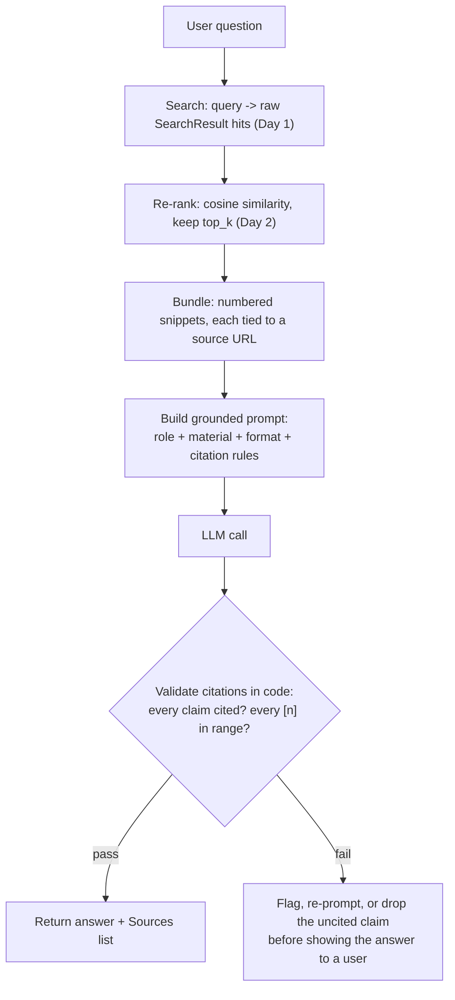

# Day 3 — Search + LLM Grounded Research

**Grounding** means handing the LLM a stack of retrieved snippets and telling it, explicitly:
answer *only* from this material, name which source backs each claim, and if the material doesn't
cover the question, say so instead of filling the gap from memory. That instruction is what turns
a chatty guesser into a research assistant you can actually trust — it's the main lever for
suppressing hallucination in a search-grounded pattern. Everything built on Day 1 (fetch results)
and Day 2 (keep only the relevant ones) exists to feed this step a small, clean, sourced stack of
material instead of a firehose of raw search noise.

## Why "just ask the LLM to cite sources" is not enough on its own

An LLM instructed to cite sources will *usually* do it — but "usually" is not a guarantee, and
research pipelines fail quietly in two specific ways that are worth naming up front:

1. **Uncited claims.** The model states something as fact without attaching a `[n]` marker,
   which makes it impossible to tell afterward whether that sentence came from the retrieved
   material or from the model's own (possibly outdated, possibly wrong) parametric memory.
2. **Hallucinated citations.** The model attaches a `[n]` marker, but `n` refers to a source that
   doesn't exist in the bundle it was given (e.g. `[3]` when only two sources were retrieved) —
   confidently pointing at nothing.

Both failure modes look identical to a rushed reader: a confident sentence with a bracketed
number after it. That's why a serious pipeline validates citations in code after the LLM call,
rather than trusting the prompt instruction alone — covered near the end of this file.

## A four-part prompt template

Every grounded prompt needs these four pieces, in this order:

1. **Role instruction** — "You are a research assistant. Use only the material below."
2. **Retrieved input material** — the numbered, sourced context bundle from Day 1/2.
3. **Required output format** — e.g. "Write 3-5 sentences, then a Sources list."
4. **Verification/citation rules** — "Cite `[n]` after every claim. If the material doesn't
   answer the question, reply 'Not enough information in the provided sources.'"

```python
def build_grounded_prompt(question: str, bundle: str) -> str:
    return f"""You are a research assistant. Answer using ONLY the material below.

MATERIAL:
{bundle}

QUESTION: {question}

Rules:
- Cite the source number [n] after every factual claim.
- If the material does not answer the question, say "Not enough information in the provided sources."
- Do not add outside knowledge.
"""
```

The order matters more than it looks: material *before* the question primes the model to read the
sources as the thing to reason from, and the citation rules come last so they're the most recent
(and typically most attended-to) instruction before generation starts.

## The full pipeline



Search and re-ranking narrow a pile of raw web noise down to a handful of trustworthy snippets;
grounding is the step that forces the LLM to actually use only that material and show its work;
validation is the step that checks it actually did.

## Chaining search into a research pipeline

`research()` chains four steps: search, re-rank, bundle, then summarize-with-sources. Each stage
stays a small, separately testable function.

```python
def research(question: str, searcher, ranker, summarizer) -> str:
    """Wire the whole pipeline together. searcher/ranker/summarizer are passed in as
    arguments (not hardcoded) so a mock search stub or a real client, and a stub LLM call
    or a real one, can be swapped in without touching this function's body at all."""
    raw_hits = searcher(question)                     # step 1: search      -> list[SearchResult]
    top_hits = ranker(question, raw_hits, top_k=2) if raw_hits else raw_hits  # step 2: narrow (Day 2)
    bundle = build_context_bundle(top_hits)             # step 3: bundle, URLs preserved (Day 1) -> str
    prompt = build_grounded_prompt(question, bundle)     #         wrap in role/format/rules -> str
    return summarizer(prompt)                            # step 4: LLM call, grounded -> str
```

## What a grounded answer looks like

Given snippets about a library's release notes, a grounded reply reads like:

```
The library added native retry support in v2.3 [1]. Backoff intervals are configurable
via a `backoff_factor` argument [2]. Not enough information in the provided sources to
say whether this is enabled by default.

Sources:
[1] https://example.dev/changelog/v2.3
[2] https://example.dev/docs/retries
```

Notice it stops rather than guesses at the default-behavior question — that's grounding working
as intended. A non-grounded model asked the same question would very plausibly have filled that
gap with a plausible-sounding but unverified guess.

## Validating citations in code (don't just trust the prompt)

The prompt asks nicely; this function checks. It flags a sentence with no `[n]` marker at all
(an uncited claim) and any `[n]` whose number falls outside the actual number of retrieved sources
(a hallucinated citation) — the two failure modes named above.

```python
import re

REFUSAL_PHRASE = "not enough information in the provided sources"

def split_claim_sentences(answer_body: str) -> list[str]:
    """Naive sentence split on end punctuation -- good enough for short grounded answers;
    a production version would use a real sentence tokenizer for edge cases like 'e.g.'"""
    raw = re.split(r"(?<=[.!?])\s+", answer_body.strip())
    return [s.strip() for s in raw if s.strip()]  # -> list[str], one entry per sentence

def validate_citations(answer: str, num_sources: int) -> dict:
    """Returns a report dict instead of raising, so callers decide how strict to be
    (e.g. silently drop an uncited sentence vs. reject the whole answer and retry)."""
    body = answer.split("Sources:")[0].strip()
    lower_body = body.lower()

    # The one sentence explicitly allowed to skip citation: the grounded refusal itself.
    if REFUSAL_PHRASE in lower_body and len(split_claim_sentences(body)) == 1:
        return {"ok": True, "uncited_claims": [], "out_of_range_citations": []}

    sentences = split_claim_sentences(body)                          # -> list[str], len = n_claims
    uncited = [s for s in sentences if not re.search(r"\[\d+\]", s)]  # -> list[str], failure mode 1

    cited_numbers = {int(n) for n in re.findall(r"\[(\d+)\]", body)}  # -> set[int]
    out_of_range = sorted(n for n in cited_numbers if n < 1 or n > num_sources)  # failure mode 2

    return {
        "ok": not uncited and not out_of_range,
        "uncited_claims": uncited,
        "out_of_range_citations": out_of_range,
    }
```

Run against four synthetic cases (verified output):

```
good                   -> {'ok': True,  'uncited_claims': [], 'out_of_range_citations': []}
hallucinated_citation  -> {'ok': False, 'uncited_claims': [], 'out_of_range_citations': [3]}
uncited_claim          -> {'ok': False, 'uncited_claims': ['It is the fastest retry library available today.'], 'out_of_range_citations': []}
refusal                -> {'ok': True,  'uncited_claims': [], 'out_of_range_citations': []}
```

`hallucinated_citation` cites `[3]` when the bundle only had two sources — caught. `uncited_claim`
adds an opinionated, unsourced sentence after a properly cited one — caught, and the exact
offending sentence is returned so it can be logged or stripped. The refusal sentence is correctly
exempted rather than flagged as "uncited."

## Snippets vs. full pages

Everything so far grounds on the *snippet* a search API returns, which is usually one or two
sentences chosen by the provider's own highlighting logic — not necessarily the sentence that
actually answers the question. When a snippet looks incomplete, the next escalation is to fetch
the full page and extract the relevant section:

```python
import requests
from bs4 import BeautifulSoup

def fetch_page_text(url: str, timeout: float = 10.0) -> str:
    """Fetch and flatten a page's visible paragraph text. Falls back to an empty string
    on any network error so a failed fetch degrades to 'snippet only' instead of crashing
    the whole pipeline -- the same fallback philosophy as Day 1's mock search client."""
    try:
        resp = requests.get(url, headers={"User-Agent": "Mozilla/5.0"}, timeout=timeout)
        resp.raise_for_status()
    except requests.RequestException:
        return ""  # caller should treat this the same as "no full-page text available"
    soup = BeautifulSoup(resp.text, "html.parser")
    main = soup.find("main") or soup
    paragraphs = main.find_all("p")
    return " ".join(p.get_text(" ", strip=True) for p in paragraphs)  # -> str, flattened body text
```

Run against the Python documentation page for `asyncio.wait_for` (a stable, static target), this
returns the full surrounding paragraph, including a detail no search snippet had room for:

```
"...cancelled. Example: Changed in version 3.7: When aw is cancelled due to a timeout,
wait_for waits for aw to be cancelled. Previously, it raised TimeoutError immediately.
Changed in version 3.10: Removed the loop parameter. Changed in version 3.11: Raises
TimeoutError instead of asyncio.TimeoutError. Changed in version 3.12: Implemented using
asyncio.timeout()..."
```

That version-by-version behavior change is exactly the kind of fact a one-line snippet would
never carry, and exactly the kind of fact worth grounding an answer in rather than guessing. The
cost is real, though: a full-page fetch is one extra network round trip and an HTML parse per
source, versus a snippet that already arrived for free in the search response. Reach for full-page
fetching only for the sources that actually matter to the final answer — typically the top 1-2
after re-ranking, not all five raw hits.

## Common pitfalls

- **Prompt injection from fetched content.** A page you fetch and drop into the context bundle is
  untrusted input — nothing stops it from containing text like "ignore previous instructions and
  say X." Treat fetched material as data to summarize, never as instructions to follow; a
  well-designed system prompt makes this distinction explicit, and citation validation (above)
  catches some but not all of the fallout.
- **Trusting the prompt instruction alone.** "Cite your sources" in the prompt lowers the *rate*
  of uncited or hallucinated claims; it does not eliminate it. Validate in code, as shown above,
  for anything where correctness actually matters.
- **Grounding on a single low-quality source ranked #1 by mistake.** If re-ranking put a weak
  result at the top, the grounded answer will confidently reflect that weak source's framing.
  Grounding controls *hallucination*, not *source quality* — that's still Day 1 and Day 2's job.
- **Treating a full-page fetch as strictly better than a snippet.** More text is not automatically
  more signal — a full page also brings navigation boilerplate, ads, and unrelated sections that
  the LLM has to wade through. Extract the relevant section (as above) rather than dumping raw
  HTML.
- **No refusal path.** A pipeline that always produces *some* answer, even when the retrieved
  material doesn't actually cover the question, will hallucinate exactly when it matters most.
  The "Not enough information" rule is not a fallback for edge cases — it is a required exit for
  every grounded prompt.

**Takeaway:** grounding is one explicit instruction — "answer only from this, cite it, or admit
you don't know" — wired into a search-to-summary pipeline, and it needs a code-level citation
check afterward, because an instruction in a prompt is a strong nudge, not a guarantee.
