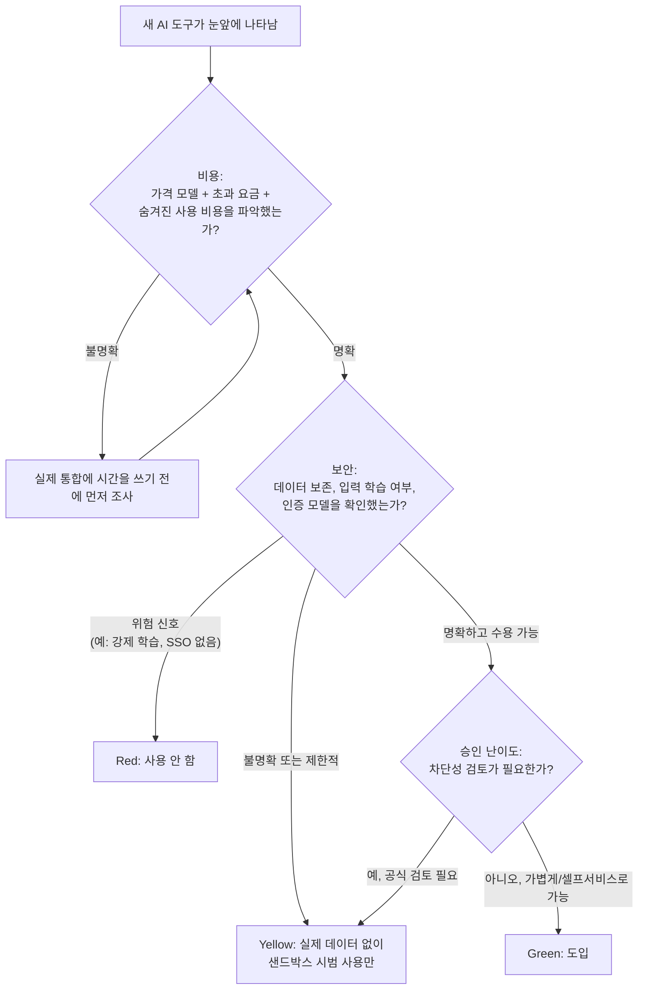

# 4일차 — AI 도구 평가 프레임워크

새로운 AI 제품은 끊임없이 출시되고, 특정 도구 이름을 나열한 목록은 몇 달 안에 낡아버립니다 —
가격 페이지가 바뀌고, "무료" 티어에 사용량 과금이 붙고, 데이터 보존 정책이 조용히 강화되거나
완화됩니다. 계속 쓸모 있는 것은, 어떤 새 도구가 눈앞에 나타나든 그 이름이 무엇이든 데모 영상이
얼마나 근사하든 상관없이 프레임워크와 무관하게 빠르게 파악하는 방법입니다. 실제로 도구 도입이
잘 되느냐 마느냐를 결정하는 것 대부분은 세 가지 렌즈로 커버됩니다: **비용**, **보안**,
**승인 난이도**. 이 글의 나머지는 이 렌즈들을 빠르고 반복 가능하게 적용하는 방법, 그리고 그
판단이 낡아버리지 않게 하는 방법에 대한 것입니다 — 여기서 3일차의 리서치 파이프라인이 다시 등장합니다.

## "좋은 도구인가"가 첫 질문이 아닌 이유

어떤 도구가 자신이 주장하는 작업을 진짜로 훌륭하게 해내면서도 여전히 나쁜 도입 결정일 수 있습니다
— 연결된 API 키에 아무도 예산을 세우지 않은 방식으로 과금되기 때문에, 기본값으로 프롬프트를
학습에 사용하는데 그 프롬프트에 내부 데이터가 들어있기 때문에, 혹은 승인을 받는 데 6주짜리 보안
검토가 걸려서 그동안 팀이... 그냥 안 쓰게 되기 때문에. 이 중 어느 것도 도구가 *좋은지*와는 무관한
문제입니다. 역량을 먼저 평가하고 나머지는 나중으로 미루는 방식은, 이미 도입하기로 결정한 것을
몇 달째 막혀서 못 쓰거나, 도입한 무언가가 한 분기 뒤 비싸거나 위험한 골칫거리가 되는 결과로
이어지는 흔한 패턴입니다. 비용, 보안, 승인 난이도가 먼저인 이유는 이 셋이야말로 나머지 면에서는
좋은 결정을 죽이거나 멈춰 세울 가능성이 가장 큰 요소이기 때문입니다.

## 세 가지 렌즈

**비용** — 가격 모델이 무엇인가: 좌석(seat) 기반, 사용량 기반, 토큰 기반? 무료 티어가 있는가, 그
한도를 넘는 순간 어떻게 되는가 — 완전 차단, 예상치 못한 청구서, 속도 제한? 특히 숨겨진 사용량
비용을 찾으세요: "무료" 도구가 당신이 제공한 연결된 API 키에 조용히 과금하는 경우(그래서 도구
자체는 $0으로 보이지만 API 제공자가 당신에게 직접 청구서를 보냄), 혹은 팀원 전원이 매일 쓰든
아니든 라이선스를 받는 순간 좌석당 가격이 눈덩이처럼 불어나는 경우.

**보안** — 이 도구를 쓰면 당신의 데이터는 어디로 가는가? 기본값으로 입력을 학습에 쓰는가, 그것이
옵트아웃 가능한가, 아니면 아예 끌 수 없는가? 인증 모델은 무엇인가 — SSO 지원 여부, API 키는 어디에
저장되는가, 실제 기능에 필요하지도 않은 광범위한 계정 권한(코드베이스나 받은편지함 전체에 대한
읽기/쓰기 권한)을 요구하지는 않는가? 내부 데이터, 고객 데이터, 독점 코드가 담겨 있을 수 있는
프롬프트를 불명확하거나 아예 없는 보존 정책을 거쳐 흘려보내는 도구는, 생산성 문제이기 전에 보안
문제입니다.

**승인 난이도** — 일반적인 조직에서 이 도구를 실제로 승인받기가 얼마나 어려운가? 조달 승인, 컴플라이언스
검토, 보안 설문지, 서명된 데이터 처리 계약이 필요한가? 훌륭한 도구라도 IT 검토에 6주가 걸린다면,
실제로는 이미 승인된 벤더 우산 아래에서 팀이 오늘 당장 쓸 수 있는 평범한 도구에 밀릴 수 있습니다.

## 의사결정 흐름



이 흐름은 의도적으로 비용 -> 보안 -> 승인 순서입니다: 비용은 보통 확인이 가장 빠르고(가격 페이지
하나면 됨), 보안은 보통 확인에 더 오래 걸리지만 실제 데이터가 도구에 닿을 수 있는지 여부를 결정하며,
승인 난이도는 이미 그 도구를 *도입하고 싶다*는 것이 확실해진 뒤에야 의미가 있습니다 — 어차피 비용
때문에 거부할 도구를 위해 보안 검토를 쫓아다닐 필요는 없습니다.

## 10분짜리 1차 체크리스트

| # | 확인 항목 | 통과 조건 |
| - | --- | --- |
| 1 | 비용: 가격 모델 파악 | 좌석 기반 / 사용량 기반 / 토큰 기반 여부를 앎 |
| 2 | 비용: 무료 티어 한도와 초과 비용 파악 | 예상치 못한 청구서 위험 없음 |
| 3 | 비용: 연결된 키/계정에 숨겨진 사용 비용 | 없음, 혹은 명시적으로 수용 가능함 |
| 4 | 보안: 데이터 보존 / 입력 학습 정책 | 2분 이내에 찾을 수 있음 |
| 5 | 보안: 인증 방식과 권한 범위 | SSO 가능; 범위가 실제 필요와 일치 |
| 6 | 승인: 개인 사용 전 조직 정책상 검토 필요 여부 | 어느 쪽이든 파악됨 |
| 7 | 승인: 더 가벼운 샌드박스/시범 경로 존재 여부 | 존재하거나, 요청할 계획이 있음 |
| 8 | 판정 | green / yellow / red, 한 줄 이유와 함께 |

새 도구가 등장할 때마다 실제로 통합에 시간을 쓰기 전에 10분 안에 이걸 실행하세요. 항목 1~5를 각각
2분 안에 답할 수 없다면, 그 자체가 정보입니다 — 특히 보안 항목에서 "명확한 답이 없음"은 green이
아니라 yellow로 기본값을 잡아야 합니다.

## 코드로 점수화하기

불리언 값을 넣으면 가벼운 정량적 위험 점수가 나옵니다 — 입력 자체가 측정값이 아니라 판단(이게
"숨겨진 비용"으로 "칠 만한가"?)이기 때문에 의도적으로 거칠게 만들었습니다.

```python
from dataclasses import dataclass

@dataclass
class ToolEvaluation:
    name: str
    pricing_model: str
    hidden_usage_costs: bool
    trains_on_input_data: bool
    sso_supported: bool
    requires_security_review: bool
    notes: str = ""

    def risk_score(self) -> int:
        """가산식 위험 점수, 0 = 가장 낮은 위험. 가중치(1~2)는 의도적으로 거칠다 --
        요점은 소수점 두 자리까지 논쟁할 정밀한 숫자를 만드는 게 아니라,
        '명백히 괜찮음'과 '명백히 그렇지 않음'을 빠르게 구분하는 것이다."""
        score = 0
        score += 2 if self.hidden_usage_costs else 0          # 예산을 조용히 초과시킬 수 있음
        score += 2 if self.trains_on_input_data else 0        # 당신의 데이터가 통제권을 벗어남
        score += 1 if not self.sso_supported else 0           # 인증/오프보딩이 더 취약함
        score += 1 if self.requires_security_review else 0    # 위험이라기보다 마찰이지만 도입을 늦춤
        return score

    def quick_verdict(self) -> str:
        score = self.risk_score()
        if score == 0:
            return "green"
        if score >= 4:
            return "red"
        return "yellow"
```

세 가지 예시 후보에 적용한 실제 실행 결과입니다:

```
note-taking assistant: risk_score=0 verdict=green | Opt-out training disclosed clearly in settings.
spreadsheet copilot:   risk_score=6 verdict=red   | Retention policy unclear; needs compliance sign-off before rollout.
code review bot:       risk_score=3 verdict=yellow | Trains on input by default but SSO + opt-out available on request.
```

스프레드시트 코파일럿은 네 가지 위험 요소를 전부 쌓습니다(숨겨진 비용 *그리고* 입력 학습 *그리고*
SSO 없음 *그리고* 검토 필요) — 확실하게 red로 떨어집니다. 코드 리뷰 봇은 기본값으로 입력을
학습하는데 — 보통은 위험 신호지만 — SSO 지원과 옵트아웃 경로가 있어서 완전한 거부가 아니라 "옵트아웃을
켠 상태로 시범 사용"이라는 yellow로 되돌아옵니다. 신호 하나가 전체 이야기를 말해주는 경우는 드뭅니다
— 그래서 하나 걸리면 바로 탈락이 아니라 가산식으로 설계했습니다.

## 3일차 파이프라인으로 프레임워크를 최신 상태로 유지하기

위 세 렌즈 자체는 바뀌지 않지만, *무엇에* 적용하는지는 바뀝니다 — 새 도구, 새 가격 페이지, 새 보안
공시가 매주 나타나고, 한 번 채워둔 `ToolEvaluation`은 캐시된 웹 페이지가 낡는 것과 정확히 같은
방식으로 낡습니다. 이를 위해 3일차의 `research()` 파이프라인을 그대로 재사용하세요: "이번 달 새로운
AI 코딩 어시스턴트 가격 변경" 이나 "AI 도구 데이터 보존 정책 업데이트" 같은 질의를 던지고, 검색하고,
재정렬하고, 출처를 포함해 요약하게 한 다음, 다음 체크리스트 점검 전에 그 근거 기반(인용된, 거절 가능한)
결과를 훑어보세요.

```python
landscape_update = research(
    "recent pricing or security policy changes for AI developer tools",
    searcher=search_web_stub,
    ranker=rerank_results,
    summarizer=call_llm_stub,
)
```

`research()`가 근거 기반(3일차)이기 때문에, 일어나지도 않은 정책 변경을 자신 있게 지어내는 대신
"제공된 출처에 충분한 정보가 없습니다"라고 말할 것입니다 — 이 출력이 실제 도입 결정에 직접 반영될
수 있는 만큼, 가벼운 질문에서보다 이 점이 훨씬 더 중요합니다.

## 흔한 함정

- **최신성 편향.** 가장 새롭고 반짝이는 도구가, 같은 일을 하는 이미 검증된 지루한 도구보다
  과도한 관심을 받습니다 — 아무것도 없는 상태가 아니라 이미 승인된 것과 비교해서 평가하세요.
- **무료 티어의 미끼 상술.** 성장기에 후하게 제공되는 무료 티어는 벤더의 영구적인 약속이 아닙니다.
  현재 페이지가 광고하는 내용뿐 아니라, 가격이 바뀔 때 *기존* 사용량에 무슨 일이 일어나는지도
  확인하세요.
- **한 번만 평가하고 다시 확인하지 않기.** 6개월 전에 채워둔 `ToolEvaluation`은 이미 바뀌었을 정책을
  반영하고 있을 수 있습니다 — 체크리스트를 일회성 관문으로 취급하는 대신 위에서 3일차 파이프라인을
  연결한 이유가 바로 이것입니다.
- **"인기 있음"과 "검증됨"을 혼동하기.** 다른 곳에서 널리 채택됐다는 사실은 *당신* 조직의 보안이나
  컴플라이언스 요건이 충족되는지와 아무 상관이 없습니다 — 도구의 사용자 수가 아니라 실제 정책을
  확인하세요.
- **탈출 비용을 무시하기.** 도입하기 전에 당신의 데이터(노트, 설정, 생성된 이력)가 나중에 떠나기로
  결정했을 때 실제로 내보내질 수 있는지 확인하세요 — 도입은 싸지만 떠나기는 비싼 도구는 가격
  페이지에 전혀 나타나지 않는 비용입니다.

**한 줄 요약:** 어떤 AI 도구든 비용, 보안, 승인 난이도라는 빠르고 반복 가능한 체크리스트와 거친
정량적 점수로 판단하세요 — 그리고 그 밑에서 가격 페이지와 정책이 계속 바뀌는 동안, 검색 근거 기반
리서치 파이프라인이 그 판단을 조용히 낡게 두지 않도록 하세요.
