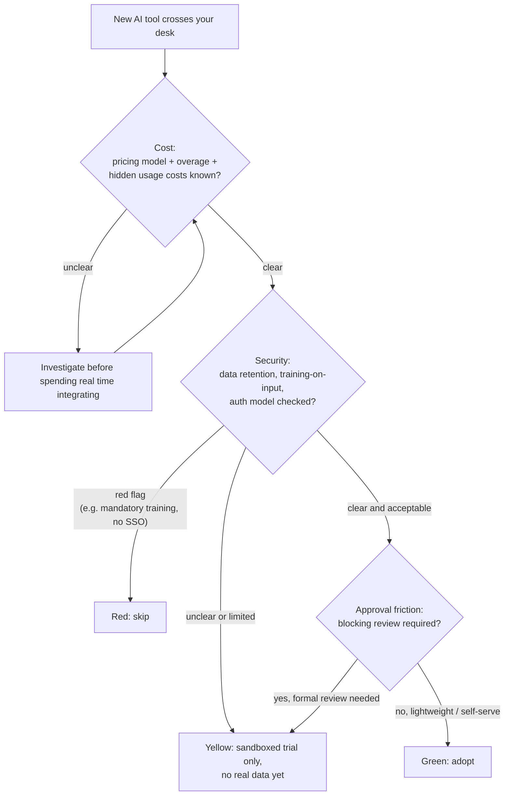

# Day 4 — A Framework for Evaluating AI Tools

New AI products ship constantly, and any list of named tools goes stale within a few months — a
pricing page changes, a "free" tier gets metered, a data-retention policy quietly tightens or
loosens. What stays useful is a framework-agnostic way to size up *any* new tool the moment it
crosses your desk, without caring what it's called or how good its demo video looks. Three lenses
cover most of what actually determines whether adopting a tool goes well: **cost**, **security**,
and **approval-friction**. The rest of this note is about applying those lenses fast and
repeatably, and about not letting the judgment go stale — which is where Day 3's research pipeline
comes back in.

## Why "is it good" is the wrong first question

A tool can be genuinely excellent at the task it claims to do and still be a bad adoption decision
— because it bills a connected API key in a way nobody budgeted for, because it trains on your
prompts by default and your prompts contain internal data, or because getting it approved takes
six weeks of security review during which the team just... doesn't use it. None of those are
about whether the tool is *good*. Evaluating capability first and everything else later is how
teams end up either blocked for months on something they already decided to adopt, or having
adopted something that becomes an expensive or risky mess a quarter later. Cost, security, and
approval-friction come first because they are the three things most likely to kill or stall an
otherwise-good decision.

## The three lenses

**Cost** — What's the pricing model: seat-based, usage-metered, token-metered? Is there a free
tier, and what happens the moment you exceed it — a hard stop, a surprise invoice, throttling?
Look specifically for hidden usage costs: a "free" tool that silently bills a connected API key
you provided (so the tool itself shows $0 while your API provider bills you directly), or a
per-seat price that balloons once every team member gets a license whether or not they use it
daily.

**Security** — Where does your data go once you use this tool? Does it train on your inputs by
default, is that opt-out, or is it not possible to turn off at all? What's the auth model — SSO
support, where are API keys stored, does it request broad account permissions (read/write access
to an entire codebase or inbox) it doesn't actually need for its stated function? A tool that
pipes your prompts — which may contain internal data, customer data, or proprietary code — through
an unclear or absent retention policy is a security question before it is a productivity question.

**Approval-friction** — How hard is this to actually get approved for use at a typical
organization? Does it need procurement sign-off, a compliance review, a security questionnaire, a
signed data processing agreement? A brilliant tool that takes six weeks of IT review to greenlight
may lose, in practice, to a mediocre one your team can start using today under an existing
approved vendor umbrella.

## Decision flow



The flow is intentionally ordered cost-then-security-then-approval: cost is usually fastest to
verify (a pricing page), security usually takes longer to verify but gates whether real data can
touch the tool at all, and approval-friction only matters once you already know you *want* to
adopt it — no point chasing a security review for a tool you'd reject on cost anyway.

## A 10-minute first-pass checklist

| # | Check | Pass condition |
| - | --- | --- |
| 1 | Cost: pricing model identified | seat-based / usage-metered / token-metered is known |
| 2 | Cost: free-tier limits and overage cost known | no surprise-invoice risk |
| 3 | Cost: hidden usage on a connected key/account | none found, or explicitly acceptable |
| 4 | Security: data retention / training-on-input policy | findable in under 2 minutes |
| 5 | Security: auth method and permission scope | SSO available; scope matches actual need |
| 6 | Approval: org policy requires review before individual use | known either way |
| 7 | Approval: a lighter-weight sandboxed/trial path exists | yes, or a plan to request one |
| 8 | Verdict | green / yellow / red, with a one-line reason |

Run this in ten minutes on any new tool before spending real time integrating it. If you can't
answer items 1-5 within two minutes each, that itself is informative — "no clear answer" on
security in particular should default to yellow, not green.

## Scoring it in code

Booleans in, a lightweight numeric risk score out — coarse on purpose, since the inputs are
judgment calls (does this "count" as a hidden cost?) rather than precise measurements.

```python
from dataclasses import dataclass

@dataclass
class ToolEvaluation:
    name: str
    pricing_model: str
    hidden_usage_costs: bool
    trains_on_input_data: bool
    sso_supported: bool
    requires_security_review: bool
    notes: str = ""

    def risk_score(self) -> int:
        """Additive risk score, 0 = lowest risk. Weights (1-2) are deliberately coarse --
        the point is to separate 'clearly fine' from 'clearly not' fast, not to produce a
        precise number worth debating to two decimal places."""
        score = 0
        score += 2 if self.hidden_usage_costs else 0          # can silently blow a budget
        score += 2 if self.trains_on_input_data else 0        # your data leaves your control
        score += 1 if not self.sso_supported else 0           # weaker auth / offboarding story
        score += 1 if self.requires_security_review else 0    # friction, not risk, but slows adoption
        return score

    def quick_verdict(self) -> str:
        score = self.risk_score()
        if score == 0:
            return "green"
        if score >= 4:
            return "red"
        return "yellow"
```

Applied to three example candidates (verified output):

```
note-taking assistant: risk_score=0 verdict=green | Opt-out training disclosed clearly in settings.
spreadsheet copilot:   risk_score=6 verdict=red   | Retention policy unclear; needs compliance sign-off before rollout.
code review bot:       risk_score=3 verdict=yellow | Trains on input by default but SSO + opt-out available on request.
```

The spreadsheet copilot stacks all four risk factors (hidden costs *and* trains on input *and* no
SSO *and* needs review) and lands solidly red. The code review bot trains on input by default —
normally a red flag — but SSO support and an opt-out path bring it back down to a yellow "trial
with the opt-out enabled" rather than an outright rejection; a single flag rarely tells the whole
story on its own, which is why this is additive rather than one-strike-and-out.

## Keeping the framework current, with Day 3's pipeline

The three lenses above don't change, but *what* they get applied to does — new tools, new pricing
pages, new security disclosures appear every week, and a `ToolEvaluation` filled in once goes
stale exactly like a cached web page does. Reuse the `research()` pipeline from Day 3 verbatim for
this: point it at a query like "new AI coding assistant pricing changes this month" or "AI tool
data retention policy update," let it search, re-rank, and summarize-with-sources, and skim the
grounded (cited, refusal-capable) result before your next checklist pass.

```python
landscape_update = research(
    "recent pricing or security policy changes for AI developer tools",
    searcher=search_web_stub,
    ranker=rerank_results,
    summarizer=call_llm_stub,
)
```

Because `research()` is grounded (Day 3), it will say "Not enough information in the provided
sources" rather than confidently inventing a policy change that didn't happen — which matters a
great deal more here than in a casual question, since this output can directly feed a real
adoption decision.

## Common pitfalls

- **Recency bias.** The newest, shiniest tool gets disproportionate attention relative to a
  boring, already-vetted one that does the same job — evaluate against what you already have
  approved, not against nothing.
- **Free-tier bait-and-switch.** A generous free tier during a growth phase is not a permanent
  commitment from the vendor. Check what happens to *existing* usage when pricing changes, not
  just what the current page advertises.
- **One-time evaluation, no re-check.** A `ToolEvaluation` filled in six months ago reflects a
  policy that may have already changed — this is the entire reason for wiring Day 3's pipeline in
  above rather than treating the checklist as a one-off gate.
- **Conflating "popular" with "vetted."** Widespread adoption elsewhere says nothing about whether
  *your* organization's security or compliance requirements are satisfied — check the actual
  policy, not the tool's user count.
- **Ignoring exit cost.** Before adopting, check whether your data (notes, configs, generated
  history) can actually be exported if you later decide to leave — a tool that's cheap to adopt
  and expensive to leave is a cost that doesn't show up on the pricing page at all.

**Takeaway:** judge any AI tool on cost, security, and approval-friction with a fast, repeatable
checklist and a coarse numeric score — then let your own search-grounded research pipeline keep
that judgment from silently going stale as pricing pages and policies change underneath it.
