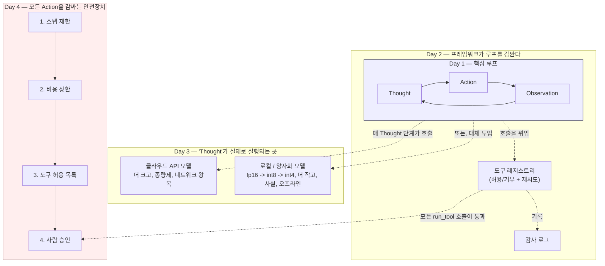

# 에이전틱 AI: ReAct 루프, 로컬 LLM, 안전장치

한 번의 프롬프트에 한 번의 답변만 내놓는 언어 모델은 세상에 대해 아무것도
할 수 없다 — 가격을 확인할 수도, API를 호출할 수도, 자기 계산이 맞는지
검증할 수도 없다. 언어 모델을 **에이전트**로 바꾼다는 것은, 모델이 추론하고
행동하고 결과를 관찰한 뒤 다시 추론할 수 있는 루프로 감싸는 일이다. 그리고
그 루프를 다시, 써서는 안 될 돈을 쓰지 않고, 무한히 실행되지 않고, 아무도
승인하지 않은 행동을 하지 않도록 충분한 안전장치로 감싸는 일이기도 하다.
이번 주는 이 구조를 하루에 한 층씩, 완전히 기초부터 쌓아 올린다 — 어떤
프레임워크도 블랙박스로 다루지 않는다.

| Day | 주제 | 링크 |
| --- | --- | --- |
| 1 | 에이전트 vs. 챗봇; ReAct(Thought/Action/Observation) 루프 직접 구현하기 | [daily/Day1_agents-vs-chatbots-react-loop.md](daily/Day1_agents-vs-chatbots-react-loop.md) |
| 2 | 에이전트 프레임워크 생태계, 그리고 처음부터 만드는 미니 프레임워크 | [daily/Day2_framework-landscape-mini-framework.md](daily/Day2_framework-landscape-mini-framework.md) |
| 3 | 로컬 LLM에서 에이전트 구동하기; 양자화와 정밀도-메모리 트레이드오프 | [daily/Day3_local-llms-quantization.md](daily/Day3_local-llms-quantization.md) |
| 4 | 에이전트 안전장치 — 허용 목록, 스텝 제한, 승인 게이트, 비용 상한, 그리고 왜 검사 *순서*가 중요한가 | [daily/Day4_agent-safety-mechanisms.md](daily/Day4_agent-safety-mechanisms.md) |

한국어 번역: 위 각 파일 옆에 `.ko.md` 대응 파일이 있다.

개념 노트북(실행 가능, 상세한 주석 포함): [concepts/7th_week_Concepts.ipynb](concepts/7th_week_Concepts.ipynb)
(한국어판: [concepts/7th_week_Concepts.ko.ipynb](concepts/7th_week_Concepts.ko.ipynb))

## 4일이 어떻게 맞물리는가

매일이 Day 1의 동일한 핵심 루프 위에 한 층씩 쌓인다. 이전 날의 내용이
대체되는 것이 아니다 — Day 2의 프레임워크도 그 밑에서는 여전히 Day 1의
Thought/Action/Observation 사이클을 실행하고, Day 3는 그 추론(Thought)
단계가 *어디서* 계산되는지만 바꾸며, Day 4는 같은 도구 호출을 거부할 수
있는 검사들로 감쌀 뿐이다.

Day 4 박스 안의 순서는 임의로 정한 것이 아니다 — 그 자체가 해당 날의
핵심 주제다: 사람을 기다려야 할 수 있는 검사보다 저렴하고 결정적인 검사가
먼저 실행되어야 하고, 카운터는 모든 검사를 통과한 *이후에만* 커밋되어야
한다. 그렇지 않으면 거부된 호출 하나가 그 뒤에 오는 호출들의 예산을
조용히 갉아먹는다.

## 실제로 검증한 것과 예시로만 보여준 것

각 일일 노트와 개념 노트북에서 순수 Python, numpy, pandas만 사용하는
실행 가능한 예제는 모두 실제로 실행해서 출력을 본문의 주장과 대조
확인했다. 실제 로컬 모델 API(`transformers`, GPU 양자화를 위한
`bitsandbytes`)를 호출하는 예제는 현재의 올바른 API 형태에 맞춰
작성했지만 이 환경에서는 실행하지 않았다 — 그런 셀에는 테스트된 출력이
아니라 그 사실을 명시했다.

## 라이선스

독자적으로 작성한 학습 자료입니다. 예시로 표시된 코드는 개념 설명용이므로,
실제 프로덕션에서 정확한 API 시그니처에 의존하기 전에 최신 라이브러리
문서를 반드시 확인하세요.
